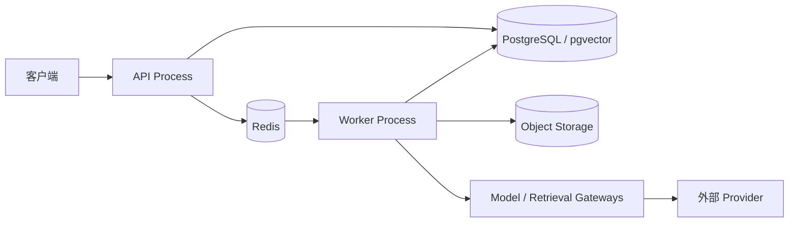

<p align="center">
  
  
  
  
  
  
</p>

---

<h1 align="center">Nora</h1>

<h3 align="center"><strong>N</strong>avigate · <strong>O</strong>bserve · <strong>R</strong>eview · <strong>A</strong>gent</h3>

<p align="center">
  面向求职决策的可审计多智能体平台。<br>
  Agentic RAG 驱动的求职决策报告系统。
</p>

---

## 项目概览

Nora 将公司背景调研、岗位匹配分析、面试准备、出行规划、风险研判和面试复盘组织为可追溯的 **Decision Report**（决策报告），帮助用户理解：

- 哪些内容来自原始材料或外部数据
- 哪些内容是规则计算或模型推断
- 哪些信息存在冲突、过期或证据不足
- 推荐动作是什么，以及为什么
- 哪些动作需要用户确认后才能执行

---

## 核心原则

| 原则 | 含义 |
|------|------|
| Evidence First | 关键结论必须引用可定位的证据；无证据内容只能保持候选、推断或未知状态 |
| 业务事实在 PostgreSQL | 缓存、向量索引、Agent State 和模型输出不能成为第二事实源 |
| 模型输出不可信 | 所有 LLM、Embedding、Reranker 输出必须经过 Schema 和策略校验 |
| Agent 只做编排 | LangGraph 节点调用 Application Use Case，不直接访问 ORM 或外部 SDK |
| 外部写默认关闭 | 所有外部副作用需审批、幂等和审计 |
| 模块化单体优先 | 先验证领域边界和主流程，再根据真实负载拆分服务，不提前引入分布式复杂度 |
| 一 Issue 一 PR | 一个 Issue、一个 `nora/` 分支、一个 PR；合并后再开始下一项 |
| 中文优先 | Commit、PR 和文档首选中文，技术标识保持行业标准写法 |

---

## 架构概览

### 依赖方向

```
  ┌──────────────┐     ┌──────────────┐     ┌──────────────┐
  │  Apps        │ ──> │  Application │ ──> │  Domain      │
  │  API / Worker│     │  Use Cases   │     │  领域模型     │
  │  Demo        │     │  Ports       │     │  仅 Python   │
  │  Adapters    │     │              │     │  标准库      │
  └──────────────┘     └──────────────┘     └──────────────┘
```

Domain 层只使用 Python 标准库，不导入 FastAPI、SQLAlchemy、LangGraph 等外部框架。违反该方向的代码在架构测试中被阻断。

### 进程边界



### 领域上下文

```
  ┌─────────────────────────────────────────────────────────────┐
  │                   Automation & Governance                   │
  │                  Agent 运行 / 审批 / 审计 / 幂等              │
  ├──────────┬──────────┬──────────┬──────────┬────────────────┤
  │ Identity │  Career  │ Opportun-│ Interview│   Decision     │
  │     &    │  Profile │    ity   │  Journey │        &       │
  │Preferences│ 简历管理 │Intelligence│ 面试管理 │  Reporting    │
  │ 身份偏好 │           │ 岗位情报  │          │  决策报告     │
  ├──────────┴──────────┴──────────┴──────────┴────────────────┤
  │                  Knowledge & Evidence                      │
  │              来源快照 / 切片 / 检索 / 证据                    │
  └─────────────────────────────────────────────────────────────┘
```

---

## 技术栈

| 组件 | 选型 |
|------|------|
| 语言 | Python >=3.11 |
| 包管理 | uv（`UV_SYSTEM_PYTHON=1`，无虚拟环境） |
| Web 框架 | FastAPI + Uvicorn（异步） |
| 数据库 | PostgreSQL 16 + pgvector |
| ORM | SQLAlchemy（异步，Repository 模式） |
| 异步队列 | Celery + Redis（M4 引入，可选中间件） |
| 对象存储 | MinIO / S3（开发可用文件系统替代） |
| Agent 框架 | LangGraph Adapter（Provider 无关） |
| 模型网关 | Provider-neutral（DeepSeek / OpenAI 兼容） |
| 代码质量 | ruff（lint + format）+ mypy（严格模式） |
| 测试 | pytest（6 层测试策略） |

---

## 里程碑路线图

```
  2026-07-23 ──────────────────────────────────────────────────────── 2026-08-23
  ├─────────┬─────────┬──────────┬──────────┬──────────┬────────┤
  │   M0    │   M1    │    M2    │    M3    │    M4    │ 缓冲   │
  │  5 天   │  5 天   │  6 天    │  8 天    │  8 天    │ 2 天   │
  │ 工程基础 │ Identity│  简历    │  Demo    │ 中间件   │        │
  │         │ + 岗位  │ + RAG    │ (Gradio) │ + 安全   │        │
  └─────────┴─────────┴──────────┴──────────┴──────────┴────────┘
                         M5+: 专项 Agent（按需启动）
```

| 里程碑 | 交付物 |
|--------|--------|
| **M0** | Python 骨架、配置/日志/异常、FastAPI 工厂、PostgreSQL + Alembic、Docker Compose、CI 门禁 |
| **M1** | 用户认证（注册/登录/Token）、岗位快照 CRUD（幂等）、审计日志 |
| **M2** | 简历管理、SourceDocument -> Chunk -> Embedding -> 混合检索 -> Evidence Pack、Model Gateway |
| **M3** | 确定性规则引擎、LLM 增强分析、版本化 Decision Report、Gradio Demo |
| **M4** | Redis 缓存、Celery 任务队列、性能基准、安全扫描（SBOM）、部署文档 |
| **M5+** | LangGraph Agent Runtime、专项 Agent、审批流程、Milvus / 服务拆分评估 |

---

## 快速开始

```bash
# 前置条件：Docker + Docker Compose
cp .env.example .env
docker compose up

# 验证服务
curl http://localhost:8000/health
```

---

## 文档索引

| 文档 | 说明 |
|------|------|
| [`CONTRIBUTING.md`](CONTRIBUTING.md) | 贡献指南与协作规则 |
| [`docs/WORKFLOW.md`](docs/WORKFLOW.md) | 完整交付操作手册（12 步） |
| [`docs/ISSUE_WORKFLOW.md`](docs/ISSUE_WORKFLOW.md) | Issue 类型、标签、状态流转 |
| [`docs/ARCHITECTURE.md`](docs/ARCHITECTURE.md) | 系统架构（22 章节） |
| [`docs/ROADMAP.md`](docs/ROADMAP.md) | 里程碑详情与验收条件 |
| [`docs/GLOSSARY.md`](docs/GLOSSARY.md) | 领域术语全表 |
| [`docs/DEVELOPMENT.md`](docs/DEVELOPMENT.md) | Docker 优先开发指南 |
| [`docs/M0_PLAN.md`](docs/M0_PLAN.md) | M0 工程基础 Issue 拆分 |
| [`SECURITY.md`](SECURITY.md) | 安全策略 |
| [`CLAUDE.md`](CLAUDE.md) | AI 助手工作指南 |

---

## 开始协作

1. 阅读 [架构文档](docs/ARCHITECTURE.md) 和 [工作流](docs/WORKFLOW.md)
2. 创建或认领一个范围明确、可独立验收的 [Issue](https://github.com/dev-cai/Nora/issues)
3. 从最新 `main` 创建 `nora/<type>-<subject>` 分支
4. 实现、测试，提交人工验收
5. PR -> CI -> 审查 -> Squash Merge

---

## 许可证

[Apache License 2.0](LICENSE)

安全问题请按 [SECURITY.md](SECURITY.md) 通过私密渠道报告。
