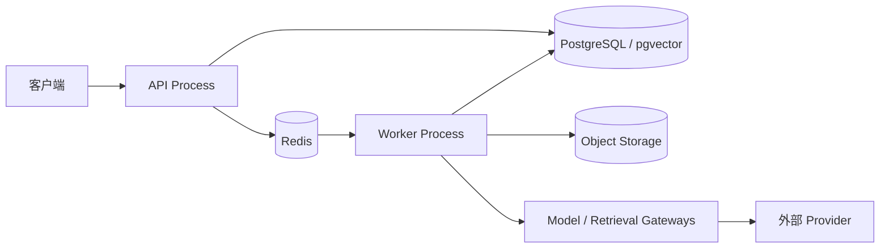

<p align="center">
  
  
  
  
  
  
</p>

---

<h1 align="center">Nora</h1>

<h3 align="center"><strong>N</strong>avigate · <strong>O</strong>bserve · <strong>R</strong>eview · <strong>A</strong>gent</h3>

<p align="center">
  面向软件工程应届求职的可审计多智能体平台。<br>
  Agentic RAG 驱动的求职决策报告系统。
</p>

---

## 项目概览

Nora 将公司背景调研、岗位匹配分析、面试准备、出行规划、风险研判和面试复盘组织为可追溯的 **Decision Report**（决策报告），帮助用户理解：

- 哪些内容来自原始材料或外部数据
- 哪些内容是规则计算或模型推断
- 哪些信息存在冲突、过期或证据不足
- 推荐动作是什么，以及为什么
- 哪些动作需要用户确认后才能执行

完整的 N.O.R.A. 定义、用户旅程、五类产品能力和 Current/Planned/Evolution 边界见
[`docs/PRODUCT_VISION.md`](docs/PRODUCT_VISION.md)。这些能力是产品目标，不代表均已实现。

> **当前状态：M0 工程基础与 M1 纵向切片。** 当前可启动 API、PostgreSQL、Redis 和 MinIO 本地骨架，提供本地账号认证、用户范围 Repository、不可变 JobPosting 创建/读取、幂等和创建审计；RAG、Web 客户端和 Agent 能力仍由后续 Issue 交付。

---

## 核心原则

| 原则 | 含义 |
|------|------|
| Evidence First | 关键结论必须引用可定位的证据；无证据内容只能保持候选、推断或未知状态 |
| 业务事实在 PostgreSQL | 缓存、向量索引、Agent State 和模型输出不能成为第二事实源 |
| 模型输出不可信 | 所有 LLM、Embedding、Reranker 输出必须经过 Schema 和策略校验 |
| Agent 只做编排 | LangGraph 节点调用 Application Use Case，不直接访问 ORM 或外部 SDK |
| 外部写默认关闭 | 所有外部副作用需审批、幂等和审计 |
| 模块化单体优先 | 先验证领域边界和主流程，再根据真实负载拆分服务，不提前引入分布式复杂度 |
| 一 Issue 一 PR | 一个 Issue、一个 `nora/` 分支、一个 PR；合并后再开始下一项 |
| 中文优先 | Commit、PR 和文档首选中文，技术标识保持行业标准写法 |

---

## 架构概览

### 依赖方向

```
  ┌───────────────────────────────────────────────────────────┐
  │ Business Module: API → Application/Ports → Domain        │
  │                  Infrastructure → Ports + Domain          │
  └───────────────────────────────────────────────────────────┘
                  ▲                         ▲
          FastAPI Composition       PostgreSQL / Providers
```

后端工程已迁移至 `backend/`，应用包为 `backend/app/`；计划中的 Vue 客户端位于独立 `frontend/` 边界。后端长期采用
业务模块优先、模块内部再分层的结构，现有技术层将按独立 Issue 渐进内聚；Domain 不导入 FastAPI、SQLAlchemy、
LangGraph 等外部框架。完整边界以架构文档为准。

### 目标进程边界

下图是 M5 按指标引入异步中间件后的目标形态，不是当前仓库的运行状态。M0–M4 的逐步交付边界见路线图。


```mermaid
flowchart LR
    Client["客户端"] --> API["API Process"]
    API --> PG[("PostgreSQL / pgvector")]
    API --> Redis[("Redis")]
    Redis --> Worker["Worker Process"]
    Worker --> PG
    Worker --> Objects[("Object Storage")]
    Worker --> Gateway["Model / Retrieval Gateways"]
    Gateway --> Providers["外部 Provider"]
```

### 领域上下文

```
  ┌─────────────────────────────────────────────────────────────┐
  │                   Automation & Governance                   │
  │                  Agent 运行 / 审批 / 审计 / 幂等              │
  ├──────────┬──────────┬──────────┬──────────┬────────────────┤
  │ Identity │  Career  │ Opportun-│ Interview│   Decision     │
  │     &    │  Profile │    ity   │  Journey │        &       │
  │Preferences│ 简历管理 │Intelligence│ 面试管理 │  Reporting    │
  │ 身份偏好 │           │ 岗位情报  │          │  决策报告     │
  ├──────────┴──────────┴──────────┴──────────┴────────────────┤
  │                  Knowledge & Evidence                      │
  │              来源快照 / 切片 / 检索 / 证据                    │
  └─────────────────────────────────────────────────────────────┘
```

---

## 技术方向

| 组件 | 当前决策 | 交付状态 |
|------|----------|----------|
| 语言 | Python >=3.11 | Current |
| 包管理 | uv | Current |
| Web 框架 | FastAPI + Uvicorn（异步） | Current |
| Web 客户端 | [Vue 3 + Vite](docs/FRONTEND.md) | M2 Planned |
| 数据库 | PostgreSQL 16；M4 增加 pgvector | PostgreSQL Current / pgvector M4 Planned |
| ORM | SQLAlchemy（异步，Repository 模式） | Current |
| 异步队列 | Celery + Redis | M5 按指标评估 |
| 对象存储 | Object Storage Port；MinIO / S3 为 Adapter | MinIO Compose 骨架 Current / 业务 Adapter Planned |
| Agent 框架 | LangGraph Adapter | M6+ 演进能力 |
| 模型网关 | Provider-neutral，不锁定未验证模型版本 | M4 Planned |
| 专用向量库 | Milvus / Zilliz | 规模触发后评估 |
| 代码质量 | ruff（lint + format）+ mypy | Current |
| 测试 | pytest（单元、集成、架构测试） | Current，按里程碑扩展 |

---

## 里程碑路线图

| 里程碑 | 交付物 |
|--------|--------|
| **M0** | Python 骨架、配置/日志/异常、FastAPI 工厂、PostgreSQL + Alembic、Docker Compose、CI 门禁 |
| **M1** | 用户认证（注册/登录/Token）、岗位快照 CRUD（幂等）、审计日志 |
| **M2** | Demo-ready 岗位契约、候选人主档、简历版本、Vue Web 客户端与前端 CI |
| **M3** | 文本 JD 输入、确定性规则引擎、版本化 Decision Report、可运行最小 Demo |
| **M4** | Evidence、RAG、Embedding、pgvector、条件模型增强与 Model Gateway |
| **M5** | 基于指标评估异步任务，补齐性能、安全供应链、恢复、可观测性与部署准备 |
| **M6+** | 投递闭环、简历定制、沟通与面试记录、专项 Agent 和规模化演进 |

详细范围、日期、依赖和退出门禁见 [`docs/ROADMAP.md`](docs/ROADMAP.md) 与
[`docs/MILESTONE_PLAN_DRAFT.md`](docs/MILESTONE_PLAN_DRAFT.md)。

---

## 当前如何开始

### 本地快速开始

前置条件：Windows + WSL2 Ubuntu + Docker Desktop（WSL2 backend）。宿主不需要安装项目 Python 或 uv。

```bash
cd "$HOME/projects/Nora"
cp backend/.env.example .env
docker compose up -d --build
docker compose exec api alembic upgrade head
```

API 启动后验证：

```bash
curl http://localhost:8000/health
curl http://localhost:8000/ready
```

停止环境：

```bash
docker compose down
```

本地数据库和 MinIO 数据保存在 Docker 命名卷中；执行 `docker compose down -v` 会删除这些数据。

Identity 与岗位快照 API 的验证命令见 [`docs/DEVELOPMENT.md`](docs/DEVELOPMENT.md)。当前业务路由不包含简历、RAG、
分析、投递或面试能力。

完整的 WSL 本地开发前置条件、Docker 安装、测试、迁移和故障排查见 [`docs/DEVELOPMENT.md`](docs/DEVELOPMENT.md)。

---

## 文档索引

| 文档 | 说明 |
|------|------|
| [`docs/PRODUCT_VISION.md`](docs/PRODUCT_VISION.md) | 产品愿景、用户旅程、能力状态与文档真源 |
| [`CONTRIBUTING.md`](CONTRIBUTING.md) | 贡献指南与协作规则 |
| [`docs/WORKFLOW.md`](docs/WORKFLOW.md) | 完整交付操作手册（12 步） |
| [`docs/ISSUE_WORKFLOW.md`](docs/ISSUE_WORKFLOW.md) | Issue 类型、标签、状态流转 |
| [`docs/ARCHITECTURE.md`](docs/ARCHITECTURE.md) | 系统架构（22 章节） |
| [`docs/ROADMAP.md`](docs/ROADMAP.md) | 里程碑详情与验收条件 |
| [`docs/GLOSSARY.md`](docs/GLOSSARY.md) | 领域术语全表 |
| [`docs/DEVELOPMENT.md`](docs/DEVELOPMENT.md) | Docker 优先开发指南 |
| [`docs/BUSINESS_FLOW.md`](docs/BUSINESS_FLOW.md) | 已确认业务流程、技术决策基线 |
| [`SECURITY.md`](SECURITY.md) | 安全策略 |
| [`AGENTS.md`](AGENTS.md) | AI 助手工作入口与强制门禁 |
| [`CLAUDE.md`](CLAUDE.md) | 兼容入口，指向项目真源 |

---

## 开始协作

1. 阅读 [架构文档](docs/ARCHITECTURE.md) 和 [工作流](docs/WORKFLOW.md)
2. 创建或认领一个范围明确、可独立验收的 [Issue](https://github.com/dev-cai/Nora/issues)
3. 从最新 `main` 创建 `nora/<type>-<subject>` 分支
4. 实现、测试，提交人工验收
5. PR -> CI -> 审查 -> Squash Merge

---

## 许可证

[Apache License 2.0](LICENSE)

安全问题请按 [SECURITY.md](SECURITY.md) 通过私密渠道报告。
