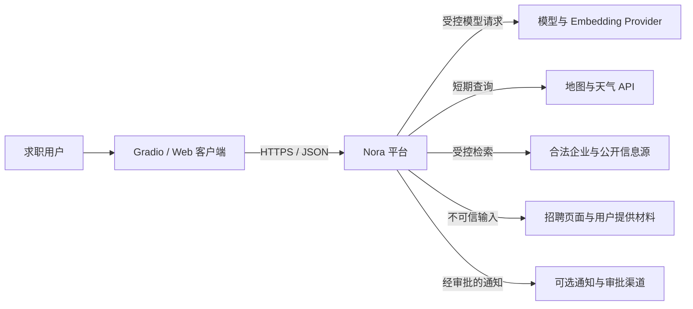
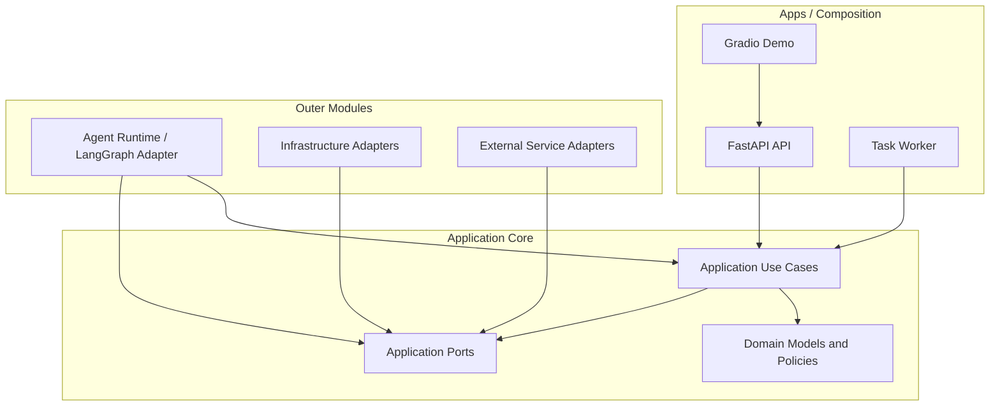
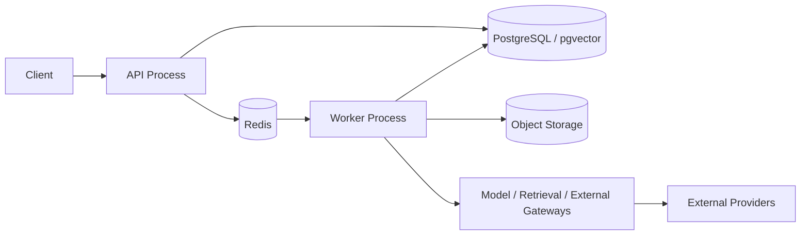
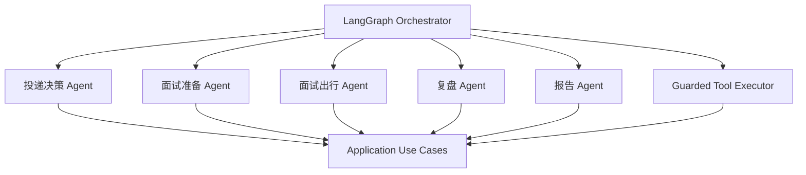
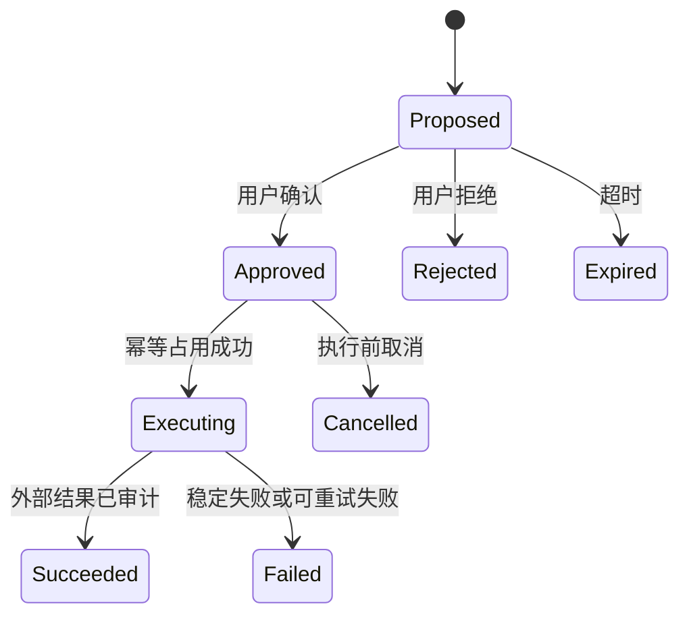

# Nora 初版架构

本文定义 Nora 新架构周期的第一版系统边界。它是后续 Architecture、Epic 和 Implementation Issue 的共同基线，
不代表文中所有目标能力已经实现。

## 1. 状态与适用范围

- 状态：Initial Architecture。
- 决策来源：Architecture Issue #3。
- 当前仓库：只有治理、模板和项目 Skill，尚无应用代码或运行时依赖。
- 适用范围：M0 架构基础、M1 首个纵向切片和 M2 Agentic RAG 基础。
- 变更规则：修改领域边界、数据所有权、依赖方向、进程或安全模型时，必须先创建 Architecture Issue。

文档中的“当前决策”是后续实现必须遵守的边界；“目标能力”需要独立 Issue 验收；“演进选项”只有达到触发条件后
才能引入。

## 2. 产品目标

Nora 是面向求职决策的可审计多智能体平台。系统将公司背景、岗位匹配、面试准备、出行规划、风险研判和面试复盘
组织为可追溯的 Decision Report，帮助用户理解：

- 哪些内容来自原始材料或外部数据；
- 哪些内容是规则计算或模型推断；
- 哪些信息存在冲突、过期或证据不足；
- 推荐动作是什么，以及为什么；
- 哪些动作需要用户确认后才能执行。

## 3. 架构原则

1. **业务事实优先。** PostgreSQL 中的领域状态是事实源；缓存、向量索引、Agent State 和模型输出不能成为第二事实源。
2. **Evidence First。** 关键结论必须引用可定位 Evidence；无证据内容只能保持候选、推断或未知状态。
3. **模型输出不可信。** 所有 LLM、Embedding、Reranker 和网页结果必须经过 Schema、归属、版本和策略校验。
4. **Agent 只做编排。** LangGraph 节点调用 Application Use Case 或受控 Tool，不直接访问 ORM、数据库或外部 SDK。
5. **外部写默认关闭。** 投递、发送消息、修改资料和其他外部副作用必须经过 Approval、幂等和审计。
6. **数据最小化。** 日志、队列、Prompt、向量元数据和审计记录只保存完成职责所需的最少数据。
7. **模块化单体优先。** 先验证领域边界和主流程，再根据真实负载拆分服务，不提前引入分布式复杂度。
8. **可替换基础设施。** Domain 和 Application 不依赖 FastAPI、SQLAlchemy、LangGraph、模型 SDK、Milvus 或第三方 API。

## 4. 当前关键决策

| 编号 | 决策 | 当前选择 | 说明 |
| :--- | :--- | :--- | :--- |
| D-001 | 架构形态 | 模块化单体，独立 API/Worker 进程 | 单仓库、共享领域模型；进程按职责隔离 |
| D-002 | 依赖方向 | Apps/Adapters → Application → Domain | 内层不导入 Web、ORM、Agent 或 SDK 类型 |
| D-003 | 业务事实源 | PostgreSQL | 领域状态、版本、审批、运行和审计均以 PostgreSQL 为准 |
| D-004 | 初期向量能力 | PostgreSQL + pgvector | 降低 M1/M2 部署成本；索引是可重建派生数据 |
| D-005 | 目标向量能力 | Milvus/Zilliz 演进选项 | 达到规模或检索隔离触发条件后再引入 |
| D-006 | Agent 编排 | LangGraph Adapter | 只管理运行图、暂停和恢复，不拥有领域事实 |
| D-007 | 模型访问 | Provider-neutral Model Gateway | DeepSeek 等 Provider 由配置选择，不绑定未验证版本 |
| D-008 | 异步任务 | Task Queue Port；目标 Adapter 为 Celery + Redis | 业务状态和最终结果不保存在 Celery Result Backend |
| D-009 | 演示界面 | Gradio 作为独立客户端 | 通过公开 API 使用系统，不导入 Application/Infrastructure |
| D-010 | 对象存储 | Object Storage Port | 本地开发可用文件系统；集成/部署可用 MinIO/S3 |

## 5. 系统上下文



系统不把第三方页面、模型 Provider、飞书 Base 或向量数据库当作业务事实源。外部来源数据必须先形成带来源、
获取时间、许可说明和内容摘要的 Source Snapshot，才能进入后续分析。

## 6. 逻辑架构与依赖方向



强制规则：

- Domain 只使用 Python 标准库和领域自身类型。
- Application 可以依赖 Domain 和 Application Ports，不依赖具体 Adapter。
- Agent Runtime 属于外层编排模块，只保存 ID、版本和结果引用。
- ORM Model、API DTO、Domain Entity、Application Command、Agent State 必须是不同类型。
- 跨上下文交互使用 ID、明确 DTO、领域事件或 Application Service，不共享 ORM Model 和 Repository。

## 7. 领域上下文

| Context | 主要职责 | 代表性业务对象 | 不负责 |
| :--- | :--- | :--- | :--- |
| Identity & Preferences | 用户身份、租户映射、时区、语言、隐私与出行偏好 | User、ExternalIdentity、UserPreference | 简历事实、岗位结论、第三方凭据正文 |
| Career Profile | 简历版本、已确认经历、技能和能力证据 | ResumeVersion、CandidateProfile、CapabilityEvidence | 岗位评分、面试状态和模型推断事实化 |
| Opportunity Intelligence | 公司与岗位快照、风险 Evidence、人岗分析输入 | CompanySnapshot、JobPosting、OpportunityCase | 投递状态、报告发布和消息发送 |
| Interview Journey | 面试计划、准备材料、题目、出行方案和复盘 | InterviewPlan、QuestionSet、TravelPlan、InterviewReview | 公司事实源和长期画像直接修改 |
| Decision & Reporting | 汇总经校验的分析结果，生成版本化决策报告 | DecisionCase、Recommendation、DecisionReport | 原始抓取、任意模型调用和外部写执行 |
| Knowledge & Evidence | 来源快照、文档版本、Chunk、Evidence、检索索引和记忆候选 | SourceDocument、Evidence、MemoryCandidate、RetrievalRecord | 直接决定业务状态或自动确认用户事实 |
| Automation & Governance | Run、Task、Tool、Approval、Checkpoint、Audit 和幂等 | AgentRun、ProposedAction、Approval、ToolCall、AuditEvent | 拥有其他 Context 的业务聚合 |

上下文边界是逻辑所有权，不要求从第一天拆成独立服务。初期可位于同一 Python 包和 PostgreSQL 实例，但必须保持
模块、Repository、表和事务责任清晰。

## 8. 进程与运行时边界



### API Process

- 负责认证上下文、HTTP DTO、输入校验、调用 Use Case 和稳定错误映射。
- 短请求不执行长时间模型调用、浏览器动作或批量 Embedding。
- 不在路由中写业务规则，不返回 ORM、SDK 或内部 Agent State。

### Worker Process

- 负责数据导入、Embedding、检索构建、分析、报告生成和通知等异步任务。
- 队列载荷只包含任务名、业务 ID、版本和幂等键，不包含简历正文、Cookie、Token 或大型对象。
- Worker 从事实源重新加载状态；任务消息不是事实源。

### Agent Runtime

- 初期作为 Worker 内的逻辑模块运行，使用 LangGraph 管理条件边、暂停、恢复和 Checkpoint。
- State 只保存业务 ID、输入版本、步骤状态和 Artifact 引用。
- 不保存数据库 Session、SDK Client、浏览器 Page、密钥或完整敏感文档。
- 独立扩展或部署只有在 Agent 负载、资源隔离或发布节奏确有需要时进行。

### Browser/Connector Runtime

- 不属于 M1 前置能力。
- 引入时必须是独立受限进程，只接受固定动作 Schema、域名 Allowlist 和服务认证。
- 只读采集与外部写动作分离；验证码、风控和不确定页面状态立即转人工处理。

## 9. 数据所有权

| 数据类别 | 权威存储 | 性质 | 规则 |
| :--- | :--- | :--- | :--- |
| 用户、画像、岗位、面试、报告 | PostgreSQL | 业务事实 | 聚合和 Repository 负责写入与版本控制 |
| Run、Approval、ToolCall、Audit | PostgreSQL | 治理事实 | 追加式或受状态机约束，不由队列状态替代 |
| 原始简历、截图、附件、长文档 | Object Storage | 不可变或版本化对象 | 私有访问、摘要校验、短期签名引用 |
| Chunk、Embedding、稀疏索引 | pgvector；后续可迁移 Milvus | 可重建派生数据 | 必须引用 Source/Artifact 版本和生成器版本 |
| 缓存、锁、限流、幂等占用 | Redis | 临时状态 | 必须有 TTL；丢失后可从事实源恢复 |
| Celery 任务消息 | Redis Broker | 传输状态 | 只携带 ID 和版本；不保存最终业务结果 |
| Agent Checkpoint | PostgreSQL Adapter | 可恢复编排状态 | 不包含密钥、大型正文和未版本化对象 |
| 外部 API 响应 | Source Snapshot / Object Storage | 不可信输入快照 | 保存来源、查询、时间、摘要和许可信息 |

### 向量数据库演进

M1/M2 先使用 pgvector，避免在领域尚未稳定时维护额外分布式组件。满足以下任一条件后，才通过独立 Architecture
Issue 评估 Milvus/Zilliz：

- 向量规模、召回延迟或索引构建明显超出 PostgreSQL 目标；
- 需要独立扩缩容、多集合隔离或高级混合检索能力；
- 向量工作负载影响事务数据库稳定性；
- 已有可复现 Benchmark 证明迁移收益高于运维成本。

迁移时 PostgreSQL 仍保存 Artifact、Evidence 和索引版本元数据；Milvus 只保存可重建向量与最小检索元数据。

## 10. RAG 与 Evidence 流程

```mermaid
flowchart LR
    Input["不可信来源"] --> Snapshot["Source Snapshot"]
    Snapshot --> Parse["解析与规范化"]
    Parse --> Chunk["Versioned Chunks"]
    Chunk --> Embed["BGE-M3 Embedding"]
    Embed --> Index["pgvector / Milvus Index"]
    Query["业务查询"] --> Retrieve["Hybrid Retrieve"]
    Index --> Retrieve
    Retrieve --> Rerank["Reranker"]
    Rerank --> Pack["Evidence Pack"]
    Pack --> Model["Model Gateway"]
    Model --> Validate["Schema + Policy Validation"]
    Validate --> Candidate["Candidate Analysis"]
    Candidate --> Confirm["Rule / User Confirmation"]
    Confirm --> Report["Versioned Decision Report"]
```



每个 Evidence 至少包含：

- `source_id` 与 Source/Artifact 版本；
- 可定位 locator，例如页码、段落、字段路径或 URL 片段；
- 内容摘要与采集/生成时间；
- 来源类型、可信级别和许可说明；
- 生成器、Embedding、Reranker 和检索参数版本。

模型不得把检索结果之外的陈述包装为来源事实。无法定位或证据冲突时，输出必须保持 `unknown`、`inferred`、
`conflicting` 或 `needs_confirmation` 等显式状态。

## 11. 多智能体边界

目标角色可以包括投递决策、面试准备、出行规划、报告汇总和复盘 Agent，但它们不是独立数据所有者。



约束：

- Agent 读取的是版本化 DTO/Evidence Pack，不读取 ORM Entity 或任意数据库查询结果。
- Agent 输出是候选 DTO，必须经过 Application Policy 才能持久化或发布。
- Tool Registry 使用固定注册表和 Pydantic Schema，不接受运行时任意 Python、JavaScript、URL 或选择器。
- READ、COMPUTE、WRITE Tool 显式分类；WRITE 必须匹配 Approval 中冻结的用户、目标、内容摘要和版本。
- 不保存或暴露模型私有 chain-of-thought；只保存可审查的结构化步骤、引用、规则结果和停止原因。

## 12. 外部写、审批与幂等



- ProposedAction 是不可变快照，包含用户、Run、Tool、目标、预览、内容摘要、风险等级、版本和失效时间。
- 修改内容必须生成新的 ProposedAction/Approval，不能复用旧批准。
- 幂等键由服务端根据用户、动作、目标、内容摘要和版本生成。
- 同键同内容重放首次结果；同键不同内容返回冲突。
- 外部成功但本地超时属于不确定结果，必须先查询外部状态或转人工，不盲目重复写入。

## 13. 安全与隐私边界

### 身份与授权

- 身份来自认证上下文，不信任请求正文提供的 `user_id`。
- 所有 Repository 查询都包含用户/租户归属边界。
- Service Token、用户 Token 和第三方 OAuth 凭据分离，并使用 Secret Store 或部署平台 Secrets。

### Prompt Injection 与不可信内容

- 网页、简历、JD、企业材料和检索片段始终作为 data，而不是系统指令。
- Tool 参数只能来自受控 Schema 和策略，不从网页文本动态生成任意动作。
- URL Fetch 必须限制协议、域名、DNS/IP、重定向、响应大小和超时，防止 SSRF。

### 隐私与日志

- 日志不记录简历正文、面试回答全文、Token、Cookie、签名 URL 和完整 Prompt。
- 使用 request/trace/run/tool ID 关联事件，敏感字段脱敏。
- 数据导出、删除、保留期和长期记忆确认规则必须由独立 Security/Architecture Issue 定义。

### 供应链

- 新依赖必须记录用途、许可证、维护状态和替代方案。
- 容器使用非 root 用户、固定基础镜像版本和最小运行文件。
- CI 执行 secret scan、依赖审查、静态检查和适用测试；发布阶段再加入 SBOM、签名与漏洞门禁。

## 14. 事务、一致性与事件

- 一个 Application Use Case 只修改一个主要聚合/上下文事务。
- 外部网络调用不放在数据库事务中。
- 数据库提交与任务/事件发布采用 Outbox 或等价可靠发布模式，避免双写不一致。
- 跨 Context 使用领域事件和幂等消费者实现最终一致，不共享事务内 ORM 对象。
- 领域对象使用显式版本进行乐观并发控制；冲突返回稳定错误，不静默覆盖。
- 时间统一存储为 UTC，用户展示时按 IANA 时区转换。

## 15. 可观测性与审计

最小上下文字段：

- `request_id`、`trace_id`、`user_id_hash`；
- `case_id`、`run_id`、`task_id`、`tool_call_id`；
- `source_version`、`artifact_version`、`prompt_version`、`model_id`；
- 延迟、重试次数、停止原因和稳定错误码。

审计与普通日志分离。AuditEvent 记录操作者、动作、目标、前后版本、Approval、幂等键和结果引用；审计记录本身不保存
密钥或大段敏感正文。

## 16. 目标目录与模块边界

物理目录在首个工程基础 Issue 中落盘，目标形态如下：

```text
Nora/
├── apps/
│   ├── api/                 # HTTP composition、路由与 lifespan
│   ├── worker/              # Celery/任务进程 composition
│   └── demo/                # Gradio 客户端，后续 Issue 引入
├── src/nora/
│   ├── domain/              # Context 内领域模型与 Policy
│   ├── application/         # Use Case、Command、Query、DTO
│   ├── ports/               # Repository、Gateway、Clock、Queue 等边界
│   ├── agents/              # LangGraph Adapter 与受控 Agent State
│   ├── infrastructure/      # PostgreSQL、Redis、Vector、Storage Adapter
│   └── integrations/        # Model、地图、天气、企业信息等 Adapter
├── tests/
│   ├── unit/
│   ├── architecture/
│   ├── contract/
│   ├── integration/
│   └── e2e/
├── docs/
└── docker/
```

不为目标蓝图批量创建空目录。每个目录只有在对应 Issue 提供真实实现、测试和调用路径时才建立。

## 17. 测试策略

| 层级 | 目的 | 外部依赖 |
| :--- | :--- | :--- |
| Unit | 领域规则、状态机、Policy、纯函数 | 无 |
| Architecture | 依赖方向、禁止导入、模块所有权 | 无 |
| Contract | Port、API、DTO、Tool、Provider Adapter 契约 | Fake/Recorded |
| Integration | PostgreSQL、pgvector、Redis、对象存储、队列 | 专用本地/CI 服务 |
| E2E | 用户主路径、权限、异步恢复和报告 | 隔离环境 |
| Dynamic | 真实模型、地图、天气、企业和浏览器平台 | 显式凭据与人工授权 |

动态测试默认不进入普通 CI。外部服务不可用时，必须完成其余检查并明确标记跳过原因；Recorded/Fixture 不得冒充
Live 结果。

## 18. 部署演进

### M1/M2 本地与演示部署

```text
Gradio/Web → API → PostgreSQL + pgvector
                 ↘ Redis → Worker → Model/External Adapters
                            ↘ Object Storage
```

- Docker Compose 编排 API、Worker、PostgreSQL、Redis 和可选 MinIO。
- 只发布 API/UI 端口，数据库、Redis 和对象存储保持内部可见。
- 模型、地图和天气 Provider 使用显式配置；无配置时使用 Disabled Adapter 并明确失败。

### 服务拆分触发条件

只有满足真实证据后才拆分：

- Agent/Embedding 资源需求与 API 明显不同；
- 独立扩缩容或故障隔离能解决已测量问题；
- 团队所有权或发布节奏需要独立生命周期；
- 已有 Contract、可观测性和数据一致性方案支持拆分。

## 19. 首个业务纵向切片

首个业务切片选择：**手工导入不可变岗位快照**。

用户通过认证 API 提交 JD 文本及可选来源信息，系统创建用户范围内的不可变 JobPosting Snapshot，并返回稳定 ID、
来源元数据、内容摘要、创建时间和幂等结果。

该切片验证：

- Identity Context 的最小认证主体；
- Opportunity Context 的领域模型和唯一写入口；
- API DTO → Command → Use Case → Repository → PostgreSQL 的依赖方向；
- 用户数据隔离、输入限制、规范化、内容摘要和重复导入幂等；
- 事务、错误映射、审计、单元/契约/集成测试；
- 不依赖 LLM、RAG、浏览器、Redis、Celery、Milvus 或外部 API 即可独立验收。

明确非目标：岗位评分、公司背调、简历匹配、Agent、报告生成、浏览器采集和自动投递。

## 20. 建议实施顺序

1. **工程基础。** Python 包、依赖锁、配置、异常、日志、FastAPI 工厂和 CI 门禁。
2. **数据库基础。** PostgreSQL Engine、事务、Schema 管理策略和 Repository 测试基线。
3. **Identity 最小上下文。** 认证主体和用户范围数据隔离。
4. **岗位快照纵向切片。** 手工导入、幂等、读取和审计。
5. **Career Profile 与 Evidence。** 简历版本、已确认事实和来源定位。
6. **Decision Case。** 组合用户画像与岗位快照，先实现确定性规则。
7. **RAG 基础。** Source、Chunk、BGE-M3、pgvector、Reranker 和 Evidence Pack。
8. **Agent Runtime。** LangGraph、Run、Checkpoint、Tool Executor 和 Approval。
9. **专项 Agent。** 背调、匹配、面试、出行、报告和复盘逐个交付。
10. **Milvus/服务拆分。** 只有 Benchmark 和负载达到触发条件后评估。

该顺序是依赖建议，不是批量创建 Issue 的授权。每一步只在前置 PR 合并后创建下一个真实 Issue。

## 21. 明确延后事项

- 从第一天部署微服务、Kubernetes 或服务网格；
- 在无 Benchmark 时同时维护 pgvector 和 Milvus 两套事实语义；
- 自动投递、自动发送招聘消息或无人值守浏览器写操作；
- 将飞书 Base、向量数据库、Redis 或 Agent State 作为业务事实源；
- 保存模型私有 chain-of-thought；
- 多租户企业权限、计费和生产级高可用；
- 在核心数据保留与删除规则确认前导入真实敏感简历。

## 22. 后续 ADR

以下决策需在相关实现前通过独立 Architecture Issue/ADR 固化：

- 数据库 Schema 演进和迁移工具；
- 身份 Provider、Session/OAuth 和本地开发身份；
- Celery Broker、重试、取消和可靠事件发布；
- Object Storage 与用户数据删除策略；
- BGE-M3 部署方式、Reranker 和检索 Benchmark；
- Milvus 引入阈值与迁移方案；
- Model Gateway Provider、Prompt 版本和成本预算；
- 浏览器与飞书集成的授权和安全模型。
