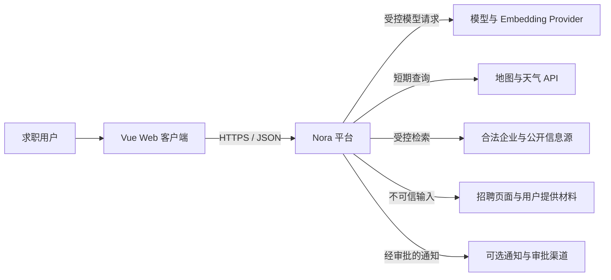
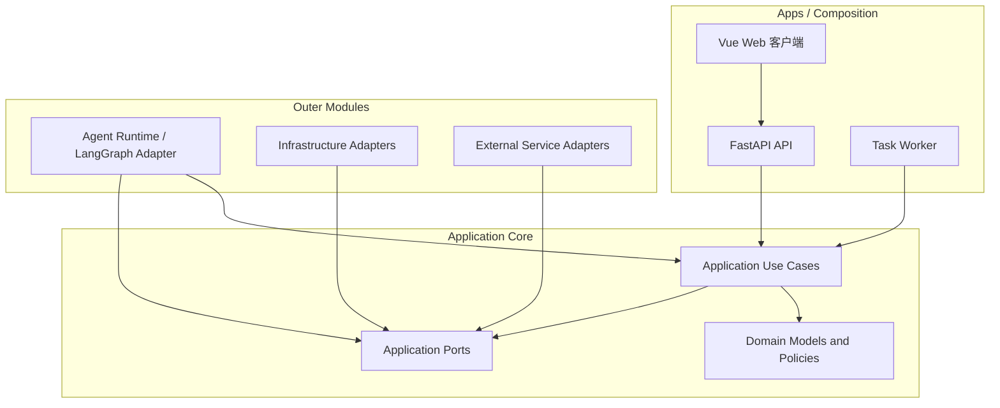
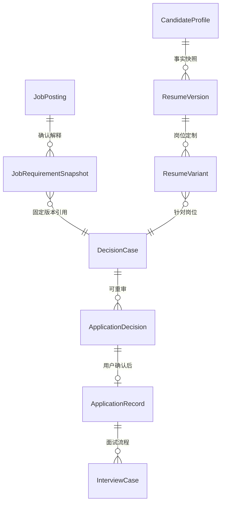
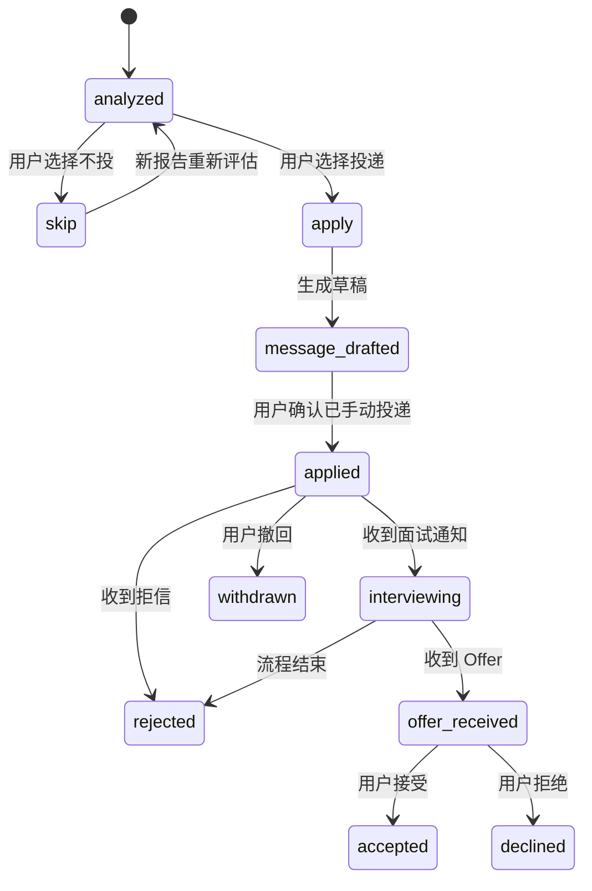
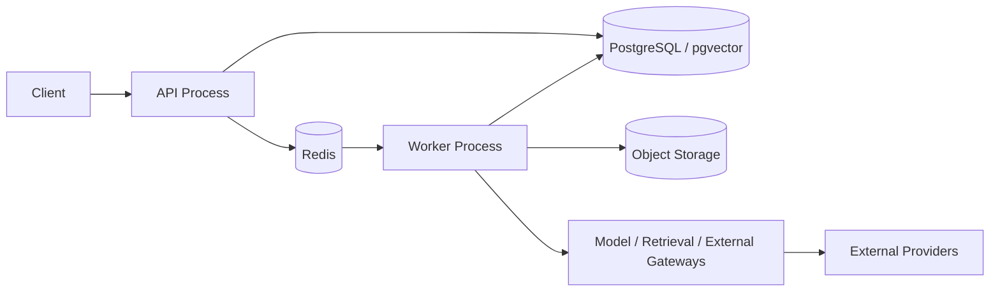
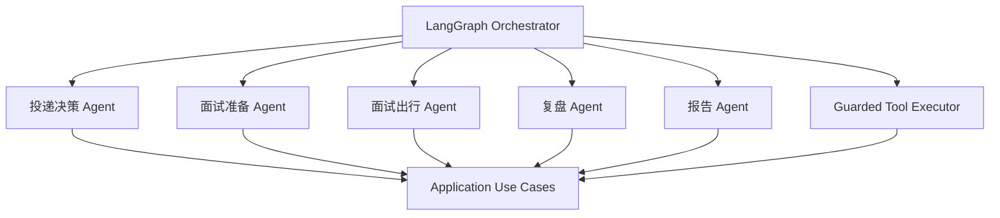
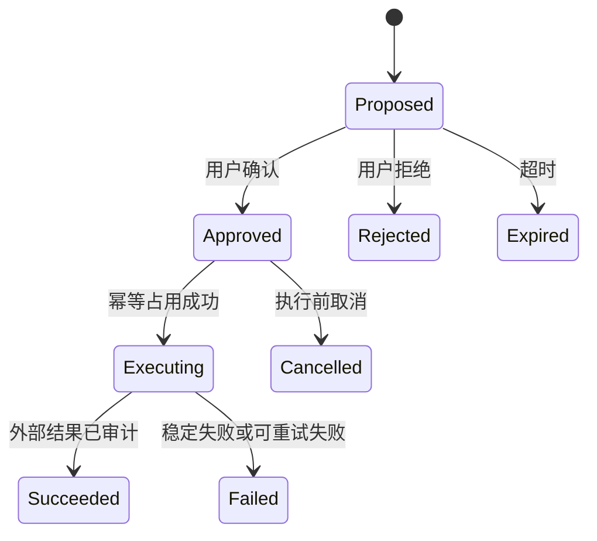

# Nora 初版架构

本文定义 Nora 新架构周期的第一版系统边界。它是后续 Architecture、Epic 和 Task Issue 的共同基线，
不代表文中所有目标能力已经实现。

产品目标、用户旅程和能力状态由 [`PRODUCT_VISION.md`](PRODUCT_VISION.md) 定义；本文只定义实现必须遵守的架构边界。

## 1. 状态与适用范围

- 状态：Initial Architecture。
- 决策来源：Architecture Issue #3、#49、#59、#98、#135。
- 当前代码：M0/M1 与既有输入/Web 基线已交付，包括 Identity、不可变 JobPosting、CandidateProfile、ResumeVersion、Vue Web、前端 CI、JD 输入契约与基础浏览器 E2E。
- 适用范围：重新开放的 M2 分析就绪输入、M3 确定性决策、M4 投递闭环 Beta、M5 Evidence/AI 增强，以及触发式候选能力。
- 变更规则：修改领域边界、数据所有权、依赖方向、进程或安全模型时，必须先创建 Architecture Issue。

文档中的“当前决策”是后续实现必须遵守的边界；“目标能力”需要独立 Issue 验收；“演进选项”只有达到触发条件后
才能引入。

## 2. 产品目标

Nora 是面向求职决策的可审计系统。系统将公司背景、岗位匹配、面试准备、出行规划、风险研判和面试复盘
组织为可追溯的 Decision Report，帮助用户理解：

- 哪些内容来自原始材料或外部数据；
- 哪些内容是规则计算或模型推断；
- 哪些信息存在冲突、过期或证据不足；
- 推荐动作是什么，以及为什么；
- 哪些动作需要用户确认后才能执行。

## 3. 架构原则

1. **业务事实优先。** PostgreSQL 中的领域状态是事实源；缓存、向量索引、Agent State 和模型输出不能成为第二事实源。
2. **Evidence First。** 关键结论必须引用可定位 Evidence；无证据内容只能保持候选、推断或未知状态。
3. **模型输出不可信。** 所有 LLM、Embedding、Reranker 和网页结果必须经过 Schema、归属、版本和策略校验。
4. **Agent 只做编排。** LangGraph 节点调用 Application Use Case 或受控 Tool，不直接访问 ORM、数据库或外部 SDK。
5. **外部写默认关闭。** 投递、发送消息、修改资料和其他外部副作用必须经过 Approval、幂等和审计。
6. **数据最小化。** 日志、队列、Prompt、向量元数据和审计记录只保存完成职责所需的最少数据。
7. **模块化单体优先。** 先验证领域边界和主流程，再根据真实负载拆分服务，不提前引入分布式复杂度。
8. **可替换基础设施。** Domain 和 Application 不依赖 FastAPI、SQLAlchemy、LangGraph、模型 SDK、Milvus 或第三方 API。

## 4. 当前关键决策

| 编号 | 决策 | 当前选择 | 交付阶段 | 说明 |
| :--- | :--- | :--- | :--- | :--- |
| D-001 | 架构形态 | 模块化单体，按需启用 API/Worker 进程 | M0–M5 | 单仓库、共享领域模型；进程按职责隔离 |
| D-002 | 依赖方向 | Apps/Adapters → Application → Domain | M0 起 | 内层不导入 Web、ORM、Agent 或 SDK 类型 |
| D-003 | 业务事实源 | PostgreSQL | M0 起 | 领域状态、版本、审批、运行和审计均以 PostgreSQL 为准 |
| D-004 | 初期向量能力 | PostgreSQL + pgvector | M5 | Embedding 契约先于 Schema；索引是可重建派生数据；M2-M4 不依赖向量能力 |
| D-005 | 专用向量能力 | Milvus/Zilliz 演进选项 | 规模触发后评估 | 达到规模或检索隔离触发条件后再引入 |
| D-006 | Agent 编排 | LangGraph Adapter 候选 | 触发后评估 | 只有多 Tool、分支和暂停/恢复需求成立后引入；不拥有领域事实 |
| D-007 | 模型访问 | Provider-neutral Model Gateway | M5 | Provider 由配置选择，不绑定未验证版本；M2-M4 无模型也可完成 |
| D-008 | 异步任务 | Task Queue Port；候选 Adapter 为 Celery + Redis | M5 条件评估 | 仅在指标成立时引入；最终结果不保存在 Celery Result Backend |
| D-009 | Web 客户端 | Vue 3 + Vite 独立前端 | Current/M2 延伸 | 既有工作台已交付；新增输入确认由 M2 完成，始终通过公开 HTTP API |
| D-010 | 对象存储 | Object Storage Port | M4 起 | 本地开发可用文件系统；投递产物和集成/部署可用 MinIO/S3 |
| D-011 | 工程组织 | 前后端分离；后端业务模块优先、模块内分层 | #59 / 后续 Task | `backend/app` 边界 Current；业务模块内聚渐进迁移 |
| D-012 | 岗位要求所有权 | 独立 `JobRequirementSnapshot`（版本化、来源定位、确认状态） | M2 | `JobPosting` 只保存原文；结构化要求独立版本化；OCR/规则/LLM 抽取仅作候选，确认后才成为事实 |

## 5. 系统上下文


```mermaid
flowchart LR
    User["求职用户"]
    UI["Vue Web 客户端"]
    Nora["Nora 平台"]
    Model["模型与 Embedding Provider"]
    Maps["地图与天气 API"]
    Company["合法企业与公开信息源"]
    Job["招聘页面与用户提供材料"]
    Feishu["可选通知与审批渠道"]

    User --> UI
    UI -->|"HTTPS / JSON"| Nora
    Nora -->|"受控模型请求"| Model
    Nora -->|"短期查询"| Maps
    Nora -->|"受控检索"| Company
    Nora -->|"不可信输入"| Job
    Nora -->|"经审批的通知"| Feishu
```

系统不把第三方页面、模型 Provider、飞书 Base 或向量数据库当作业务事实源。外部来源数据必须先形成带来源、
获取时间、许可说明和内容摘要的 Source Snapshot，才能进入后续分析。

## 6. 逻辑架构与依赖方向


```mermaid
flowchart TB
    subgraph Apps["Apps / Composition"]
        API["FastAPI API"]
        Worker["Task Worker"]
        Web["Vue Web 客户端"]
    end

    subgraph Outer["Outer Modules"]
        Agents["Agent Runtime / LangGraph Adapter"]
        Infra["Infrastructure Adapters"]
        External["External Service Adapters"]
    end

    subgraph Core["Application Core"]
        UseCases["Application Use Cases"]
        Ports["Application Ports"]
        Domain["Domain Models and Policies"]
    end

    API --> UseCases
    Worker --> UseCases
    Web --> API
    Agents --> UseCases
    Agents --> Ports
    Infra --> Ports
    External --> Ports
    UseCases --> Domain
    UseCases --> Ports
```

强制规则：

- Domain 只使用 Python 标准库和领域自身类型。
- Application 可以依赖 Domain 和 Application Ports，不依赖具体 Adapter。
- Agent Runtime 属于外层编排模块，只保存 ID、版本和结果引用。
- ORM Model、API DTO、Domain Entity、Application Command、Agent State 必须是不同类型。
- 跨上下文交互使用 ID、明确 DTO、领域事件或 Application Service，不共享 ORM Model 和 Repository。

## 7. 领域上下文

| Context | 主要职责 | 代表性业务对象 | 不负责 |
| :--- | :--- | :--- | :--- |
| Identity & Preferences | 用户身份、租户映射、时区、语言、隐私与出行偏好 | User、ExternalIdentity、UserPreference | 简历事实、岗位结论、第三方凭据正文 |
| Career Profile | 简历版本、已确认经历、技能和能力证据 | ResumeVersion、CandidateProfile、CapabilityEvidence | 岗位评分、面试状态和模型推断事实化 |
| Opportunity Intelligence | 公司与岗位快照、风险 Evidence、人岗分析输入 | CompanySnapshot、JobPosting、JobRequirementSnapshot、DecisionCase | 投递状态、报告发布和消息发送 |
| Application & Follow-up | 用户对机会的决定、投递产物和投递进度 | ApplicationDecision、ResumeVariant、MessageDraft、ApplicationRecord | 修改个人主档、自动发送外部消息或自动投递 |
| Interview Journey | 面试计划、准备材料、题目、出行方案和复盘 | InterviewPlan、QuestionSet、TravelPlan、InterviewReview | 公司事实源和长期画像直接修改 |
| Decision & Reporting | 汇总经校验的分析结果，生成版本化决策报告 | DecisionCase、Recommendation、DecisionReport | 原始抓取、任意模型调用和外部写执行 |
| Knowledge & Evidence | 来源快照、文档版本、Chunk、Evidence、检索索引和记忆候选 | SourceDocument、Evidence、MemoryCandidate、RetrievalRecord | 直接决定业务状态或自动确认用户事实 |
| Automation & Governance | Run、Task、Tool、Approval、Checkpoint、Audit 和幂等 | AgentRun、ProposedAction、Approval、ToolCall、AuditEvent | 拥有其他 Context 的业务聚合 |

### Career Profile 契约

`CandidateProfile` 是用户确认事实的主档，采用字段级确认而不是整份档案一次性确认：

| 区块 | 最小字段 | 规则 |
| :--- | :--- | :--- |
| 基本信息 | 显示名、标题、所在城市、联系方式、公开链接 | 联系方式按隐私策略存储；每个字段可单独确认或撤回 |
| 经历 | 公司、岗位、起止时间、雇佣类型、职责、成就、技术栈、来源引用 | 时间范围必须可排序；成就与技术栈可以有多个 Evidence |
| 项目 | 名称、角色、时间、背景、职责、结果、技术栈、来源引用 | 结果优先保存用户原文；模型改写只能成为候选 |
| 教育 | 学校、学历、专业、起止时间、来源引用 | 只保存用户确认内容 |
| 技能 | 名称、分类、熟练度、最近使用时间、来源引用 | 使用规范化名称；熟练度是用户/规则标签，不是模型臆测 |
| 偏好 | 地点、工作方式、行业、岗位类型、薪酬约束、硬性排除项 | 偏好影响建议，不改变岗位和公司事实 |

每个字段都带 `confirmation_status`（`unconfirmed`、`confirmed`、`rejected`、`superseded`）、来源版本、更新时间和用户归属。PDF/Word 导入时，原文件进入 `SourceDocument`，解析结果先作为候选，用户确认后才写入 `CandidateProfile`。

### 岗位要求契约（JobRequirementSnapshot）

`JobPosting` 保存用户实际看到的岗位原文与基本来源元数据；结构化岗位要求使用独立 `JobRequirementSnapshot`，与原文分离、不反向覆盖原文，避免向原始快照持续追加解释字段。

| 项 | 最小结构 | 规则 |
| :--- | :--- | :--- |
| 身份与归属 | `id`、`owner_id`、`version`、`job_posting_id` 与岗位版本 | 用户范围隔离；岗位引用必须带版本 |
| 结构化字段 | `required_skills`、`minimum_experience_years`、`degree_requirement`、`location_requirement`、`work_mode` | `work_mode` 取 onsite / hybrid / remote / unknown；缺失保持 unknown，不从自由文本推断 |
| 确认状态 | 字段级 `confirmation_status` | `unknown` / `unconfirmed` / `confirmed` |
| 来源定位 | 原文字符区间 / 人工输入 / OCR 预览 | 每条解释可定位来源与录入方式 |
| 版本元数据 | `created_at`、生成器或录入方式版本、内容哈希或等价幂等标识 | 修改确认结果创建新版本，不覆盖历史快照 |

取舍：向 `JobPosting` 追加解释字段（破坏原文快照、无法版本化）与派生表/缓存临时保存（不可作为业务事实源、无法承载用户确认语义）均被拒绝，采用独立 `JobRequirementSnapshot`。

规则：

- OCR、规则或 LLM 输出只作为候选，经用户确认后才成为确定性规则事实；
- `DecisionCase` 固定引用 `job_requirement_snapshot_id` 与版本，不能只引用「当前岗位要求」；
- 数据所有权、Schema 与迁移必须继续遵守下述 DecisionCase 输入契约。

### DecisionCase 输入契约

`DecisionCase` 是 Decision & Reporting 上下文拥有的不可变分析输入关系。创建时固定以下引用，源对象后续产生新版本不得重写历史案例：

| 输入 | 固定字段 | 不变量 |
| :--- | :--- | :--- |
| 岗位原文 | `job_posting_id`、`job_posting_version` | 必须是当前用户可见的精确版本 |
| 岗位要求 | `job_requirement_snapshot_id`、快照版本 | 必须属于所选岗位及岗位版本 |
| 用户主档 | `candidate_profile_id`、主档版本 | 必须是当前用户可见的精确版本 |
| 简历事实 | `resume_version_id`、简历版本 | 必须由所选主档版本发布 |
| 规则 | `rule_set_version` | 规范化后参与输入指纹，不隐式使用“最新规则” |

创建用例先按用户范围解析全部对象；对象不存在、属于其他用户或版本不匹配均返回统一不可见语义，不泄露跨用户存在性。规范化输入生成确定性 SHA-256 指纹，同一用户和同一输入指纹只创建一个案例并支持幂等重放。

持久化层用包含 `owner_id` 的复合外键约束四类输入，并限制版本为正数。状态只允许 `created`、`completed`、`failed`：终态必须记录完成时间，失败态还必须同时记录稳定失败码与信息。公开创建/读取路由、HTTP Schema 和错误映射由 #75 拥有；规则执行与报告生成分别由 #73、#74 拥有。

### 确定性规则契约

M3 首个规则集版本为 `m3-rules-v1`，只消费 `DecisionCase` 固定引用版本中的 confirmed 结构化字段，不读取 JD 或主档自由文本补全缺失事实。规则按固定顺序输出技能覆盖、最低经验年限、地点与工作方式兼容、学历要求四项结果；每项包含 `rule_id`、`rule_version`、`match` / `partial` / `mismatch` / `unknown` 状态、输入对象 ID 与版本、字段路径、可读原因、不确定性和可选建议。

规则是无 I/O 的纯领域逻辑：不访问数据库、网络、模型或系统时钟。技能比较只做空白与大小写规范化，不隐式扩展同义词；经验年限只合并完整 confirmed 起止日期，未结束或日期不完整且可能改变结论时返回 `unknown`；现场或混合岗位按规范化后的明确目标地点比较，远程岗位由 `accepts_remote` 决定兼容性；学历只使用规则集显式声明的等级映射，无法识别的表达保持 `unknown`。源对象新版本、未知字段或未确认字段不得改变历史案例的既有规则输入。

### 主档、简历与岗位输出关系


```mermaid
erDiagram
    CandidateProfile ||--o{ ResumeVersion : "事实快照"
    ResumeVersion ||--o{ ResumeVariant : "岗位定制"
    JobPosting ||--o{ JobRequirementSnapshot : "确认解释"
    JobRequirementSnapshot }o--|| DecisionCase : "固定版本引用"
    DecisionCase ||--o{ ApplicationDecision : "可重审"
    ApplicationDecision ||--o| ApplicationRecord : "用户确认后"
    ApplicationRecord ||--o{ InterviewCase : "面试流程"
    ResumeVariant }o--|| DecisionCase : "针对岗位"
```

修改 `CandidateProfile` 不会重写历史 `ResumeVersion`；用户显式发布后生成新 `ResumeVersion`。`ResumeVariant` 固定引用一个 `ResumeVersion`、一个 `DecisionCase`、一个模板版本和一个渲染器版本。

### ApplicationDecision 状态机


```mermaid
stateDiagram-v2
    [*] --> analyzed
    analyzed --> skip: 用户选择不投
    analyzed --> apply: 用户选择投递
    skip --> analyzed: 新报告重新评估
    apply --> message_drafted: 生成草稿
    message_drafted --> applied: 用户确认已手动投递
    applied --> interviewing: 收到面试通知
    applied --> rejected: 收到拒信
    applied --> withdrawn: 用户撤回
    interviewing --> offer_received: 收到 Offer
    interviewing --> rejected: 流程结束
    offer_received --> accepted: 用户接受
    offer_received --> declined: 用户拒绝
```

状态转换必须记录操作者、时间、输入报告版本和幂等键。`message_drafted` 不代表消息已发送；只有用户确认外部网站或渠道已完成投递，才能进入 `applied`。

### 简历模板、PDF 与 MessageDraft

- 模板采用声明式 JSON `TemplateDefinition`：页面设置、样式 Token、区块顺序、允许字段和必填字段；不执行任意 HTML、JavaScript 或 Jinja。
- 模板发布后不可变。`ResumeVariant` 固定模板版本、`ResumeVersion`、`DecisionCase`、字段映射和生成器版本；模板更新不会重算历史 PDF。
- 初版 PDF 统一使用 WeasyPrint Adapter，将受限模板转换为 HTML/CSS 后渲染；输出文件写入 Object Storage，保存 SHA-256、模板版本、来源版本和用户归属，构建产物不得进入 Git。
- `MessageDraft` 是一条可编辑纯文本，默认 `professional` 风格，另支持 `concise` 和用户提供内推上下文的 `referral` 风格；输入只允许已确认主档、JD、公司 Evidence 和用户备注，初版不做平台适配、不自动发送。

### 公司网评 Evidence 与历史跳过检索

- 来源分为 `official/company`、`reputable_media`、`verified_platform`、`anonymous_platform`，保存 URL/来源标识、抓取时间、原始发布时间、许可信息和原文摘要。
- 时效标签按原始发布时间计算：`fresh`（不超过 12 个月）、`aging`（12–24 个月）、`stale`（超过 24 个月）；过期内容继续可见但不得作为当前事实。
- 初版只展示分层后的原文和时效，不对匿名评价做多数投票、加权平均或综合公司分数。
- 新岗位报告生成时，在用户范围内按规范化技术栈标签交集检索历史 `skip` 记录：至少两个共同标签且岗位族一致，最多展示 3 条，并提示“历史相似记录”，不自动改变当前建议。

上下文边界是逻辑所有权，不要求从第一天拆成独立服务。初期可位于同一 Python 包和 PostgreSQL 实例，但必须保持
模块、Repository、表和事务责任清晰。

## 8. 目标进程与运行时边界

下图描述 M5 按指标引入异步中间件后的目标边界。M0–M4 不得因为目标图中出现 Worker、Redis 或 Agent Runtime 就提前引入它们。


```mermaid
flowchart LR
    Client["Client"] --> API["API Process"]
    API --> PG[("PostgreSQL / pgvector")]
    API --> Redis[("Redis")]
    Redis --> Worker["Worker Process"]
    Worker --> PG
    Worker --> Objects[("Object Storage")]
    Worker --> Gateway["Model / Retrieval / External Gateways"]
    Gateway --> Providers["External Providers"]
```

### API Process

- 负责认证上下文、HTTP DTO、输入校验、调用 Use Case 和稳定错误映射。
- 短请求不执行长时间模型调用、浏览器动作或批量 Embedding。
- 不在路由中写业务规则，不返回 ORM、SDK 或内部 Agent State。

### Worker Process

- 只负责经过指标证明需要长耗时、重试或故障隔离的数据导入、Embedding、检索构建和模型增强等任务。
- 队列载荷只包含任务名、业务 ID、版本和幂等键，不包含简历正文、Cookie、Token 或大型对象。
- Worker 从事实源重新加载状态；任务消息不是事实源。

### Agent Runtime

- 触发条件成立并通过 Architecture Review 后，先作为 Worker 内的逻辑模块运行，候选使用 LangGraph 管理条件边、暂停、恢复和 Checkpoint。
- State 只保存业务 ID、输入版本、步骤状态和 Artifact 引用。
- 不保存数据库 Session、SDK Client、浏览器 Page、密钥或完整敏感文档。
- 独立扩展或部署只有在 Agent 负载、资源隔离或发布节奏确有需要时进行。

### Browser/Connector Runtime

- 不属于 M1 前置能力。
- 引入时必须是独立受限进程，只接受固定动作 Schema、域名 Allowlist 和服务认证。
- 只读采集与外部写动作分离；验证码、风控和不确定页面状态立即转人工处理。

## 9. 数据所有权

| 数据类别 | 权威存储 | 性质 | 规则 |
| :--- | :--- | :--- | :--- |
| 用户、画像、岗位、投递决定、投递记录、面试、报告 | PostgreSQL | 业务事实 | 聚合和 Repository 负责写入与版本控制 |
| JobRequirementSnapshot（结构化岗位要求） | PostgreSQL | 用户确认解释，独立版本 | 独立于 `JobPosting` 原文；字段级确认状态与来源定位；修改产生新版本；`DecisionCase` 固定引用快照版本 |
| 简历版本、模板配置、简历变体、消息草稿元数据 | PostgreSQL | 结构化事实与版本 | 记录用户归属、输入版本、模板版本和生成器版本 |
| Run、Approval、ToolCall、Audit | PostgreSQL | 治理事实 | 追加式或受状态机约束，不由队列状态替代 |
| 原始简历、截图、附件、长文档、生成 PDF | Object Storage | 不可变或版本化对象 | 私有访问、摘要校验、短期签名引用；生成产物不得提交 Git |
| Chunk、Embedding、稀疏索引 | pgvector；后续可迁移 Milvus | 可重建派生数据 | 必须引用 Source/Artifact 版本和生成器版本 |
| 缓存、锁、限流、幂等占用 | Redis | 临时状态 | 必须有 TTL；丢失后可从事实源恢复 |
| Celery 任务消息 | Redis Broker | 传输状态 | 只携带 ID 和版本；不保存最终业务结果 |
| Agent Checkpoint | PostgreSQL Adapter | 可恢复编排状态 | 不包含密钥、大型正文和未版本化对象 |
| 外部 API 响应 | Source Snapshot / Object Storage | 不可信输入快照 | 保存来源、查询、时间、摘要和许可信息 |

### 向量数据库演进

M5 在 Embedding 模型、版本、维度和归一化契约确定后计划使用 pgvector，避免在领域尚未稳定时维护额外分布式组件。
满足以下任一条件后，才通过独立 Architecture
Issue 评估 Milvus/Zilliz：

- 向量规模、召回延迟或索引构建明显超出 PostgreSQL 目标；
- 需要独立扩缩容、多集合隔离或高级混合检索能力；
- 向量工作负载影响事务数据库稳定性；
- 已有可复现 Benchmark 证明迁移收益高于运维成本。

迁移时 PostgreSQL 仍保存 Artifact、Evidence 和索引版本元数据；Milvus 只保存可重建向量与最小检索元数据。

## 10. RAG 与 Evidence 流程


```mermaid
flowchart LR
    Input["不可信来源"] --> Snapshot["Source Snapshot"]
    Snapshot --> Parse["解析与规范化"]
    Parse --> Chunk["Versioned Chunks"]
    Chunk --> Embed["BGE-M3 Embedding"]
    Embed --> Index["pgvector / Milvus Index"]
    Query["业务查询"] --> Retrieve["Hybrid Retrieve"]
    Index --> Retrieve
    Retrieve --> Rerank["Reranker"]
    Rerank --> Pack["Evidence Pack"]
    Pack --> Model["Model Gateway"]
    Model --> Validate["Schema + Policy Validation"]
    Validate --> Candidate["Candidate Analysis"]
    Candidate --> Confirm["Rule / User Confirmation"]
    Confirm --> Report["Versioned Decision Report"]
```

每个 Evidence 至少包含：

- `source_id` 与 Source/Artifact 版本；
- 可定位 locator，例如页码、段落、字段路径或 URL 片段；
- 内容摘要与采集/生成时间；
- 来源类型、可信级别和许可说明；
- 生成器、Embedding、Reranker 和检索参数版本。

模型不得把检索结果之外的陈述包装为来源事实。无法定位或证据冲突时，输出必须保持 `unknown`、`inferred`、
`conflicting` 或 `needs_confirmation` 等显式状态。

## 11. 多智能体边界

目标角色可以包括投递决策、面试准备、出行规划、报告汇总和复盘 Agent，但它们不是独立数据所有者。


```mermaid
flowchart TB
    Orchestrator["LangGraph Orchestrator"]
    DecisionAgent["投递决策 Agent"]
    PrepAgent["面试准备 Agent"]
    TravelAgent["面试出行 Agent"]
    ReviewAgent["复盘 Agent"]
    ReportAgent["报告 Agent"]
    UseCases["Application Use Cases"]
    Tools["Guarded Tool Executor"]

    Orchestrator --> DecisionAgent
    Orchestrator --> PrepAgent
    Orchestrator --> TravelAgent
    Orchestrator --> ReviewAgent
    Orchestrator --> ReportAgent
    DecisionAgent --> UseCases
    PrepAgent --> UseCases
    TravelAgent --> UseCases
    ReviewAgent --> UseCases
    ReportAgent --> UseCases
    Orchestrator --> Tools
    Tools --> UseCases
```

约束：

- Agent 读取的是版本化 DTO/Evidence Pack，不读取 ORM Entity 或任意数据库查询结果。
- Agent 输出是候选 DTO，必须经过 Application Policy 才能持久化或发布。
- Tool Registry 使用固定注册表和 Pydantic Schema，不接受运行时任意 Python、JavaScript、URL 或选择器。
- READ、COMPUTE、WRITE Tool 显式分类；WRITE 必须匹配 Approval 中冻结的用户、目标、内容摘要和版本。
- 不保存或暴露模型私有 chain-of-thought；只保存可审查的结构化步骤、引用、规则结果和停止原因。

## 12. 外部写、审批与幂等


```mermaid
stateDiagram-v2
    [*] --> Proposed
    Proposed --> Approved: 用户确认
    Proposed --> Rejected: 用户拒绝
    Proposed --> Expired: 超时
    Approved --> Executing: 幂等占用成功
    Executing --> Succeeded: 外部结果已审计
    Executing --> Failed: 稳定失败或可重试失败
    Approved --> Cancelled: 执行前取消
```

- ProposedAction 是不可变快照，包含用户、Run、Tool、目标、预览、内容摘要、风险等级、版本和失效时间。
- 修改内容必须生成新的 ProposedAction/Approval，不能复用旧批准。
- 幂等键由服务端根据用户、动作、目标、内容摘要和版本生成。
- 同键同内容重放首次结果；同键不同内容返回冲突。
- 外部成功但本地超时属于不确定结果，必须先查询外部状态或转人工，不盲目重复写入。

## 13. 安全与隐私边界

### 身份与授权

- 身份来自认证上下文，不信任请求正文提供的 `user_id`。
- 所有 Repository 查询都包含用户/租户归属边界。
- Service Token、用户 Token 和第三方 OAuth 凭据分离，并使用 Secret Store 或部署平台 Secrets。

### Prompt Injection 与不可信内容

- 网页、简历、JD、企业材料和检索片段始终作为 data，而不是系统指令。
- Tool 参数只能来自受控 Schema 和策略，不从网页文本动态生成任意动作。
- URL Fetch 必须限制协议、域名、DNS/IP、重定向、响应大小和超时，防止 SSRF；JD 输入的具体限制与 Adapter 审查清单见 [`JD_INPUT_SECURITY.md`](JD_INPUT_SECURITY.md)。
- 截图 OCR 先经 PIL 受限解码（像素与解压膨胀防护），再由百度智能云 OCR 识别；OCR 输出视为不可信输入，凭据经 `BAIDU_OCR_API_KEY` / `BAIDU_OCR_SECRET_KEY` 配置，失败返回稳定错误码。

### 隐私与日志

- 日志不记录简历正文、面试回答全文、Token、Cookie、签名 URL 和完整 Prompt。
- 使用 request/trace/run/tool ID 关联事件，敏感字段脱敏。
- 数据导出、删除、保留期和长期记忆确认规则必须由独立 Security/Architecture Issue 定义。

### 供应链

- 新依赖必须记录用途、许可证、维护状态和替代方案。
- 容器使用非 root 用户、固定基础镜像版本和最小运行文件。
- CI 执行 secret scan、依赖审查、静态检查和适用测试；发布阶段再加入 SBOM、签名与漏洞门禁。

## 14. 事务、一致性与事件

- 一个 Application Use Case 只修改一个主要聚合/上下文事务。
- 外部网络调用不放在数据库事务中。
- 数据库提交与任务/事件发布采用 Outbox 或等价可靠发布模式，避免双写不一致。
- 跨 Context 使用领域事件和幂等消费者实现最终一致，不共享事务内 ORM 对象。
- 领域对象使用显式版本进行乐观并发控制；冲突返回稳定错误，不静默覆盖。
- 时间统一存储为 UTC，用户展示时按 IANA 时区转换。

## 15. 可观测性与审计

最小上下文字段：

- `request_id`、`trace_id`、`user_id_hash`；
- `case_id`、`run_id`、`task_id`、`tool_call_id`；
- `source_version`、`artifact_version`、`prompt_version`、`model_id`；
- 延迟、重试次数、停止原因和稳定错误码。

审计与普通日志分离。AuditEvent 记录操作者、动作、目标、前后版本、Approval、幂等键和结果引用；审计记录本身不保存
密钥或大段敏感正文。

## 16. 工程目录与模块边界

Issue #59 已将后端工程迁移至 `backend/`：Python 应用包为 `backend/app/`，FastAPI composition 位于
`backend/app/apps/api/`，测试、Alembic 与 Python 工程清单均由 `backend/` 拥有。仓库根目录只保留跨工程文档、
Compose、Docker 配置和协作治理文件。

当前后端采用技术层 + 业务子模块的过渡形态：`application/`、`domain/`、`ports/` 下按业务上下文（`career`、
`decision`、`identity`、`opportunity`、`governance`）组织子模块，`apps/api/` 承载路由与 composition。该形态是模块化蓝图
的渐进迁移中间态，以确保目录迁移不改变业务行为：

```text
backend/
├── app/
│   ├── application/          # Use Case 编排（按业务子模块）
│   │   ├── career/
│   │   ├── decision/
│   │   ├── identity/
│   │   └── opportunity/
│   ├── apps/
│   │   └── api/              # FastAPI 路由与 composition
│   ├── domain/               # 领域对象与规则（按业务子模块）
│   │   ├── base/
│   │   ├── career/
│   │   ├── decision/
│   │   ├── governance/
│   │   ├── identity/
│   │   └── opportunity/
│   ├── infrastructure/       # ORM、Repository 与 Adapter
│   │   ├── auth.py
│   │   ├── config/
│   │   ├── database/
│   │   └── logging/
│   └── ports/                # Repository 与 Gateway Protocol
│       ├── career.py
│       ├── decision.py
│       ├── governance.py
│       ├── identity.py
│       ├── jd_input.py
│       ├── opportunity.py
│       └── repository.py
├── tests/
├── alembic/
├── alembic.ini
├── pyproject.toml
└── uv.lock
```

长期目标采用“业务模块优先、模块内部再分层”；下列模块化蓝图仍是 Target，不得描述为 Current：

```text
Nora/
├── backend/
│   ├── app/
│   │   ├── main.py                    # FastAPI 入口与 composition
│   │   ├── api/v1/router.py           # 聚合各业务模块路由
│   │   ├── core/                      # 进程级配置、安全、数据库和日志组装
│   │   ├── modules/
│   │   │   ├── identity/
│   │   │   │   ├── api/               # Router 与 Pydantic Schema
│   │   │   │   ├── application/       # Command、Query、Use Case、DTO
│   │   │   │   ├── domain/            # Entity、Value Object、Policy、Error
│   │   │   │   ├── ports/             # Repository 与 Gateway Protocol
│   │   │   │   └── infrastructure/    # ORM 与 Adapter
│   │   │   ├── opportunity/
│   │   │   └── governance/
│   │   └── shared/                    # 严格受控的无业务归属基础类型
│   ├── tests/                         # unit / architecture / contract / integration
│   ├── alembic/
│   ├── pyproject.toml
│   └── uv.lock
├── frontend/                          # Current：Vue 3 + Vite
│   ├── src/
│   │   ├── api/
│   │   ├── components/
│   │   ├── features/
│   │   ├── views/
│   │   ├── composables/
│   │   ├── stores/
│   │   └── router/
│   └── tests/
├── docs/
└── docker-compose.yml
```

### 模块职责

- `api/` 只负责 HTTP 输入、认证上下文、调用 Use Case 和稳定响应/错误映射，不包含业务规则或 SQL。
- `application/` 负责编排 Use Case 与事务，依赖 Domain 和 Ports，不导入 FastAPI、SQLAlchemy 或具体 Adapter。
- `domain/` 只包含本模块的领域对象和规则，仅依赖 Python 标准库及本模块领域类型。
- `ports/` 定义 Repository、Gateway、Clock、Queue 等 Protocol；Infrastructure 实现这些端口。
- `infrastructure/` 拥有 ORM Model、Repository Adapter 和外部 Provider Adapter，不向内层泄漏框架类型。
- `core/` 只拥有进程级配置、日志、安全和数据库组装，不作为业务逻辑或通用工具杂物目录。
- `shared/` 默认禁止新增；只有至少两个模块稳定复用且没有明确领域所有者的最小类型才可进入。

### 依赖规则

```text
API -> Application -> Domain
API -> Ports（仅用于类型与 composition）
Infrastructure -> Ports + Domain
Core/Composition -> API + Application + Infrastructure
Domain -X-> FastAPI / Pydantic / SQLAlchemy / Infrastructure
Application -X-> FastAPI / SQLAlchemy / 具体 Repository
Module A -X-> Module B 的 ORM、私有 API 或 Infrastructure
```

API Schema、Application Command/Query/DTO、Domain Entity 与 SQLAlchemy ORM Model 是不同类型。跨模块交互使用稳定 ID、
显式 DTO、领域事件或 Application Service，不共享 ORM Model。FastAPI `Depends` 只允许出现在 API/Composition 边界；
本决策不引入第三方依赖注入容器。

### API 版本与兼容性

`/api/v1` 是后续目标版本边界。当前已经发布的 `/auth/*`、`/job-postings/*`、`/health` 和 `/ready` 路由在独立兼容性
Issue 合并前保持不变；Architecture 文档不能替代路由迁移、兼容期和前端切换测试。

### 后续渐进迁移顺序

后续按下列原子 Task 顺序创建真实 Issue；前一项合并后才开始下一项：

1. **增加模块依赖架构测试。** 在 `backend/app/` 上固化层级、框架和跨 Context 禁止边，不改变业务行为。
2. **迁移 Identity 业务模块。** 只移动 Identity 的 API/Application/Domain/Ports/Infrastructure，保持认证路由和数据契约。
3. **迁移 Opportunity 与 Governance。** 在共享事务和审计测试保护下迁移岗位与审计模块，不改幂等语义。
4. **保持 Vue 工程边界。** Issue #26 和 #53 已交付客户端与前端 CI；后续页面继续按 [`FRONTEND.md`](FRONTEND.md) 只调用已发布 API，不伪造未交付能力。
5. **评审 `/api/v1` 兼容迁移。** 使用独立 Architecture/Task Issue 定义旧路由兼容期、OpenAPI 契约和双端测试。

不为目标蓝图批量创建空目录。每个目录只有在对应 Issue 提供真实实现、测试和调用路径时才建立。

## 17. 测试策略

| 层级 | 目的 | 外部依赖 |
| :--- | :--- | :--- |
| Unit | 领域规则、状态机、Policy、纯函数 | 无 |
| Architecture | 依赖方向、禁止导入、模块所有权 | 无 |
| Contract | Port、API、DTO、Tool、Provider Adapter 契约 | Fake/Recorded |
| Integration | PostgreSQL、pgvector、Redis、对象存储、队列 | 专用本地/CI 服务 |
| E2E | 用户主路径、权限、异步恢复和报告 | 隔离环境 |
| Dynamic | 真实模型、地图、天气、企业和浏览器平台 | 显式凭据与人工授权 |

动态测试默认不进入普通 CI。外部服务不可用时，必须完成其余检查并明确标记跳过原因；Recorded/Fixture 不得冒充
Live 结果。

## 18. 部署演进

### M1-M4 确定性核心与 Beta 边界

```text
M1: Client      → API → PostgreSQL
M2: Vue Web     → API → PostgreSQL（分析就绪输入）
M3: Vue Web     → API → PostgreSQL（确定性报告）
M4: Vue Web     → API → PostgreSQL / Object Storage（投递材料与记录）
```

- M0 的 Docker Compose 可提供 API、PostgreSQL 以及 Redis/MinIO 骨架，但 M1-M4 业务路径不依赖 Redis/Celery。
- 只发布 API 端口，数据库和其他基础设施保持内部可见。
- M3 的最小 Demo 不配置 Model Provider，不依赖 pgvector、Embedding、Reranker 或 LLM。

### M5 Evidence、AI 与条件异步边界

```text
M5 基础: Vue Web → API → PostgreSQL + pgvector / Object Storage / Model Gateway
M5 条件: Client → API → Redis/Task Queue → Worker → PostgreSQL / Object Storage / Providers
```

- M5 的 AI 增强失败时必须回退到 M3/M4 确定性流程，不覆盖业务事实。
- M5 只有在长任务、重试、吞吐或故障隔离指标成立时才引入 Redis/Celery；允许评估结论为不引入。

### 服务拆分触发条件

只有满足真实证据后才拆分：

- Agent/Embedding 资源需求与 API 明显不同；
- 独立扩缩容或故障隔离能解决已测量问题；
- 团队所有权或发布节奏需要独立生命周期；
- 已有 Contract、可观测性和数据一致性方案支持拆分。

## 19. 首个业务纵向切片

首个业务切片选择：**手工导入不可变岗位快照**。

用户通过认证 API 提交 JD 文本及可选来源信息，系统创建用户范围内的不可变 JobPosting Snapshot，并返回稳定 ID、
来源元数据、内容摘要、创建时间和幂等结果。

该切片验证：

- Identity Context 的最小认证主体；
- Opportunity Context 的领域模型和唯一写入口；
- API DTO → Command → Use Case → Repository → PostgreSQL 的依赖方向；
- 用户数据隔离、输入限制、规范化、内容摘要和重复导入幂等；
- 事务、错误映射、审计、单元/契约/集成测试；
- 不依赖 LLM、RAG、浏览器、Redis、Celery、Milvus 或外部 API 即可独立验收。

明确非目标：岗位评分、公司背调、简历匹配、Agent、报告生成、浏览器采集和自动投递。

## 20. 建议实施顺序

1. **工程基础。** Python 包、依赖锁、配置、异常、日志、FastAPI 工厂和 CI 门禁。
2. **数据库基础。** PostgreSQL Engine、事务、Schema 管理策略和 Repository 测试基线。
3. **Identity 最小上下文。** 认证主体和用户范围数据隔离。
4. **岗位快照纵向切片。** 手工导入、幂等、读取和审计。
5. **分析就绪输入。** 在既有岗位、主档、简历和 Web 基线上补齐 JobRequirementSnapshot、OCR/链接确认与 E2E。
6. **确定性决策 MVP。** DecisionCase、规则、版本化报告、apply/skip、真实页面和 Compose E2E。
7. **可部署投递闭环 Beta。** ResumeVariant、模板、PDF、MessageDraft、手工投递/面试记录、安全恢复和可观测性。
8. **Evidence 与 AI 增强。** Source、Chunk、Embedding 契约、pgvector、检索、Evidence Pack、Model Gateway 和增强报告。
9. **条件规模化。** 根据评测和性能指标决定是否引入 Reranker、Redis 或 Worker。
10. **触发式候选。** Agent Runtime、外部写、深度面试/出行和服务拆分只在准入条件成立后评估。

该顺序是依赖建议，不是批量创建 Issue 的授权。每一步只在前置 PR 合并后创建下一个真实 Issue。

## 21. 明确延后事项

- 从第一天部署微服务、Kubernetes 或服务网格；
- 在无 Benchmark 时同时维护 pgvector 和 Milvus 两套事实语义；
- 自动投递、自动发送招聘消息或无人值守浏览器写操作；
- 将飞书 Base、向量数据库、Redis 或 Agent State 作为业务事实源；
- 保存模型私有 chain-of-thought；
- 多租户企业权限、计费和生产级高可用；
- 在核心数据保留与删除规则确认前导入真实敏感简历。

## 22. 后续 ADR

以下决策需在相关实现前通过独立 Architecture Issue/ADR 固化：

- 数据库 Schema 演进和迁移工具；
- 第三方身份 Provider、Session/OAuth 和生产身份联邦；
- Celery Broker、重试、取消和可靠事件发布；
- Object Storage 与用户数据删除策略；
- BGE-M3 部署方式、Reranker 和检索 Benchmark；
- Milvus 引入阈值与迁移方案；
- Model Gateway Provider、Prompt 版本和成本预算；
- 浏览器与飞书集成的授权和安全模型。
