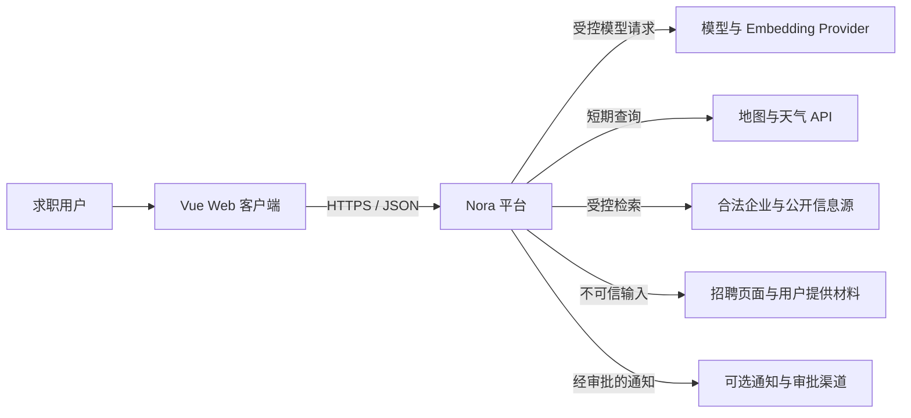
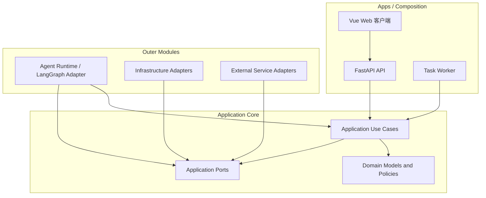
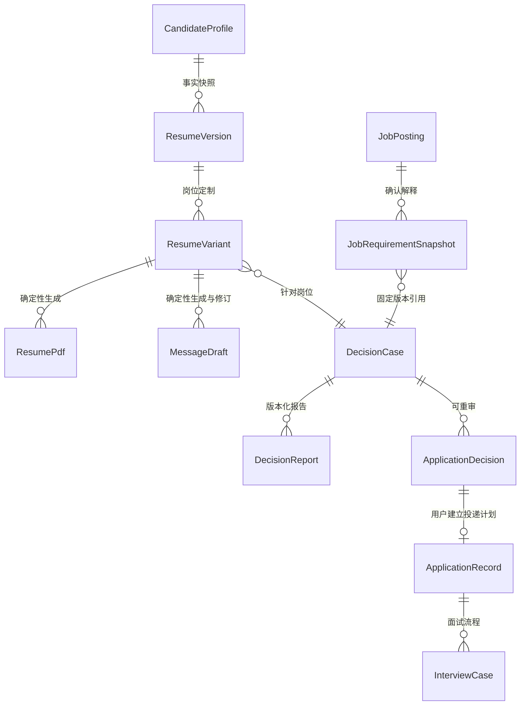
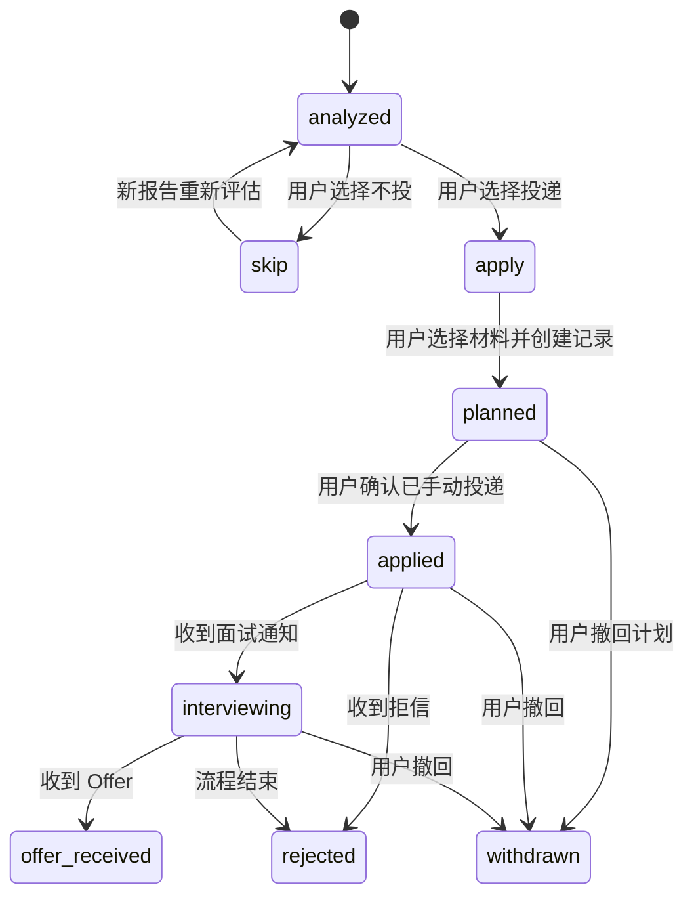
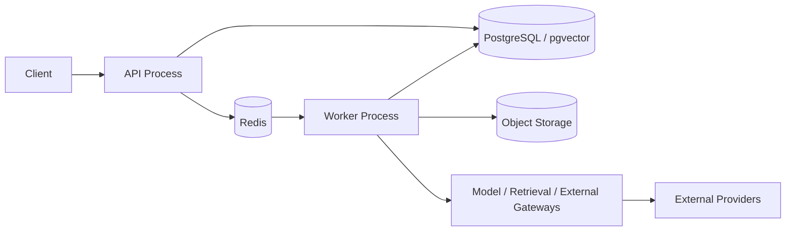
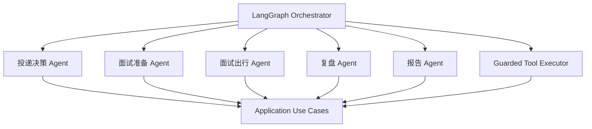
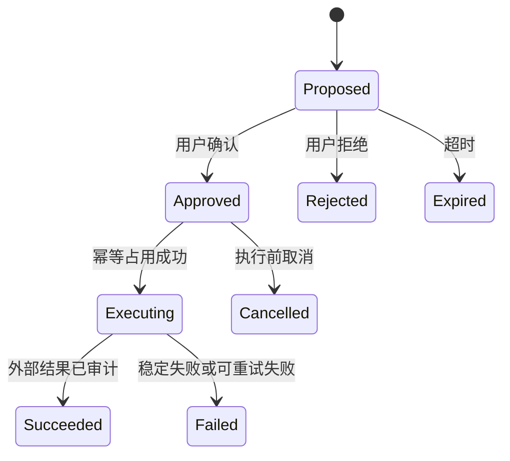

# Nora 初版架构

本文定义 Nora 新架构周期的第一版系统边界。它是后续 Architecture、Epic 和 Task Issue 的共同基线，
不代表文中所有目标能力已经实现。

产品目标、用户旅程和能力状态由 [`PRODUCT_VISION.md`](PRODUCT_VISION.md) 定义；本文只定义实现必须遵守的架构边界。

## 1. 状态与适用范围

- 状态：Initial Architecture。
- 决策来源：Architecture Issue #3、#49、#59、#98、#135、#163、#166、#171、#174、#183、#184、#185、#186、#187、#224。
- 当前代码：M0/M1、M2/M3 确定性工作流与首批 M4 能力已交付，包括 Identity、不可变 JobPosting、CandidateProfile、ResumeVersion、DecisionReport、ApplicationDecision、声明式模板、ResumeVariant、确定性 PDF、确定性 MessageDraft、手工 ApplicationRecord、最小 InterviewCase、Vue Web、Artifact/Source 基础和公司情报后端切片。
- 适用范围：重新开放的 M2 分析就绪输入、M3 确定性决策、M4 投递闭环 Beta、M5 Evidence/AI 增强，以及触发式候选能力。
- 变更规则：修改领域边界、数据所有权、依赖方向、进程或安全模型时，必须先创建 Architecture Issue。

文档中的“当前决策”是后续实现必须遵守的边界；“目标能力”需要独立 Issue 验收；“演进选项”只有达到触发条件后
才能引入。

## 2. 产品目标

Nora 是面向求职决策的可审计系统。系统将公司背景、岗位匹配、面试准备、出行规划、风险研判和面试复盘
组织为可追溯的 Decision Report，帮助用户理解：

- 哪些内容来自原始材料或外部数据；
- 哪些内容是规则计算或模型推断；
- 哪些信息存在冲突、过期或证据不足；
- 推荐动作是什么，以及为什么；
- 哪些动作需要用户确认后才能执行。

## 3. 架构原则

1. **业务事实优先。** PostgreSQL 中的领域状态是事实源；缓存、向量索引、Agent State 和模型输出不能成为第二事实源。
2. **Evidence First。** 关键结论必须引用可定位 Evidence；无证据内容只能保持候选、推断或未知状态。
3. **模型输出不可信。** 所有 LLM、Embedding、Reranker 和网页结果必须经过 Schema、归属、版本和策略校验。
4. **Agent 只做编排。** LangGraph 节点调用 Application Use Case 或受控 Tool，不直接访问 ORM、数据库或外部 SDK。
5. **外部写默认关闭。** 投递、发送消息、修改资料和其他外部副作用必须经过 Approval、幂等和审计。
6. **数据最小化。** 日志、队列、Prompt、向量元数据和审计记录只保存完成职责所需的最少数据。
7. **模块化单体优先。** 先验证领域边界和主流程，再根据真实负载拆分服务，不提前引入分布式复杂度。
8. **可替换基础设施。** Domain 和 Application 不依赖 FastAPI、SQLAlchemy、LangGraph、模型 SDK、Milvus 或第三方 API。

## 4. 当前关键决策

| 编号 | 决策 | 当前选择 | 交付阶段 | 说明 |
| :--- | :--- | :--- | :--- | :--- |
| D-001 | 架构形态 | 模块化单体，按需启用 API/Worker 进程 | M0–M5 | 单仓库、共享领域模型；进程按职责隔离 |
| D-002 | 依赖方向 | Apps/Adapters → Application → Domain | M0 起 | 内层不导入 Web、ORM、Agent 或 SDK 类型 |
| D-003 | 业务事实源 | PostgreSQL | M0 起 | 领域状态、版本、审批、运行和审计均以 PostgreSQL 为准 |
| D-004 | 初期向量能力 | PostgreSQL + pgvector | M5 | Embedding 契约先于 Schema；索引是可重建派生数据；M2-M4 不依赖向量能力 |
| D-005 | 专用向量能力 | Milvus/Zilliz 演进选项 | 规模触发后评估 | 达到规模或检索隔离触发条件后再引入 |
| D-006 | Agent 编排 | LangGraph Adapter 候选 | 触发后评估 | 只有多 Tool、分支和暂停/恢复需求成立后引入；不拥有领域事实 |
| D-007 | 模型访问 | 最小 ModelPort + 阿里云百炼北京地域单 Provider | M5 | Chat 使用 `qwen3.8-max`，Embedding 使用 `qwen3.7-text-embedding` 1024 维；M2-M4 无模型也可完成 |
| D-008 | 异步任务 | Task Queue Port；候选 Adapter 为 Celery + Redis | M5 条件评估 | 仅在指标成立时引入；最终结果不保存在 Celery Result Backend |
| D-009 | Web 客户端 | Vue 3 + Vite 独立前端 | Current/M2 延伸 | 既有工作台已交付；新增输入确认由 M2 完成，始终通过公开 HTTP API |
| D-010 | 对象存储 | Object Storage Port + MinIO/S3 首个真实 Adapter | M4 起 | 开发、集成 CI 与 Beta 统一验证私有 MinIO；Application 不依赖具体 SDK |
| D-011 | 工程组织 | 前后端分离；后端业务模块优先、模块内分层 | #59 / 后续 Task | `backend/app` 边界 Current；业务模块内聚渐进迁移 |
| D-012 | 岗位要求所有权 | 独立 `JobRequirementSnapshot`（版本化、来源定位、确认状态） | M2 | `JobPosting` 只保存原文；结构化要求独立版本化；OCR/规则/LLM 抽取仅作候选，确认后才成为事实 |
| D-013 | Artifact 与 Source 生命周期 | PostgreSQL 元数据事实源 + 私有对象存储字节 + 应用层补偿 | M4 | MinIO/S3 是首个真实 Adapter；逻辑删除先撤销访问，物理删除与孤儿清理由可重试任务完成 |
| D-014 | PostgreSQL 事务所有权 | Application 注入最小 `Transaction` Port，Repository 只查询、写入与 `flush` | #183 / M4 | 顶层写 Use Case 划分提交/回滚边界；SQLAlchemy Adapter 与 Repository 共享同一请求会话 |
| D-015 | JobPosting 幂等指纹 | 只接受当前完整字段指纹，不保留 M1 运行时双轨 | #184 / M4 | 无生产或稳定客户端迁移义务；直接删除 legacy 分支，旧格式记录按同键异请求返回冲突 |
| D-016 | DecisionCase 身份 | Decision & Reporting 拥有的不可变 ID，不预留常量版本字段 | #185 / M4 | CompanyAssessment 只引用 case ID；迁移双向重算生成身份并删除公开固定版本字段 |
| D-017 | 前端 HTTP 契约 | FastAPI OpenAPI + `openapi-typescript` / `openapi-fetch` | #186 / M4 | 生成类型只镜像传输契约；手写 transport 保留认证、超时、错误与 Blob 策略，CI 阻止漂移 |
| D-018 | 类型化错误契约 | 协议无关 `ErrorCode` + `ErrorCategory` 注册表 | #187 / M4 | API 只按 category 映射 HTTP；OpenAPI 枚举是前端类型真源，未知异常固定脱敏 500 |
| D-019 | Beta 部署与发布 | Host Reverse Proxy/TLS -> localhost Web -> API；GitHub Actions 为唯一 CD 控制面 | #171、#224 / M4 | 只有 Web 发布 localhost 端口；真实 HTTPS public smoke 先于健康指针；不支持容器内生产 ingress |
| D-020 | Beta 注册与会话安全 | 运维 bootstrap 唯一用户 + 短时 JWT key ring + PostgreSQL 登录限额 | #174、#224 / M4 | 生产关闭公共注册；精确 Origin；API 只信任固定 Web IP `/32` 和单值 forwarded headers |

### 首个模型 Provider 与最小数据边界（D-007 / #166）

截至 2026-08-18，M5 首个真实模型调用只允许使用阿里云百炼按量付费 API 的中国大陆北京地域。Chat 固定
`qwen3.8-max`，通过 OpenAI 兼容 Chat Completions 的 JSON Schema Structured Output 生成受校验结果；Embedding 固定
`qwen3.7-text-embedding`、dense 输出和 1024 维。两个模型属于同一 Provider、同一地域和同一账单边界；模型别名、地域、
维度或 Provider 的任何变化都必须先通过新的 Architecture Review，不能在实现 Issue 中静默替换。

选择依据与拒绝项：

- 百炼官方文档明确提供 JSON Schema 结构化输出、OpenAI 兼容调用和 `qwen3.7-text-embedding` 的 1024 维输出；
- 按量付费 API 的官方隐私说明承诺不将客户数据用于模型训练，并说明传输数据加密；Nora 不使用数据条款不同的 Coding Plan
  或 Token Plan 个人版，也不宣称 Provider 零保留；
- 中国大陆北京地域可直接服务当前开发与 Beta 边界，API Key、Endpoint 和模型均不得跨地域混用；
- OpenAI 直接 API 不作为首个 Provider，因为其 2026-08-18 官方支持国家与地区列表不包含中国大陆；
- 不引入第二 Chat/Embedding Provider、本地模型、fallback chain、动态路由、托管知识库、Provider 文件存储或 Reranker。

允许发送的数据仅限当前 Use Case 明确选择并在请求前完成 owner/版本校验的以下内容：

| 用途 | 允许发送 | 禁止发送 |
| :--- | :--- | :--- |
| AI 人岗分析 | 岗位正文、已确认岗位要求、用户明确选择的主档/简历字段、确定性报告字段 | 密码、JWT、API Key、内部日志、审计正文、无关联系方式、未选择的简历或主档字段 |
| RAG | 用户可见的 Source Chunk、查询文本、最小 source/version/locator 引用 | 原始文件字节、对象存储键、跨用户内容、已删除/不可见 Source、无关 Artifact |
| 诊断与计量 | 模型 ID、Prompt/Schema 版本、Token 用量、耗时、低基数错误分类 | Prompt/Response 正文、chain-of-thought、Secret、完整异常正文 |

所有用户材料和检索片段都按不可信 data 放入用户消息或结构化字段，不能拼入系统指令。Nora 只调用无托管会话状态的
Chat Completions 与 Embeddings 接口，不启用百炼应用、知识库、文件托管、联网搜索或 Tool；模型输出必须再次经过本地
Pydantic Schema、引用归属和 Application Policy 校验，校验失败不得发布业务对象。

凭据、预算与失败边界：

- 实现只读取 `DASHSCOPE_API_KEY` 的受控 Secret 注入，不把值写入仓库、数据库、日志、Prompt、异常或命令参数；开发环境可用
  进程环境变量，Beta 继承 D-019 的 root-owned Secret 文件和唯一消费者权限；
- `DASHSCOPE_API_KEY` 由 operator 在百炼控制台创建、轮换和撤销：先创建新 Key、更新受权限保护的 Secret 文件并验证一次受控
  连接，再撤销旧 Key；每次操作只记录 Secret 类别、版本、操作者、时间、消费者和验证结果，不记录 Key 值。轮换或撤销失败时
  保留旧 Key 直到新 Key 验证成功，Secret 缺失或已撤销统一进入稳定失败，不影响 M3/M4；
- Chat 单次应用层软预算为人民币 0.50 元，单次 Embedding ingestion 软预算为人民币 0.20 元，月度总软预算为人民币
  20 元；请求前按当前公开单价和最大 Token 估算，预计超限时不调用，Provider 控制台另设置不高于该月度值的费用预警/额度；
- 默认 timeout 由 #85 固定；只对连接错误、`429` 和明确 `5xx` 做至多一次带抖动重试，不重试认证、权限、输入、Schema
  或预算错误；
- Secret 缺失、超预算、Provider/区域不可用、限流或输出无效时，AI/RAG Use Case 返回稳定失败且允许显式重试，M3/M4
  确定性报告、投递材料和面试记录继续可用；失败不能伪造成 `unknown` 分析或成功版本；
- 普通 CI 只使用 Fake/Recorded 契约证据；真实 Chat/Embedding smoke 只在显式 Secret 环境运行。没有真实凭据时必须记录
  `not run`，不能把 Fake 结果写成 Provider 动态通过。

Issue #85 将 Chat 边界实现为 `ModelPort.generate_structured(request, output_type)`：Application 拥有版本化 Prompt、输入 token 上限、
输出 token 上限、temperature 和 Pydantic 输出 Schema；Infrastructure 只接受业务空间 ID，并固定拼接北京地域
`{WorkspaceId}.cn-beijing.maas.aliyuncs.com/compatible-mode/v1` 与 `qwen3.8-max`，不得从运行时配置换模或跨地域。
Adapter 默认 30 秒单次调用总墙钟 timeout，对连接错误、timeout、`429` 和 `5xx` 最多重试
一次并加入短抖动；认证/权限/其他 `4xx`、预算和输出校验失败不重试。调用固定关闭思考模式，不请求或保存 chain-of-thought。
调用前以请求声明的最大 token 和配置中经审查、只允许向上调整的单价执行
人民币 0.50 元单次软预算，月度人民币 20 元仍由 Provider 控制台执行，不在 Nora 内新增成本仓库。缺少 Secret 时只让模型调用以
稳定错误失败，不影响 M3/M4 组合与启动。

当前只交付固定无敏感正文的 Application 连通性探测、Fake Adapter 和显式凭据动态 smoke，证明 Port 到真实 Provider 的
结构化调用链；探测结果不写入业务事实，也不表示 AI 人岗分析、Embedding、RAG、Tool Calling 或 Agent Runtime 已交付。

本决策依据以下官方资料形成；价格、模型、地域或数据条款发生实质变化时停止新增模型调用并重新审查：

- [百炼模型与地域](https://help.aliyun.com/zh/model-studio/models)
- [千问结构化输出](https://help.aliyun.com/zh/model-studio/qwen-structured-output)
- [文本 Embedding 同步接口](https://help.aliyun.com/zh/model-studio/text-embedding-synchronous-api)
- [百炼模型价格](https://help.aliyun.com/zh/model-studio/model-pricing)
- [百炼合规资质与隐私说明](https://help.aliyun.com/zh/model-studio/privacy-notice)
- [OpenAI API 支持国家和地区](https://developers.openai.com/api/docs/supported-countries)

## 5. 系统上下文


```mermaid
flowchart LR
    User["求职用户"]
    UI["Vue Web 客户端"]
    Nora["Nora 平台"]
    Model["模型与 Embedding Provider"]
    Maps["地图与天气 API"]
    Company["合法企业与公开信息源"]
    Job["招聘页面与用户提供材料"]
    Feishu["可选通知与审批渠道"]

    User --> UI
    UI -->|"HTTPS / JSON"| Nora
    Nora -->|"受控模型请求"| Model
    Nora -->|"短期查询"| Maps
    Nora -->|"受控检索"| Company
    Nora -->|"不可信输入"| Job
    Nora -->|"经审批的通知"| Feishu
```

系统不把第三方页面、模型 Provider、飞书 Base 或向量数据库当作业务事实源。外部来源数据必须先形成带来源、
获取时间、许可说明和内容摘要的 Source Snapshot，才能进入后续分析。

## 6. 逻辑架构与依赖方向


```mermaid
flowchart TB
    subgraph Apps["Apps / Composition"]
        API["FastAPI API"]
        Worker["Task Worker"]
        Web["Vue Web 客户端"]
    end

    subgraph Outer["Outer Modules"]
        Agents["Agent Runtime / LangGraph Adapter"]
        Infra["Infrastructure Adapters"]
        External["External Service Adapters"]
    end

    subgraph Core["Application Core"]
        UseCases["Application Use Cases"]
        Ports["Application Ports"]
        Domain["Domain Models and Policies"]
    end

    API --> UseCases
    Worker --> UseCases
    Web --> API
    Agents --> UseCases
    Agents --> Ports
    Infra --> Ports
    External --> Ports
    UseCases --> Domain
    UseCases --> Ports
```

强制规则：

- Domain 只使用 Python 标准库和领域自身类型。
- Application 可以依赖 Domain、Application Ports 和经 D-007 审批的 Pydantic 结构化输出 Schema，不依赖具体 Adapter；Ports
  只为 `ModelPort` 的 Provider-neutral 泛型输出引用 Pydantic，不得引入模型 Provider SDK。架构门禁对两个内层只开放
  `pydantic` 这一项第三方根模块，FastAPI、HTTP client、ORM、Agent Runtime 与 Provider SDK 仍属于外层。
- Agent Runtime 属于外层编排模块，只保存 ID、版本和结果引用。
- ORM Model、API DTO、Domain Entity、Application Command、Agent State 必须是不同类型。
- 跨上下文交互使用 ID、明确 DTO、领域事件或 Application Service，不共享 ORM Model 和 Repository。

## 7. 领域上下文

| Context | 主要职责 | 代表性业务对象 | 不负责 |
| :--- | :--- | :--- | :--- |
| Identity & Preferences | 用户身份、租户映射、时区、语言、隐私与出行偏好 | User、ExternalIdentity、UserPreference | 简历事实、岗位结论、第三方凭据正文 |
| Career Profile | 简历版本、已确认经历、技能和能力证据 | ResumeVersion、CandidateProfile、CapabilityEvidence | 岗位评分、面试状态和模型推断事实化 |
| Opportunity Intelligence | 公司与岗位快照、风险 Evidence、人岗分析输入 | CompanySnapshot、JobPosting、JobRequirementSnapshot | 投递状态、报告发布和消息发送 |
| Application & Follow-up | 用户对机会的决定、投递产物和投递进度 | ApplicationDecision、ResumeVariant、MessageDraft、ApplicationRecord | 修改个人主档、自动发送外部消息或自动投递 |
| Interview Journey | 面试计划、准备材料、题目、出行方案和复盘 | InterviewPlan、QuestionSet、TravelPlan、InterviewReview | 公司事实源和长期画像直接修改 |
| Decision & Reporting | 汇总经校验的分析结果，生成版本化决策报告 | DecisionCase、CompanyAssessment、Recommendation、DecisionReport | 原始抓取、任意模型调用和外部写执行 |
| Knowledge & Evidence | 来源快照、文档版本、Chunk、Evidence、检索索引和记忆候选 | SourceDocument、Artifact、Evidence、MemoryCandidate、RetrievalRecord | 直接决定业务状态或自动确认用户事实 |
| Automation & Governance | Run、Task、Tool、Approval、Checkpoint、Audit 和幂等 | AgentRun、ProposedAction、Approval、ToolCall、AuditEvent | 拥有其他 Context 的业务聚合 |

### Career Profile 契约

`CandidateProfile` 是用户确认事实的主档，采用字段级确认而不是整份档案一次性确认：

| 区块 | 最小字段 | 规则 |
| :--- | :--- | :--- |
| 基本信息 | 显示名、标题、所在城市、联系方式、公开链接 | 联系方式按隐私策略存储；每个字段可单独确认或撤回 |
| 经历 | 公司、岗位、起止时间、雇佣类型、职责、成就、技术栈、来源引用 | 时间范围必须可排序；成就与技术栈可以有多个 Evidence |
| 项目 | 名称、角色、时间、背景、职责、结果、技术栈、来源引用 | 结果优先保存用户原文；模型改写只能成为候选 |
| 教育 | 学校、学历、专业、起止时间、来源引用 | 只保存用户确认内容 |
| 技能 | 名称、分类、熟练度、最近使用时间、来源引用 | 使用规范化名称；熟练度是用户/规则标签，不是模型臆测 |
| 偏好 | 地点、工作方式、行业、岗位类型、薪酬约束、硬性排除项 | 偏好影响建议，不改变岗位和公司事实 |

每个字段都带 `confirmation_status`（`unconfirmed`、`confirmed`、`rejected`、`superseded`）、来源版本、更新时间和用户归属。PDF/Word 导入时，原文件进入 `SourceDocument`，解析结果先作为候选，用户确认后才写入 `CandidateProfile`。

### JobPosting 幂等指纹兼容退出（D-015）

截至 #184 决策，Nora 没有 Git tag、GitHub Release、已完成的 Beta/生产部署或已登记的第三方 JobPosting 客户端；M4 部署、
发布与安全基线仍由开放 Issue 交付。M1 旧指纹只在 PR #100 引入的迁移集成测试中通过人工 SQL 构造，仓库没有必须重放的
真实旧记录证据。因此选择**直接删除运行时兼容**，不为假设数据增加一次性迁移、feature flag、wrapper 或永久双轨。

JobPosting 创建只使用一个当前指纹算法：先由 Domain 完成字段规范化，再对以下对象按 key 排序、紧凑 JSON、UTF-8 编码并计算
SHA-256：

```json
{
  "company_name": "<normalized value>",
  "jd_text": "<normalized value>",
  "job_title": "<normalized value>",
  "location": "<normalized value>",
  "source_type": "<enum value>",
  "source_url": "<normalized value or null>"
}
```

同一 owner 与规范化后的 `Idempotency-Key` 下，已存指纹等于当前请求指纹时返回首次 JobPosting；不相等时返回既有稳定
`409 idempotency_conflict`，不得忽略新增元数据字段或接受 M1 子集指纹。并发请求继续依赖 owner-scoped 唯一约束和 D-014
事务边界：失败事务先回滚，再读取赢家并执行相同的单指纹 replay / conflict 判定。

实现已删除 `_legacy_request_fingerprint()`、双指纹参数/集合比较和人工旧指纹重放断言，同时保留 PR #100 对岗位元数据
Schema 升级、回填、约束和 downgrade 的迁移验证；没有新增数据库迁移或修改公开请求/响应 Schema。测试覆盖同键同完整输入
重放、六个指纹字段逐一变化时冲突及同键并发，迁移测试只验证既有 64 位指纹在 Schema 往返中原样保留且不被当前算法重放。
合并后的回滚只整体回退实现 PR 以恢复旧分支，因为本决策不重写数据。

### 岗位要求契约（JobRequirementSnapshot）

`JobPosting` 保存用户实际看到的岗位原文与基本来源元数据；结构化岗位要求使用独立 `JobRequirementSnapshot`，与原文分离、不反向覆盖原文，避免向原始快照持续追加解释字段。

| 项 | 最小结构 | 规则 |
| :--- | :--- | :--- |
| 身份与归属 | `id`、`owner_id`、`version`、`job_posting_id` 与岗位版本 | 用户范围隔离；岗位引用必须带版本 |
| 结构化字段 | `required_skills`、`minimum_experience_years`、`degree_requirement`、`location_requirement`、`work_mode` | `work_mode` 取 onsite / hybrid / remote / unknown；缺失保持 unknown，不从自由文本推断 |
| 确认状态 | 字段级 `confirmation_status` | `unknown` / `unconfirmed` / `confirmed` |
| 来源定位 | 原文字符区间 / 人工输入 / OCR 预览 | 每条解释可定位来源与录入方式 |
| 版本元数据 | `created_at`、生成器或录入方式版本、内容哈希或等价幂等标识 | 修改确认结果创建新版本，不覆盖历史快照 |

取舍：向 `JobPosting` 追加解释字段（破坏原文快照、无法版本化）与派生表/缓存临时保存（不可作为业务事实源、无法承载用户确认语义）均被拒绝，采用独立 `JobRequirementSnapshot`。

规则：

- OCR、规则或 LLM 输出只作为候选，经用户确认后才成为确定性规则事实；
- `DecisionCase` 固定引用 `job_requirement_snapshot_id` 与版本，不能只引用「当前岗位要求」；
- 数据所有权、Schema 与迁移必须继续遵守下述 DecisionCase 输入契约。

### DecisionCase 输入契约

`DecisionCase` 是 Decision & Reporting 上下文拥有的不可变分析输入关系。创建时固定以下引用，源对象后续产生新版本不得重写历史案例：

| 输入 | 固定字段 | 不变量 |
| :--- | :--- | :--- |
| 岗位原文 | `job_posting_id`、`job_posting_version` | 必须是当前用户可见的精确版本 |
| 岗位要求 | `job_requirement_snapshot_id`、快照版本 | 必须属于所选岗位及岗位版本 |
| 用户主档 | `candidate_profile_id`、主档版本 | 必须是当前用户可见的精确版本 |
| 简历事实 | `resume_version_id`、简历版本 | 必须由所选主档版本发布 |
| 规则 | `rule_set_version` | 规范化后参与输入指纹，不隐式使用“最新规则” |

创建用例先按用户范围解析全部对象；对象不存在或属于其他用户时返回统一不可见语义，不泄露跨用户存在性；当前用户可见对象之间的版本或引用关系不兼容时返回稳定冲突。规范化输入生成确定性 SHA-256 指纹，同一用户和同一输入指纹只创建一个案例并支持幂等重放。

持久化层用包含 `owner_id` 的复合外键约束四类输入，并限制版本为正数。状态只允许 `created`、`completed`、`failed`：终态必须记录完成时间，失败态还必须同时记录稳定失败码与信息。公开创建/读取路由、HTTP Schema 和错误映射已由 #75 接入；规则执行与报告生成分别由 #73、#74 提供。

### 确定性规则契约

M3 首个规则集版本为 `m3-rules-v1`，只消费 `DecisionCase` 固定引用版本中的 confirmed 结构化字段，不读取 JD 或主档自由文本补全缺失事实。规则按固定顺序输出技能覆盖、最低经验年限、地点与工作方式兼容、学历要求四项结果；每项包含 `rule_id`、`rule_version`、`match` / `partial` / `mismatch` / `unknown` 状态、输入对象 ID 与版本、字段路径、可读原因、不确定性和可选建议。

规则是无 I/O 的纯领域逻辑：不访问数据库、网络、模型或系统时钟。技能比较只做空白与大小写规范化，不隐式扩展同义词；经验年限只合并完整 confirmed 起止日期，未结束或日期不完整且可能改变结论时返回 `unknown`；现场或混合岗位按规范化后的明确目标地点比较，远程岗位由 `accepts_remote` 决定兼容性；学历只使用规则集显式声明的等级映射，无法识别的表达保持 `unknown`。源对象新版本、未知字段或未确认字段不得改变历史案例的既有规则输入。

### DecisionReport 报告契约

`DecisionReport` 是 Decision & Reporting 上下文拥有的不可变业务事实。报告只消费与 `DecisionCase` 固定版本一致的确定性规则结果，不读取自由文本补全事实，也不调用 LLM。每个报告固定 `decision_case_id`、报告版本、规则集版本、生成器版本和生成时间，并保存匹配摘要、已满足条件、差距、未知项、风险、下一步与字段级引用。

报告内容明确分为五种语义：

| 分区 | 内容与边界 |
| :--- | :--- |
| Fact | 只陈述能够定位到 confirmed 输入版本的事实；部分或未知规则引用不得整体提升为事实 |
| Rule Result | 保存规则 ID、规则版本、结果状态、原因和所用 Citation |
| Unknown | 明确记录缺失、冲突或未确认输入及其影响，不猜测缺失值 |
| Recommendation | 由固定规则结果映射出的确定性后续动作，并保留来源规则 ID |
| Citation | 定位输入对象类型、对象 ID、版本和字段路径；不包含 M5 Evidence Pack |

同一用户、`DecisionCase`、规则集版本和生成器版本构成生成身份，重复生成返回既有报告。生成器升级在同一案例下追加递增报告版本；规则集版本由 `DecisionCase` 固定，规则集升级需创建固定新规则版本的新案例及报告，不覆盖旧案例或旧报告。PostgreSQL 同时约束案例内报告版本唯一和生成身份唯一，并在分配版本时锁定所属案例，保证并发重试最多发布一条报告。

公开分析与报告 API 使用同步应用层编排：`POST /decisions` 固定输入版本，`GET /decisions/{id}` 重新加载固定输入并执行规则，`POST /decisions/{id}/reports` 幂等生成报告，`GET /reports/{id}` 与 `GET /reports` 读取用户范围内结果。路由只负责认证、DTO、状态码和错误映射，不执行规则或 SQL。跨用户对象与不存在对象统一返回 `404`；只有当前用户可见对象之间的版本或关系冲突返回 `409`；请求校验返回 `422`；数据库或固定输入基础设施不可用返回脱敏 `503`。报告列表按 `generated_at DESC, id DESC` 稳定排序并使用从 1 开始的分页；缺少 confirmed 规则输入仍成功返回 `unknown`，不伪造失败或异步进度。

### 主档、简历与岗位输出关系


```mermaid
erDiagram
    CandidateProfile ||--o{ ResumeVersion : "事实快照"
    ResumeVersion ||--o{ ResumeVariant : "岗位定制"
    ResumeVariant ||--o{ ResumePdf : "确定性生成"
    ResumeVariant ||--o{ MessageDraft : "确定性生成与修订"
    JobPosting ||--o{ JobRequirementSnapshot : "确认解释"
    JobRequirementSnapshot }o--|| DecisionCase : "固定版本引用"
    DecisionCase ||--o{ DecisionReport : "版本化报告"
    DecisionCase ||--o{ ApplicationDecision : "可重审"
    ApplicationDecision ||--o| ApplicationRecord : "用户建立投递计划"
    ApplicationRecord ||--o{ InterviewCase : "面试流程"
    ResumeVariant }o--|| DecisionCase : "针对岗位"
```

修改 `CandidateProfile` 不会重写历史 `ResumeVersion`；用户显式发布后生成新 `ResumeVersion`。`ResumeVariant` 固定引用一个 apply `ApplicationDecision`、`DecisionCase`、`ResumeVersion`、`JobPosting`/`JobRequirementSnapshot` 精确版本、模板版本和生成器版本。

### ApplicationDecision 与 ApplicationRecord 状态机


```mermaid
stateDiagram-v2
    [*] --> analyzed
    analyzed --> skip: 用户选择不投
    analyzed --> apply: 用户选择投递
    skip --> analyzed: 新报告重新评估
    apply --> planned: 用户选择材料并创建记录
    planned --> applied: 用户确认已手动投递
    planned --> withdrawn: 用户撤回计划
    applied --> interviewing: 收到面试通知
    applied --> rejected: 收到拒信
    applied --> withdrawn: 用户撤回
    interviewing --> offer_received: 收到 Offer
    interviewing --> rejected: 流程结束
    interviewing --> withdrawn: 用户撤回
```

ApplicationRecord 状态转换必须记录操作者、业务发生时间、用户确认来源、渠道、可选备注和幂等键。生成 PDF、生成 MessageDraft 或创建 `planned` 记录都不代表消息已发送；只有用户确认外部网站或渠道已完成投递，才能进入 `applied`。

M3 Current 交付 `analyzed -> apply` 与 `analyzed -> skip`：`ApplicationDecision` 属于 Application & Follow-up 上下文，是引用一条不可变 `DecisionReport` 的不可变业务事实。记录固定报告 ID/版本、DecisionCase、分析所用 ResumeVersion、操作者、决定时间、原因和幂等键；每个用户范围内的一份报告最多存在一条决定。相同语义重放返回既有记录，复用幂等键提交不同内容或对同一报告提交不同决定返回稳定 `409`。`skip` 必须保存原因，`apply` 只表达投递意图；决定创建本身不自动生成材料或执行外部写，但可作为后续 ResumeVariant 创建的必要输入。公开接口为 `GET /reports/{id}/decision` 与 `POST /reports/{id}/decision`；跨用户与不存在报告统一返回 `404`，未决定的读取返回 `204`。

M4 Current `ApplicationRecord` 只允许从 apply 决定和属于该决定的不可变 ResumeVariant 创建，初始状态固定为 `planned`。记录固化 ResumeVariant ID/版本/内容指纹，并按用户显式选择固化可用 ResumePdf、Artifact 和 MessageDraft 的精确 ID、版本与哈希；未选择的可选材料统一保存为空，不在之后追随“最新版本”。每条 apply 决定最多一条记录。

创建与转换均使用 owner 范围幂等键；转换以 `base_version` 做乐观并发控制，非法状态边稳定返回 `application_record_transition_conflict/409`，过期或并发失败返回 `application_record_version_conflict/409`。业务记录、只追加转换事件和 AuditEvent 由 Application 顶层通过共享 `Transaction` 一次提交；任何写入失败整段回滚，冲突恢复必须先 rollback 再读取赢家。公开接口为 `POST/GET /application-records`、`GET /application-records/{id}` 以及 `POST/GET /application-records/{id}/transitions`，全部按 owner 隔离。系统没有招聘平台写 Adapter，不读取外部投递结果，也不会从未知外部状态自动推进记录。

M4 Current `InterviewCase` 只记录用户确认的面试通知事实，并固定属于一条已由用户推进到 `interviewing` 的 ApplicationRecord。每个安排以 v1 创建，后续对尚未开始的安排只追加 v2..N，不覆盖历史；精确版本、最新版本和完整版本列表均按 owner 隔离读取。方式限定为线下、线上或电话：线下必须有地点且无会议链接，线上必须有不含凭据的 HTTPS 链接且无地点，电话不得保存两者；时区使用 IANA 名称，轮次限定 1..20。

InterviewCase 创建和版本追加使用 owner 范围幂等键，请求指纹包含 ApplicationRecord、`base_version` 和全部规范化字段；`(id, version)` 唯一约束保护并发追加，过期或并发失败稳定返回 `interview_case_version_conflict/409`。InterviewCase 与 AuditEvent 在共享事务中原子提交，审计摘要只包含 ApplicationRecord、版本、状态、方式、开始时间、时区和轮次，不记录会议链接或备注。公开接口为 `POST /application-records/{id}/interviews`、`GET /interviews`、`GET /interviews/{id}`、`POST/GET /interviews/{id}/versions` 与 `GET /interviews/{id}/versions/{version}`；不包含邮件/日历读取、通知发送、面试准备、复盘、地图或天气 Provider。

### 简历模板、PDF 与 MessageDraft

- Current 模板采用声明式 JSON `TemplateDefinition`：页面尺寸、密度、强调色、区块顺序、允许字段和必填字段。模板发布后不可变，只接受受控枚举与结构化字段路径，不执行 Python、HTML、JavaScript、Jinja，也不加载外部脚本或网络资源。
- Current `ResumeVariant` 只允许从 apply 决定创建，固定 `ApplicationDecision`、`DecisionCase`、`ResumeVersion`、`JobPosting`/`JobRequirementSnapshot` 和模板的精确版本。用户选择、顺序、标签、编辑值、模板定义哈希及生成器版本共同参与内容指纹；同一 owner 范围的幂等键支持语义重放，不同载荷稳定冲突。历史源对象或模板升级不会重算或改写既有变体。
- 模板与变体公开接口为 `GET /templates`、`GET /templates/{id}/versions/{version}`、`POST /resume-variants`、`GET /resume-variants` 与 `GET /resume-variants/{id}`。对象按 owner 隔离，跨用户与不存在对象统一不可见；变体创建只写 PostgreSQL 结构化事实，不修改 CandidateProfile/ResumeVersion 且不执行外部写。
- Current `ResumePdf` 以 `pending -> available`、`pending/failed -> pending` 和 `pending -> failed` 记录可观察生成状态。生成身份固定 ResumeVariant ID/版本/内容指纹、模板 ID/版本/定义哈希、WeasyPrint/Pango Adapter 版本、Noto CJK 字体集版本、`zh-CN` 区域和 `UTC` 时区；同一身份重放复用同一 PDF 与 Artifact，模板、输入或渲染器升级产生不同身份，不覆盖历史产物。
- WeasyPrint Adapter 只把声明式模板和经 HTML 转义的纯文本转换为内部 HTML/CSS，拒绝所有 URL/resource fetch，不接受用户 HTML、脚本、Jinja、本地文件或网络资源。锁定容器固定 WeasyPrint、Pango、Noto CJK、`SOURCE_DATE_EPOCH` 和 PDF identifier；确定性承诺限于该锁定环境，相同生成身份必须产生相同 SHA-256。
- PDF 元数据先写入 PostgreSQL，再调用既有 `ArtifactService` 发布私有 `application/pdf` Artifact。只有 Artifact 为 `available` 且 generation identity、生成器、size 与 SHA-256 完整校验后，`ResumePdf` 才转为 `available`；渲染、对象存储或数据库发布失败保持不可下载并标为 `failed`，重试沿用同一身份。公开接口为 `POST /resume-variants/{id}/pdf`、`GET /resume-variants/{id}/pdf`、`GET /resume-pdfs/{id}` 与 `GET /resume-pdfs/{id}/content`，下载按 owner 隔离并使用私有缓存与安全文件名/header。
- Current `MessageDraft` 从一条不可变 ResumeVariant 生成纯文本，固定 apply `ApplicationDecision`、报告与 DecisionCase、CandidateProfile/ResumeVersion、JobPosting、ResumeVariant 内容指纹，以及可选 CompanySnapshot 的精确版本、哈希和时效。生成身份还包含风格、用户备注、模板与生成器版本；相同身份幂等复用，输入或模板变化产生独立草稿，不覆盖历史。
- 风格限于 `professional`、`concise` 和 `referral`；`referral` 必须由用户显式提供上下文，系统不推断内推关系。公司快照即使为 stale、unknown 或 conflicted 也只固定来源身份，不进入文本；只有附件状态为 `available` 且行业字段为 `confirmed` 时才可写入。生成和编辑均只接受纯文本，编辑以 `draft_id + base_version + text` 幂等追加修订，生成版本保持不可变。
- MessageDraft 公开接口为 `POST /resume-variants/{id}/message-drafts`、`GET /resume-variants/{id}/message-draft`、`GET /message-drafts`、`GET /message-drafts/{id}`、`GET /message-drafts/{id}/versions`、`GET /message-drafts/{id}/versions/{version}` 与 `POST /message-drafts/{id}/revisions`。所有对象按 owner 隔离；复制只发生在用户浏览器，不存在发送 Port、招聘平台 Adapter、模型调用、RAG 或外部写。

### 公司情报与决策报告版本边界

`CompanySnapshot` 属于 Opportunity Intelligence Context，`CompanyAssessment` 属于 Decision & Reporting Context。两者均按用户归属和正整数版本追加，版本发布后不可原地覆盖。

#### 所有权与来源

- `CompanySnapshot` 保存公司规模、行业、来源摘要和状态字段；它不保存岗位结论，也不直接修改 `JobPosting`、`DecisionCase` 或 `DecisionReport`。
- 每个公司情报字段都必须区分 `confirmed`、`unconfirmed`、`unknown`、`conflicted` 和 `superseded`；缺失、冲突、匿名或过期来源不得升级为当前事实。
- 公司来源通过 #21 的 `SourceDocument` 精确引用 `source_id`/`source_version`，并保存获取时间、原始发布时间、许可/录入方式和内容哈希。来源删除后，历史快照只保留版本、状态和墓碑引用，不再暴露正文、定位信息或下载能力。
- `CompanySnapshot` 的 owner、版本、来源和字段状态是 PostgreSQL 事实；对象字节若存在只由 Artifact/Source 生命周期决定，不能作为公司事实。

#### 与 M3 决策和报告的关系

- M3 `DecisionCase` 的四类输入、`input_fingerprint` 和 `rule_set_version` 保持不变。公司情报不追加到既有 DecisionCase 输入，不改变 M3 规则执行、幂等键或历史恢复。
- `CompanyAssessment` 是可选的独立版本化附件，固定 `owner_id`、`decision_case_id`、`company_snapshot_id`/版本、生成器版本和生成身份；它只能引用已存在且属于同一用户的对象。
- 当前 M3 `DecisionCase` 没有独立版本列，持久化身份为不可变 ID；CompanyAssessment 按下述 D-016 只保存案例 ID，
  不预留固定为 `1` 的版本字段。
- `DecisionReport` 的 M3 五类分区和生成身份保持不变。公开报告可在独立的兼容扩展字段中返回 `company_assessment_id`、版本、状态和来源引用；没有附件时返回 `unknown`/缺失，不读取“最新公司快照”填充历史报告。
- 公司快照或评估新版本不会静默重算或覆盖旧报告。刷新必须显式创建新的 `CompanyAssessment`，需要新的报告组合时由后续 Task 定义新的报告版本和生成身份；旧报告继续返回原有内容。

#### 缺失、冲突、过期与匿名来源

- 时效标签沿用 `fresh`（不超过 12 个月）、`aging`（12–24 个月）、`stale`（超过 24 个月）；`stale` 内容可审计查看但不作为当前事实。
- `official/company`、`reputable_media`、`verified_platform` 和 `anonymous_platform` 只表示来源类型，不代表自动可信度；匿名评价必须保留原始来源标记和摘要语气，不生成聚合评分。
- 版本组合中任一引用不可见、删除、冲突或过期时，Assessment 对应字段保持 `unknown` 或明确状态，并记录稳定原因；不得用最新版本或其他用户数据回填。

#### #79/#169 实现边界

- #79 负责 CompanySnapshot/CompanyAssessment 的 Domain、Application、Repository、认证 API 和报告兼容 DTO；不修改 M3 DecisionCase/Report 的既有字段和持久化身份。
- #169 只消费固定版本 API，提供录入、版本查看、状态和报告附件展示；页面刷新或重新登录不得切换到“最新版本”覆盖历史。
- 本决策不引入自动全网采集、RAG、Embedding、LLM 或外部写。

#### DecisionCase 不可变身份（D-016）

`DecisionCase` 由 Decision & Reporting Context 唯一拥有。它以 owner-scoped UUID 表达一组不可变分析输入；没有案例内版本序列，
精确引用只需要 `decision_case_id` 与 `owner_id`。CompanyAssessment 已通过 `(decision_case_id, owner_id)` 外键约束案例归属，且
`(report_id, report_version, decision_case_id, owner_id)` 外键同时证明附件报告与案例一致，因此固定为 `1` 的
`decision_case_version` 不增加完整性。

截至 #185 决策，Nora 没有 Git tag、GitHub Release、已完成的 Beta/生产部署或已登记的稳定 API 客户端；该字段只由 PR #179
后的仓库代码与测试消费。因此选择在首个实现切片中直接删除，不建立 DTO 兼容期、别名字段、wrapper 或替代占位版本。公开
CompanyAssessment 响应移除 `decision_case_version`；未来只有出现“同一案例身份下必须追加且独立引用多个输入修订”的真实需求时，
才能通过新的 Architecture Issue 为 DecisionCase 设计版本序列和迁移，不能复用本常量字段。

Schema upgrade 已在删除列前先按新身份对象重算每条 CompanyAssessment 的 `generation_identity`：

```json
{
  "company_snapshot_id": "<uuid>",
  "company_snapshot_version": 1,
  "decision_case_id": "<uuid>",
  "generator_version": "<normalized value>",
  "report_id": "<uuid>",
  "report_version": 1
}
```

序列化继续使用 key 排序、紧凑 JSON、ASCII 转义和 UTF-8 SHA-256。重算完成后已删除
`ck_company_assessment_case_compat_version`、`ck_company_assessment_case_version` 与 `decision_case_version` 列；其余外键、唯一约束
和 owner 隔离保持不变。迁移在一个数据库事务中校验所有新身份仍唯一，任何读取、重算或约束失败都停止升级，不留下半迁移状态。

Downgrade 先以默认值 `1` 加回非空列，按旧身份对象（包含 `"decision_case_version": 1`）重算全部生成身份，再恢复两个 Check
Constraint 并移除临时 server default。这样旧应用重放既有附件时仍得到原算法身份；upgrade/downgrade 都不删除
CompanyAssessment、DecisionCase 或报告数据。实现已同时移除 Domain 字段与构造参数、Application 固定值、Adapter 映射、
API DTO、ORM 列和固定值断言，不修改 CompanySnapshot、DecisionReport、Artifact 或 MessageDraft 的版本契约。

### 公司网评 Evidence 与历史跳过检索

- 来源分为 `official/company`、`reputable_media`、`verified_platform`、`anonymous_platform`，保存 URL/来源标识、抓取时间、原始发布时间、许可信息和原文摘要。
- 时效标签按原始发布时间计算：`fresh`（不超过 12 个月）、`aging`（12–24 个月）、`stale`（超过 24 个月）；过期内容继续可见但不得作为当前事实。
- 初版只展示分层后的原文和时效，不对匿名评价做多数投票、加权平均或综合公司分数。
- 新岗位报告生成时，在用户范围内按规范化技术栈标签交集检索历史 `skip` 记录：至少两个共同标签且岗位族一致，最多展示 3 条，并提示“历史相似记录”，不自动改变当前建议。

上下文边界是逻辑所有权，不要求从第一天拆成独立服务。初期可位于同一 Python 包和 PostgreSQL 实例，但必须保持
模块、Repository、表和事务责任清晰。

## 8. 目标进程与运行时边界

下图描述 M5 按指标引入异步中间件后的目标边界。M0–M4 不得因为目标图中出现 Worker、Redis 或 Agent Runtime 就提前引入它们。


```mermaid
flowchart LR
    Client["Client"] --> API["API Process"]
    API --> PG[("PostgreSQL / pgvector")]
    API --> Redis[("Redis")]
    Redis --> Worker["Worker Process"]
    Worker --> PG
    Worker --> Objects[("Object Storage")]
    Worker --> Gateway["Model / Retrieval / External Gateways"]
    Gateway --> Providers["External Providers"]
```

### API Process

- 负责认证上下文、HTTP DTO、输入校验、调用 Use Case 和稳定错误映射。
- 短请求不执行长时间模型调用、浏览器动作或批量 Embedding。
- 不在路由中写业务规则，不返回 ORM、SDK 或内部 Agent State。

### Worker Process

- 只负责经过指标证明需要长耗时、重试或故障隔离的数据导入、Embedding、检索构建和模型增强等任务。
- 队列载荷只包含任务名、业务 ID、版本和幂等键，不包含简历正文、Cookie、Token 或大型对象。
- Worker 从事实源重新加载状态；任务消息不是事实源。

### Agent Runtime

- 触发条件成立并通过 Architecture Review 后，先作为 Worker 内的逻辑模块运行，候选使用 LangGraph 管理条件边、暂停、恢复和 Checkpoint。
- State 只保存业务 ID、输入版本、步骤状态和 Artifact 引用。
- 不保存数据库 Session、SDK Client、浏览器 Page、密钥或完整敏感文档。
- 独立扩展或部署只有在 Agent 负载、资源隔离或发布节奏确有需要时进行。

### Browser/Connector Runtime

- 不属于 M1 前置能力。
- 引入时必须是独立受限进程，只接受固定动作 Schema、域名 Allowlist 和服务认证。
- 只读采集与外部写动作分离；验证码、风控和不确定页面状态立即转人工处理。

## 9. 数据所有权

| 数据类别 | 权威存储 | 性质 | 规则 |
| :--- | :--- | :--- | :--- |
| 用户、画像、岗位、投递决定、投递记录、面试、报告 | PostgreSQL | 业务事实 | 聚合和 Repository 负责写入与版本控制 |
| JobRequirementSnapshot（结构化岗位要求） | PostgreSQL | 用户确认解释，独立版本 | 独立于 `JobPosting` 原文；字段级确认状态与来源定位；修改产生新版本；`DecisionCase` 固定引用快照版本 |
| 简历版本、模板配置、简历变体、PDF/消息草稿元数据 | PostgreSQL | 结构化事实与版本 | 记录用户归属、状态、输入版本、模板版本、生成身份、生成器版本和 Artifact 精确引用 |
| Run、Approval、ToolCall、Audit | PostgreSQL | 治理事实 | 追加式或受状态机约束，不由队列状态替代 |
| 原始简历、截图、附件、长文档、生成 PDF | Object Storage | 不可变或版本化对象 | 私有访问、摘要校验、短期签名引用；生成产物不得提交 Git |
| Chunk、Embedding、稀疏索引 | pgvector；后续可迁移 Milvus | 可重建派生数据 | 必须引用 Source/Artifact 版本和生成器版本 |
| 缓存、锁、限流、幂等占用 | Redis | 临时状态 | 必须有 TTL；丢失后可从事实源恢复 |
| Celery 任务消息 | Redis Broker | 传输状态 | 只携带 ID 和版本；不保存最终业务结果 |
| Agent Checkpoint | PostgreSQL Adapter | 可恢复编排状态 | 不包含密钥、大型正文和未版本化对象 |
| 外部 API 响应 | Source Snapshot / Object Storage | 不可信输入快照 | 保存来源、查询、时间、摘要和许可信息 |

### Artifact 与 Source 生命周期（D-013）

#### 所有权与引用

- `SourceDocument` 属于 Knowledge & Evidence Context，记录用户提供或受控采集材料的不可变来源版本、录入/许可方式、
  获取时间、适用的原始发布时间和内容身份；其原始字节通过精确 `artifact_id`、`artifact_version` 引用 `Artifact`。
- `Artifact` 也由 Knowledge & Evidence Context 管理，只描述不可变二进制的归属、版本、完整性和生命周期。生成 PDF
  是 `Artifact`，不是外部 `SourceDocument`；它额外保存生成器和全部输入版本构成的生成身份。
- Application & Follow-up、Career Profile 等业务 Context 拥有各自的业务对象和 Artifact 引用，只通过 ID、版本、DTO
  或 Application Service 交互，不共享 ORM Model、Repository 或对象存储 SDK。
- PostgreSQL 中的 Source/Artifact 元数据、生命周期和业务引用是唯一事实源；对象键、Bucket 或字节是否存在不能自行证明
  Artifact 已发布。对象存储不得承载业务状态。

每个 Artifact 元数据至少包含 `id`、`owner_id`、`version`、用途/类型、`content_type`、字节数、SHA-256、
内部对象键、创建时间和生命周期状态。SourceDocument 固定引用 Artifact 精确版本；生成 Artifact 保存生成器版本及由业务输入版本
构成的生成身份。SourceDocument 另保存来源类型、录入/许可方式、时间、定位信息和内容哈希。版本发布后不可原地覆盖；内容、来源
或生成器变化必须产生新版本。

#### 私有对象键与访问

- 对象键只由服务端从 owner、Artifact ID、版本和随机标识生成；请求中的文件名、URL、路径或业务文本不能参与目录解析。
- MinIO/S3 Bucket 保持私有。M4 的上传、读取、下载和删除默认通过认证 API 与 Application Use Case 完成，先校验 owner，
  再访问 Storage Port；跨用户和不存在对象统一不可见。
- API 使用仅限目标私有 Bucket 和必要动作的独立凭据；MinIO root 凭据只用于受控初始化，不能注入应用、进入响应或写入日志。
- M4 不提供匿名 URL或长期签名 URL。后续确需预签名下载时，必须在签发前完成 owner 校验，只允许短时、单对象、只读 GET，
  固定安全 `Content-Disposition`/`Content-Type`，且 URL 不进入日志、审计正文或客户端持久存储。
- Adapter 必须限制允许的 content type 和大小、流式计算 size/SHA-256，并拒绝路径穿越、符号链接逃逸和任意本地文件读取。
  用户文件名只可作为经过清理的下载展示名，不能成为对象键。

M4 选择 Compose 已具备的 MinIO/S3 兼容服务作为开发、集成 CI 和 Beta 的首个真实 Adapter，因为它能覆盖私有 Bucket、
流式读写、对象元数据、备份恢复和未来迁移到 S3 的接口边界。内存或临时文件 Adapter 只用于单元/契约测试，不能替代 #21 的
真实集成验收；若保留本地文件系统 Adapter，其根目录约束和原子 rename 必须达到同等安全语义。M4 不要求同时交付 MinIO 与
公有云 S3，也不在本决策中锁定具体 Python SDK。

#### 发布、幂等与失败补偿

跨 PostgreSQL 与对象存储不伪造原子事务，使用可观察、可重试的状态机：

```text
pending -> available -> delete_pending -> deleted
   |                 |
   v                 v
 failed           delete_failed（仍不可访问）
   |                 |
   +--> pending      +--> delete_pending
```

1. Application Use Case 先以 owner 范围的幂等键/生成身份创建 `pending` 元数据并提交；相同身份重放返回同一记录，
   相同幂等键但不同内容返回稳定冲突。
2. Adapter 将字节写入同一 Artifact 的临时对象，流式核对 size、content type 和 SHA-256，再通过同 Bucket copy/delete 或
   同文件系统原子 rename 发布到服务端生成的最终键。
3. 只有最终对象验证成功且 PostgreSQL 将记录更新为 `available` 后，调用方才得到成功。任何 `pending`、`failed`、孤儿对象或
   仅存在于 Bucket 的字节都不可读取、引用或报告为成功。
4. 对象写入失败时记录可重试失败；对象成功但数据库发布失败时，由重试按同一身份协调，或由孤儿扫描在安全窗口后清理。
   Storage Port 只把已识别的对象存储故障暴露为 `ArtifactStorageError`，Application 才将其转换为稳定的上传/删除错误码；
   Repository、Audit、Domain 与未知程序异常保留原分类，未知异常进入脱敏的统一 `500` 边界，不能伪装为对象存储不可用。
   发布后失败仍须回滚数据库并补偿删除已写对象，物理删除后发布失败则保留 `delete_pending` 供幂等重试；补偿失败不能覆盖
   原始失败。已知补偿故障只记录补偿阶段、异常类型及 Application 可取得的 Artifact ID，不记录对象键、文件内容或异常正文；
   未知补偿缺陷必须与原始异常一起上抛。并发发布依靠 owner + 幂等/生成身份唯一约束和显式版本冲突，不静默覆盖。
5. 审计记录创建、发布、下载、导出、删除请求、物理删除和补偿结果，只保存 actor、动作、目标 ID/版本、结果、时间及
   request/trace ID，不保存字节、对象键、签名 URL、文件正文或来源正文。

补偿、孤儿扫描和物理删除必须实现为可重复运行的 Application 维护用例，可由管理命令或部署调度周期调用；M4 不因此依赖
Redis、Celery 或 Worker。只有 M5 的真实时延、吞吐或故障隔离指标满足条件并经过独立决策后，才可把同一用例接到任务队列。

Artifact/Source 基础按该状态机交付 `ArtifactService`、PostgreSQL Repository、私有 MinIO Adapter 与认证 API。上传使用服务端生成的临时键，
校验后复制到最终键；孤儿扫描按 owner 前缀执行，只有受控维护调用可显式处理全局 `.pending` 临时对象。确定性 PDF 复用同一服务发布
生成 Artifact，不建立平行对象存储事实；两者都不替代 #138 的联合备份恢复演练。

#### 导出、保留与删除

- M4 的可用 Source/Artifact 不设置静默的时间自动过期；它们随业务对象保留，直到用户显式删除、父业务对象按已审查策略删除，
  或后续政策明确到期。临时对象、失败上传和无元数据引用的孤儿必须由 #21/#138 配置有界清理窗口并提供清单与审计。
- 用户导出通过认证调用路径生成元数据清单并流式读取其仍可见的原始字节；导出不暴露 Bucket、对象键、存储凭据或其他用户数据。
- 删除先在 PostgreSQL 中原子转为 `delete_pending`，立即阻止新读取、下载、派生和业务引用；随后异步物理删除字节及可重建派生物，
  成功后转为 `deleted`。失败保持不可访问并安全重试，不能因对象仍存在而恢复可见性。
- 已被 DecisionReport、ResumeVariant、ApplicationRecord 或 EvidencePack 引用的对象删除后，历史业务记录继续存在，但只显示
  `artifact_id`/`source_id`、版本和已删除状态；正文、下载和派生内容不可访问。物理删除后仅保留满足引用完整性和审计所需的
  owner 范围墓碑（ID、版本、类型、删除状态/时间与审计关联），不保留对象键、文件名、URL、正文或可恢复字节。
- M4 不提供 Legal Hold。若法规或组织场景需要阻止用户删除，必须通过新的 Security/Architecture Review，明确授权主体、期限、
  通知和审计后才能引入。
- 备份中的已删除字节只保留到 #138 定义的备份到期；删除台账必须随数据库备份，恢复后不得把 `delete_pending`/`deleted` 对象
  重新发布为可用。

#### 备份恢复与 M5 继承

- #138 必须使用暂停写入或等价的一致性屏障，生成 PostgreSQL 备份、对象快照/副本及 `available` Artifact 清单；清单包含
  ID、版本、对象身份、size 和 SHA-256，但不作为 PostgreSQL 之外的第二事实源。
- 恢复后逐项核对数据库引用与对象哈希：缺失或损坏对象标为不可用并使 readiness/恢复验收失败；无有效元数据的对象进入隔离
  清单，不能自动发布；已删除对象继续删除。RPO/RTO 和备份保留期由 #138 在真实演练中记录。
- M5 的 Chunk、Embedding 和索引必须固定 Source ID/版本/content hash，视为可重建派生数据。Source 不可见或删除后禁止新派生，
  既有派生立即不可查询并进入清理流程。
- EvidencePack 和增强报告可保留不可变结论及墓碑引用，但 Source 删除后不得继续暴露摘录、原文或可反向恢复的派生内容；
  重建与恢复流程必须继承相同的 owner、版本和删除台账。

| 代表场景 | 必须得到的结果 | 后续验收责任 |
| :--- | :--- | :--- |
| 用户上传来源 | owner 范围 `pending` 经哈希验证后才变为 `available`，下载不暴露对象键 | #21 |
| ResumeVariant 生成 PDF | 相同生成身份幂等；对象或数据库任一步失败都不产生成功 Artifact | #92 |
| 对象已写、数据库发布失败 | 重试协调同一 Artifact；超出安全窗口的无主对象进入隔离/清理清单 | #21、#138 |
| 用户删除被历史对象引用的 Source/Artifact | 立即不可下载和派生；历史对象只保留墓碑引用，物理删除失败可重试 | #21、#23、#81 |
| PostgreSQL 与 MinIO 联合恢复 | 逐项核对 owner、版本、size、SHA-256 和删除台账；缺失/损坏对象不恢复为可用 | #138 |

### 向量数据库演进

M5 在 Embedding 模型、版本、维度和归一化契约确定后计划使用 pgvector，避免在领域尚未稳定时维护额外分布式组件。
满足以下任一条件后，才通过独立 Architecture
Issue 评估 Milvus/Zilliz：

- 向量规模、召回延迟或索引构建明显超出 PostgreSQL 目标；
- 需要独立扩缩容、多集合隔离或高级混合检索能力；
- 向量工作负载影响事务数据库稳定性；
- 已有可复现 Benchmark 证明迁移收益高于运维成本。

迁移时 PostgreSQL 仍保存 Artifact、Evidence 和索引版本元数据；Milvus 只保存可重建向量与最小检索元数据。

## 10. RAG 与 Evidence 流程


```mermaid
flowchart LR
    Input["不可信来源"] --> Snapshot["Source Snapshot"]
    Snapshot --> Parse["解析与规范化"]
    Parse --> Chunk["Versioned Chunks"]
    Chunk --> Embed["qwen3.7-text-embedding (1024d)"]
    Embed --> Index["pgvector / Milvus Index"]
    Query["业务查询"] --> Retrieve["Hybrid Retrieve"]
    Index --> Retrieve
    Retrieve --> Rerank["Reranker"]
    Rerank --> Pack["Evidence Pack"]
    Pack --> Model["Model Gateway"]
    Model --> Validate["Schema + Policy Validation"]
    Validate --> Candidate["Candidate Analysis"]
    Candidate --> Confirm["Rule / User Confirmation"]
    Confirm --> Report["Versioned Decision Report"]
```

每个 Evidence 至少包含：

- `source_id` 与 Source/Artifact 版本；
- 可定位 locator，例如页码、段落、字段路径或 URL 片段；
- 内容摘要与采集/生成时间；
- 来源类型、可信级别和许可说明；
- 生成器、Embedding、Reranker 和检索参数版本。

模型不得把检索结果之外的陈述包装为来源事实。无法定位或证据冲突时，输出必须保持 `unknown`、`inferred`、
`conflicting` 或 `needs_confirmation` 等显式状态。

## 11. 多智能体边界

目标角色可以包括投递决策、面试准备、出行规划、报告汇总和复盘 Agent，但它们不是独立数据所有者。


```mermaid
flowchart TB
    Orchestrator["LangGraph Orchestrator"]
    DecisionAgent["投递决策 Agent"]
    PrepAgent["面试准备 Agent"]
    TravelAgent["面试出行 Agent"]
    ReviewAgent["复盘 Agent"]
    ReportAgent["报告 Agent"]
    UseCases["Application Use Cases"]
    Tools["Guarded Tool Executor"]

    Orchestrator --> DecisionAgent
    Orchestrator --> PrepAgent
    Orchestrator --> TravelAgent
    Orchestrator --> ReviewAgent
    Orchestrator --> ReportAgent
    DecisionAgent --> UseCases
    PrepAgent --> UseCases
    TravelAgent --> UseCases
    ReviewAgent --> UseCases
    ReportAgent --> UseCases
    Orchestrator --> Tools
    Tools --> UseCases
```

约束：

- Agent 读取的是版本化 DTO/Evidence Pack，不读取 ORM Entity 或任意数据库查询结果。
- Agent 输出是候选 DTO，必须经过 Application Policy 才能持久化或发布。
- Tool Registry 使用固定注册表和 Pydantic Schema，不接受运行时任意 Python、JavaScript、URL 或选择器。
- READ、COMPUTE、WRITE Tool 显式分类；WRITE 必须匹配 Approval 中冻结的用户、目标、内容摘要和版本。
- 不保存或暴露模型私有 chain-of-thought；只保存可审查的结构化步骤、引用、规则结果和停止原因。

## 12. 外部写、审批与幂等


```mermaid
stateDiagram-v2
    [*] --> Proposed
    Proposed --> Approved: 用户确认
    Proposed --> Rejected: 用户拒绝
    Proposed --> Expired: 超时
    Approved --> Executing: 幂等占用成功
    Executing --> Succeeded: 外部结果已审计
    Executing --> Failed: 稳定失败或可重试失败
    Approved --> Cancelled: 执行前取消
```

- ProposedAction 是不可变快照，包含用户、Run、Tool、目标、预览、内容摘要、风险等级、版本和失效时间。
- 修改内容必须生成新的 ProposedAction/Approval，不能复用旧批准。
- 幂等键由服务端根据用户、动作、目标、内容摘要和版本生成。
- 同键同内容重放首次结果；同键不同内容返回冲突。
- 外部成功但本地超时属于不确定结果，必须先查询外部状态或转人工，不盲目重复写入。

## 13. 安全与隐私边界

### 身份与授权

- 身份来自认证上下文，不信任请求正文提供的 `user_id`。
- 所有 Repository 查询都包含用户/租户归属边界。
- Service Token、用户 Token 和第三方 OAuth 凭据分离，并使用 Secret Store 或部署平台 Secrets。

### Beta 注册、认证与会话安全（D-020）

#### 当前事实、选择与拒绝项

Current 开发契约公开 `POST /auth/register`、`POST /auth/login` 和 `GET /auth/me`，以 Argon2id 保存密码、用单一 HS256
Secret 签发 Bearer JWT；开发 CORS 允许任意 Origin，浏览器把 Token 保存在标签页级 `sessionStorage`。这些事实只适用于受控
开发和测试，不能直接作为公网 Beta 配置。

D-019 已固定一个 Host Reverse Proxy/TLS Terminator、一个 Web runtime、一个 API 实例和 PostgreSQL，且 M4 不引入 Redis、WAF、
OAuth Provider 或长期 Session 服务。
据此作出以下选择：

| 主题 | 选择 | 拒绝理由或残余风险 |
| :--- | :--- | :--- |
| Beta 开户 | 生产关闭公共注册；operator 通过受控管理入口一次性 bootstrap 唯一用户 | 邀请码仍需公开注册面、Secret 分发和重放状态；仅靠限流的公共注册违反单用户最小暴露原则 |
| 滥用防护 | API 粗尝试限额 + PostgreSQL 持久登录失败桶 | 仅内存计数可被重启清空且多进程不一致；Redis/WAF 没有触发证据 |
| Session | 30 分钟上限的 HS256 Bearer JWT key ring，Token 带 `kid` 和会话版本 | HttpOnly Cookie/Refresh Token 会引入 CSRF、服务端 Session 和新恢复契约；`sessionStorage` 仍暴露于同源 XSS |
| Browser Origin | 单一同源 HTTPS 入口，精确 Origin allowlist | 通配符、正则和反射请求 Origin 都可能扩大浏览器信任边界 |
| 客户端地址 | Host Proxy 覆盖客户端 forwarded headers；Web 原样转发唯一规范值；API 只信任固定 Web IP `/32` | 信任整个 edge subnet、追加 forwarded chain 或任意信任 `X-Forwarded-For` 都可绕过限额和伪造安全信号 |

#### 唯一用户 bootstrap 与恢复

`ENV=prod` 时，公开 `POST /auth/register` 不读取或哈希注册凭据，固定返回与未知路由同结构的
`entity_not_found/not_found/404`。开发和隔离测试可显式保留 Current 注册行为，但它不属于 Beta 开户路径；Beta Web 不展示注册入口。

开户只能由 D-019 的 operator 经 provider Console、VPN 或固定管理员 allowlist 进入 root 拥有的管理入口，调用应用级
`bootstrap-owner` 命令。用户名、邮箱和密码从仅本次命令可读的 Secret 文件或受控标准输入读取，不能出现在命令参数、Shell history、
Compose 文件、GitHub Actions、日志或审计正文。该命令不开放 HTTP 路由，也不允许 deployment Runner 直接读取开户材料。

```text
empty --bootstrap success--> provisioned
  |                            |
  | same request + fingerprint| new/different bootstrap
  +---------- replay <--------+--------> already_provisioned

provisioned --operator credential recovery--> provisioned + session_version increment
```

- PostgreSQL 使用固定 singleton 槽、事务锁和唯一约束保证并发 bootstrap 只有一个 winner；先检查再插入不能替代数据库约束。
- 命令要求非敏感 request identity。相同 identity 与相同规范化 username/email 指纹返回同一 user ID；同 identity 不同指纹为
  `idempotency_conflict`；已经 provisioned 后的其他请求为 `already_provisioned`。指纹和操作记录不得包含密码或可逆个人字段。
- bootstrap 必须在一次 PostgreSQL 事务中写入唯一 owner、Argon2id 密码哈希、初始 `session_version=1`、幂等记录和不含个人内容的
  AuditEvent。数据库或审计写入失败整段回滚，不允许留下半开户用户。
- 生产 readiness 只在 singleton 槽引用恰好一个 active owner 且不存在其他 active 用户时通过。空库允许管理命令执行 bootstrap，
  但公网 API 保持不就绪；存在多个用户、无槽用户或损坏引用时 fail closed，不能把开发注册数据自动提升为 Beta owner。
- 公网不披露 username/email 冲突。管理命令只报告稳定状态、request ID 和 user ID，不回显用户名、邮箱、密码哈希或具体冲突字段。
- M4 不提供公开密码重置。operator 恢复凭据时必须进入维护窗口、对唯一 owner 执行受控命令、原子替换 Argon2id 哈希并递增
  `session_version`；相同恢复 identity 幂等。恢复失败回滚，成功后全部旧 Token 立即失效，并形成脱敏操作记录。
- 删除用户、重新开放注册或创建第二用户不属于恢复。数据库丢失时只能按 D-019 在隔离环境恢复已验证备份；不得用新 bootstrap
  静默替代丢失的 owner 事实。

#### 登录错误、时序与滥用防护

API 认证中间件对 `/auth/login` 和 `/auth/register` 统一执行每个可信客户端每分钟 30 次请求的粗限额；超限固定返回
`authentication_rate_limited/rate_limited/429` 和整数秒 `Retry-After`，不返回剩余额度或账户信息。该层保护 Argon2/PostgreSQL，
但不替代登录失败策略。可信代理解析、粗限额、Origin 拒绝、请求 Schema 和路由按此顺序执行；生产 register 在限额内仍按上节返回
404。粗限额也使用 PostgreSQL 原子桶和 `AUTH_RATE_LIMIT_SECRET` 摘要，不能回退到进程内计数。

应用层最终只把登录失败计入限额，并在 PostgreSQL 保存可过期的安全桶：每个规范化登录目标在 15 分钟窗口最多 5 次失败，每个
可信客户端在同一窗口最多 20 次失败。目标与客户端只以独立 `AUTH_RATE_LIMIT_SECRET` 生成的 HMAC-SHA-256 摘要持久化；不保存
原始 username、email 或 IP。窗口到期后的记录可清理且不是业务事实。

- 密码校验前，一个 PostgreSQL 事务必须原子检查两个桶并为本次 attempt 预留名额；达到上限即返回同一
  `authentication_rate_limited/rate_limited/429` 与准确 `Retry-After`。失败把两个 reservation 确认为失败计数；成功删除本次
  reservation 并清除目标失败桶，但不清除客户端既有失败。并发请求不能超发，进程崩溃遗留的 reservation 在窗口结束前保持占用并
  随窗口过期；operator 不能通过普通 API 手工解锁。
- username 不存在、用户停用、密码错误和 malformed password hash 都执行同一公开
  `authentication_failed/authentication/401`、`WWW-Authenticate: Bearer` 和通用消息。不存在用户也必须用固定 dummy Argon2id hash
  走一次相同 verify 路径；测试证明 hasher 被调用且没有身份特有分支，不宣称无法测量的绝对恒定时间。
- 目标摘要对存在和不存在 username 使用同一规范化与 HMAC 路径，因此限额本身不能成为账户枚举信号。请求 Schema 校验失败的
  `422` 只表达格式错误，不查询账户。
- PostgreSQL、事务或限额状态不可用时 fail closed，返回既有 `database_unavailable/service_unavailable/503`，不验证密码、不签发
  Token、不回退到进程内计数。`AUTH_RATE_LIMIT_SECRET` 缺失、过短、使用公开示例值或与 JWT key 相同会使非开发环境启动失败。
- `rate_limited` 是 D-018 的新增稳定 category，只映射 HTTP 429；`authentication_rate_limited` 是本切片唯一新增 429 code。
  未经新契约不得把 429 伪装成 401、409 或 503。

#### JWT key ring、轮换与撤销

生产继续使用 HS256，但从单 Secret 改为 root-owned Secret 目录中的 key ring。每个 key 至少 32 个 CSPRNG bytes，使用非敏感、不可复用
且符合 `[A-Za-z0-9._-]{1,64}` 的 `kid`；配置指定唯一 active key。签发 Token 固定 `alg=HS256`，header 带 active `kid`，claims
至少包含 `sub`、`type=access`、`iat`、`nbf`、`exp`、`iss=nora-api`、`aud=nora-web` 和当前 `session_version`。生产访问
Token TTL 最大 30 分钟，时钟偏差最多 30 秒。

解码先从固定 allowlist 解析 `kid`，再以该 key 验证签名、算法、issuer、audience、时间和必需 claims；未知/缺失 `kid`、`alg` 不匹配、
过期、未来签发或 session version 不匹配都返回同一 401。不得根据 Token header 动态读取文件、网络或任意 key 标识。

正常轮换顺序固定为：生成新 key 文件 -> 安全加载为验证 key -> 切换 active `kid` -> 验证新 Token -> 保留旧 key 至
“最后签发时间 + 30 分钟 TTL + 30 秒偏差” -> 删除旧 key。正常窗口内旧 Token 继续有效，回滚应用不能恢复已经撤销的 key。
紧急泄露时立即从验证 ring 移除 compromised key 并切换 active key，该 key 签发的现有 Token 全部 401；需要注销所有 Session 时，
operator 递增唯一 owner 的 `session_version`。M4 不维护单 Token denylist，也不支持 Refresh Token。

#### Origin、CORS、TLS 与代理头

| 输入/路径 | Beta 规则 | 失败行为 |
| :--- | :--- | :--- |
| Public Origin 配置 | 恰好一个部署公开的 `https://host[:port]`；禁止 `*`、`null`、HTTP、userinfo、path、query、fragment 和正则 | 非开发启动失败 |
| 带 `Origin` 的实际请求 | 在读取认证/注册正文或调用 Use Case 前做精确 scheme/host/port 比较 | `origin_not_allowed/forbidden/403`，不添加 CORS allow header |
| CORS preflight | 只允许配置 Origin、已发布 method 和 `Authorization`、`Content-Type`、`Idempotency-Key`、`X-Request-ID` headers | 不允许的 Origin/method/header 固定 403 |
| 无 `Origin` 的客户端 | 允许进入正常认证和限额；CORS 不是 API 客户端认证 | 按认证、限额或业务契约处理 |
| Browser -> Host Proxy | 只接受 D-019 的 HTTPS 入口；HTTP 只在 Host Proxy 重定向，HSTS 由 Host Proxy 设置 | 非 TLS 公网请求不得转发 Web/API |
| Host Proxy -> Web | Host Proxy 删除客户端提供的全部 forwarded headers，写入唯一真实客户端 IP 和唯一 `proto=https`，只转发到 localhost Web published port | 不得直连 API，也不得把客户端 header 追加成 chain |
| Web -> API | Web 不生成客户端 IP，只保留并转发 Host Proxy 的单值 `X-Forwarded-For`/`X-Forwarded-Proto`；API peer 必须是固定 Web IP | 缺失、重复、逗号 chain 或 `proto` 非 `https` 均不作为可信输入 |
| 非可信 peer -> API | 忽略其 `Forwarded`、`X-Forwarded-*` 和 Host 派生安全声明，客户端身份使用直接 peer IP | 不得绕过限额或 TLS/Origin 判断 |

`forbidden` 是 D-018 新增且只映射 HTTP 403 的稳定 category；本决策新增 `origin_not_allowed` code。Bearer Token 使用
`Authorization` header 且 `allow_credentials=false`，API 不设置认证 Cookie。CORS 响应只允许公开 Origin，显式列出 method/header，
暴露 `X-Request-ID`，禁止请求 Origin 反射。即使无 Origin 客户端可访问登录端点，仍受相同限额和统一错误约束。

API 只在连接的直接 peer 精确匹配生产 Compose 固定 Web IP `/32` 时读取代理头；该值是内部拓扑事实，不是 operator 可扩大为 edge
subnet 的配置。API 只接受恰好一个规范 `X-Forwarded-For` 和恰好一个 `X-Forwarded-Proto=https`，拒绝逗号 chain、重复 header、空值
和其他 proto，不能用第一个或最后一个值猜测客户端。生产未固定 Web peer、Host Proxy 未执行 strip/overwrite 或 Web 追加/重写代理头时
readiness 或安全回归必须 fail closed；同一 edge network 的其他容器不能通过伪造 forwarded headers 获得可信客户端身份。

#### Browser Token 决策与残余风险

M4 保留 Current `sessionStorage` + Bearer Token：只在当前标签页保存 Token 与最小用户投影，刷新后用 `/auth/me` 重新验证；关闭标签页、
用户退出、任意 API 401 或恢复失败时同步清除内存和 `sessionStorage`。Token 不进入 `localStorage`、URL、日志、错误、Analytics、
Service Worker cache 或跨标签页 channel。退出是客户端删除，服务端 Token 最迟在 30 分钟后过期；紧急全局失效使用 key/session version。

该选择不抵御同源 XSS。#175/#138 必须保持 Vue 文本转义，禁止用户 HTML、内联脚本、`eval` 和未审查第三方脚本。HSTS 只由真实
HTTPS 终止的 Host Proxy 设置；Nora Web runtime 对 HTML、静态资源和 API proxy response 统一设置不允许 `unsafe-inline`/
`unsafe-eval` 的 CSP、`nosniff`、frame 限制和严格 Referrer Policy。Bearer header 不由浏览器自动附加，降低传统 CSRF 风险，但
Origin 校验、CORS 和输入安全仍不能替代 XSS 防护。

出现多用户、长期会话、跨设备登录、第三方脚本、逐 Token 撤销、浏览器重启后保持登录或独立前后端 Origin 任一需求时，必须通过新
Identity/Security Issue 评估 HttpOnly `Secure`/`SameSite` Cookie、CSRF Token、Refresh Token 和服务端 Session；不得由前端单独切换。

#### 安全信号与后续责任

认证安全日志只记录 event、结果、request ID、匿名 bucket ID 前缀、`kid`、session version、限额维度、`Retry-After`、可信代理判定和
时间，不记录 username、email、原始 IP、密码、hash、JWT、Authorization、Origin query、Secret 或异常正文。指标使用低基数标签，
至少覆盖 bootstrap 结果、登录成功/失败/限额、Origin 拒绝、Token 拒绝原因类别、key/session 轮换和可信代理配置失败；不得以用户、
IP、Token 或 `kid` 作为高基数/敏感指标标签。告警阈值由 #175 以合成负载验证后记录，不能把单次用户输错密码当作安全事件。

| Issue | 必须消费的责任 | 不得重新选择 |
| :--- | :--- | :--- |
| #175 | bootstrap/recovery、生产注册关闭、粗尝试与登录失败安全桶、统一登录错误、JWT key ring/session version、Origin/代理校验，以及 Beta Web 注册入口关闭 | 公共注册、邀请码、内存/Redis 限额、Cookie/Refresh Token、通配 CORS 或多跳代理猜测 |
| #138 | D-019 生产运行、root-owned Secret 文件、readiness 与真实部署配置验证；#224 后由 Host Proxy 拥有 TLS/HSTS、Web 拥有应用安全 headers | Identity 状态机、JWT 生命周期、认证 429 事实源或另一 Secret 真源 |
| #165 | 真实 Beta 的无注册入口、登录、刷新恢复、退出、过期/撤销 Token、429、Origin 拒绝与伪造代理头负向浏览器证据 | 在 E2E 内修补认证或部署实现 |
| #171/#224 | 继续拥有单主机、Host Proxy/TLS、localhost Web、Secret 文件和固定 Web `/32` 网络信任边界 | 认证策略、账户生命周期或浏览器 Token 行为 |

Issue #175 若证明 PostgreSQL 安全桶无法在 Argon2 预算内承受已定义阈值，或 #138 证明 Host Proxy 无法可靠覆盖代理头，必须带测量
证据重开 Architecture 决策；不得在实现 Task 内静默引入 Redis/WAF、放宽 Origin 或信任任意代理头。

Issue #175 已按该决策实现 `0021_beta_auth_security`、`nora-identity` 管理命令、PostgreSQL 固定窗口认证桶、JWT key ring/session version、
生产 Origin/单跳代理请求边界和唯一 owner readiness。Identity Application 只依赖 Ports；SQLAlchemy、JWT、FastAPI 和命令行保持为
外层 Adapter。生产公共注册在请求正文解析前固定隐藏为 404，数据库或限额状态不可用时固定 503，不存在进程内降级计数。认证、
Origin、限额、owner 管理、key ring 与代理配置使用统一的低基数 `nora_security_events_total` 结构化信号；部署日志聚合按固定
`security_signal`、`result`、`reason` 和 `trusted_proxy` 维度派生计数，不把 request ID、`kid`、用户或客户端标识作为指标标签。

### Prompt Injection 与不可信内容

- 网页、简历、JD、企业材料和检索片段始终作为 data，而不是系统指令。
- Tool 参数只能来自受控 Schema 和策略，不从网页文本动态生成任意动作。
- URL Fetch 必须限制协议、域名、DNS/IP、重定向、响应大小和超时，防止 SSRF；JD 输入的具体限制与 Adapter 审查清单见 [`JD_INPUT_SECURITY.md`](JD_INPUT_SECURITY.md)。
- 截图 OCR 先经 PIL 受限解码（像素与解压膨胀防护），再由百度智能云 OCR 识别；OCR 输出视为不可信输入，凭据经 `BAIDU_OCR_API_KEY` / `BAIDU_OCR_SECRET_KEY` 配置，失败返回稳定错误码。

### 隐私与日志

- 日志不记录简历正文、面试回答全文、Token、Cookie、签名 URL 和完整 Prompt。
- 使用 request/trace/run/tool ID 关联事件，敏感字段脱敏。
- Artifact/Source 的导出、删除、保留和历史引用遵循 D-013；其他个人数据与长期记忆仍须由适用的独立
  Security/Architecture Issue 定义。

### 供应链

- 新依赖必须记录用途、许可证、维护状态和替代方案。
- 容器使用非 root 用户、固定基础镜像版本和最小运行文件。
- CI 执行 secret scan、依赖审查、静态检查和适用测试；发布阶段再加入 SBOM、签名与漏洞门禁。

## 14. 事务、一致性与事件

### 14.1 决策与最小契约

采用最小 `Transaction` Port，实现位置固定为 `backend/app/ports/transaction.py`：

```python
class Transaction(Protocol):
    async def commit(self) -> None: ...
    async def rollback(self) -> None: ...
```

该端口只表达当前 PostgreSQL 逻辑事务段的成功或失败终点，不聚合 Repository，不提供 Repository accessor、自动重试、
`__aenter__` / `__aexit__`、SQLAlchemy 类型或通用 savepoint API。Nora 不引入 Unit of Work Framework、第三方 DI Container
或 Service Locator。

一个顶层写 Application Use Case 是事务所有者。它可在一次业务操作中编排多个 Repository，包括与业务事实同生共死的幂等记录和
AuditEvent；成功路径显式调用 `commit()`，失败路径在继续查询、执行幂等恢复或向外抛错前显式调用 `rollback()`。被顶层用例调用的
Application Service 不得自行结束调用方的事务。只读 Use Case 不注入 `Transaction`，也不为释放连接而伪造提交。

`Transaction` 实例由 composition root 按请求创建，可承载同一顶层用例划分的多个顺序事务段；每一段由首次数据库操作隐式开始，
并由显式 `commit()` 或 `rollback()` 结束。请求结束时关闭 Session 只是不完整事务的安全兜底，不替代 Application 的失败路径。

### 14.2 唯一职责与接线

| 组件 | 唯一职责 | 禁止行为 |
| :--- | :--- | :--- |
| 顶层写 Application Use Case | 划分事务段，编排业务、幂等和审计写入，决定提交、整段回滚及冲突恢复 | 导入 SQLAlchemy；把提交权交给任意 Repository；在回滚前继续使用失败 Session |
| `Transaction` Port | 向 Application 暴露技术无关的 `commit()` / `rollback()` | 暴露 Session、连接、Repository、savepoint 或框架异常 |
| SQLAlchemy Transaction Adapter | 包装一个 `AsyncSession`，执行整段提交/回滚并转换提交阶段的基础设施异常 | 包含业务规则、owner 判断、幂等决策或 HTTP 映射 |
| Repository Port / Adapter | owner-scoped 查询、写入、必要的 `flush()`、ORM 与 Domain 转换、已知约束识别 | 暴露或调用通用 `commit()` / `rollback()`；隐式回滚整个请求事务 |
| API composition root | 以同一个请求级 `AsyncSession` 构造 Transaction Adapter 和该用例的全部 SQLAlchemy Repository | 依赖偶然的对象共享、创建第二个写 Session、让 FastAPI 类型进入 Application |

SQLAlchemy 首个 Adapter 固定放在 `backend/app/infrastructure/database/`。FastAPI `get_session` 继续拥有请求级 Session 生命周期，
新增的 Transaction dependency 与所有 Repository dependency 必须显式接收该同一个缓存 Session。接线测试需要验证对象身份，避免
“多个 Adapter 恰好各自可提交”继续充当原子性契约。Session Factory 保持 `expire_on_commit=False` 且不自动提交。

同一 PostgreSQL 中，一个业务动作可以原子写入主要聚合、幂等记录和 AuditEvent；这不授权跨 Context 共享 ORM Model 或
Repository。跨数据库、任务队列、对象存储和其他外部系统不伪造数据库原子性，继续使用 D-013 状态机、补偿和可重试边界。
外部网络调用不得位于开放的数据库事务段中。数据库提交与未来任务/事件发布采用 Outbox 或等价可靠发布模式，避免双写不一致。

### 14.3 异常、并发与 savepoint

SQLAlchemy 异常只能在 Infrastructure / Adapter 层被导入和识别：

1. Repository 用必要的 `flush()` 尽早暴露唯一约束、外键或版本冲突。对于已知约束，Repository 检查 constraint name，并转换为现有
   稳定 `InfrastructureError`；它不调用整事务 `rollback()`。
2. Application 捕获可恢复冲突后，必须先调用 `Transaction.rollback()`，再查询并发赢家并执行 replay / conflict 判定。当前岗位、
   投递决定、简历变体、PDF 与消息草稿的幂等竞争都应整段放弃失败尝试，不需要 savepoint。
3. 未知 `IntegrityError` 转换为稳定持久化失败；提交阶段的 `SQLAlchemyError` 由 Transaction Adapter 转换为
   `InfrastructureError(error_code="database_unavailable")`。Application 仍负责调用 `rollback()`；API 只做既有稳定 HTTP 映射。
4. `rollback()` 后才能复用同一 Session 开始下一事务段。回滚本身失败时不得吞掉错误或继续写入，由 Adapter 报告
   `database_unavailable`，Session 关闭作为最终资源清理。

只有同时满足下列条件，SQLAlchemy Repository Adapter 才可在 Infrastructure 内部使用 `begin_nested()`：冲突是预期且可恢复的；
冲突前的同段写入必须保留；能够把精确的风险写入及 `flush()` 包进局部 savepoint；PostgreSQL 集成测试证明 savepoint 失败不会泄漏
部分业务或审计事实。局部回滚只回退 savepoint，外层是否提交仍由 Application 决定。不得为了省略 Use Case 的失败分支而普遍使用
savepoint，也不得给 Repository Port 增加通用 savepoint / rollback 方法。

领域对象继续使用显式版本做乐观并发控制，冲突返回稳定错误且不静默覆盖。时间统一存储为 UTC，用户展示时按 IANA 时区转换。

### 14.4 迁移切片与兼容窗口

迁移按以下顺序使用独立 Task Issue 和 PR 交付；这些 Issue 只能在 #183 合并后创建：

1. **事务基础与审计幂等参考切片（#195 已实现）。** `Transaction` Port、SQLAlchemy Adapter 和 composition dependency
   已落地；JobPosting + AuditEvent、ApplicationDecision + AuditEvent 两条写路径由顶层 Use Case 显式提交或回滚，并覆盖成功、
   失败和并发矩阵。#94 ApplicationRecord 已使用同一事务契约原子写入记录、转换事件与 AuditEvent，没有复制旧的 Repository 提交模式。
2. **其余纯 PostgreSQL 写路径。** 按业务模块迁移 Identity、Career、Opportunity、Decision、Follow-up 与 Knowledge 元数据用例；
   每迁移一个 Use Case，就同时从对应 Port、Adapter 和测试替身移除 `commit()` / 通用 `rollback()`。
3. **外部副作用状态机与最终清理。** 最后迁移 Artifact、ResumePdf 等跨对象存储或渲染器的多事务段流程，保持 D-013 的
   pending / available / failed / delete compensation 语义；随后增加架构测试，禁止 Repository Port 再声明事务终结方法。

兼容窗口只允许“未迁移 Use Case 暂时保留旧 Repository 方法”；单个 Use Case 不得同时调用 Repository `commit()` 与
`Transaction.commit()`，不得增加双轨 Adapter、运行时开关或兼容层。每一切片必须在前一切片合并后开始，并保持 API、Schema、
领域模型、owner 隔离、幂等键和稳定错误码不变。

每个切片都不含数据库迁移，回滚策略是整体回退该切片的代码 PR，使其用例恢复到切片前接线；不得只回退 composition root 而留下
半迁移 Port。若生产证据要求暂停，未迁移模块保持原状，已迁移模块不采用运行时双轨。第一切片合并后，需将实际实现 Issue 编号回填
到 #94 的依赖。

### 14.5 验证矩阵

| 场景 | Unit / contract 证据 | PostgreSQL 集成证据 | 必须保持的不变量 |
| :--- | :--- | :--- | :--- |
| 业务写成功且 Audit 成功 | 顶层 Use Case 对业务、幂等和审计全部 `add` 后提交；无回滚 | 同一请求只产生一组业务、幂等、审计记录 | 三者一次可见，owner 与目标版本一致，无部分提交 |
| Audit 写入或 `flush` 失败 | 注入审计失败，断言调用整段回滚且不报告成功 | 对 `audit_events` 注入失败，响应为稳定 503，所有相关表计数为零 | 业务事实不得脱离审计独立存在 |
| 业务写入或 `flush` 失败 | 审计不执行或随事务回滚；错误保持稳定 | 分别对业务表、幂等表注入失败，所有相关表计数为零 | 无审计孤儿、无幂等占位、Session 回滚后可继续使用 |
| 幂等并发竞争 | 丢失竞争的一方先回滚，再读取赢家并判定 replay / conflict | 同键同输入为 201 + 200 且只保留一条完整链；同键异输入为 201 + 409 且无额外审计 | generation / request identity 决定稳定结果，失败事务不泄漏任何写入 |

事务实现切片还必须加入架构测试，保证 Application 不导入 SQLAlchemy/具体 Adapter，并在最终清理后保证 Repository Port 不含
`commit`、`rollback`。测试不可用时必须报告缺失的 PostgreSQL 证据，不得用 mock 或构建成功替代原子性验证。

## 15. 可观测性与审计

Current M4 API 在唯一请求中间件基于静态路由模板输出日志派生指标，不增加第二请求关联框架，也不把指标作为业务事实源：

- `nora_http_requests_total` 记录请求计数，`nora_http_request_duration_seconds` 记录秒级耗时样本；固定维度只有 HTTP method、静态路由模板、状态码类别与结果类别；
- 未匹配或在路由解析前拒绝的请求统一使用 `_unmatched`，不得把原始 URL、path 参数或 query 写入指标；
- `nora_business_operations_total` 只使用固定枚举记录分析、报告生成、Artifact、PDF 生成和 ApplicationRecord 操作的成功、客户端失败或服务端失败；
- `request_id` 只用于关联同一次请求的响应、指标、普通日志和错误，不作为聚合标签；不生成、记录或回传伪 Trace ID；
- 指标不包含原始 `user_id`、业务对象 ID、Token、Cookie、简历/JD/PDF 正文、签名 URL、Prompt 或异常堆栈。#138 负责在真实部署日志管道中采集这些信号并配置部署级排障与告警。

后续真实接入 tracing、模型或 Worker 时可扩展的最小上下文字段：

- `request_id`、`user_id_hash`；
- `case_id`、`run_id`、`task_id`、`tool_call_id`；
- `source_version`、`artifact_version`、`prompt_version`、`model_id`；
- 延迟、重试次数、停止原因和稳定错误码。

审计与普通日志分离。AuditEvent 记录操作者、动作、目标、前后版本、Approval、幂等键和结果引用；审计记录本身不保存
密钥或大段敏感正文。

## 16. 工程目录与模块边界

Issue #59 已将后端工程迁移至 `backend/`：Python 应用包为 `backend/app/`，FastAPI composition 位于
`backend/app/apps/api/`，测试、Alembic 与 Python 工程清单均由 `backend/` 拥有。仓库根目录只保留跨工程文档、
Compose、Docker 配置和协作治理文件。

当前后端采用技术层 + 业务子模块的过渡形态：`application/`、`domain/`、`ports/` 下按业务上下文（`career`、
`decision`、`identity`、`opportunity`、`governance`）组织子模块，`apps/api/` 承载路由与 composition。该形态是模块化蓝图
的渐进迁移中间态，以确保目录迁移不改变业务行为：

```text
backend/
├── app/
│   ├── application/          # Use Case 编排（按业务子模块）
│   │   ├── career/
│   │   ├── decision/
│   │   ├── identity/
│   │   └── opportunity/
│   ├── apps/
│   │   └── api/              # FastAPI 路由与 composition
│   │       ├── routes/       # HTTP 路由与传输 DTO
│   │       └── dependencies/ # 按 bounded context 拆分的显式接线
│   ├── domain/               # 领域对象与规则（按业务子模块）
│   │   ├── base/
│   │   ├── career/
│   │   ├── decision/
│   │   ├── governance/
│   │   ├── identity/
│   │   └── opportunity/
│   ├── infrastructure/       # ORM、Repository 与 Adapter
│   │   ├── auth.py
│   │   ├── config/
│   │   ├── database/
│   │   └── logging/
│   └── ports/                # Repository 与 Gateway Protocol
│       ├── career.py
│       ├── decision.py
│       ├── governance.py
│       ├── identity.py
│       ├── jd_input.py
│       ├── opportunity.py
│       └── repository.py
├── tests/
├── alembic/
├── alembic.ini
├── pyproject.toml
└── uv.lock
```

长期目标采用“业务模块优先、模块内部再分层”；下列模块化蓝图仍是 Target，不得描述为 Current：

```text
Nora/
├── backend/
│   ├── app/
│   │   ├── main.py                    # FastAPI 入口与 composition
│   │   ├── api/v1/router.py           # 聚合各业务模块路由
│   │   ├── core/                      # 进程级配置、安全、数据库和日志组装
│   │   ├── modules/
│   │   │   ├── identity/
│   │   │   │   ├── api/               # Router 与 Pydantic Schema
│   │   │   │   ├── application/       # Command、Query、Use Case、DTO
│   │   │   │   ├── domain/            # Entity、Value Object、Policy、Error
│   │   │   │   ├── ports/             # Repository 与 Gateway Protocol
│   │   │   │   └── infrastructure/    # ORM 与 Adapter
│   │   │   ├── opportunity/
│   │   │   └── governance/
│   │   └── shared/                    # 严格受控的无业务归属基础类型
│   ├── tests/                         # unit / architecture / contract / integration
│   ├── alembic/
│   ├── pyproject.toml
│   └── uv.lock
├── frontend/                          # Current：Vue 3 + Vite
│   ├── src/
│   │   ├── api/
│   │   ├── components/
│   │   ├── features/
│   │   ├── views/
│   │   ├── composables/
│   │   ├── stores/
│   │   └── router/
│   └── tests/
├── docs/
└── docker-compose.yml
```

### 模块职责

- `api/` 只负责 HTTP 输入、认证上下文、调用 Use Case 和稳定响应/错误映射，不包含业务规则或 SQL。
- `apps/api/dependencies/` 是 FastAPI composition root：Identity、Career、Opportunity、Decision、Follow-up、Knowledge 与
  Governance 各自拥有 Repository、Service 和外部 Adapter 接线；`common.py` 的公开依赖面只包含 Settings、唯一 AsyncSession
  和认证用户，生命周期实现由私有 `_lifecycle.py` 承载以避免与 Identity Service 装配形成循环导入。Identity 仍拥有 Service
  构造，其他 Context 直接复用 common 中的同一函数对象以保持 FastAPI override 身份；#195 已交付的 Transaction 接线单独
  保留在 `transaction.py`，本结构拆分不迁移事务所有权。
- `application/` 负责编排 Use Case 与事务，依赖 Domain 和 Ports，不导入 FastAPI、SQLAlchemy 或具体 Adapter。
- `domain/` 只包含本模块的领域对象和规则，仅依赖 Python 标准库及本模块领域类型。
- `ports/` 定义 Repository、Gateway、Clock、Queue 等 Protocol；Infrastructure 实现这些端口。
- `infrastructure/` 拥有 ORM Model、Repository Adapter 和外部 Provider Adapter，不向内层泄漏框架类型。
- `core/` 只拥有进程级配置、日志、安全和数据库组装，不作为业务逻辑或通用工具杂物目录。
- `shared/` 默认禁止新增；只有至少两个模块稳定复用且没有明确领域所有者的最小类型才可进入。

### 依赖规则

```text
API -> Application -> Domain
API -> Ports（仅用于类型与 composition）
Infrastructure -> Ports + Domain
Core/Composition -> API + Application + Infrastructure
Domain -X-> FastAPI / Pydantic / SQLAlchemy / Infrastructure
Application -X-> FastAPI / SQLAlchemy / 具体 Repository
Module A -X-> Module B 的 ORM、私有 API 或 Infrastructure
```

上述规则由 `backend/tests/architecture/test_dependency_rules.py` 对 `app/` 全包的绝对与相对 import 执行 AST 检查，并用负向夹具证明
Domain、Ports、Application、Infrastructure、Apps 与跨 Context Infrastructure 规则会真实失败。Current 横向数据库结构只保留两个精确、
带理由且必须实际存在的历史例外：career 和 opportunity ORM 为 owner 行锁引用 identity `UserRecord`；模块迁移完成后删除对应例外。

API Schema、Application Command/Query/DTO、Domain Entity 与 SQLAlchemy ORM Model 是不同类型。跨模块交互使用稳定 ID、
显式 DTO、领域事件或 Application Service，不共享 ORM Model。FastAPI `Depends` 只允许出现在 API/Composition 边界；
本决策不引入第三方依赖注入容器。

### API 版本与兼容性

`/api/v1` 是后续目标版本边界。当前已经发布的 `/auth/*`、`/job-postings/*`、`/live` 和 `/ready` 路由在独立兼容性
Issue 合并前保持不变；Architecture 文档不能替代路由迁移、兼容期和前端切换测试。

### OpenAPI 驱动的前端 HTTP 契约（D-017）

FastAPI 路由、Pydantic 请求/响应模型和显式 response 声明是 HTTP Contract 的唯一真源。导出的 OpenAPI 与 TypeScript 都是可重复
生成的派生产物，不能反向编辑或作为第二契约源；Pinia state、表单、路由状态、UI 文案、展示模型和 Domain 语义继续手写并由前端拥有。

首个实现固定使用精确版本 `openapi-typescript@7.13.0`（开发依赖）与 `openapi-fetch@0.17.0`（浏览器运行依赖），两者均为 MIT
许可证并由 `openapi-ts/openapi-typescript` 项目维护，锁文件必须固定传递依赖。拒绝 Orval 8.24.0：当前只需要 schema 类型和轻量 fetch
绑定，Orval 会引入多 client/plugin 生成面、配置和显著更多工具依赖；继续手写后端 DTO 镜像同样被拒绝。

`backend/scripts/export_openapi.py` 已使用隔离于常规运行时环境变量的默认 Settings 调用 `create_app(...).openapi()`，导出 key 排序、UTF-8、稳定缩进的
`frontend/src/api/generated/openapi.json`，再由 `openapi-typescript` 生成同目录的 `schema.d.ts`；两者均提交并标明 generated / do not
edit。JSON 是 FastAPI 真源的可审计派生产物，不接受手工维护。前端已提供 `api:generate` 与 `api:check` 命令，后者在 CI 重新导出和
生成后验证两个预期文件均被追踪、执行 `git diff --exit-code` 并拒绝未追踪输出；OpenAPI 任意漂移、生成器版本漂移、漏交生成物或人工修改都必须失败。生成脚本和 CI
使用仓库锁定的 Python、Node 与 npm 版本，不通过网络读取运行中 API。

`openapi-fetch` 只消费 generated `paths` 提供 path、method、query、header、body 和 response 类型。手写 `transport` Adapter 仍唯一拥有：

- `VITE_NORA_API_BASE_URL`、Bearer Token 注入和 `401` 会话清理；
- 10 秒默认超时、调用方 AbortSignal 合并、网络失败与 `X-Request-ID` 采集；
- `{data, error, response}` 到现有 `ApiError` 和本地化 UI 文案的转换；
- `204` 的 `undefined` 传输语义到 Store/ViewModel 所需 `null` 的边界转换；
- 二进制响应的 `Blob` 解析、Content-Type/Disposition 使用和对象 URL 生命周期。

认证、超时、错误、Blob 或 UI 文案不得生成进 `schema.d.ts`。Current OpenAPI 3.1 生成物包含 45 个 path、97 个 schema，并正确保留枚举、
可选字段与 `string | null`；但 Artifact/PDF 下载的 `200` 仍被错误描述为空 `application/json`。任何 Blob 端点迁移前必须先在 FastAPI
声明真实 media type 与 binary schema，并加入 OpenAPI contract test；不得用类型断言掩盖错误 Schema。稳定业务错误目前也未作为可枚举
response schema 暴露，由 #187 在 D-017 生成链路合并后定义。

迁移按可独立回退的切片进行：

1. **Current：** 建立导出/生成命令、generated 目录、精确依赖和 CI drift gate，未改现有调用行为；
2. 选择认证、JobPosting 等 JSON 端点验证 body、query、自定义幂等 header、nullable、错误和 `204`，保持手写 transport 行为；
3. 修正下载 OpenAPI 后迁移 Artifact/PDF Blob，再按 bounded context 逐批替换 `client.ts` 的泛型断言；
4. 所有消费者迁移且前端/E2E 通过后，删除 `types.ts` 中与后端同构的 DTO，只保留命名明确的 UI/ViewModel 类型。

每个切片保持 API 语义和 Store 接口稳定；回滚只回退该切片及 generated diff，不保留新旧 client 双写或运行时开关。

### 类型化错误分类与 HTTP 映射（D-018）

`backend/app/domain/base/exceptions.py` 是错误契约的协议无关 Shared Kernel，只拥有稳定失败词汇，不导入 FastAPI、Pydantic、
SQLAlchemy 或 HTTP 类型。它定义完整 `ErrorCode(StrEnum)`、少量稳定的 `ErrorCategory(StrEnum)`，以及从每个 code 到恰好一个
category 的不可变注册表。`NoraError`、`DomainError`、`ApplicationError` 和 `InfrastructureError` 只接受 `ErrorCode`；生产代码不再
传入裸字符串，也不由异常子类或调用点自行携带 HTTP status。新增 code 必须同时登记 category、契约测试和前端生成物；重命名或删除
公开 code 是兼容性变更，新增 category 或改变 category 的 HTTP 语义必须先经 Architecture Review。

API Adapter 定义唯一 `ApiProblem` 响应模型：

```json
{
  "error_code": "entity_not_found",
  "error_category": "not_found",
  "message": "Entity not found"
}
```

FastAPI 的公开错误响应引用该 Pydantic 模型，因此 OpenAPI 分别枚举 `ErrorCode` 与 `ErrorCategory`；D-017 生成链路再产生前端
TypeScript union，不维护第二份手写枚举。Application/Domain 提供 code 与可公开的英文 message，category 由注册表确定；API 只按下表
映射 status，并为 `authentication` 增加 `WWW-Authenticate: Bearer`。`internal` 类别和未捕获 Python/框架异常一律记录服务端上下文，
对外固定 `internal_error`、通用 message 和 `500`，不得返回异常类型、SQL、对象键、堆栈或内部消息。

| ErrorCategory | HTTP | 语义 |
|---|---:|---|
| `invalid_input` | 400 | 语法有效但不满足领域、应用或安全输入约束 |
| `authentication` | 401 | 缺少、失效或不正确的认证凭据 |
| `not_found` | 404 | 不存在或因 owner 隔离而隐藏的对象 |
| `conflict` | 409 | 可见对象的版本、幂等键、关系或唯一性冲突 |
| `payload_too_large` | 413 | 公开上传资源超过端点上限 |
| `unsupported_media_type` | 415 | 公开上传资源类型不受支持 |
| `request_validation` | 422 | FastAPI/Pydantic 在进入 Use Case 前拒绝请求结构 |
| `upstream_failure` | 502 | 已批准的同步上游返回失败或不可用结果 |
| `service_unavailable` | 503 | Nora 数据库、对象存储或确定性处理能力暂不可用 |
| `upstream_timeout` | 504 | 已批准的同步上游连接或读取超时 |
| `internal` | 500 | 未分类异常、契约缺陷或本应被 Application 转换的内部哨兵泄漏 |

`403` 当前没有稳定业务场景，不能用 `authentication` 代替；未来真实授权拒绝需要独立 code/category 决策。FastAPI 请求结构错误由
Adapter 统一转换为新增 `validation_error/request_validation/422`，替代当前默认 `HTTPValidationError.detail` 结构；这与前端已经在 422
时合成的 `validation_error` 语义一致。`SQLAlchemyError` 固定转换为脱敏
`database_unavailable/service_unavailable/503`，其他框架或未知异常进入 `internal_error/internal/500`。

#### 当前错误码兼容清单

以下清单是 D-018 在 `main@c25bb08` 的初始盘点，共覆盖 143 个既有 code；Current 注册表保留全部字符串值，并增加
`validation_error` 形成 144-code 闭集。除明确的内部 fail-closed 项外，实施不改既有公开 HTTP status。每个分组就是稳定 category 注册表，
契约测试必须断言
`set(ErrorCode) == set(ERROR_CATEGORY_BY_CODE)`，并扫描拒绝新的 `error_code="..."`：

- `authentication`：`authentication_failed`。
- `not_found`：`entity_not_found`。
- `conflict`：`application_decision_conflict`、`application_decision_key_taken`、`artifact_conflict`、`artifact_state_conflict`、
  `company_assessment_conflict`、`company_snapshot_version_conflict`、`decision_case_conflict`、`decision_input_conflict`、
  `decision_report_generation_conflict`、`decision_report_version_conflict`、`email_conflict`、`idempotency_conflict`、
  `job_requirement_version_conflict`、`message_draft_conflict`、`message_draft_version_conflict`、`profile_version_conflict`、
  `resume_pdf_conflict`、`resume_variant_key_taken`、`resume_version_conflict`、`source_conflict`、`unsupported_rule_set_version`、
  `username_conflict`。
- `payload_too_large`：`artifact_too_large`。
- `unsupported_media_type`：`unsupported_artifact_type`。
- `upstream_failure`：`fetch_failed`、`ocr_failed`。
- `upstream_timeout`：`fetch_timeout`。
- `service_unavailable`：`application_decision_persistence_failed`、`artifact_corrupt`、`artifact_delete_failed`、
  `artifact_storage_unavailable`、`company_assessment_unavailable`、`database_unavailable`、`decision_input_unavailable`、
  `decision_persistence_failed`、`identity_persistence_failed`、`job_posting_persistence_failed`、`message_draft_input_unavailable`、
  `pdf_generation_failed`、`pdf_render_failed`、`resume_pdf_persistence_failed`、`resume_variant_persistence_failed`。
- `internal`：`application_error`、`domain_error`、`entity_not_persisted`、`idempotency_key_taken`、`infrastructure_error`、
  `internal_error`、`nora_error`、`version_conflict`。这些 generic/default 或 Repository 哨兵没有公开业务语义；若漏过 Application
  转换，迁移后由当前意外的 400 改为脱敏 500，并由契约测试使泄漏失败，不作为可依赖客户端分支。
- `invalid_input`：`artifact_unavailable`、`content_too_large`、`decision_case_immutable`、`decision_rule_input_mismatch`、
  `decode_failed`、`empty_content`、`image_too_large`、`invalid_application_decision_fingerprint`、
  `invalid_application_decision_status`、`invalid_artifact_content_type`、`invalid_artifact_sha256`、`invalid_artifact_size`、
  `invalid_audit_action`、`invalid_audit_idempotency_key`、`invalid_audit_summary`、`invalid_audit_target_type`、
  `invalid_audit_target_version`、`invalid_company_assessment_status`、`invalid_company_fact_status`、`invalid_company_name`、
  `invalid_company_text`、`invalid_confirmation_status`、`invalid_confirmation_transition`、`invalid_correlation_id`、
  `invalid_decision_case_state`、`invalid_decision_reason`、`invalid_draft_text`、`invalid_email`、`invalid_failure_code`、
  `invalid_failure_message`、`invalid_generation_identity`、`invalid_generator_version`、`invalid_idempotency_key`、
  `invalid_input_fingerprint`、`invalid_input_kind`、`invalid_jd_text`、`invalid_job_title`、`invalid_location`、
  `invalid_message_draft_fingerprint`、`invalid_message_draft_hash`、`invalid_message_draft_revision`、
  `invalid_message_draft_source`、`invalid_message_draft_style`、`invalid_object_key`、`invalid_pagination`、`invalid_password`、
  `invalid_profile`、`invalid_profile_field`、`invalid_profile_item_id`、`invalid_profile_version`、`invalid_referral_context`、
  `invalid_report_content`、`invalid_report_generator_version`、`invalid_report_rule_set_version`、`invalid_report_version`、
  `invalid_requirement`、`invalid_requirement_field`、`invalid_resume_content`、`invalid_resume_pdf_input`、
  `invalid_resume_pdf_state`、`invalid_resume_title`、`invalid_resume_version`、`invalid_rule_set_version`、
  `invalid_source_locator`、`invalid_source_metadata`、`invalid_source_range`、`invalid_source_sha256`、`invalid_source_type`、
  `invalid_source_url`、`invalid_template_field`、`invalid_template_section`、`invalid_timestamp`、`invalid_url`、
  `invalid_username`、`invalid_variant_blocks`、`invalid_variant_field`、`invalid_variant_fingerprint`、`invalid_variant_text`、
  `invalid_version`、`jd_text_too_long`、`profile_has_no_confirmed_data`、`referral_context_required`、`report_input_mismatch`、
  `required_variant_field`、`response_too_large`、`resume_pdf_state_conflict`、`skip_reason_required`、
  `template_definition_invalid`、`too_many_redirects`、`unsafe_url`、`unsupported_image`。

`request_validation` 的 `validation_error` 是本决策新增的第 144 个公开 code。浏览器本地的 `network_error`、`network_timeout` 与
`http_error` 不是服务端响应，保留为手写 `TransportErrorCode`，不得加入后端 `ErrorCode` 或 OpenAPI；UI 可用生成的 code 做精确文案，
再按生成的 category、HTTP status 和 transport code 依次回退。

#### Current 实施、测试与回滚

Current 实现基于 #202 的 D-017 生成与 drift Gate，已在一个原子纵向切片中建立完整 enum/注册表与 `ApiProblem`，迁移全部构造点，
集中 category-to-status handler，声明 OpenAPI error responses，重新生成 TypeScript，并删除逐 code HTTP 字典、`JdInputErrorCode` 和前端
后端镜像类型。生产扫描拒绝 `error_code="..."`，异常构造运行时也拒绝非 `ErrorCode`；没有 `str | ErrorCode`、未知 code fallback、
新旧 handler、feature flag 或双响应结构。回滚整体回退该切片与 generated diff，不保留兼容轨道。

测试矩阵至少覆盖：注册表全集相等与 category/status 全分支；Domain/Application 不导入 HTTP；认证 401 与 header、owner 隐藏 404、
冲突 409、上传 413/415、请求验证 422、上游 502/504、基础设施 503、内部 500 脱敏；全部既有 code 字符串；OpenAPI 两个 enum 与每类
response 引用；生成 TypeScript union 和 drift 失败；前端精确文案、category/status fallback、transport-only 错误与未知响应回退。

### 后续渐进迁移顺序

后续按下列原子 Task 顺序创建真实 Issue；前一项合并后才开始下一项：

1. **增加模块依赖架构测试。** 在 `backend/app/` 上固化层级、框架和跨 Context 禁止边，不改变业务行为。
2. **迁移 Identity 业务模块。** 只移动 Identity 的 API/Application/Domain/Ports/Infrastructure，保持认证路由和数据契约。
3. **迁移 Opportunity 与 Governance。** 在共享事务和审计测试保护下迁移岗位与审计模块，不改幂等语义。
4. **保持 Vue 工程边界。** Issue #26 和 #53 已交付客户端与前端 CI；后续页面继续按 [`FRONTEND.md`](FRONTEND.md) 只调用已发布 API，不伪造未交付能力。
5. **评审 `/api/v1` 兼容迁移。** 使用独立 Architecture/Task Issue 定义旧路由兼容期、OpenAPI 契约和双端测试。

不为目标蓝图批量创建空目录。每个目录只有在对应 Issue 提供真实实现、测试和调用路径时才建立。

## 17. 测试策略

| 层级 | 目的 | 外部依赖 |
| :--- | :--- | :--- |
| Unit | 领域规则、状态机、Policy、纯函数 | 无 |
| Architecture | 依赖方向、禁止导入、模块所有权 | 无 |
| Contract | Port、API、DTO、Tool、Provider Adapter 契约 | Fake/Recorded |
| Integration | PostgreSQL、pgvector、Redis、对象存储、队列 | 专用本地/CI 服务 |
| E2E | 用户主路径、权限、异步恢复和报告 | 隔离环境 |
| Dynamic | 真实模型、地图、天气、企业和浏览器平台 | 显式凭据与人工授权 |

动态测试默认不进入普通 CI。外部服务不可用时，必须完成其余检查并明确标记跳过原因；Recorded/Fixture 不得冒充
Live 结果。

## 18. 部署演进

### M1-M4 确定性核心与 Beta 边界

```text
M1: Client      → API → PostgreSQL
M2: Vue Web     → API → PostgreSQL（分析就绪输入）
M3: Vue Web     → API → PostgreSQL（确定性报告）
M4: Vue Web     → API → PostgreSQL / Object Storage（投递材料与记录）
```

- Docker Compose 提供 Web、API、PostgreSQL 和私有 MinIO；M4 Artifact/Source 使用 MinIO，Redis/Celery 未达 M5 指标前不进入运行时。
- Beta 只通过同一 TLS 入口发布 Web 和 API；PostgreSQL、MinIO、管理控制面和其他基础设施保持内部可见。
- M3 的最小 Demo 不配置 Model Provider，不依赖 pgvector、Embedding、Reranker 或 LLM。

### Beta 部署、Secret 与发布边界（D-019）

#### 决策依据与被拒绝方案

截至 #171，没有已选云账户、强制数据驻留区域、组织 Jenkins、私网专线或禁止 GitHub Actions 的 Release Policy 证据。
因此 Beta 固定为可移植的单主机 Compose 拓扑，并以 GitHub Actions 作为唯一 CD 控制面；云厂商和产品 SKU 是不改变本节
边界的部署参数，不得据此切换托管数据库、托管对象存储或第二套发布控制面。首次供应资源时，#138 必须在部署证据中记录
实际 provider、region、主机规格和数据驻留结论；所有运行数据和恢复副本位于法律允许、距唯一 Beta 用户最近的同一地理区域。
更换 provider/region 视为新环境恢复，不是普通原地发布。

| 方案 | 结论 | 依据与代价 |
| :--- | :--- | :--- |
| 单 Linux 主机运行 Docker Compose | 选择 | 与 Current Compose、MinIO Adapter 和模块化单体一致；单用户 Beta 接受维护窗口和主机级故障停机 |
| GitHub Actions + 专用部署 Runner | 选择 | 复用现有 CI、分支与 Environment Gate；Runner 仅出站连接 GitHub，不增加公网管理入口 |
| Jenkins | 拒绝 | 当前没有组织强制、既有安全运维能力或网络不可达证据；会增加控制器、Agent、Credentials、升级和备份成本 |
| 手工 SSH 发布 | 仅紧急接管 | 不能提供稳定的并发锁、产物校验和发布证据，不作为正常 CD |
| Kubernetes、微服务、多区域或生产 HA | 拒绝 | 当前容量、隔离和可用性目标不足以支付额外控制面与数据一致性成本 |
| 托管 PostgreSQL 或公有云 S3 替换 MinIO | 本阶段拒绝 | 会让 #138 在 Task 中重新选择数据服务；后续只有独立 Architecture Issue 可替换 D-010/D-019 |

#### 目标、拓扑、区域与成本

Beta 目标是一个提供持久块存储和可恢复快照的 Linux VM/VPS。宿主运行产品无关的 Host Reverse Proxy/TLS Terminator；一个受审查的
Compose Project 只运行 Web、API、PostgreSQL 16 和私有 MinIO。部署 Runner 以独立 OS 身份运行在同一主机，只能调用 root 拥有的
固定发布入口。
PostgreSQL 与 MinIO 使用相互独立的持久卷，容器文件系统和 Runner 工作目录不保存业务事实。该拓扑没有热备或自动故障转移；
主机、区域或数据卷故障通过新主机恢复处理。

```text
Internet -> HTTPS -> Host Reverse Proxy / TLS Terminator
                         |
                         | HTTP 127.0.0.1:${NORA_WEB_PORT}
                         v
                    Web runtime :5173
                    | static / SPA
                    ` /api/* -> API :8000
                                  |
                         private Compose networks
                            |               |
                            v               v
                       PostgreSQL         MinIO

GitHub Actions -> protected Environment -> deployment Runner (outbound HTTPS only)
                                              `-> fixed deploy entrypoint
```

区域边界是一个 provider 下的一个 region/数据中心；计算、数据库卷和对象存储卷必须同区，禁止透明跨区复制。备份目的地必须在
同一法律驻留范围内但与运行主机/主卷处于不同故障域。没有经审查的数据驻留证据时不得跨国家或地区复制。

成本边界只包含一个 Beta 环境的以下类别：一台容器主机、两个持久数据卷、DNS/TLS、出站流量、跨故障域备份容量、
GHCR/GitHub Actions 超出免费额度的用量，以及最小日志和告警。#138 在供应前记录月度预算和告警阈值；备份保留按实测
RPO/RTO 设置上限。Beta 不为 Jenkins 控制器、Kubernetes 控制面、托管数据服务、多区域副本、热备或自动扩缩容付费。

| 责任方 | 拥有的责任 | 不拥有的责任 |
| :--- | :--- | :--- |
| Beta operator | provider/region 记录、DNS、Host Proxy/TLS、主机、Secret、备份、恢复、发布授权和人工接管 | 修改应用领域事实或绕过审查发布任意镜像 |
| GitHub | 仓库、Actions、Environment Gate、GHCR 和工作流审计记录 | Beta 数据、运行时 Secret、数据库恢复和应用可用性 |
| 基础设施 provider | VM、网络、卷和 provider 级快照的可用性边界 | Nora 迁移、Artifact 引用一致性或发布回滚 |
| Nora 应用 | Web 同源静态/API 路由与应用安全 headers、readiness、迁移、owner 隔离、Artifact 状态机和脱敏日志 | 公网监听、TLS/HSTS、证书签发、基础设施快照原子性或 provider 灾难恢复 |

#### 网络、TLS 与防火墙

| 路径 | 规则 |
| :--- | :--- |
| 浏览器 -> Host Proxy | 公网只允许 `443/tcp`；`80/tcp` 只能重定向到 HTTPS。TLS 1.2+，证书自动续期并监控到期；Host Proxy 设置 HSTS |
| Host Proxy -> Web | 只允许 HTTP 到 `127.0.0.1:${NORA_WEB_PORT}`；Host Proxy 覆盖 forwarded headers，禁止直接转发到 API |
| Web -> API | Web 与 `/api/*` 同源并在 edge network 内代理到 API；Web 固定内部 IP，API 只信任该 IP `/32` |
| API -> PostgreSQL | 仅私有网络 `5432/tcp`，只用应用数据库身份；数据库不得绑定公网或宿主全接口 |
| API -> MinIO | 仅私有网络 S3 API；Bucket 私有。MinIO Console、root API 和对象端口不得公网暴露 |
| deployment Runner -> GitHub/GHCR | 仅出站 `443/tcp`，用于取 Job、拉取固定摘要和发布审计；不接收入站 GitHub 连接 |
| 运行时出站 | 默认拒绝；按功能逐项允许 DNS、NTP、证书续期和已配置的 OCR/受审查 Provider 目标，不允许任意扫描或私网访问 |
| 运维入口 | 日常发布不开放 SSH；紧急访问只经 provider Console、VPN 或固定管理员 allowlist，并使用短期密钥与独立审计 |

Host Reverse Proxy 是唯一 TLS 终止点，必须设置 HSTS、请求体上限并覆盖客户端传入的 forwarded headers，只写入唯一真实客户端 IP
和唯一 `proto=https`。Nora Web runtime 负责 CSP、`X-Frame-Options: DENY`、`Referrer-Policy: no-referrer` 和
`X-Content-Type-Options: nosniff`，这些 header 覆盖 HTML、静态资源和 API proxy response，但不得破坏 API 的 Content-Type、
Content-Length、Retry-After 或 WWW-Authenticate。Web 不输出 HSTS。内部明文流量仅限 localhost 和单主机隔离网络；若任一数据服务
迁出主机，则迁移必须先经 Architecture Review，并使用双向认证或 provider 私网 TLS，不得直接开放公网端口。

#### 镜像、SBOM 与部署身份

- API、Web 和迁移命令只使用 GHCR 中由受保护 `main` Commit 构建的一次性镜像；部署清单必须引用 OCI manifest digest，
  tag 只用于阅读，不能决定运行版本。PostgreSQL、MinIO 和构建基础镜像继续固定上游 digest。
- 同一次受信构建产出每个镜像的 SBOM、来源证明和漏洞扫描结果。发布证据固定
  `commit -> workflow run -> image digest -> SBOM digest -> migration revision -> environment release`；任一引用缺失或验证失败即停止。
- GitHub Actions 只在 PR CI 成功且目标 Commit 位于受保护 `main` 后创建部署；`beta` GitHub Environment 提供人工授权、
  单并发锁和审计。部署 Runner 只接受该 Environment 的已批准 Job，不运行普通 PR Job。
- Runner 使用独立非登录 OS 用户和临时 GitHub Runner token 注册；不得持有数据库、MinIO root、应用认证或备份解密 Secret。
  它只能读取 GHCR 所需的短期只读凭据，并通过最小 sudo 规则调用 root 拥有、不可由 Runner 修改的发布入口。
- 优先使用 GitHub OIDC/短期令牌；GHCR 或 provider 不支持时才保存可撤销的最小范围凭据。任何长期 PAT 不得拥有仓库写权限，
  不得进入镜像层、Compose 文件、Actions Artifact、命令参数或日志。

#### Secret 生命周期与最小权限

运行时 Secret 的事实源是主机上 root 拥有的 Secret 目录，不是 GitHub、Compose YAML、仓库 `.env`、
镜像或数据库。发布入口把每个 Secret 以只读文件挂载到唯一消费者的 `/run/secrets`；不把值写入 Compose 渲染输出、进程参数、
Shell trace 或日志。GitHub Environment 只保存触发发布所需的短期控制面凭据，不保存 Nora 业务数据 Secret。

| Secret 类别 | 创建与读取者 | 轮换与撤销边界 |
| :--- | :--- | :--- |
| TLS 私钥 | Host Proxy 的受控证书流程；仅宿主 TLS 终止层可读 | 自动续期；私钥泄露立即撤销证书并重新签发，Nora Compose、API/Web 和 Runner 不持有私钥 |
| JWT key ring 与限额 HMAC key | operator 通过 CSPRNG 创建；仅 API 可读 | 按 D-020 正常轮换保留受限验证窗口；泄露时撤销 key 或提升 session version，HMAC key 轮换会重置限额桶 |
| PostgreSQL 管理身份 | operator/数据库初始化入口 | 不注入 API；只用于建库、恢复和受控迁移，泄露时撤销并检查角色授权 |
| PostgreSQL 应用身份 | operator 创建；仅 API 和显式迁移命令可读 | 新旧凭据短时重叠，验证新连接后撤销旧角色/密码；权限只覆盖 Nora Schema 必需动作 |
| MinIO root 身份 | operator 创建；仅初始化/恢复入口可读 | 不注入 API/Runner；轮换后复验 Bucket policy，泄露立即撤销并检查对象访问日志 |
| MinIO 应用身份 | 初始化入口创建；仅 API 可读 | 先签发目标 Bucket 最小读写删身份，切换验证后撤销旧身份；不得管理用户、Policy 或其他 Bucket |
| 备份身份/密钥 | operator 创建；仅备份或隔离恢复入口可读 | 写入身份不能删除/覆盖历史备份；恢复读取与解密身份分离，按演练轮换并验证旧备份可恢复 |
| 可选 OCR/外部 Provider | operator 创建；仅启用对应 Adapter 的 API 可读 | 未配置时保持既有确定性失败/降级；撤销后禁用能力，不得影响 M4 核心流程 |

Secret 创建、轮换和撤销必须生成不含值的操作记录，包含类别、版本、操作者、时间、消费者和验证结果。每次发布先校验必需文件
存在、权限正确且非公开示例值；Secret 更新与镜像发布是两个独立动作，回滚镜像不会自动恢复旧 Secret。

#### 持久化、备份与恢复

- PostgreSQL 仍是业务事实源，MinIO 只保存 Artifact 字节；两个数据卷不得与容器生命周期绑定，也不得存放在 Runner 工作目录。
- 备份使用 D-013 的一致性屏障：暂停写入或采用经演练等价机制，生成 PostgreSQL 备份、MinIO 对象副本/快照、
  `available` Artifact 清单和删除台账。清单只用于核验，不成为第二事实源。
- 备份加密后写入与主机和主卷不同故障域的私有目的地。备份身份只允许追加新恢复点，不能删除既有恢复点；删除/保留由独立
  operator 身份执行。备份目录、对象键、签名 URL 和解密材料不得进入应用日志或仓库。
- 恢复只能先进入隔离环境：使用不同 DNS、不同运行时 Secret、关闭外部写和公网入口，且不能复用 Beta 的数据库、Bucket 或
  用户 Token。恢复后运行 Schema 版本、owner/版本、Artifact size/SHA-256、删除台账、`/live`、`/ready` 和主路径 smoke 核验。
- 缺失或损坏 Artifact 不得恢复为 `available`；无 PostgreSQL 元数据的对象进入隔离清单；任何一致性核验失败都阻止环境晋升。
  只有 operator 明确接受恢复点和数据损失窗口后，才可切换 DNS/入口。
- #138 通过真实首次备份与恢复演练记录 RPO、RTO、保留期、恢复点位置、实际成本和责任人；未演练前不得宣称可恢复。

#### 发布、失败停止与回滚顺序

正常发布固定为以下单并发状态机，GitHub Actions 继续是唯一 CD 控制面，不得改变顺序或另建发布入口：

1. `preflight`：获取 `beta` Environment 锁，确认目标 Commit 位于 `main`，验证镜像 digest、SBOM/来源证明、迁移 revision、
   Secret 文件权限和磁盘余量，并记录当前最后健康 release。
2. `backup`：存在 Schema 或数据迁移时创建可恢复的发布前联合恢复点；失败即停止，当前版本继续服务。
3. `pull`：只拉取清单中的摘要并再次核对；失败即停止，不能改写当前 Compose release。
4. `migrate`：进入维护窗口、停止 Web/API 新流量，保持 PostgreSQL/MinIO 运行；使用候选 API 镜像执行一次前向
   `alembic upgrade head`。迁移失败时保持维护状态并转人工恢复，禁止继续启动候选版本。
5. `start`：以同一清单启动 PostgreSQL、MinIO、API 和 Web，等待 healthcheck，并验证 API `/live` 与 `/ready`。
6. `internal-smoke`：执行认证/API smoke、Web container smoke 与临时 Artifact put/get/delete；失败即停止晋升。
7. `public-smoke`：通过唯一 `NORA_PUBLIC_ORIGIN` 使用正常 TLS 证书校验访问 Web、`/api/live` 和 `/api/ready`，验证 HTML、API JSON、
   Web 应用安全 headers、Host Proxy HSTS 和 `/api` 确实经过 Web proxy；禁止 `--insecure`，失败即停止晋升。
8. `promote`：只有 public smoke 完整通过后，才原子替换生产 env，写入 `current.json`、`last-healthy.json` 和 healthy result，并记录
   Commit、全部 digest、SBOM、migration revision、时间与两类 smoke 结果，最后释放环境锁。

迁移前失败不改变最后健康版本。迁移成功后的应用失败只能在“上一镜像已声明兼容新 Schema”时自动回退镜像摘要；数据库迁移
默认只前进，不自动执行 Alembic downgrade。破坏性 Schema 变更必须使用跨发布 expand/migrate/contract，且 contract 前保留一个
已验证恢复窗口。兼容性不明、迁移部分失败、Secret 轮换失败或数据校验失败时保持维护状态，由 operator 从发布前恢复点在隔离环境
验证后恢复；不得把应用回滚伪装成数据库恢复。候选 public smoke 失败时不得留下候选 Web/API 对外服务；只有上一镜像与当前 Schema
相同或被显式声明兼容时才可自动恢复旧 env/images。恢复后必须重新通过 `internal-smoke` 和 `public-smoke`，两者都通过后才能记录
rollback healthy 或更新指针；任一步失败或不存在安全回滚条件时停止 Web/API 并保持维护态。人工 rollback 遵守相同门禁，不执行
Alembic downgrade。

人工接管先取消/禁用当前 workflow、取得同一 Environment 锁并保留现场证据；operator 只能对固定摘要调用同一发布入口或执行
文档化恢复流程，不允许用临时 Compose 文件、可变 tag 或未审查命令覆盖环境。接管结束必须记录原因、动作、结果和后续修复。

Issue #226 已实现上述运行和八阶段发布契约：生产 Compose 不含容器内 ingress，只有 localhost Web published port；Web 固定 IP，API
只信任其 `/32`；public smoke 和 rollback smoke 通过后才写健康指针；Beta E2E 使用 test-only reference proxy 模拟 Host TLS Proxy。
实现未增加兼容开关、双 Compose、第二发布路径或 TLS fallback。仓库当前仍没有真实 `beta` Environment、专用 Runner 或主机配置，
因此这些 Current 代码与本地/CI 证据不是已完成目标环境部署的声明。

#### 后续 Issue 的消费契约

| Issue | 必须实现或验证 | 不得重新选择 |
| :--- | :--- | :--- |
| #138 | 单主机 Compose 运行基线、非 root/最小权限、同源 TLS、Secret 文件消费、安全扫描/SBOM、联合备份与隔离恢复、RPO/RTO/成本证据 | provider 特有托管数据库/S3、第二地域、Kubernetes、Jenkins 或另一 Secret 事实源 |
| #153 | GitHub Actions `beta` Environment、专用部署 Runner、GHCR 摘要清单、单并发锁；#224 后状态机扩展为 internal/public smoke 八阶段 | Jenkins、手工主发布路径、可变 tag、自动数据库 downgrade、蓝绿/灰度发布 |
| #226 | localhost-only Web、固定 Web IP `/32`、八阶段发布、真实 HTTPS public smoke、test-only reference proxy 和旧生产 Caddy 删除 | 旧拓扑兼容层、可配置 bind/可信 subnet、第二 CD 控制面或 production reference proxy |

Issue #138 若发现目标 provider/region 无法提供持久卷、跨故障域私有备份或安全运维入口，或 #153 证明 GitHub Runner 无法出站访问
GitHub/GHCR，必须带可核验证据重新开启 Architecture 决策；不得在 Task 内静默改用 Jenkins、托管数据服务或公网数据库。

### M5 Evidence、AI 与条件异步边界

```text
M5 基础: Vue Web → API → PostgreSQL + pgvector / Object Storage / Model Gateway
M5 条件: Client → API → Redis/Task Queue → Worker → PostgreSQL / Object Storage / Providers
```

- M5 的 AI 增强失败时必须回退到 M3/M4 确定性流程，不覆盖业务事实。
- M5 只有在长任务、重试、吞吐或故障隔离指标成立时才引入 Redis/Celery；允许评估结论为不引入。

### 服务拆分触发条件

只有满足真实证据后才拆分：

- Agent/Embedding 资源需求与 API 明显不同；
- 独立扩缩容或故障隔离能解决已测量问题；
- 团队所有权或发布节奏需要独立生命周期；
- 已有 Contract、可观测性和数据一致性方案支持拆分。

## 19. 首个业务纵向切片

首个业务切片选择：**手工导入不可变岗位快照**。

用户通过认证 API 提交 JD 文本及可选来源信息，系统创建用户范围内的不可变 JobPosting Snapshot，并返回稳定 ID、
来源元数据、内容摘要、创建时间和幂等结果。

该切片验证：

- Identity Context 的最小认证主体；
- Opportunity Context 的领域模型和唯一写入口；
- API DTO → Command → Use Case → Repository → PostgreSQL 的依赖方向；
- 用户数据隔离、输入限制、规范化、内容摘要和重复导入幂等；
- 事务、错误映射、审计、单元/契约/集成测试；
- 不依赖 LLM、RAG、浏览器、Redis、Celery、Milvus 或外部 API 即可独立验收。

明确非目标：岗位评分、公司背调、简历匹配、Agent、报告生成、浏览器采集和自动投递。

## 20. 建议实施顺序

1. **工程基础。** Python 包、依赖锁、配置、异常、日志、FastAPI 工厂和 CI 门禁。
2. **数据库基础。** PostgreSQL Engine、事务、Schema 管理策略和 Repository 测试基线。
3. **Identity 最小上下文。** 认证主体和用户范围数据隔离。
4. **岗位快照纵向切片。** 手工导入、幂等、读取和审计。
5. **分析就绪输入。** 在既有岗位、主档、简历和 Web 基线上补齐 JobRequirementSnapshot、OCR/链接确认与 E2E。
6. **确定性决策 MVP。** DecisionCase、规则、版本化报告、apply/skip、真实页面和 Compose E2E。
7. **可部署投递闭环 Beta。** ResumeVariant、模板、PDF、MessageDraft、手工投递/面试记录、安全恢复和可观测性。
8. **Evidence 与 AI 增强。** Source、Chunk、Embedding 契约、pgvector、检索、Evidence Pack、Model Gateway 和增强报告。
9. **条件规模化。** 根据评测和性能指标决定是否引入 Reranker、Redis 或 Worker。
10. **触发式候选。** Agent Runtime、外部写、深度面试/出行和服务拆分只在准入条件成立后评估。

该顺序是依赖建议，不是批量创建 Issue 的授权。每一步只在前置 PR 合并后创建下一个真实 Issue。

## 21. 明确延后事项

- 从第一天部署微服务、Kubernetes 或服务网格；
- 在无 Benchmark 时同时维护 pgvector 和 Milvus 两套事实语义；
- 自动投递、自动发送招聘消息或无人值守浏览器写操作；
- 将飞书 Base、向量数据库、Redis 或 Agent State 作为业务事实源；
- 保存模型私有 chain-of-thought；
- 多租户企业权限、计费和生产级高可用；
- 在核心数据保留与删除规则确认前导入真实敏感简历。

## 22. 后续 ADR

以下决策需在相关实现前通过独立 Architecture Issue/ADR 固化：

- 数据库 Schema 演进和迁移工具；
- 第三方身份 Provider、Session/OAuth 和生产身份联邦；
- Celery Broker、重试、取消和可靠事件发布；
- Artifact 之外其他用户数据的导出、保留与删除策略；
- Reranker 和检索 Benchmark；
- Milvus 引入阈值与迁移方案；
- #85 的最小 ModelPort、Prompt/Schema 版本和 D-007 预算执行；
- 浏览器与飞书集成的授权和安全模型。
