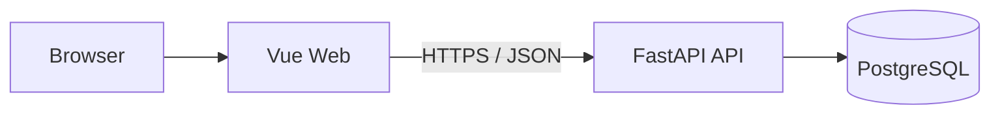

# Nora 前端集成契约

本文定义 Vue 3 + Vite Web 客户端与 Nora 后端之间的稳定边界。架构选择来源于 Issue #49；产品能力和
里程碑范围仍分别以 [`PRODUCT_VISION.md`](PRODUCT_VISION.md) 和 [`ROADMAP.md`](ROADMAP.md) 为准。

## 1. 状态

- 技术选择：Vue 3 + Vite 独立 Web 客户端。
- 交付阶段：M3。
- 实现状态：Planned。默认分支当前没有 `frontend/`、Node 依赖、Web 容器或前端 CI。
- 替代方案：不采用 Gradio；不维护 Gradio 与 Vue 两套客户端。

选择 Vue 是为了支持长期的多步骤工作流、状态管理、Evidence 展示和可测试交互。代价是增加 Node 工具链、
独立构建产物与 CI 维护；这些成本必须由后续实现 Issue 明确交付，不能仅创建空目录或占位页面。

## 2. 所有权与目录

计划中的前端工程位于根目录 `frontend/`，与 Python 包 `src/nora/` 分离：

```text
frontend/
├── src/              # 页面、组件、状态和 API client
├── tests/            # 前端单元与组件测试
├── package.json      # 脚本与依赖
├── lockfile          # 实现 Issue 选择并提交唯一锁文件
└── vite.config.*     # 构建与本地代理
```

前端拥有浏览器交互、展示状态和 API client，不拥有领域规则、业务事实、权限判断或数据持久化。它不得导入
`src/nora/application`、`src/nora/domain`、`src/nora/infrastructure`，也不得直接连接 PostgreSQL、Redis
或对象存储。

## 3. 进程与网络边界



- 本地 Compose 计划新增 `web` 服务；API 继续由 `api` 服务拥有。
- 浏览器只访问 Web 入口和公开 API，不访问 Compose 内部基础设施端口。
- 开发代理可以把浏览器的 `/api` 请求转发到 Compose 中的 `api:8000`，但不得改变后端真实路由。
- 生产静态资源托管、TLS 和同源反向代理属于部署 Issue，不在 M3 前端实现中提前承诺。

## 4. API 契约

当前可用接口由 FastAPI OpenAPI 和默认分支代码确定，包括：

- `POST /auth/register`
- `POST /auth/login`
- `GET /auth/me`
- `GET /health`
- `GET /ready`

岗位、简历、分析和报告接口仍为 Planned；只有对应后端 Issue 合并后，前端才能把它们描述为可用能力。
前端不得根据路线图伪造响应或绕过未交付 API。

前端 API client 使用一个公开基址配置，例如 `VITE_NORA_API_BASE_URL`。所有 `VITE_*` 值都会进入浏览器
构建产物，因此只能保存公开配置，禁止写入数据库凭据、签名密钥、Provider Token 或其他秘密。

## 5. 认证与安全

- 当前认证契约是 `Authorization: Bearer <access_token>`。
- M3 默认只在运行时内存中保存 Token；页面刷新后允许用户重新登录，不把 Token 写入日志、URL 或构建产物。
- 收到 `401` 时清除前端会话并返回登录状态；`403` 不得被解释为未登录。
- 改用 HttpOnly Cookie、刷新令牌或持久会话需要独立的 Identity/Security Issue，不由前端单方面实现。
- 当前开发 CORS 配置不是生产安全承诺；生产来源白名单由部署与安全 Issue 明确。

## 6. 错误与可观测性

Nora 可预期错误使用稳定结构：

```json
{
  "error_code": "authentication_failed",
  "message": "Authentication failed"
}
```

前端根据 `error_code` 选择可本地化提示，保留通用失败回退；FastAPI 请求校验产生的 `422` 作为独立验证错误处理。
响应中的 `X-Request-ID` 可显示在错误详情中用于排障，但不得替代用户可理解的提示，也不得包含敏感数据。

## 7. 后续交付边界

Vue 前端实现 Issue 负责：

- 初始化可锁定依赖的 Vue 3 + Vite 工程；
- API client、认证状态和 M3 页面真实调用路径；
- `web` Compose 服务、开发代理、单元/组件测试与生产构建验证。

独立前端 CI Issue 在工程与锁文件存在后负责：

- 固定 Node 主版本和包管理器缓存策略；
- 锁文件安装、lint、类型检查、单元测试和生产构建；
- 在后端契约可用后增加必要的端到端检查，并如实报告未执行的动态检查。

两个 Issue 都不得把构建通过描述为完整用户流程已经通过；跨 API 的真实流程必须有独立集成或 E2E 证据。
