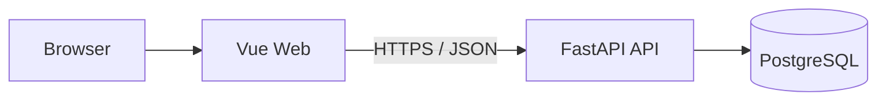

# Nora 前端集成契约

本文定义 Vue 3 + Vite Web 客户端与 Nora 后端之间的稳定边界。架构选择来源于 Issue #49；产品能力和
里程碑范围仍分别以 [`PRODUCT_VISION.md`](PRODUCT_VISION.md) 和 [`ROADMAP.md`](ROADMAP.md) 为准。

## 1. 状态

- 技术选择：Vue 3 + Vite 独立 Web 客户端。
- 交付阶段：既有 Web 基线已交付；重新开放的 M2 补齐分析就绪输入，M3-M5 依次扩展决策、投递和 Evidence 页面。
- 实现状态：Current 基线已包含 `frontend/`、Node 依赖、Web 容器与前端 CI；新增页面仍按 Planned 标注。
- 替代方案：不采用 Gradio；不维护 Gradio 与 Vue 两套客户端。

选择 Vue 是为了支持长期的多步骤工作流、状态管理、Evidence 展示和可测试交互。代价是增加 Node 工具链、
独立构建产物与 CI 维护；这些成本必须由后续实现 Issue 明确交付，不能仅创建空目录或占位页面。

## 2. 所有权与目录

前端工程位于根目录 `frontend/`（Current 基线）。Issue #59 已将当前后端迁移至 `backend/`，应用包位于
`backend/app/`；前后端是独立构建、测试和容器边界：

```text
frontend/
├── src/
│   ├── api/          # HTTP client 与公开 DTO
│   ├── components/   # 可复用 UI 组件
│   ├── features/     # 按业务能力组织的前端模块
│   ├── views/        # 页面级组件
│   ├── stores/       # Pinia 状态
│   └── router/       # Vue Router
├── tests/            # 前端单元、组件与适用 E2E 测试
├── package.json
├── lockfile          # 实现 Issue 选择并提交唯一锁文件
└── vite.config.*
```

前端拥有浏览器交互、展示状态和 API client，不拥有领域规则、业务事实、权限判断或数据持久化。它不得导入
`backend/app/` 的任何内部模块，也不得直接连接 PostgreSQL、Redis 或对象存储。
前后端只通过公开、版本化的 HTTP/JSON 契约交互。

## 3. 进程与网络边界



- 本地 Compose 计划新增 `web` 服务；API 继续由 `api` 服务拥有。
- 浏览器只访问 Web 入口和公开 API，不访问 Compose 内部基础设施端口。
- 开发代理可以把浏览器的 `/api` 请求转发到 Compose 中的 `api:8000`，但不得改变后端真实路由。
- `/api/v1` 是 Issue #59 定义的目标版本边界；当前已发布路由保持兼容，切换必须由独立 Issue 提供双端契约测试。
- 生产静态资源托管、TLS 和同源反向代理属于 M4 Beta 运行基线，不在更早的输入或决策页面中提前承诺。

## 4. API 契约

当前可用接口由 FastAPI OpenAPI 和默认分支代码确定，包括：

- `POST /auth/register`
- `POST /auth/login`
- `GET /auth/me`
- `POST /job-postings`
- `GET /job-postings/{id}`
- `POST /decisions`
- `GET /decisions/{id}`
- `POST /decisions/{id}/reports`
- `GET /reports/{id}`
- `GET /reports`
- `GET /health`
- `GET /ready`

简历接口属于 Current（`POST /resumes`、`GET /resumes`、`GET /resumes/{id}`）。分析与报告后端 API 及浏览器页面也属于 Current；投/不投决定仍为 Planned。前端不得根据路线图伪造响应或绕过未交付 API。

前端 API client 使用一个公开基址配置，例如 `VITE_NORA_API_BASE_URL`。所有 `VITE_*` 值都会进入浏览器
构建产物，因此只能保存公开配置，禁止写入数据库凭据、签名密钥、Provider Token 或其他秘密。

## 5. 认证与安全

- 当前认证契约是 `Authorization: Bearer <access_token>`。
- Token 与当前用户仅在标签页级 `sessionStorage` 中受控保存，使刷新可恢复登录态；关闭标签页后会话消失，不扩展为跨标签页或浏览器重启的长期会话。
- 登出、`401` 或恢复校验失败时同时清除内存与 `sessionStorage`；Token 不写入日志、URL、`localStorage` 或构建产物。
- 收到 `401` 时清除前端会话并返回登录状态；`403` 不得被解释为未登录。
- 改用 HttpOnly Cookie、刷新令牌或持久会话需要独立的 Identity/Security Issue，不由前端单方面实现。
- 当前开发 CORS 配置不是生产安全承诺；生产来源白名单由部署与安全 Issue 明确。

## 6. 错误与可观测性

Nora 可预期错误使用稳定结构：

```json
{
  "error_code": "authentication_failed",
  "message": "Authentication failed"
}
```

前端根据 `error_code` 选择可本地化提示，保留通用失败回退；FastAPI 请求校验产生的 `422` 作为独立验证错误处理。
响应中的 `X-Request-ID` 可显示在错误详情中用于排障，但不得替代用户可理解的提示，也不得包含敏感数据。

## 7. 交付边界

### Current Web 基线

- 可锁定依赖的 Vue 3 + Vite 工程（`frontend/`，锁文件 `package-lock.json`）；
- API client、认证状态与岗位 / 主档 / 简历页面；
- 岗位要求确认与版本历史页面（`/jobs/:id/requirements`，M2 交付）；
- `web` Compose 服务、开发代理、单元 / 组件测试与生产构建验证；
- 前端 CI：固定 Node 版本（`frontend/.nvmrc`）、锁文件安装、lint、类型检查、单元测试、生产构建与 Playwright 基础浏览器 E2E。

### M2-M5 Planned

- M2 分析就绪状态与输入 E2E；
- M3 分析、确定性报告和 apply/skip 页面（对应 `MILESTONE_PLAN.md` §6.6-§6.8）；
- M4 定制材料、手工投递记录、最小面试通知和 Beta 流程；
- M5 Evidence、检索引用和可选模型增强版本；
- 每个跨 API 流程随所属 Milestone 补充真实浏览器 E2E。

前端不得把构建通过描述为完整用户流程已经通过；跨 API 的真实流程必须有独立集成或 E2E 证据。

---

## 第二部分：前端详细设计（基于已确认业务流程）

> 本章把已确认的业务流程（[`BUSINESS_FLOW.md`](BUSINESS_FLOW.md)）与里程碑计划
> （[`MILESTONE_PLAN.md`](MILESTONE_PLAN.md)）翻译为 Vue 前端的页面、路由、状态、组件与 API
> 映射。目标用户为软件工程专业应届生（以校招为主）。本章均为 **Planned/设计**，不代表已实现。

## 8. 用户旅程 → 页面映射

| 业务流程步骤 | 页面 | 里程碑 |
| :--- | :--- | :--- |
| 注册 / 登录 | `/register`、`/login` | Current |
| 主档建立（基本信息/项目/经历/教育/技能/偏好） | `/profile` | Current |
| 发布简历版本 | `/resumes`、`/resumes/new` | Current |
| JD 输入（文本/截图/链接）与岗位要求确认 | `/jobs/new`、`/jobs/:id/requirements` | M2（要求确认已交付） |
| 岗位列表与详情 | `/jobs`、`/jobs/:id` | Current |
| 发起适配分析 | `/analysis/new` | M3 |
| 查看分析进度 | `/analysis/:id` | M3 |
| 决策报告（匹配/差距/未知/建议/公司情报） | `/reports/:id` | M3 |
| 投/不投决定 | 报告页内 `DecisionBar` | M3 |
| 定制简历（选模板）与 PDF | `/templates`、`/resumes/:id/customize` | M4 |
| 打招呼语草稿 | `/messages/:id` | M4 |
| 投递与最小面试通知 | `/applications`、`/interviews` | M4 |
| Evidence 与 AI 增强版本 | 报告详情内版本视图 | M5 |
| 深度面试准备、复盘与出行 | 待独立设计 | 触发式候选 |

## 9. 路由表

下表以 `Current` 和 `Planned` 区分实际交付。里程碑归属不能替代默认分支代码与能力台账证据。

```text
/login                      登录〔Current〕
/register                   注册〔Current〕
/                           工作台概览〔Current〕
/jobs/new                   文本岗位输入〔Current〕；截图/链接预览〔M2 Planned〕
/jobs                       岗位列表〔Current〕
/jobs/:id                   岗位详情〔Current〕
/jobs/:id/requirements      岗位要求确认与版本历史〔Current〕
/profile                    主档编辑〔Current〕
/resumes                    简历版本列表〔Current〕
/resumes/new                发布新版本〔Current〕
/resumes/:id                简历版本详情〔Current〕
/analysis/new               发起分析（选岗位要求版本 + 主档 + 简历版本）〔Current〕
/analysis/:id               同步分析结果 / 失败重试〔Current〕
/reports                    报告历史列表（分页）〔Current〕
/reports/:id                确定性报告详情〔Current〕
/decisions                  投递决定记录（skip/apply）〔M3 Planned〕
/templates                  模板管理〔M4 Planned〕
/resumes/:id/customize      定制简历〔M4 Planned〕
/messages/:id               打招呼语草稿〔M4 Planned〕
/applications               手工投递记录〔M4 Planned〕
/interviews                 最小面试通知〔M4 Planned〕
```

路由守卫：未登录访问受保护路由跳 `/login`；收到 `401` 统一清除会话；`403` 不做登出。

## 10. 页面规格

### 10.1 注册 / 登录（Current）

- 功能：注册（用户名/邮箱 + 密码 + 确认密码）、登录、登出。
- 表单校验：非空、邮箱格式、密码强度、两次密码一致。
- API：`POST /auth/register`、`POST /auth/login`、`GET /auth/me`。
- Token：标签页级 `sessionStorage` 受控保存，刷新后通过 `/auth/me` 校验恢复（见 §5）。
- 错误：`401` 页内提示；`409`（已注册）明确提示。

### 10.2 主档编辑 `/profile`（Current）

- 功能：维护 `CandidateProfile` 基本信息、求职偏好、教育、经历、技能；展示字段级确认状态（`unconfirmed` / `confirmed` / `rejected` / `superseded`）。
- 表单：分区表单 + 经历/技能动态增删列表。
- API：CandidateProfile CRUD（Current）。
- 状态：`profileStore` 持有草稿与已确认快照；有未保存修改时离开需确认。
- 校验：必填字段、经历时间范围可排序、技能用规范化名称。

### 10.3 简历版本 `/resumes`（Current）

- 功能：从已确认主档发布不可变 `ResumeVersion`；查看历史版本。
- 发布：选择主档版本 → 预览 → 发布（发布后不可变，不因主档后续修改重写）。
- API：`POST /resumes`、`GET /resumes`、`GET /resumes/{id}`（Current）。
- 状态：`resumeStore`；发布成功进入详情，显示版本号与发布时间。

### 10.4 岗位输入与要求确认（M2）

- 文本模式：JD 正文 textarea + 标题/公司/地点结构化字段。
- 截图模式（M2 Planned）：图片上传（大小/格式限制）→ OCR 结果预览可编辑 → 用户确认保存。
- 链接模式（M2 Planned）：URL 输入 → 受控抓取预览 → 用户确认保存；失败展示稳定错误码（如 `fetch_failed`）。
- 岗位要求（M2 Planned）：原始 `JobPosting` 与 `JobRequirementSnapshot` 分开显示；用户补充、修正和确认后创建新版本。
- API：既有 `POST /job-postings` 保持兼容；截图、链接与岗位要求端点由 #135-#137 后续契约定义。
- 组件：`FileUpload`（校验类型/大小/超时）、`OCRPreview`、`LinkFetchPreview`。

### 10.5 岗位列表 / 详情（Current）

- 列表：`GET /job-postings` 分页列表，卡片展示标题/公司/地点/摘要/时间。
- 详情：`GET /job-postings/{id}` 展示完整 JD、来源、版本、创建时间；入口进入发起分析。
- 空态 / 错误态：无岗位引导新建；`404`（跨用户）统一提示"对象不存在"，不泄露存在性。

### 10.6 发起分析 `/analysis/new`（M3，M3.1）

- 功能：选择岗位 + 主档 + 简历版本 → 创建 `DecisionCase`。
- API：`POST /decisions`、`GET /decisions/{id}`（Current）。
- 校验：三者同属当前用户（后端 404）；输入版本不兼容返回 `409`。
- 执行：当前 API 同步返回四条确定性规则结果，不伪造异步进度；页面可展示加载、成功与失败状态。

### 10.7 报告详情 `/reports/:id`（M3，M3.3/M3.5）

- 分区展示：
  - **事实（Fact）**：已确认主档与岗位的结构化字段；
  - **规则结果（Rule Result）**：技能/技术栈覆盖、经验年限、地点兼容、学历要求；每条带 `rule_id`、状态（match/partial/mismatch/unknown）、输入字段定位与原因；
  - **公司情报**（M4 Planned）：网评摘要 + 规模 + 行业 + 来源与时效标签；缺失显示 unknown；
  - **未知项（Unknown）**：规则缺输入项；
  - **建议（Recommendation）**：确定性下一步；
  - 明确"确定性规则"标识；M5 前显示"AI 增强未启用"。
- 幂等：重复"生成报告"返回既有报告，版本不变。
- API：`POST /decisions/{id}/reports`、`GET /reports/{id}`、`GET /reports`（Current）。列表从第 1 页开始，默认每页 20 条、最多 100 条，按生成时间倒序，空集合返回空 `items` 与 `total = 0`。
- 组件：`ReportContent`、`RuleStatusBadge`，统一呈现报告分区、规则状态与字段级引用。

### 10.8 投/不投决定（M3，M3.9）

- 报告页底部 `DecisionBar`：`投递` / `不投` / `稍后`。
- 选择"不投"：填写原因 → `skip` 记录（沉淀为历史相似记录）。
- 选择"投递"：仅标记 `apply`，投递产物属 M4。
- API：ApplicationDecision 状态机（Planned，M3.9）。
- 状态转换记录操作者、时间与报告版本；重复提交幂等。

### 10.9 定制简历与 PDF（M4）

- 模板列表 `/templates`：声明式 JSON 模板（页面设置/区块顺序/占位字段）只读预览。
- 定制 `/resumes/:id/customize`：选择模板 → 字段映射（主档/岗位）→ 预览 → 生成 PDF。
- PDF：`GET` 产物（Object Storage 签名引用），下载/分享。
- 打招呼语 `/messages/:id`：可编辑纯文本，默认 `professional` 风格。
- API：`ResumeVariant`、`MessageDraft`（Planned，M4）。

### 10.10 最小面试通知（M4）与触发式候选

- 面试记录 `/interviews`：录入面试时间、地点、轮次和备注（M4 Planned）。
- API：最小 `InterviewCase`（Planned，M4）。
- 深度准备、复盘和出行推荐不属于 M2-M5 默认退出条件，满足触发条件后另行设计路由与契约。

## 11. 状态管理（Pinia）

| Store | 职责 | 关键状态 |
| :--- | :--- | :--- |
| `authStore` | 登录/注册/登出/当前用户 | token、user、isAuthenticated |
| `profileStore` | 主档草稿与确认快照 | draft、confirmed snapshot、confirmationStatus |
| `resumeStore` | 简历版本列表/详情 | versions、current |
| `jobStore` | 岗位列表/详情/新建 | jobs、current、inputMode（text/ocr/link） |
| `analysisStore` | DecisionCase 创建、同步结果与报告缓存 | currentCase、analysis、report、reports |

规则：Store 只保存展示状态与缓存快照，不持有业务事实权威；页面刷新后从后端重新加载；跨页共享使用稳定 ID。

## 12. API Client 与错误映射

- HTTP client 统一基址（`VITE_NORA_API_BASE_URL`），Bearer Token 注入，采集 `X-Request-ID`。
- 错误码 → 本地化提示表（预留通用回退）：
  - `401` → 登录态失效，跳转登录；
  - `404` → "对象不存在"（跨用户不泄露）；
  - `409` → 版本冲突 / 幂等冲突；
  - `422` → 表单校验；
  - `503` → 服务暂不可用，可重试；
  - 网络失败 → 可重试网络错误。
- 统一组件 `ErrorState`（提示 + 重试）、`LoadingState`、`EmptyState`。

## 13. 组件划分

下表为组件设计划分。`Current` 只表示能力台账已证明的页面；M2-M5 均按新增功能的计划归属标注。

| 组件 | 用途 | 里程碑 |
| :--- | :--- | :--- |
| `AppShell` | 布局、导航、认证态 | Current |
| `AuthForm` | 注册/登录表单 | Current |
| `JobForm` / `FileUpload` / `OCRPreview` / `LinkFetchPreview` | JD 三模式输入 | Current 文本 / M2 Planned 增强 |
| `RequirementEditor` / `ConfirmationBadge` | 岗位要求确认与版本历史（`JobRequirementsView`） | Current |
| `ProfileForm` / `FieldGroup` | 主档分区与字段确认状态 | Current |
| `ResumeVersionCard` | 简历版本卡片 | Current |
| `ReportContent` / `RuleStatusBadge` | 报告分区、规则状态与字段引用 | Current |
| `DecisionBar` | 投/不投 | M3 Planned |
| `ErrorState` / `LoadingState` / `EmptyState` | 通用状态 | M3 Planned |

## 14. 里程碑前端交付映射

| 里程碑 | 前端交付 |
| :--- | :--- |
| Current 基线 | Vue 工程、认证、岗位文本、主档、简历、岗位要求确认页面、前端 CI 和基础浏览器 E2E |
| M2 | 分析就绪状态、输入 E2E；截图 OCR/链接预览经后端接口返回正文预览 |
| M3 | 分析创建、报告详情/历史、DecisionBar、刷新恢复和双用户 E2E |
| M4 | 模板、定制简历/PDF、消息草稿、手工投递记录、最小面试通知和 Beta E2E |
| M5 | Evidence 引用、检索状态、确定性/增强报告版本和降级展示 |

## 15. 技术选型（Current 基线）

- Vue 3 + Vite + TypeScript；
- Vue Router（路由与守卫）；Pinia（状态管理）；
- Vitest + Vue Test Utils（组件/单元），浏览器 E2E 用 Playwright 或 Cypress（少量关键路径）；
- HTTP：fetch 封装或 axios（实现 Issue 选定，保持 API client 单一抽象）；
- UI：不引入重量级组件库，优先原生组件 + 少量本地基元；
- 前端不直连 PostgreSQL / MinIO / 后端内部模块；不保存生产秘密（见 §4）。
