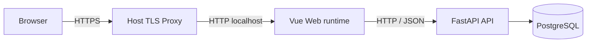

# Nora 前端集成契约

本文定义 Vue 3 + Vite Web 客户端与 Nora 后端之间的稳定边界。架构选择来源于 Issue #49；产品能力和
里程碑范围仍分别以 [`PRODUCT_VISION.md`](PRODUCT_VISION.md) 和 [`ROADMAP.md`](ROADMAP.md) 为准。

## 1. 状态

- 技术选择：Vue 3 + Vite 独立 Web 客户端。
- 交付阶段：M2 分析就绪输入、M3 确定性决策页面和 M4 声明式模板/ResumeVariant/PDF/MessageDraft/ApplicationRecord/InterviewCase 页面已交付；M4 后续与 M5 继续扩展部署、验收和 Evidence 页面。
- 实现状态：Current 基线已包含 `frontend/`、Node 依赖、Web 容器、前端 CI、定制简历工作流、`/jobs/new` 的 JD AI 草稿确认流程，以及 `/profile` 内的 text-PDF 主档导入；未交付页面继续按 Planned 标注。
- 替代方案：不采用 Gradio；不维护 Gradio 与 Vue 两套客户端。

选择 Vue 是为了支持长期的多步骤工作流、状态管理、Evidence 展示和可测试交互。代价是增加 Node 工具链、
独立构建产物与 CI 维护；这些成本必须由后续实现 Issue 明确交付，不能仅创建空目录或占位页面。

## 2. 所有权与目录

前端工程位于根目录 `frontend/`（Current 基线）。Issue #59 已将当前后端迁移至 `backend/`，应用包位于
`backend/app/`；前后端是独立构建、测试和容器边界：

```text
frontend/
├── src/
│   ├── api/          # generated HTTP contract、手写 transport 与 UI Adapter
│   ├── components/   # 可复用 UI 组件
│   ├── features/     # 按业务能力组织的前端模块
│   ├── views/        # 页面级组件
│   ├── stores/       # Pinia 状态
│   └── router/       # Vue Router
├── tests/            # 前端单元与组件测试
├── package.json
├── lockfile          # 实现 Issue 选择并提交唯一锁文件
└── vite.config.*
```

前端拥有浏览器交互、展示状态和 API client，不拥有领域规则、业务事实、权限判断或数据持久化。它不得导入
`backend/app/` 的任何内部模块，也不得直接连接 PostgreSQL、Redis 或对象存储。
前后端只通过公开、版本化的 HTTP/JSON 契约交互。

## 3. 进程与网络边界



- Compose 中 `web` 服务拥有静态文件、SPA fallback 与 `/api` proxy；API 继续由 `api` 服务拥有。
- 浏览器只访问 Web 入口和公开 API，不访问 Compose 内部基础设施端口。
- 开发代理可以把浏览器的 `/api` 请求转发到 Compose 中的 `api:8000`，但不得改变后端真实路由。
- 生产只发布 `127.0.0.1:${NORA_WEB_PORT}:5173`；Host Proxy 负责 TLS/HSTS 和覆盖 forwarded headers，Web 输出 CSP、XFO、
  Referrer/`nosniff` 且不输出 HSTS。API 只信任固定 Web IP `/32`。
- `/api/v1` 是 Issue #59 定义的目标版本边界；当前已发布路由保持兼容，切换必须由独立 Issue 提供双端契约测试。

## 4. API 契约

当前可用接口由默认分支的 FastAPI 路由与 Pydantic 模型确定，并通过 OpenAPI 暴露。D-017 选择该 OpenAPI 作为唯一 HTTP Contract
源；Current 生成链路离线导出并提交 `openapi.json` 与 `schema.d.ts`，由 `api:check` 和 CI 阻止漂移。现有端点尚未迁移到
`openapi-fetch`，手写 DTO 和 transport 仍承载运行时调用，不得被误报为 generated client。
接口完整定义只维护在生成的 OpenAPI 契约：`frontend/src/api/generated/openapi.json` 与
`frontend/src/api/generated/schema.d.ts`；运行时请求策略由 `frontend/src/api/client.ts` 实现。本文只说明前端拥有的
超时、Blob、sessionStorage、错误映射和特殊交互语义，不再复制易漏项的 endpoint 清单。


简历版本、声明式模板、ResumeVariant、确定性 PDF、MessageDraft 与手工 ApplicationRecord 接口均属于 Current。分析、确定性报告、AI JobFitAnalysis、报告内 citation 展示与投/不投决定的后端 API 及浏览器页面也属于 Current。AI 页面将模型推断、建议和未知与确定性规则分区；Provider 失败时只显示局部错误，报告和决定控件继续可用。招聘平台自动投递仍未交付；前端不得根据路线图伪造响应或绕过未交付 API。

最小 RAG API 已进入后端契约：来源索引和知识问答返回 Source/Chunk 定位、检索分数与 grounded/unknown 状态；当前尚无独立 RAG 前端页面，前端不得虚构该能力的导航入口。

Agent Runtime API 已进入后端契约，但当前没有独立浏览器页面或 Pinia Store。调用方只能通过认证 API 查看 Run、Tool 摘要、Approval
快照和可清理 Checkpoint；显式 `/agent-runs/decision-analysis` 入口只接受 `report_id` 并固定执行 JobFit COMPUTE，前端不得展示
chain-of-thought、注入任意 Tool 名称或绕过 Approval 触发 WRITE Tool。

JD 导入（Current）：`/jobs/new` 的文本、截图和受控链接入口共用 AI 草稿流程。抽取结果先回填正文、职位、公司、地点和五类岗位要求候选；
用户可修改任意字段，AI 草稿页面只提供一次“确认导入岗位”。提交始终优先请求 AI 自动识别；只有 AI 明确失败且用户已完整填写职位、公司、地点和 JD 正文时，才显示“手动填写兜底”入口。
草稿 Session ID 保存在当前标签页 `sessionStorage`，刷新时以服务端版本和内容指纹恢复，确认成功或取消后清理。AI 草稿确认前不创建岗位；冲突由服务端返回稳定错误码。

前端 API client 使用一个公开基址配置，例如 `VITE_NORA_API_BASE_URL`。所有 `VITE_*` 值都会进入浏览器
构建产物，因此只能保存公开配置，禁止写入数据库凭据、签名密钥、Provider Token 或其他秘密。

## 5. 认证与安全

- 当前认证契约是 `Authorization: Bearer <access_token>`。
- Token 与当前用户仅在标签页级 `sessionStorage` 中受控保存，使刷新可恢复登录态；关闭标签页后会话消失，不扩展为跨标签页或浏览器重启的长期会话。D-020 继续采用该方案作为 M4 Beta 目标，并要求生产隐藏公共注册入口。
- 登出、`401` 或恢复校验失败时同时清除内存与 `sessionStorage`；Token 不写入日志、URL、`localStorage` 或构建产物。
- 收到 `401` 时清除前端会话并返回登录状态；`403` 不得被解释为未登录。
- 收到 `429` 时保留稳定的“尝试过于频繁”提示和整数 `Retry-After` 语义；生产构建不包含公共注册路由或入口。
- 改用 HttpOnly Cookie、刷新令牌或持久会话需要独立的 Identity/Security Issue，不由前端单方面实现。
- 当前开发 CORS 配置不是生产安全承诺；Beta production 使用单一同源 HTTPS 入口、精确 Origin allowlist、显式 method/header 和
  固定 Web `/32` 单跳可信代理，未授权 Origin 在业务处理前拒绝，客户端伪造 forwarded headers 不改变限流身份。

## 6. 错误与可观测性

D-018 Current 错误响应使用稳定结构：

```json
{
  "error_code": "authentication_failed",
  "error_category": "authentication",
  "message": "Authentication failed"
}
```

前端从 OpenAPI generated schema 获得 `ErrorCode`、`ErrorCategory` 与 `ApiProblem`，根据 `error_code` 选择可本地化提示，再按
category、status 和 transport/unknown 保留通用失败回退。FastAPI 请求校验统一为
`validation_error/request_validation/422`，不再消费独立的 `HTTPValidationError.detail` 结构。
生成枚举包含模型未配置、输入超限、Provider 拒绝/不可用、timeout 和结构化输出无效六类稳定错误；当前 #85 只提供后端
Application 连通性探测与显式凭据 smoke，没有新增浏览器 API、路由、Store 或专用 UI 文案，前端仍走 category/status 通用回退。
响应中的 `X-Request-ID` 可显示在错误详情中用于排障，但不得替代用户可理解的提示，也不得包含敏感数据。

## 7. 交付边界

### Current Web 基线

- 可锁定依赖的 Vue 3 + Vite 工程（`frontend/`，锁文件 `package-lock.json`）；
- API client、认证状态与岗位 / 主档 / 简历页面；
- 普通 API 请求使用 10 秒传输超时；JD AI 导入和 JobFit AI 生成使用 75 秒客户端超时，以覆盖后端模型调用的 60 秒总墙钟预算，超时仍映射为 `network_timeout`。
- 岗位要求确认与版本历史页面（`/jobs/:id/requirements`，M2 交付）；
- `web` Compose 服务、开发代理、单元 / 组件测试与生产构建验证；
- production Web runtime 的静态/SPA、`/api` proxy、安全 Header 与链路标记测试；
- 前端 CI：固定 Node 版本（`frontend/.nvmrc`）、锁文件安装、lint、类型检查、单元测试与生产构建。

### M2-M4 Current 与后续 Planned

- M2 分析就绪状态与输入 API；
- M3 分析、确定性报告、apply/skip 页面；
- M4 公司情报录入/版本/报告固定展示、声明式模板选择、ResumeVariant 内容编排、不可变详情、确定性 PDF 生成/预览/下载、MessageDraft 生成/编辑/复制、手工投递记录和最小面试通知；Beta Environment/Runner 已被真实 workflow 使用，但完整 promote 仍需动态证据；
- M5 Evidence、检索引用、可选模型增强版本，以及 D-021 可编辑简历/JD AI 导入草稿与一次整体确认；
- 跨 API 流程使用后端集成测试、前端组件测试和 API smoke 验证。

前端不得把构建通过描述为完整用户流程已经通过；跨 API 的真实流程以后端集成测试、前端组件测试和 API smoke 证据为准。

---

## 第二部分：前端详细设计（基于已确认业务流程）

> 本章把已确认的业务流程（[`BUSINESS_FLOW.md`](BUSINESS_FLOW.md)）与里程碑边界
> （[`ROADMAP.md`](ROADMAP.md)）翻译为 Vue 前端的页面、路由、状态、组件与 API 映射。目标用户为软件工程专业应届生
> （以校招为主）。`Current` 仅作前端契约摘要，逐项证据以 `current-capabilities.toml` 为准；`Planned` 的状态、依赖和顺序以
> GitHub Milestones/Issues 为准。

## 8. 用户旅程 → 页面映射

| 业务流程步骤 | 页面 | 里程碑 |
| :--- | :--- | :--- |
| 注册 / 登录 | `/register`、`/login` | Current |
| 主档建立（基本信息/项目/经历/教育/技能/偏好） | `/profile` | Current |
| `/profile` 内 text-PDF 主档导入 | `/profile` | Current；DOCX、扫描 PDF OCR 和完整 D-021 ImportSession 未实现 |
| 发布简历版本 | `/resumes`、`/resumes/new` | Current |
| JD 文本输入与岗位要求确认 | `/jobs/new`、`/jobs/:id/requirements` | Current，M2 |
| JD 截图/链接预览 | `/jobs/new` | Current |
| 岗位列表与详情 | `/jobs`、`/jobs/:id` | Current |
| 手工投递记录与状态确认 | `/applications`、`/applications/new`、`/applications/:id` | Current，M4 |
| 发起适配分析 | `/analysis/new` | Current，M3 |
| 查看同步分析结果 | `/analysis/:id` | Current，M3 |
| 决策报告（匹配/差距/未知/建议） | `/reports/:id` | Current，M3；公司情报固定版本展示 Current，M4 |
| 公司情报录入与版本 | `/companies/new`、`/companies/:id` | Current，M4 |
| 投/不投决定 | 报告页内 `DecisionBar` | Current，M3 |
| 定制简历（选模板与 PDF） | `/templates`、`/resumes/:id/customize`、`/resume-variants/:id` | Current，M4 |
| 打招呼语草稿 | `/messages/:id` | Current，M4 |
| 投递与最小面试通知 | `/applications`、`/interviews`、`/interviews/new`、`/interviews/:id` | Current，M4 |
| Evidence 与 AI 增强版本 | 报告详情内版本视图 | RAG/JobFit Current；Evidence Pack 仍未交付 |
| 面试准备与复盘 | `/interviews/:id` | Current；实时出行仍未交付 |

## 9. 路由表

下表以 `Current` 和 `Planned` 区分实际交付。里程碑归属不能替代默认分支代码与能力台账证据。

```text
/login                      登录〔Current〕
/register                   注册〔Current〕
/                           工作台概览〔Current〕
/jobs/new                   文本、截图和受控链接岗位输入〔Current〕
/jobs                       岗位列表〔Current〕
/jobs/:id                   岗位详情〔Current〕
/jobs/:id/requirements      岗位要求确认与版本历史〔Current〕
/profile                    主档编辑〔Current〕
/resumes                    简历版本列表〔Current〕
/resumes/new                发布新版本〔Current〕
/resumes/:id                简历版本详情〔Current〕
/analysis/new               发起分析（选岗位要求版本 + 主档 + 简历版本）〔Current〕
/analysis/:id               同步分析结果 / 失败重试〔Current〕
/reports                    报告历史列表（分页）〔Current〕
/reports/:id                确定性报告详情〔Current〕
/templates                  模板与定制简历列表〔Current，M4〕
/resumes/:id/customize      选择、编辑和编排定制内容〔Current，M4〕
/resume-variants/:id        不可变定制简历详情与 PDF〔Current，M4〕
/messages/:id               确定性消息草稿与版本编辑〔Current，M4〕
/applications               手工投递记录列表〔Current，M4〕
/applications/new           选择精确材料并创建 planned 记录〔Current，M4〕
/applications/:id           投递详情、状态确认与转换历史〔Current，M4〕
/companies/new              录入并可选绑定报告的公司情报〔Current，M4〕
/companies/:id              公司情报精确版本与追加版本〔Current，M4〕
/interviews                 面试安排列表〔Current，M4〕
/interviews/new             从 interviewing 投递记录创建安排〔Current，M4〕
/interviews/:id             面试详情、版本追加与历史〔Current，M4〕
```

路由守卫：未登录访问受保护路由跳 `/login`；收到 `401` 统一清除会话；`403` 不做登出。

## 10. 页面规格

### 10.1 注册 / 登录（Current）

- 功能：注册（用户名/邮箱 + 密码 + 确认密码）、登录、登出。
- 表单校验：非空、邮箱格式、密码强度、两次密码一致。
- API：`POST /auth/register`、`POST /auth/login`、`GET /auth/me`。
- Token：标签页级 `sessionStorage` 受控保存，刷新后通过 `/auth/me` 校验恢复（见 §5）。
- 错误：`401` 页内提示；`409`（已注册）明确提示。

### 10.2 主档编辑 `/profile`（Current）

- 功能：维护 `CandidateProfile` 基本信息、求职偏好、教育、经历、技能；展示字段级确认状态（`unconfirmed` / `confirmed` / `rejected` / `superseded`）。
- 表单：分区表单 + 经历/技能动态增删列表。
- API：CandidateProfile CRUD（Current）。
- 状态：`profileStore` 持有草稿与已确认快照；有未保存修改时离开需确认。
- 校验：必填字段、经历时间范围可排序、技能用规范化名称。

### 10.3 简历版本 `/resumes`（Current）

- 功能：从已确认主档发布不可变 `ResumeVersion`；查看历史版本。
- 发布：选择主档版本 → 预览 → 发布（发布后不可变，不因主档后续修改重写）。
- API：`POST /resumes`、`GET /resumes`、`GET /resumes/{id}`（Current）。
- 状态：`resumeStore`；发布成功进入详情，显示版本号与发布时间。

### 10.3A `/profile` 内的 text-PDF 主档导入（Current）

- 输入：`ProfileView` 接受有文本层 PDF；无文本层时提示用户转换为可搜索 PDF。当前不支持 DOCX 或扫描 PDF OCR。
- 流程：`api.importProfilePdf` 调用 `POST /profile/import-pdf`，本地提取文本后由 `ProfileImportAgent` 和 `ModelPort` 生成可编辑候选。
- 确认：用户在同一 `/profile` 页面检查字段并一次整体确认；非空候选写入新的 `CandidateProfile` 版本，不自动发布 `ResumeVersion`。
- 边界：当前不是持久化 `Profile ImportSession/ImportDraft` 状态机，也没有独立 `/profile/import` 页面；完整 D-021 的 DOCX、OCR、持久化导入图仍是目标架构。

### 10.4 岗位输入与要求确认（M2）

- 文本模式：JD 正文 textarea + 标题/公司/地点结构化字段。
- 截图模式（Current）：`JobCreateView` 选择本地 PNG/JPEG 图片 → OCR 结果预览回填 JD textarea 可编辑 → 用户确认后走既有文本创建路径。
- 链接模式（Current）：`JobCreateView` 输入 URL → 受控抓取正文预览回填 JD textarea 可编辑 → 用户确认后走既有文本创建路径；失败展示稳定错误码对应的中文提示（如 `fetch_failed`、`unsafe_url`）。
- 岗位要求（Current）：原始 `JobPosting` 与 `JobRequirementSnapshot` 分开显示；用户补充、修正和确认后创建新版本。
- API：`POST /job-postings/image`、`POST /job-postings/fetch` 与岗位要求端点均为 Current；两者只返回正文预览，不直接创建岗位快照，仍需经 `POST /job-postings` 文本路径确认写入。
- 组件：截图与链接输入未拆出独立组件，直接内嵌在 `JobCreateView` 的可切换 tab 中；两个输入方式的预览状态与创建状态在 `jobsStore` 中分离，预览失败不污染岗位列表/详情状态。
- D-021 Target：`JobCreateView` 的文本、截图和受控链接进入统一 JD ImportSession；OCR/抓取后继续清洗并自动填充正文、职位、
  公司、地点和结构化岗位要求。用户可以修改任意字段，最后一次“确认导入”绑定草稿版本与内容指纹，并原子创建岗位和首个要求
  快照；不再把 OCR 原文直接当作最终字段，也不要求用户逐字段确认或再次进入第二确认弹窗。JD PDF 不在此目标范围。

### 10.5 岗位列表 / 详情（Current）

- 列表：`GET /job-postings` 分页列表，卡片展示标题/公司/地点/摘要/时间。
- 详情：`GET /job-postings/{id}` 展示完整 JD、来源、版本、创建时间；入口进入发起分析。
- 空态 / 错误态：无岗位引导新建；`404`（跨用户）统一提示"对象不存在"，不泄露存在性。

### 10.6 发起分析 `/analysis/new`（M3，M3.1）

- 功能：选择岗位 + 主档 + 简历版本 → 创建 `DecisionCase`。
- API：`POST /decisions`、`GET /decisions/{id}`（Current）。
- 校验：三者同属当前用户（后端 404）；输入版本不兼容返回 `409`。
- 执行：当前 API 同步返回四条确定性规则结果，不伪造异步进度；页面可展示加载、成功与失败状态。

### 10.7 报告详情 `/reports/:id`（M3，M3.3/M3.5）

- 分区展示：
  - **事实（Fact）**：已确认主档与岗位的结构化字段；
  - **规则结果（Rule Result）**：技能/技术栈覆盖、经验年限、地点兼容、学历要求；每条带 `rule_id`、状态（match/partial/mismatch/unknown）、输入字段定位与原因；
  - **公司情报**（Current，M4）：固定 CompanyAssessment/CompanySnapshot 精确版本，展示来源摘要、规模、行业、字段状态、来源层级、许可、哈希与时效；缺失保持 unknown，匿名来源明确为非事实；
  - **未知项（Unknown）**：规则缺输入项；
  - **建议（Recommendation）**：确定性下一步；
  - 明确"确定性规则"与 JobFitAnalysis AI 分区；Provider 失败时保留确定性报告与决定控件。
- 幂等：重复"生成报告"返回既有报告，版本不变。
- API：`POST /decisions/{id}/reports`、`GET /reports/{id}`、`GET /reports`（Current）。列表从第 1 页开始，默认每页 20 条、最多 100 条，按生成时间倒序，空集合返回空 `items` 与 `total = 0`。
- 组件：`ReportContent`、`RuleStatusBadge`，统一呈现报告分区、规则状态与字段级引用。
- 公司情报：无附件时可进入 `/companies/new?report=<id>` 完成私有来源 Artifact、SourceDocument 与 CompanySnapshot 创建并绑定；也可按 ID/版本绑定已有快照。报告后续始终展示已绑定精确版本，新版本不会静默覆盖历史。

### 10.7A 公司情报 `/companies/new`、`/companies/:id`（Current，M4）

- 录入页串联私有文本 Artifact、SourceDocument 和 CompanySnapshot，支持人工记录或 HTTP(S) 网页来源、来源层级、获取/发布时间、许可说明、规模、行业、来源摘要及各字段确认状态。
- 匿名来源不能将字段标为 confirmed；超过时效的来源不能显示为当前确认事实。anonymous、stale、unknown、conflicted 和 superseded 均使用显式标签，不提供聚合评分。
- 详情页从认证 API 读取最新版本、完整版本列表和 URL 指定的精确历史版本；追加版本使用最新 `expected_version` 保护并发，`409` 提示刷新后重试。
- API：`POST /artifacts`、`POST /sources`、`POST /companies`、`GET /companies/{id}`、`GET/POST /companies/{id}/versions`、`GET /companies/{id}/versions/{version}` 与 `GET/POST /reports/{id}/company-assessment`。
- 刷新和重新登录按 URL/报告附件恢复服务端固定版本；登出清空 `companiesStore`。跨用户 Source、CompanySnapshot、CompanyAssessment 与报告统一不可见。

### 10.8 投/不投决定（M3，M3.9）

- 报告页底部 `DecisionBar`：`投递` / `不投`；未提交即保持 analyzed，无需伪造“稍后”记录。
- 选择"不投"：必须填写原因 → `skip` 记录。
- 选择"投递"：仅标记 `apply`，投递产物属 M4。
- API：`GET /reports/{id}/decision`、`POST /reports/{id}/decision`（Current）。未决定返回 `204`；创建使用 `Idempotency-Key`，相同语义重放返回既有记录，不同决定返回 `409`。
- 状态转换固定报告、DecisionCase 与简历版本，并记录操作者、时间和原因；刷新时与报告并行恢复。
- 边界：不生成 ResumeVariant、MessageDraft 或 PDF，不执行外部投递；历史 skip 提示如后续展示，只允许使用确定性标签交集，不依赖 RAG。

### 10.9 定制简历与 PDF（Current，M4）

- 模板与变体列表 `/templates`（Current）：读取声明式 JSON 模板的页面尺寸、密度、强调色、区块顺序和字段约束，并列出当前用户已创建的不可变变体。
- 定制 `/resumes/:id/customize`（Current）：仅从报告中的 apply 决定进入，固定决定和来源简历；选择精确模板版本，裁剪、编辑、排序允许字段并创建 ResumeVariant。必填字段不可取消，失败重试沿用同一幂等键。
- 详情 `/resume-variants/:id`（Current）：刷新后从 API 重新读取变体、精确模板版本和最近 PDF 状态，展示固定的决定、案例、岗位、岗位要求、简历、模板、生成器及内容指纹；登出时清空用户范围缓存。
- PDF（Current）：详情页可发起生成或失败重试；`available` 后展示 Artifact 版本、SHA-256、渲染器与字体集版本，并通过带 Bearer Token 的 Blob 请求预览或下载。刷新恢复服务端状态，预览 URL 在替换或卸载时回收，不持久化对象字节或 URL。
- API（Current）：`GET /templates`、`GET /templates/{id}/versions/{version}`、`POST /resume-variants`、`GET /resume-variants`、`GET /resume-variants/{id}`、`POST /resume-variants/{id}/pdf`、`GET /resume-variants/{id}/pdf`、`GET /resume-pdfs/{id}` 与 `GET /resume-pdfs/{id}/content`。未生成 PDF 时读取返回 `204`；首次生成返回 `201`，同一生成身份重放返回 `200`；跨用户对象与不存在对象统一返回 `404`。
- 安全边界：前端只提交受控字段路径和纯文本值，不执行模板代码、用户 HTML 或外部资源；编辑结果只属于 ResumeVariant，不修改 CandidateProfile 或 ResumeVersion。
- MessageDraft（Current）：变体详情选择 `professional`、`concise` 或 `referral` 风格，可附用户备注；`referral` 未填写显式上下文时不发起请求。生成成功进入 `/messages/:id`，展示固定输入来源、生成器、内容指纹与修订历史。

### 10.10 消息草稿 `/messages/:id`（Current，M4）

- 页面从认证 API 恢复最新修订和完整版本列表；纯文本编辑保存为新版本，不覆盖生成版本。刷新重新读取服务端事实，登出清理 `messagesStore`。
- 生成与编辑失败重试沿用相同载荷的 `Idempotency-Key`；载荷变化后生成新键。版本冲突提示刷新后重试，跨用户与不存在对象统一显示 `404`。
- “复制”只调用浏览器 `navigator.clipboard.writeText`，不请求发送 API，不连接招聘平台，也不保存剪贴板内容。
- API：`POST /resume-variants/{id}/message-drafts`、`GET /resume-variants/{id}/message-draft`、`GET /message-drafts`、`GET /message-drafts/{id}`、`GET /message-drafts/{id}/versions`、`GET /message-drafts/{id}/versions/{version}` 与 `POST /message-drafts/{id}/revisions`。

### 10.11 手工投递记录（Current，M4）

- 列表 `/applications` 和详情 `/applications/:id` 刷新时只从认证 API 恢复 owner 范围事实，登出清空 `applicationsStore`。
- 创建确认页 `/applications/new?variant=<id>` 固定 apply 决定和 ResumeVariant，并让用户明确勾选是否固化当前可用 PDF Artifact 与 MessageDraft 精确版本；创建结果始终为 `planned`，不推断已完成外部投递。
- 详情页仅展示服务端允许的下一状态。进入 `applied` 必须由用户选择渠道并确认发生时间；其他转换也保存发生时间、可选渠道和备注。失败重试沿用相同载荷的幂等键，版本冲突提示刷新后重试。
- API：`POST /application-records`、`GET /application-records`、`GET /application-records/{id}`、`GET /application-records/{id}/transitions` 与 `POST /application-records/{id}/transitions`。跨用户对象统一 `404`；前端没有招聘平台请求、发送 API 或外部成功推断。

### 10.12 面试通知与 RAG 准备（Current）

- 列表 `/interviews` 从认证 API 恢复 owner 范围最新安排；ApplicationRecord 进入 `interviewing` 后，详情页提供 `/interviews/new?application=<id>` 创建入口。登出清空 `interviewsStore`。
- 创建和详情表单保存开始时间、IANA 时区、方式、轮次、备注，以及线上 HTTPS 会议链接或线下地点。电话方式不提交地点或链接；页面不读取邮件、日历或招聘平台。
- 详情 `/interviews/:id` 对未来安排用当前 `base_version` 追加新版本，并展示完整版本历史；已开始或过去的安排只读。失败重试沿用相同载荷的幂等键，载荷变化后生成新键，冲突提示刷新后重试。
- 同一详情页加载最新 `InterviewPreparation`，展示项目深挖、技术栈与基础、简历风险与反问主题，以及 priority、预计投入、reason、通用建议和可打开 citation。点击刷新生成只追加准备版本，历史版本列表来自服务端；没有准备计划是正常空态，RAG 无证据显示 `unknown` 而不是伪造结论。
- API：`POST /application-records/{id}/interviews`、`GET /interviews`、`GET /interviews/{id}`、`POST/GET /interviews/{id}/versions`、`GET /interviews/{id}/versions/{version}`、`POST/GET /interviews/{id}/preparation` 和准备历史读取接口。跨用户对象统一 `404`。
- 面试详情同时提供复盘输入（问题、回答、自评、卡点和结果）、候选生成与逐项确认/拒绝/撤销；候选只有确认后才会作为下一次准备可检索的用户记忆来源，模型失败时不写入业务事实。
- API：`POST/GET /interviews/{id}/reviews` 与 `POST /interviews/memory-candidates/{id}/confirm|reject|revoke`。页面展示候选状态、原因、置信度和建议动作，不展示模型私有思维链。
- 题库编排、模拟面试评分、出行推荐和通知发送不属于本切片。

## 11. 状态管理（Pinia）

| Store | 职责 | 关键状态 |
| :--- | :--- | :--- |
| `authStore` | 登录/注册/登出/当前用户 | token、user、isAuthenticated |
| `profileStore` | 主档草稿与确认快照 | draft、confirmed snapshot、confirmationStatus |
| `resumeStore` | 简历版本列表/详情 | versions、current |
| `jobStore` | 岗位列表/详情、新建与 JD AI 导入草稿 | jobs、current、inputMode、importDraft、importLoading |
| `analysisStore` | DecisionCase 创建、同步结果、报告与投不投决定缓存 | currentCase、analysis、report、reports、decision |
| `variantsStore` | 模板、ResumeVariant 列表/详情、精确模板恢复、幂等创建与 PDF 状态 | templates、variants、current、currentTemplate、currentPdf、generatingPdf |
| `messagesStore` | MessageDraft 生成、详情恢复、修订历史与幂等编辑 | latestForVariant、current、versions、generating、saving |
| `applicationsStore` | 手工投递列表/详情、材料确认、转换历史与幂等状态更新 | records、current、transitions、saving |
| `interviewsStore` | 面试列表/详情、安排版本与 RAG 准备历史 | items、current、versions、preparation、preparationVersions、saving |
| `companiesStore` | 来源上传、公司情报创建/追加、精确版本恢复与报告绑定 | latest、current、versions、saving、attaching |

规则：Store 只保存展示状态与缓存快照，不持有业务事实权威；页面刷新后从后端重新加载；跨页共享使用稳定 ID。

## 12. API Client 与错误映射

- HTTP client 统一基址（`VITE_NORA_API_BASE_URL`），Bearer Token 注入，采集 `X-Request-ID`。
- D-017 Current 结构把 `src/api/generated/openapi.json` 与 `schema.d.ts` 限定为后端派生传输契约，把认证、超时、取消、错误、`204`
  和 Blob 行为保留在手写 transport Adapter；Store、View 和表单只能消费显式 API facade 或 UI/ViewModel，不直接散布
  generated path 索引。
- Generated 文件禁止手改；`api:generate` 负责重建，`api:check` 在 CI 生成后执行 tracked-file、diff 和未追踪文件 Gate。迁移期间每个端点只有一个实际
  请求实现，不进行手写/生成 client 双写。
- D-018 Current 实现中，后端 `ErrorCode` / `ErrorCategory` 只来自 generated schema；手写 UI 只拥有本地化文案与回退策略，不得声明同构
  union/Enum。浏览器产生的 `network_error`、`network_timeout`、`http_error` 是独立 `TransportErrorCode`，不伪装成后端响应码。
- 错误码优先于 category/status 选择本地化提示（预留通用回退）：
  - `401` → 登录态失效，跳转登录；
  - `404` → "对象不存在"（跨用户不泄露）；
  - `409` → 版本冲突 / 幂等冲突；
  - `422` → 表单校验；
  - `503` → 服务暂不可用，可重试；
  - 网络失败 → 可重试网络错误。
- 统一组件 `ErrorState`（提示 + 重试）、`LoadingState`、`EmptyState`。

## 13. 组件划分

下表为组件设计划分。`Current` 只表示能力台账已证明的页面；M2-M5 均按新增功能的计划归属标注。

| 组件 | 用途 | 里程碑 |
| :--- | :--- | :--- |
| `AppShell` | 布局、导航、认证态 | Current |
| `AuthForm` | 注册/登录表单 | Current |
| `JobForm` | JD 文本输入 | Current |
| `JobCreateView` 输入模式与草稿编辑区 | JD 文本、截图、受控链接提取、AI 候选编辑和一次整体确认 | Current，#254 |
| （无独立简历导入组件） | text-PDF 导入内嵌 `ProfileView`；完整 D-021 ImportSession 组件尚未实现 | — |
| `RequirementEditor` / `ConfirmationBadge` | 岗位要求确认与版本历史（`JobRequirementsView`） | Current |
| `ProfileForm` / `FieldGroup` | 主档分区与字段确认状态 | Current |
| `ResumeVersionCard` | 简历版本卡片 | Current |
| `ReportContent` / `RuleStatusBadge` | 报告分区、规则状态与字段引用 | Current |
| `DecisionBar` | 固定报告版本的投/不投决定 | Current |
| `ResumeCustomizeView` / `ResumeVariantDetailView` | 受控字段编排、不可变变体恢复与 PDF 生成/预览/下载 | Current，M4 |
| `MessageDraftView` | 纯文本草稿编辑、追加版本、刷新恢复与浏览器复制 | Current，M4 |
| `ApplicationRecordsView` / `ApplicationRecordCreateView` / `ApplicationRecordDetailView` | 列表恢复、精确材料确认、用户确认状态转换与历史 | Current，M4 |
| `InterviewsView` / `InterviewCreateView` / `InterviewDetailView` | 面试通知、安排版本、RAG 准备生成与历史恢复 | Current，M4/M5 |
| `CompanySnapshotForm` / `CompanySnapshotCard` / Company views | 来源录入、字段状态、精确版本、时效与报告固定附件 | Current，M4 |
| `AppErrorBoundary` | 顶层渲染错误边界 | Current |
| `ErrorState` / `LoadingState` / `EmptyState` | 可复用通用状态组件 | Planned；当前页面内联处理 |

## 14. 里程碑前端交付映射

| 里程碑 | 前端交付 |
| :--- | :--- |
| Current 基线 | Vue 工程、认证、岗位文本、主档、简历、岗位要求确认页面、前端 CI |
| M2 | 分析就绪状态、输入 API；截图 OCR/链接预览经后端接口返回正文预览 |
| M3 | 分析创建、报告详情/历史、DecisionBar 和刷新恢复 |
| M4 | 公司情报页面、模板、ResumeVariant、确定性 PDF、MessageDraft、手工投递记录和最小面试通知；Beta Environment/Runner 已被真实 workflow 使用，但完整 promote 仍需动态证据 |
| M5 | Evidence 引用、检索状态、确定性/增强报告版本和降级展示；JD AI 草稿、冲突恢复与一次整体确认已进入 Current；`/profile` text-PDF 导入已 Current，DOCX/OCR/完整 D-021 ImportSession 仍未实现 |

## 15. 技术选型（Current 基线）

- Vue 3 + Vite + TypeScript；
- Vue Router（路由与守卫）；Pinia（状态管理）；
- Vitest + Vue Test Utils（组件/单元）；
- HTTP：Current 已精确锁定 `openapi-typescript@7.13.0` 与 `openapi-fetch@0.17.0`，提交可审计 generated schema 并启用漂移 Gate；
  运行时仍为单一手写 fetch transport，后续按原子实现 Issue 渐进迁移端点；
- UI：不引入重量级组件库，优先原生组件 + 少量本地基元；
- 前端不直连 PostgreSQL / MinIO / 后端内部模块；不保存生产秘密（见 §4）。
