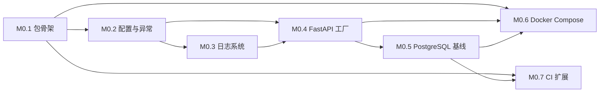

# M0：工程基础与 CI 门禁

本文档将 M0 里程碑拆解为可独立验收的 Implementation Issue，遵循 Issue 模板的最低信息要求。

## M0 交付目标

完成 Python 工程骨架、基础基础设施（配置/日志/异常/错误码）、FastAPI 应用工厂、PostgreSQL 连接基线、Docker Compose 本地环境和 CI 流水线扩展，为 M1 首个业务纵向切片做好准备。

## M0 范围边界

- M0 **不实现**任何业务功能（无领域模型、无业务路由）
- M0 **不引入** Redis/Celery（留给 M1）
- M0 **不引入** LLM/Agent/RAG 相关依赖
- M0 **不引入** Gradio 客户端

## 依赖关系总览

---

## Issue M0.1：初始化 Python 包结构与构建系统

**标签：** `type:implementation`、`priority:high`、`area:infrastructure`
**里程碑：** M0
**前置依赖：** 无

### 背景与用户价值

项目需要一个标准的 Python 包结构来组织代码。当前仓库没有构建配置，无法安装、引入依赖、运行测试或进行类型检查。

### 允许范围

- 创建 `src/nora/` 包目录结构：
  - `domain/`（`__init__.py` 及子目录空包）
  - `application/`
  - `ports/`
  - `agents/`
  - `infrastructure/`
  - `integrations/`
- 创建 `apps/` 目录：
  - `api/`（空包）
  - `worker/`（空包）
  - `demo/`（空包）
- 创建 `tests/` 目录结构：
  - `unit/`
  - `architecture/`
  - `contract/`
  - `integration/`
  - `e2e/`
- 创建 `pyproject.toml`，配置：
  - 项目元数据（name、version、description、authors、license）
  - Python 版本约束（>=3.11）
  - 构建系统声明
  - 后续 Issue 所需的工具配置段落占位（ruff、pytest、mypy）
- 创建 `.python-version`（Python 3.11+）
- 生成 `uv.lock`（可先无运行时依赖）

### 非目标

- 不安装任何运行时依赖（`dependencies` 初始为空）
- 不创建应用代码、配置加载、日志、异常等

### 验收条件

- [ ] `uv sync` 成功执行，生成 `uv.lock`
- [ ] `python -c "import nora; print(nora.__version__)"` 成功输出版本号
- [ ] 上述所有目录结构存在（可为空包）

### 测试计划

无（骨架初始化暂无逻辑可测）。

### 文档更新范围

无（README.md 已有说明，后续 M0.6 补充快速开始）。

---

## Issue M0.2：实现配置加载与异常基础设施

**标签：** `type:implementation`、`priority:high`、`area:infrastructure`
**里程碑：** M0
**前置依赖：** M0.1

### 背景与用户价值

应用需要统一的配置管理和一致的异常处理机制，避免后续模块各自造轮子，确保错误可预测、可审计。

### 允许范围

**配置模块**（`src/nora/infrastructure/config/`）：
- 配置模型（Pydantic Settings 或等效方案）
- 支持从环境变量和 `.env` 文件加载
- 至少包含：`ENV`（dev/staging/prod）、`DEBUG`、`LOG_LEVEL`、`DATABASE_URL`

**异常模块**（`src/nora/domain/base/exceptions.py`）：
- 异常基类 `NoraError`，包含 `error_code: str`
- 分支异常：`DomainError`、`ApplicationError`、`InfrastructureError`
- `ErrorCode` 枚举或常量定义

**配置 `pyproject.toml`**：
- 添加 `pydantic-settings`（或所选配置库）到 `dependencies`

### 非目标

- 不实现日志输出（M0.3 处理）
- 不实现 FastAPI 错误处理器（M0.4 处理）

### 验收条件

- [ ] 从环境变量和 `.env` 文件均可加载配置，环境变量优先
- [ ] 配置访问支持类型提示（如 `settings.env` 返回枚举，非字符串）
- [ ] `NoraError` 可序列化为 `{"error_code": "...", "message": "..."}`
- [ ] `DomainError`、`ApplicationError`、`InfrastructureError` 继承关系正确
- [ ] 单元测试覆盖：配置加载、环境覆盖、异常序列化

### 测试计划

- 单元测试：配置加载优先级、缺失字段处理、类型转换
- 单元测试：异常层次结构、序列化输出

### 文档更新范围

无。

---

## Issue M0.3：实现结构化日志系统

**标签：** `type:implementation`、`priority:high`、`area:infrastructure`
**里程碑：** M0
**前置依赖：** M0.2

### 背景与用户价值

系统需要统一的日志输出格式，包含请求追踪字段，便于本地调试和未来可观测性集成。

### 允许范围

- 实现 `src/nora/infrastructure/logging/` 模块
- 结构化 JSON 日志格式（时间戳、级别、消息、请求上下文）
- 通过配置（`LOG_LEVEL`、`LOG_FORMAT`）控制日志级别和输出格式
- 预留敏感字段脱敏扩展点（拦截器或过滤器机制）
- 集成 `structlog` 或等效方案

**配置 `pyproject.toml`**：
- 添加 `structlog`（或所选日志库）到 `dependencies`

### 非目标

- 不实现日志聚合或远程发送
- 不实现审计日志（由业务 Context 自行处理）

### 验收条件

- [ ] 日志输出为 JSON 格式，包含 `timestamp`、`level`、`message`
- [ ] 注入 `request_id` 后日志行包含该字段
- [ ] 通过 `LOG_LEVEL=WARNING` 配置可屏蔽 DEBUG/INFO 输出
- [ ] 单元测试覆盖：格式化、级别控制、上下文注入

### 测试计划

- 单元测试：JSON 格式校验、级别过滤、Extra 上下文注入
- 可选用 `pytest` 的 `caplog` 或等效方案验证日志输出

### 文档更新范围

无。

---

## Issue M0.4：搭建 FastAPI 应用工厂与 API 基础

**标签：** `type:implementation`、`priority:high`、`area:infrastructure`
**里程碑：** M0
**前置依赖：** M0.2、M0.3

### 背景与用户价值

需要一个可测试的 FastAPI 应用入口以及健康检查端点，为后续业务路由提供统一框架。

### 允许范围

- 实现 `src/nora/apps/api/` 应用工厂函数 `create_app()`
- `GET /health` — 返回 `{"status": "healthy"}`（含数据库连接状态占位）
- `GET /ready` — 返回就绪状态
- 全局异常处理器，将 `NoraError` 层级映射为稳定 HTTP 错误响应
- 全局请求/响应中间件：
  - 请求 ID 注入（缺失时自动生成 UUID）
  - CORS 配置
  - 日志上下文注入
- Lifespan 事件管理（启动/关闭钩子）

**配置 `pyproject.toml`**：
- 添加 `fastapi`、`uvicorn[standard]` 到 `dependencies`

### 非目标

- 不实现认证/授权中间件（M1 Identity Context 处理）
- 不实现业务路由

### 验收条件

- [ ] `GET /health` 返回 `{"status": "healthy"}`，HTTP 200
- [ ] `GET /ready` 返回就绪信息，HTTP 200
- [ ] 未捕获的 `NoraError` 返回结构化 JSON：`{"error_code": "...", "message": "..."}`
- [ ] 未捕获的未知异常返回 500 并记录日志（不泄露内部细节）
- [ ] 响应中包含 `X-Request-ID` 头
- [ ] `from nora.apps.api import create_app` 可导入

### 测试计划

- 集成测试（TestClient）：健康检查、就绪检查、错误映射
- 架构测试：`domain/` 不导入 `fastapi`、`httpx` 等外部包

### 文档更新范围

无。

---

## Issue M0.5：搭建 PostgreSQL 连接与 Repository 基线

**标签：** `type:implementation`、`priority:high`、`area:infrastructure`
**里程碑：** M0
**前置依赖：** M0.4

### 背景与用户价值

PostgreSQL 是系统的业务事实源。需要建立安全的数据库连接管理、Schema 版本化（Migration）和 Repository 模式基线。

### 允许范围

- 实现 `src/nora/infrastructure/database/` 模块：
  - 异步 SQLAlchemy `AsyncEngine` 和 `async_sessionmaker` 工厂
  - 连接池配置（池大小、超时、重试）
- 实现 `src/nora/infrastructure/database/base.py`：
  - 声明式基类 `Base`
  - 公共 Mixin 或字段：`id`（UUID）、`created_at`、`updated_at`、`version`（乐观锁）
- 实现 `src/nora/ports/repository.py`：
  - `Repository[T]` 抽象基类，定义 CRUD 接口
- 实现通用 `SqlAlchemyRepository[T]` 基类
- 配置 Alembic 迁移：
  - 初始化 `alembic/` 目录
  - 首次空迁移（验证迁移系统可用）
  - 配置 `alembic.ini` 从应用配置读取数据库 URL
- 将数据库健康检查集成到 `/health` 端点

**配置 `pyproject.toml`**：
- 添加 `sqlalchemy[asyncio]`、`asyncpg`、`alembic` 到 `dependencies`
- 添加 `pytest-asyncio` 到 `[project.optional-dependencies] dev`

### 非目标

- 不实现任何领域实体或业务表
- 不实现事务装饰器或工作单元模式（M1 引入）

### 验收条件

- [ ] Alembic `alembic upgrade head` 成功执行（空迁移）
- [ ] `alembic downgrade -1` 成功回滚
- [ ] Repository 基类支持 `add()`、`get()`、`list()`、`update()`、`delete()`
- [ ] 数据库断开时 `/health` 返回降级状态而非崩溃
- [ ] 集成测试覆盖：CRUD 操作、多表操作、连接池配置

### 测试计划

- 集成测试（测试数据库容器）：Repository CRUD、并发控制（version）
- 契约测试：Repository 接口实现验证
- 架构测试：`domain/` 和 `application/` 不导入 `sqlalchemy`、`asyncpg`

### 文档更新范围

无。

---

## Issue M0.6：定义 Docker Compose 本地开发环境

**标签：** `type:implementation`、`priority:high`、`area:infrastructure`
**里程碑：** M0
**前置依赖：** M0.4、M0.5

### 背景与用户价值

本地开发需要一键启动所有依赖服务，消除"我机器上能跑"的环境差异。

### 允许范围

- 创建 `docker-compose.yml`，编排以下服务：
  - **api**：FastAPI 应用
  - **db**：PostgreSQL 16
  - **redis**：Redis 7（骨架，预留端口）
  - **storage**：MinIO（骨架，预留端口）
- 创建 `docker/Dockerfile.api`：
  - 基于 Python 3.11+ 官方镜像
  - 安装依赖、复制源码
  - 开发模式支持热加载（挂载卷 + `--reload`）
- 创建 `docker/Dockerfile.worker`（骨架，仅入口占位）
- 创建 `.dockerignore`
- 创建 `docker-compose.override.yml`（开发用）：
  - 源码挂载
  - 端口映射（API 8000、DB 5432、Redis 6379、MinIO 9000）
  - 环境变量传递（`.env` 或内联）
- 创建 `scripts/dev.sh`（或等效脚本）：一条命令启动开发环境
- 初始化 `.env.example`（不含密钥的模板）

### 非目标

- 不构建生产级镜像（无多阶段构建、无安全扫描、无瘦身）
- 不配置复杂网络策略或服务发现

### 验收条件

- [ ] `docker compose up` 后 API 在 `localhost:8000` 可访问
- [ ] `GET /health` 返回数据库已连接的 `{"status": "healthy"}`
- [ ] `docker compose down` 后所有服务正常停止并清理
- [ ] 修改 Python 源码后 API 自动重载

### 测试计划

- CI 中增加 `docker compose build` 验证（确保镜像可构建）

### 文档更新范围

- `README.md` 添加"本地快速开始"章节：
  - 前置条件：Docker、uv
  - 命令：`cp .env.example .env` → `docker compose up`
  - 验证：`curl http://localhost:8000/health`

---

## Issue M0.7：扩展 CI 流水线（Lint + Type + Test）

**标签：** `type:implementation`、`priority:high`、`area:infrastructure`
**里程碑：** M0
**前置依赖：** M0.1、M0.5

### 背景与用户价值

当前 CI（`pr-conventions.yml`）只校验 PR 元数据（分支名、标题、正文格式），没有代码质量门禁。需要增加代码检查步骤，确保提交质量。

### 允许范围

**工具配置**（写入 `pyproject.toml`）：
- `[tool.ruff]` — lint + format 规则
- `[tool.pytest.ini_options]` — 测试发现路径、asyncio 模式、覆盖率
- `[tool.mypy]` 或 `[tool.pyright]` — 类型检查配置

**CI 配置**（扩展 `.github/workflows/pr-conventions.yml`）：
- 步骤：检出 → 安装 Python → `uv sync` → ruff 检查 → 类型检查 → pytest → 架构测试
- 新增 PostgreSQL service container 供集成测试使用
- 各步骤独立，任一失败即阻断合并

**架构测试**：
- 创建 `tests/architecture/test_dependency_rules.py`
- 验证：`domain/` 不导入 `fastapi`、`sqlalchemy`、`httpx` 等外部包
- 使用 `import-linter` 或纯 `ast` 方案

### 非目标

- 不设置覆盖率百分比门禁（仅执行和报告）
- 不引入安全扫描（SBOM、secret scan — 留给后续 Issue）
- 不替换现有 PR 元数据校验（在其基础上新增）

### 验收条件

- [ ] CI 中 ruff 检查通过（无 lint 错误、格式合规）
- [ ] CI 中类型检查通过（当前代码无严重类型错误）
- [ ] CI 中 `pytest` 通过（包含 M0.2~M0.5 的所有测试）
- [ ] 架构测试正确检测非法导入（可故意注入非法导入验证）
- [ ] CI 配置了 PostgreSQL service container，集成测试可连接

### 测试计划

- 架构测试：Domain 层不导入外部框架
- 架构测试：Application 层不导入基础设施包

### 文档更新范围

无。

---

## 汇总

| Issue | 标题 | 前置依赖 | 预计文件变更 |
|-------|------|---------|-------------|
| M0.1 | 初始化 Python 包结构与构建系统 | 无 | 新建 10+ 目录/文件 |
| M0.2 | 实现配置加载与异常基础设施 | M0.1 | 配置 + 异常模块 |
| M0.3 | 实现结构化日志系统 | M0.2 | 日志模块 |
| M0.4 | 搭建 FastAPI 应用工厂与 API 基础 | M0.2、M0.3 | API 应用工厂 |
| M0.5 | 搭建 PostgreSQL 连接与 Repository 基线 | M0.4 | 数据库 + Repository 模块 |
| M0.6 | 定义 Docker Compose 本地开发环境 | M0.4、M0.5 | Docker 配置 + README |
| M0.7 | 扩展 CI 流水线 | M0.1、M0.5 | CI 配置 + 架构测试 |

---

## 实施建议

1. 按依赖顺序逐个创建 Issue，从前置依赖最少的 M0.1 开始
2. 每个 Issue 独立走完完整交付流程：Issue → 分支 → 实现 → 验收 → PR → 合并
3. M0.2 和 M0.3 可并行实施（均依赖 M0.1，互不依赖）
4. 后续 Issue（M1+）计划在 M0 全部合并后再创建
