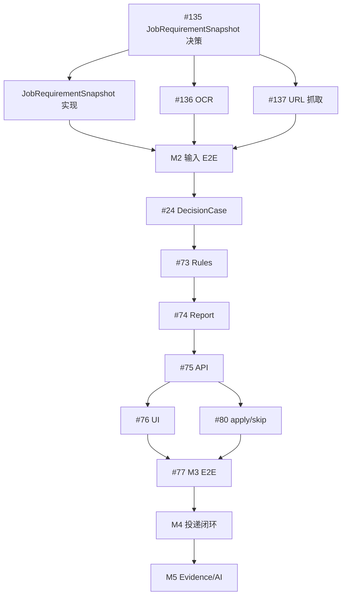

# Nora M2-M5 里程碑执行计划

> 本文负责原子交付顺序、Issue 映射、依赖和验收。里程碑结果与范围以
> [`ROADMAP.md`](ROADMAP.md) 为真源，实际执行状态以 GitHub Milestone 与 Issue 为准。
>
> 当前已交付能力及证据只维护在 [`current-capabilities.toml`](current-capabilities.toml)。本计划描述 Planned
> 工作，不把规划写成 Current。

## 1. 规划目标

本计划从用户何时获得真实结果反向组织交付：

1. M2 先把岗位、主档和简历变成可确认、可版本化的分析输入；
2. M3 交付无模型也能运行的确定性决策闭环；
3. M4 交付投递材料、手工跟进和可部署单用户 Beta；
4. M5 才引入 Evidence、检索和可选模型增强；
5. 缓存、Worker、Reranker 和 Agent Runtime 均由指标触发。

M6+ 已取消为主动 Milestone。候选能力的准入条件见 [`ROADMAP.md`](ROADMAP.md)“触发式候选池”。

## 2. 规划原则

### 2.1 用户结果优先

Milestone 必须产生可观察用户结果。技术组件可以作为原子 Task，但不能连续构成没有用户入口的阶段。

### 2.2 原始事实与解释分离

- JobPosting 是岗位原文事实；
- JobRequirementSnapshot 是用户确认的结构化解释；
- CandidateProfile 是用户确认主档；
- ResumeVersion 是不可变简历事实版本；
- ResumeVariant、报告和消息草稿是输出；
- Chunk、Embedding、缓存和 Agent State 是可重建派生数据。

### 2.3 确定性核心先于 AI

M2-M4 不配置模型密钥也必须工作。模型只能增加增强版本，不能替换原始事实、确定性报告或用户确认记录。

### 2.4 公开契约与真实调用路径

实现 Task 必须进入真实调用路径：

```text
Web / API
  -> Application Use Case
  -> Domain
  -> Port
  -> Adapter
  -> PostgreSQL / Artifact Storage
```

纯目录、DTO、Port、Fake Adapter 或 TODO 不能作为功能完成证据。Architecture Issue 可以只交付决策，但后续实现必须单独验收。

### 2.5 一项一个主要交付物

- 一个 Task 应有一个主要模块或用户结果；
- 超过两个主要 area 时优先拆分；
- OCR 与 URL 抓取分开；
- 部署/安全/恢复与性能基准分开；
- 面试记录、准备、复盘和出行分开；
- Embedding 决策与 pgvector Schema 分开；
- Model Gateway 与 LLM 产品能力分开。

### 2.6 条件能力允许不引入

Reranker、Redis 和 Worker 的评估结论可以是不引入。未达阈值时应关闭评估并记录证据，不能无限期阻塞 Milestone。

## 3. 当前基线

默认分支已经具备的能力、代码路径与合并证据只由 [`current-capabilities.toml`](current-capabilities.toml) 证明，本计划不再复制容易过期的 Current 清单。执行某项工作前必须同时核对 Current 台账、GitHub Milestone、关联 Issue 和已合并依赖；路线图中的目标描述不等于已交付能力。

## 4. 总览与关键路径

| Milestone | 核心结果 | 必须无模型运行 |
| :--- | :--- | :---: |
| M2 | 分析就绪输入 | 是 |
| M3 | 确定性决策和 apply/skip | 是 |
| M4 | 投递材料、记录和可部署 Beta | 是 |
| M5 | Evidence、AI 与条件规模化 | M3/M4 降级路径必须可用 |



## 5. M2：分析就绪的输入基线

### 5.1 进入条件

- M0、M1 历史交付保持关闭；
- 岗位、主档、简历和 Vue 基线仍通过回归；
- 没有未合并的主线 PR；
- 新的数据所有权先经过 Architecture Review。

### 5.2 M2-A：JobRequirementSnapshot 决策（#135）

状态：已交付并随 M2 关闭。

主要交付物：岗位结构化要求的所有权和版本边界。

必须决定：

- 与 JobPosting 的关系；
- owner、版本和不可变性；
- 技能、最低经验、学历、地点和工作方式最小字段；
- unknown、unconfirmed、confirmed 状态；
- 人工输入、原文字符区间和 OCR 预览等来源定位；
- 内容哈希或等价幂等标识；
- 修改确认结果时创建新版本；
- DecisionCase 固定引用具体版本。

非目标：

- 不实现 Schema、迁移或 API；
- 不实现抽取算法；
- 不改变 JobPosting 原文语义。

退出：

- [x] Architecture Review 通过；
- [x] 决策、取舍和拒绝方案可追溯；
- [x] 后续实现未静默改变所有权。

### 5.3 M2-B：JobRequirementSnapshot 纵向实现

状态：已交付并随 M2 关闭；实现遵循 #135，不在本计划重复 Current 证据。

主要交付物：

- Domain 不变量和版本行为；
- Repository、迁移和用户隔离；
- 创建、列表或读取所需公开 API；
- 人工补充和确认；
- 历史快照不被重写；
- 幂等和冲突行为。

建议错误：

- 未认证 401；
- 跨用户或不存在 404；
- 版本/状态冲突 409；
- 校验失败 422；
- PostgreSQL 不可用 503。

### 5.4 M2-C：岗位要求确认页面

状态：已交付并随 M2 关闭。

主要交付物：用户通过浏览器确认结构化岗位要求。

范围：

- 显示 JobPosting 原文；
- 编辑技能、最低经验、学历、地点和工作方式候选；
- 显示 unknown/unconfirmed/confirmed；
- 显示字段来源；
- 创建新确认版本；
- 标记岗位是否分析就绪；
- 显示服务端校验、冲突和网络失败。

非目标：不执行决策规则或生成报告。

### 5.5 M2-D：截图 OCR 输入（#136）

状态：已交付并随 M2 关闭；浏览器截图入口未纳入该 Issue。

主要路径：

```text
upload
  -> byte/format/pixel/decode limits
  -> immutable bytes
  -> OCR
  -> editable preview
  -> user confirmation
  -> JobPosting
```

强制边界：

- 不可变字节复制后再验证和传递；
- 限制压缩膨胀和解码资源；
- OCR 输出不可信；
- 空结果和失败使用稳定错误码；
- 不根据 OCR 结果自动建立确认事实。

### 5.6 M2-E：链接受控抓取（#137）

状态：已交付并随 M2 关闭；浏览器链接入口未纳入该 Issue。

主要路径：

```text
URL
  -> syntax / IDNA / host checks
  -> DNS public-unicast checks
  -> connect and enforce limits
  -> validate every redirect
  -> editable preview
  -> user confirmation
  -> JobPosting
```

强制边界：

- 拒绝 localhost、环回、私网、链路本地、保留、未指定和组播；
- 防止 DNS Rebinding；
- 限制重定向、超时、Content-Type、响应大小和解压后大小；
- 不执行脚本、不携带 Cookie、不登录平台；
- 失败返回稳定错误码。

### 5.7 M2-F：分析就绪输入 E2E

最小场景：

1. 注册并登录；
2. 创建主档和简历；
3. 粘贴 JD 并确认结构化岗位要求；
4. 修改岗位要求产生新版本；
5. 刷新后恢复；
6. 第二个用户不可访问；
7. 清理隔离环境。

截图 OCR 与受控链接预览的浏览器入口不属于 #151；其公开 API 由 #136/#137 的受控 Adapter 集成测试覆盖。
不能把 Fake 单元测试冒充浏览器 E2E 或真实 Adapter 集成证据。

### 5.8 M2 退出条件

- [x] #135 已完成；
- [x] JobRequirementSnapshot 实现和确认页面进入真实调用路径；
- [x] #136、#137 已交付；
- [x] 安全与用户隔离测试通过；
- [x] 浏览器 E2E 通过；
- [x] 无模型环境可完成全部流程；
- [x] Current 台账只在能力合并后更新。

## 6. M3：确定性求职决策 MVP

### 6.1 进入条件

- M2 已关闭；
- JobPosting、JobRequirementSnapshot、CandidateProfile 和 ResumeVersion 公开契约稳定；
- 无未合并主线 PR。

### 6.2 M3.1：DecisionCase 输入契约（#24）

主要交付物：不可变分析输入关系。

至少引用：

- owner；
- JobPosting ID/版本；
- JobRequirementSnapshot ID/版本；
- CandidateProfile ID/版本；
- ResumeVersion ID；
- rule_set_version；
- 状态和时间；
- 输入指纹或幂等标识。

Issue #24 负责 Domain、Application、Repository 和输入不变量，不拥有公开 HTTP 路由。创建时验证全部对象属于同一用户。

### 6.3 M3.2：确定性规则（#73）

四类规则：

1. 技能覆盖；
2. 最低经验年限；
3. 地点和工作方式；
4. 学历要求。

每条规则输出：

- rule ID/version；
- match/partial/mismatch/unknown；
- 输入字段路径和版本；
- 原因；
- 不确定性；
- 可选确定性建议。

规则是纯函数；不得访问网络、模型或数据库。

### 6.4 M3.3：版本化基础报告（#74）

报告区分：

- Fact；
- Rule Result；
- Unknown；
- Recommendation；
- Citation。

相同 DecisionCase、规则集和生成器版本重复生成时返回既有报告。升级必须创建新版本，不覆盖历史。

### 6.5 M3.4：分析与报告 API（#75）

Issue #75 唯一拥有公开 HTTP 契约：

- 创建/读取 DecisionCase；
- 生成/读取报告；
- 用户范围报告列表；
- 分页、排序和空集合；
- 401/404/409/422/503；
- 缺输入时成功返回 unknown。

默认同步执行。不为尚未存在的 Worker 设计虚假排队状态。

### 6.6 M3.5：分析与报告页面（#76）

页面：

- 创建分析；
- 请求中和失败重试；
- 报告详情；
- 报告历史；
- Fact/Rule/Unknown/Recommendation/Citation 分区；
- 刷新恢复；
- “确定性规则”和“AI 增强未启用”标识。

如果后端同步完成，不显示虚假的进度百分比。

### 6.7 M3.6：最小投不投决定（#80）

状态：

```text
analyzed -> apply
analyzed -> skip
```

要求：

- 引用报告版本；
- 保存操作者、时间、原因和幂等键；
- 重复提交幂等；
- 冲突决定返回 409；
- apply 不生成材料；
- skip 历史提示不得依赖 M5 RAG。

### 6.8 M3.7：真实 Compose E2E（#77）

浏览器 E2E 只承担关键旅程：

- 创建分析；
- 至少断言一个规则结果和一个 unknown/mismatch；
- 查看报告；
- apply 或 skip；
- 刷新恢复；
- 双用户隔离。

401/404/409/422/503 的完整组合由 API 契约和集成测试承担，不在单个浏览器用例中穷举。

### 6.9 M3 退出条件

- [x] #24、#73-#77、#80 全部交付；
- [x] 无模型、无向量扩展时主流程通过；
- [x] 报告和决定可恢复；
- [x] 规则与输入版本可追溯；
- [x] API、集成和浏览器门禁通过；
- [x] 当前能力台账同步真实合并结果。

M3 已于 2026-08-12 完成退出核验并关闭；Current 代码路径和 PR 证据只见能力台账。

## 7. M4：可部署的投递闭环 Beta

### 7.1 进入条件

- M3 已关闭；
- apply/skip 和确定性报告契约稳定；
- Artifact/Source 数据所有权通过 #163 Architecture Review；
- 公司情报与决策报告版本边界通过 #164 Architecture Review；
- 外部写继续关闭。

### 7.2 Architecture 与文档门禁（M4.1、M4.2、M4.4、M4.7、M4.14）

- M4.1 #163 已固定 Artifact/Source 所有权、跨存储一致性、访问、保留、删除、恢复和 M5 继承规则；
- M4.2 #167 同步 M3 封版事实和 M4/M5 静态 Issue 映射；
- M4.4 #164（D-014）固定独立 CompanySnapshot/CompanyAssessment 版本、Source 精确引用与 M3 DecisionCase/DecisionReport 兼容关系；
- M4.7 #171 固定 Beta 部署目标、网络、TLS、Secret 和发布边界；
- M4.14 #174 固定注册、认证、会话、CORS、滥用防护和密钥轮换边界；
- Architecture 项只交付决策，不提前实现 Schema、Adapter、API 或业务页面。

### 7.3 Artifact 与 Source 基础（M4.3 #21）

- 元数据、版本和归属存 PostgreSQL；
- 二进制存一种真实 Artifact Adapter；
- 保存 content type、size、SHA-256、来源/生成器版本；
- 定义保留、删除和审计；
- 不要求同时交付文件系统和 MinIO 两套生产实现。

### 7.4 公司情报最小化（M4.8 #79、M4.9 #169）

- #79 按 D-014 实现独立 CompanySnapshot/CompanyAssessment；不得把公司情报追加到 M3 DecisionCase 输入或用最新版本覆盖历史报告；

- 公司规模和行业；
- 来源和获取/发布时间；
- fresh/aging/stale；
- 网评摘要与原始来源；
- 缺失、冲突或过期明确 unknown；
- 不做全网自动采集和聚合风险分数。

### 7.5 ResumeVariant 与模板（M4.5 #91）

- 声明式不可变 TemplateDefinition；
- 不执行任意 Python、JavaScript、Jinja 或活动 HTML；
- ResumeVariant 固定引用简历、岗位、岗位要求和模板版本；
- 历史变体不因模板升级重算；
- 字段选择和排序可解释。

### 7.6 确定性 PDF（M4.10 #92）

- 固定渲染器、字体和易变元数据；
- 记录输入、模板和生成器版本；
- 写入 Artifact Storage 并保存哈希；
- 不允许模板访问未批准网络资源；
- 字节级确定性只在锁定环境内验收。

### 7.7 确定性 MessageDraft（M4.11 #93）

- professional/concise/referral 等有限风格；
- 可编辑纯文本；
- 输入来自确认主档、岗位、可用公司信息和用户备注；
- 无 LLM 时可生成；
- 用户手工复制，不自动发送。

### 7.8 ApplicationRecord（M4.12 #94）

建议状态：

```text
planned -> applied -> interviewing -> offer_received
                            |         -> rejected
                            -> withdrawn
planned -> withdrawn
```

状态由用户确认，具有操作者、时间、幂等和审计。不确定的外部结果不得自动标成功。

### 7.9 最小 InterviewCase（M4.13 #140）

- 时间、地点、轮次、备注；
- 与 ApplicationRecord interviewing 状态衔接；
- 用户隔离、幂等和审计；
- 不包含面试准备、复盘、TravelPlan 或长期记忆。

### 7.10 可观测与 Beta 运行基线（M4.6 #87、M4.16 #138）

- 在既有日志/request/trace ID 上增加延迟、吞吐和错误率指标；
- Secret Scan、依赖审查和 SBOM；
- 部署文档和环境变量清单；
- PostgreSQL 与 Artifact 备份恢复；
- 健康检查与依赖降级；
- 新环境部署冒烟；
- Token、Cookie、简历正文、PDF 和完整 Prompt 脱敏；
- 基础保留和删除说明。

### 7.11 Beta 认证安全（M4.15 #175）与 Jenkins CD（M4.17 #153）

M4.15 按 M4.14 决策落地受控开户、登录滥用防护、生产 CORS allowlist、可信代理、JWT 轮换和安全可观测契约。

Issue #153 是 M4 可部署 Beta 的必需自动部署门禁，而不是 GitHub Actions PR CI 的替代品；它在 #138 固定部署、Secret、健康与回滚
契约后，负责从固定 Commit/镜像部署 Beta、验证镜像/SBOM 追溯、执行冒烟并在失败时安全停止或回滚。

### 7.12 M4 E2E（M4.18 #165）

至少覆盖：

1. 从确定性报告选择 apply；
2. 创建 ResumeVariant；
3. 选择模板并生成 PDF；
4. 生成和编辑 MessageDraft；
5. 用户确认手工投递；
6. 记录 ApplicationRecord；
7. 可选记录 InterviewCase；
8. 刷新恢复和双用户隔离。
9. 受控开户/注册、登录、会话失效、退出与未授权 Origin 拒绝。

### 7.13 M4 退出条件

- [ ] M4.1、M4.4、M4.7、M4.14 Architecture 门禁已完成；
- [ ] M4.3-M4.17 的强制实现与运行项全部交付；
- [ ] M4.18 真实 Compose/Object Storage 浏览器 E2E 已交付；
- [ ] 无模型环境可完成投递材料和记录流程；
- [ ] Artifact、模板和用户数据安全边界通过；
- [ ] 部署、安全和恢复门禁通过；
- [ ] 外部写保持关闭；
- [ ] Beta 浏览器 E2E 通过。

## 8. M5：Evidence、AI 与规模化增强

### 8.1 进入条件

- M4 已关闭；
- 已有代表性的岗位、主档、报告和投递 fixture；
- 已定义检索问题、Ground Truth 和质量指标；
- Provider、密钥、许可、成本和失败策略通过 Architecture Review。

### 8.2 Provider 与评测门禁（M5.1 #166、M5.2 #172）

- Provider 用途、凭据、数据发送、许可、保留、区域、成本与退出条件先通过审查；
- 检索问题、脱敏 fixture、Ground Truth、质量/安全/延迟/成本阈值在实现前冻结；
- 后续实现不得为通过门禁而静默修改评测版本或阈值。

### 8.3 Embedding 决策（M5.3 #141）

先决定：

- Provider-neutral Port；
- 模型、版本和维度；
- 归一化和距离前提；
- 批量、超时、重试、成本和失败；
- 内容哈希和版本；
- 不可用时的降级。

Issue #141 只交付决策，不实现 Schema。

### 8.4 pgvector 决策（M5.4 #168）

- 固定 Embedding 身份、列、约束、距离函数和查询运算符；
- 依据冻结评测决定精确扫描、HNSW、IVFFlat 或暂不建立 ANN 索引；
- 固定模型升级、双版本、回填、切换、回滚和重建边界。

### 8.5 Chunk（M5.5 #81）与 Model Gateway（M5.6 #85）

- 引用 Source 版本；
- 稳定 locator、序号和字符偏移；
- chunker version；
- 可从 Source 重建；
- 不在同一 Task 引入 Embedding。

Model Gateway 保持 Provider-neutral，定义 Prompt/Schema、限流、用量、失败分类与确定性降级，不直接写领域事实。

### 8.6 pgvector 实现（M5.7 #22）

严格按 M5.4 #168 的决策实现：

- PostgreSQL 镜像/扩展；
- vector 列维度；
- 距离算法；
- HNSW/IVFFlat 或无 ANN 索引策略；
- Alembic 升级、降级、备份和重建；
- 无扩展失败行为。

不引入 Milvus。

### 8.7 Embedding Adapter（M5.8 #82）

- 实现 #141 契约；
- 批量、超时、重试、用量和错误分类；
- 版本和内容哈希；
- 写入 #22 已确认 Schema；
- 不把向量作为事实。

### 8.8 混合检索（M5.9 #83）

- PostgreSQL 关键词检索；
- pgvector 相似检索；
- 归一化和融合版本；
- 用户、权限和来源版本过滤；
- 固定评测集；
- Recall/Precision/MRR/nDCG 中适用指标；
- 延迟和成本基线。

### 8.9 Evidence Pack（M5.10 #23）

- 不可变；
- source ID/version/locator；
- 摘要和适用可信标签；
- 检索、Embedding、融合和生成器版本；
- 可供报告引用；
- 无 Reranker/LLM 时成立。

### 8.10 LLM 报告增强（M5.11 #25）

- 只读取版本化事实、规则和 Evidence Pack；
- 输出区分 fact/rule/llm_inferred/suggestion/unknown/citation；
- 无引用推断不得升级为事实；
- Schema 失败拒绝增强版本；
- Provider 失败返回确定性报告；
- 增强版本不覆盖历史。

### 8.11 条件 Reranker（M5.12 #84）

只有固定评测集证明 Top-K 未达阈值且预计收益高于成本/延迟时引入。验收必须比较前后指标；否则以“不引入”结论关闭。

### 8.12 性能和容量基线（M5.13 #139）

- 接口延迟、吞吐和热点；
- 检索延迟；
- PDF/Embedding/抓取/模型任务耗时；
- 失败率和资源占用；
- 可复验脚本和 fixture；
- 为 #27/#28 提供触发证据。

### 8.13 条件 Redis（M5.14 #27）与 Worker（M5.15 #28）

只有高频热点、限流或用户可感知延迟证据成立时引入。缓存带 TTL、可重建，不保存事实，不可用时明确降级。

只有长任务、跨进程重试、取消、并发控制或故障隔离需求成立时引入。

若引入：

- 队列只带任务名、业务 ID、版本和幂等键；
- 不携带 Token、正文或大对象；
- 支持重试、取消、超时和死信；
- 最终事实写 PostgreSQL；
- 不使用 Result Backend 保存最终业务结果。

### 8.14 M5 E2E 与退出条件（M5.16 #170）

- [ ] M5.1-M5.11 强制决策与实现项已交付；
- [ ] 检索质量、成本和延迟可复验；
- [ ] Evidence 引用稳定；
- [ ] Provider 不可用时 M3/M4 完整可用；
- [ ] Reranker、Redis 和 Worker 已交付或形成不引入结论；
- [ ] 用户隔离、重建和删除行为通过；
- [ ] 部署、安全、备份和数据保留门禁继续通过。
- [ ] M5.16 浏览器 E2E 覆盖 Evidence 与增强报告、恢复、隔离和降级。

## 9. 公开 API 规划矩阵

| API 契约 | 交付归属 |
| :--- | :--- |
| M0-M2 输入 API | 当前状态、代码路径与证据只查 Current 台账 |
| DecisionCase API | Current，M3；公开路由由 #75 所有 |
| DecisionReport API | Current，M3；#74/#75 |
| ApplicationDecision API | Current，M3；#80 |
| ResumeVariant/Template/PDF/MessageDraft | M4 |
| ApplicationRecord/InterviewCase | M4 |
| Source/Chunk/Evidence/增强报告 | M5，仅在需要用户入口时公开 |

所有列表接口必须定义分页、排序和空集合。跨用户对象统一返回 404。

## 10. 测试与质量门禁

| 检查 | M2 | M3 | M4 | M5 |
| :--- | :---: | :---: | :---: | :---: |
| 后端 Ruff/format/Mypy | 必须 | 必须 | 必须 | 必须 |
| Domain/Application 单元测试 | 必须 | 必须 | 必须 | 必须 |
| PostgreSQL 集成 | 必须 | 必须 | 必须 | 必须 |
| Alembic 往返 | Schema 变化时 | Schema 变化时 | Schema 变化时 | 必须 |
| API/Port 契约 | 必须 | 必须 | 必须 | 必须 |
| 前端 lint/type/test/build | 必须 | 必须 | 必须 | 适用 |
| 浏览器 E2E | 输入流程 | 决策流程 | 投递 Beta | 增强流程 |
| 安全测试 | 上传/SSRF/隔离 | 隔离/幂等 | 模板/Artifact/秘密 | Provider/检索/重建 |
| Benchmark | 非门禁 | 同步基线 | 部署基线 | 强制 |

禁止替代：

- 单元测试不能替代 PostgreSQL 集成；
- API 测试不能替代浏览器 E2E；
- Mock Provider 不能证明真实 Provider；
- 构建通过不能证明用户流程；
- Port 契约不能证明 Adapter 已接线；
- CI 绿色不能替代安全审查；
- “模型接通”不能替代质量 Benchmark。

## 11. 失败降级

| 故障 | 行为 |
| :--- | :--- |
| API 不可用 | Web 展示可重试网络错误 |
| PostgreSQL 不可用 | 健康检查 degraded，业务返回稳定 503 |
| 结构化岗位要求缺失 | 分析前标记未就绪；规则层返回 unknown |
| OCR/抓取失败 | 保留人工文本输入，不生成猜测内容 |
| Artifact Storage 不可用 | 不标记 PDF 已生成，允许重试 |
| pgvector 不可用 | M2-M4 不受影响；M5 检索明确不可用 |
| Provider 不可用 | 返回确定性报告和确定性草稿 |
| LLM Schema 无效 | 拒绝增强版本 |
| Redis/Worker 不可用 | 核心事实保持一致，缓存旁路或任务明确失败 |

## 12. Issue 迁移基线

治理 Issue #134 已完成 GitHub 元数据重排：

- M2-M5 是唯一主动序列；
- 原 M6+ Milestone 已取消并删除；
- #88-#90、#95-#97 等候选能力已关闭并保留迁移说明；
- #29 拆为 #138 部署/安全/恢复和 #139 性能/容量；
- #95 拆出 #140 最小 InterviewCase；
- #141 修正 Embedding 决策与 pgvector Schema 的依赖顺序；
- #135-#137 已交付并随 M2 关闭；
- #91-#94 是 M4 核心能力，优先级为 p1。

后续 Issue 创建仍遵循：

- Architecture 决策先于依赖实现；
- 已有未合并主线时不创建下一个依赖任务；
- 一个主要交付物、可独立验收；
- 历史 Issue 不删除，替代项保留双向迁移说明；
- 计划不能被描述为 Current。

## 13. 风险登记

| 风险 | 最早发现点 | 处置 |
| :--- | :--- | :--- |
| JobRequirementSnapshot 过度建模 | #135 | 只保留四类规则和分析就绪所需字段 |
| OCR 依赖过重 | #136 | Adapter 隔离、资源限制、允许人工输入降级 |
| URL 抓取 SSRF | #137 | 每跳校验、DNS/IP 绑定、大小和超时限制 |
| M3 伪异步化 | #75/#76 | 默认同步，指标触发 Worker |
| 报告不可解释 | #73/#74 | 字段级引用、版本和 unknown |
| 模板执行任意代码 | #91/#92 | 声明式 Schema、固定渲染环境 |
| PDF 不可复现 | #92 | 固定字体/渲染器/元数据，限定确定性范围 |
| AI 成为硬依赖 | #85/#25 | 确定性降级和版本隔离 |
| 向量维度倒置 | #141/#22 | 模型决策先于 Schema |
| 条件中间件提前引入 | #139/#27/#28 | 指标触发，允许不引入 |
| 文档与 GitHub 漂移 | 每次规划变更 | 规划语义检查、真源和回读 |

## 14. Milestone 关闭检查表

- [ ] 所有强制 Issue/PR 已合并，开放项为 0；
- [ ] 条件项已实施或形成不引入结论；
- [ ] GitHub Milestone、ROADMAP 和本计划一致；
- [ ] Current 台账只记录已合并能力；
- [ ] 公开 API、OpenAPI 和行为一致；
- [ ] 数据所有权和版本边界明确；
- [ ] Schema 可升级、降级和再升级；
- [ ] 用户隔离、安全和隐私通过；
- [ ] 静态、类型、单元、契约、集成和 E2E 通过；
- [ ] 新环境可按文档动态验收；
- [ ] 未执行项及原因真实记录；
- [ ] 没有 Mock、占位或孤立 Port 冒充完成；
- [ ] 后续里程碑不依赖隐含的未交付能力；
- [ ] 历史 Issue、PR、Commit 和迁移说明可追溯。

## 15. 变更控制

以下变化需要 Architecture Issue：

- 修改岗位、岗位要求、主档、简历、DecisionCase、报告或投递记录所有权；
- 让模型输出直接成为用户事实；
- 选择 Embedding 模型、pgvector Schema 或索引；
- 引入运行时 Provider、Redis、Worker 或 Agent Runtime；
- 开启自动投递、自动消息或浏览器外部写；
- 改变 M2-M4 无模型可运行要求；
- 修改个人数据保留、删除或隔离；
- 新增 M5 之后的编号 Milestone。

字段校验、既定页面、测试补强和不改变边界的修复可以直接通过原子 Task 或 PR 交付。
