# Nora 里程碑执行计划（重排基线）

> 状态：Architecture Issue #98 的**正式执行基线**（非草案）。本文是各里程碑的**原子交付执行计划**；
> 里程碑范围与验收条件以 [`ROADMAP.md`](ROADMAP.md) 为真源。
> 基线日期：2026-08-02。
> 修订 v2：按已确认业务流程与决策基线补充 JD 输入（截图/链接）、公司情报、最小投不投决定、平台 Port 预留与出行推荐；对齐软件工程应届目标用户。
> 目标：保持 M3 交付最小可运行 Demo，同时解除 RAG、外部模型和完整 AI 平台对 Demo 的阻塞。
> 当前有效状态仍以 Nora 仓库中的 `docs/ROADMAP.md`、GitHub Milestone 和 Issue 为准。

## 1. 文档目的

本文从“用户何时能够真正操作 Nora”反向设计里程碑，而不是从技术组件数量正向堆叠范围。重排遵循以下目标：

1. M0、M1 保留已完成的历史事实，不返工、不伪造前端交付。
2. M2 只建立 M3 Demo 必需的数据、公开 API 和前端工程基础。
3. M3 必须交付一个无外部模型密钥也能完整运行的确定性 Demo。
4. RAG、Embedding、Reranker、Model Gateway 和 LLM 作为 M4 增强能力，不阻塞 M3。
5. Redis、Celery 等中间件必须由真实性能或可靠性指标触发，不预设为业务前提。
6. Agent 和任何外部写操作继续位于稳定业务闭环之后，并受人工确认、幂等和审计约束。
7. 对齐已确认的业务流程与决策基线：目标用户为软件工程专业应届生（以校招为主）；业务流程与三项技术决策
   （PostgreSQL+pgvector、半自动仅预留接口、本地声明式模板 + WeasyPrint）见
   [`BUSINESS_FLOW.md`](BUSINESS_FLOW.md) 与 [`PRODUCT_VISION.md`](PRODUCT_VISION.md)。

## 2. 最小 Demo 的严格定义

M3 所称“最小 Demo”不是页面静态原型，也不是 Mock API 演示。它必须满足：

- 使用真实 Vue Web 客户端；
- 使用真实 FastAPI、PostgreSQL 和 Alembic；
- 用户通过真实认证 API 注册和登录；
- 用户手工录入真实结构的岗位与个人事实；
- 后端执行可重复的确定性规则；
- 后端持久化版本化分析报告；
- 前端展示事实、规则结论、差距、未知项和建议；
- 业务成功路径不依赖 Mock、Embedding、向量库、Reranker、外部 Provider 或 LLM；
- `docker compose up --build` 后能由新环境完成完整流程；
- 至少一个浏览器级 E2E 覆盖主流程。

M3 可以展示“AI 增强尚未启用”，但不能把伪造的 LLM 结果作为成功演示。

## 3. 规划原则

### 3.1 用户价值优先

每个开放里程碑必须产生可观察结果。纯基础设施可以是原子 Issue，但不能连续占据多个里程碑而没有用户可验证路径。

### 3.2 确定性核心先于 AI 增强

岗位、画像、规则和报告均应在没有模型时成立。模型只能增强解释和建议，不能成为事实源或核心状态机的唯一执行者。

### 3.3 公开契约先于前端页面

前端只调用已发布 HTTP API。页面实现前必须明确请求、响应、错误码、分页、鉴权和缺失数据行为。

### 3.4 纵向切片必须触达用户界面

M1 可以作为后端纵向切片保留，但从 M2 开始，“纵向切片”必须至少包含一个真实用户入口或明确为平台内部切片。

### 3.5 一 Issue 一个主要交付物

禁止在一个 Issue 中同时交付 Reranker、Evidence Pack、Model Gateway 和 Provider；禁止在一个 Issue 中初始化 Vue、实现全部页面、Compose、所有测试和 E2E。

### 3.6 可选能力不能成为退出条件

如果某项能力允许降级，那么里程碑关闭条件必须用降级模式也能通过。外部模型不可用时，M3 仍需完成。

## 4. 当前能力基线

| 能力 | 当前状态 | 证据或限制 |
|---|---|---|
| Python/FastAPI 工程 | 已完成 | `backend/app/`，应用工厂、配置、日志和异常已存在 |
| PostgreSQL/Alembic | 已完成 | PostgreSQL-only 集成路径和迁移往返已建立 |
| 认证 | 已完成 | 注册、登录、Bearer Token、`/auth/me` |
| 岗位快照 | 已完成 | 公开契约返回完整 JD、标题、公司、地点、来源、状态和版本，支持用户范围分页列表 |
| 用户隔离 | 已完成 | Repository 和 API 集成测试覆盖 |
| 幂等与审计 | 已完成 | 岗位创建幂等、审计事务和不可变保护 |
| CandidateProfile | 已完成 | Web 主档页面可读取、编辑并保存版本 |
| ResumeVersion API | 已完成 | Web 可从已确认主档发布、列表和读取不可变版本 |
| DecisionCase | 未实现 | 当前 Issue 依赖范围过大且输入契约不完整 |
| Versioned DecisionReport | 未实现 | 当前与 LLM 增强绑定，不利于无模型 Demo |
| Vue 前端 | 已完成 | Vue 3/Vite 工作台支持认证、岗位、主档和简历页面 |
| 前端 CI | 已完成 | PR 门禁执行 lint、typecheck、Vitest 与 production build |
| pgvector | 未实现 | Compose 使用普通 `postgres:16-alpine`，不能视为已预留可用 |
| RAG/Model Gateway/LLM | 未实现 | 应从 M3 硬依赖链中移除 |
| JD 截图（OCR）输入 | 未实现 | 目前只有 `jd_text` 文本字段，无图像解析 |
| JD 链接受控抓取 | 未实现 | `source_url` 仅记录来源，未实现抓取（需 SSRF 防护） |
| 公司情报（网评/规模/来源） | 未实现 | 无 CompanySnapshot 或来源分类 |
| JobPlatform 预留 Port | 未实现 | 无批量导入/投递/打招呼 Port 抽象 |

## 5. 重排后的里程碑总览

| Milestone | 名称 | 状态 | 用户可见结果 | 是否阻塞 M3 |
|---|---|---|---|---|
| M0 | 工程基础与质量门禁 | 已完成 | API 和数据库可运行 | 是，已满足 |
| M1 | 认证与岗位快照后端切片 | 已完成 | 后端可认证并保存 JD | 是，已满足 |
| M2 | Demo-ready 数据与前端基础 | 已完成 | 用户可在 Web 注册、登录、录入岗位与画像，并管理简历 | 是，已满足 |
| M3 | 最小确定性决策 Demo | 待实施 | 用户可完成录入、分析、查看报告全过程 | 最终目标 |
| M4 | Evidence、RAG 与 AI 增强 | 待实施 | 报告获得来源检索和可选模型增强 | 否 |
| M5 | 生产准备与异步能力 | 待实施 | 性能、安全、可运维能力达到部署要求 | 否 |
| M6+ | 投递闭环与专项 Agent | 候选 | 受控投递、面试和 Agent 工作流 | 否 |

## 6. 总体依赖图

```mermaid
flowchart LR
    M0["M0 工程基础"] --> M1["M1 认证与岗位后端切片"]
    M1 --> M2A["岗位公开契约补齐"]
    M1 --> M2C["Vue 工程与认证/JD 页面"]
    M2A --> M2B["CandidateProfile 与 ResumeVersion"]
    M2C --> M2D["前端 CI"]
    M2B --> M3A["DecisionCase 输入契约"]
    M3A --> M3B["确定性规则"]
    M3B --> M3C["版本化基础报告"]
    M2D --> M3D["画像、分析与报告页面"]
    M3C --> M3D
    M3D --> M3E["Compose E2E"]
    M3E --> Demo["M3 最小 Demo"]

    Demo --> M4A["SourceDocument 与 Chunk"]
    M4A --> M4B["pgvector 与检索"]
    M4B --> M4C["Evidence Pack"]
    M4C --> M4D["可选 Reranker"]
    M4C --> M4E["Model Gateway"]
    M4E --> M4F["LLM 报告增强"]
    M4D --> M4F
    M4F --> M5["M5 生产准备"]
    M5 --> M6["M6+ 投递闭环与 Agent"]
```



## 7. 关键路径

M3 的唯一强制关键路径：

```text
M1 已完成
  → 岗位公开契约补齐
  → CandidateProfile / ResumeVersion
  → DecisionCase 输入契约
  → 确定性规则
  → 版本化基础报告
  → Vue 画像/分析/报告页面
  → Compose E2E
  → M3 Demo 验收
```

Vue 工程基础与前端 CI 可以在 CandidateProfile 后端实现之前开始，因为注册、登录和岗位录入 API 已存在。前端未交付接口只能显示禁用状态或明确的“尚未实现”，不能伪造业务成功。

以下能力明确不在 M3 关键路径：

- SourceDocument；
- Chunk；
- MinIO 对象持久化；
- pgvector；
- Embedding；
- 混合检索；
- Reranker；
- Evidence Pack；
- Model Gateway；
- Provider API Key；
- LLM 推断。

## 8. M0：工程基础与质量门禁

### 8.1 状态

已完成、已关闭。只记录历史事实，不重新打开。

### 8.2 已交付结果

- `backend/app/` Python 工程与锁文件；
- 配置、异常和结构化日志；
- FastAPI 应用工厂、健康与就绪检查；
- PostgreSQL、SQLAlchemy、Repository 和 Alembic；
- Docker Compose 开发环境；
- Ruff、格式、Mypy、pytest、架构测试和容器构建门禁；
- 自动审核、Issue/PR 工作流和本地提交门禁。

### 8.3 对后续里程碑的约束

- PostgreSQL 是业务事实源；
- Domain 和 Application 不依赖 Web/数据库框架；
- 新依赖和架构边界通过独立 Issue 审查；
- 集成测试只使用 PostgreSQL，不回退 SQLite；
- M0 没有交付 pgvector，仅交付普通 PostgreSQL 基线；
- Redis 和 MinIO 容器存在不代表业务能力已接入。

### 8.4 非目标

- 不补前端；
- 不补业务实体；
- 不把中间件骨架宣称为已使用能力。

## 9. M1：认证与岗位快照后端切片

### 9.1 状态

已完成、已关闭。其准确定位是“后端 API 纵向切片”，不是用户可见 Demo。

### 9.2 已交付结果

- 用户注册、登录和当前用户查询；
- 密码哈希和短期访问 Token；
- 用户范围数据隔离；
- 不可变 JobPosting 快照；
- 岗位创建和按 ID 读取；
- 创建幂等、并发冲突和审计事件；
- 审计 UPDATE、DELETE、TRUNCATE 防护。

### 9.3 已知公开契约缺口（已于 M2 关闭）

M1 交付时 JobPosting 公开契约存在以下缺口，已在 M2.1 补齐：

- 创建请求公开 `job_title`、`company_name`、`location` 结构化字段；
- 创建/读取响应返回完整 JD、标题、公司、地点、来源、状态和版本；
- 提供用户范围分页岗位列表接口；
- 前端刷新后可通过 `/auth/me` 恢复会话并重新加载岗位列表；
- M3 的结构化规则可依赖完整 JD 字段执行。

## 10. M2：Demo-ready 数据与前端基础

### 10.1 目标

建立 M3 所需的真实输入契约和可运行 Web 基础。M2 结束时，用户虽然还看不到最终分析报告，但已经能通过浏览器完成注册、登录、岗位录入、岗位选择、画像/简历录入和读取。

### 10.2 用户结果

- 用户可以打开 Web 页面；
- 注册、登录和退出行为可用；
- 可以粘贴 JD 并填写标题、公司和地点；
- 可以查看自己的岗位列表与详情；
- 可以手工建立 CandidateProfile；
- 可以发布并查看 ResumeVersion；
- API 或网络错误有稳定反馈；
- 所有数据都来自真实后端和 PostgreSQL。

### 10.3 进入条件

- M0、M1 已关闭；
- Vue 3 + Vite 架构决策已合并；
- 没有未合并的主线 PR；
- JobPosting 和 CandidateProfile 契约通过原子 Issue 明确。

### 10.4 建议原子交付

#### M2.1 补齐岗位公开契约

主要交付物：可供前端和 DecisionCase 使用的 JobPosting API。

范围：

- 创建请求支持 `job_title`、`company_name`、`location`；
- 响应返回 ID、完整 JD、摘要、元数据、来源、状态、版本和时间；
- 用户范围岗位列表，使用稳定分页；
- 保持创建幂等和跨用户 404；
- 明确空字段、过长字段和旧数据兼容行为。

非目标：

- 不做岗位更新、删除、搜索、自动解析或抓取；
- 不做技能/学历自动抽取；
- 不做分析。

验收：

- 前端可创建、列表和读取岗位；
- 旧岗位迁移兼容；
- 认证、隔离、幂等和错误码有集成测试。

#### M2.2 实现 CandidateProfile

主要交付物：用户确认事实主档。

最小字段：

- 基本信息：显示名称、当前地点；
- 求职偏好：目标地点、是否接受远程、目标岗位；
- 教育：学校、学历、专业、起止时间；
- 经历：公司、岗位、起止时间、职责、成就；
- 技能：名称、熟练度或年限、确认状态；
- 用户归属、版本和更新时间。

规则：

- 字段具有 `unconfirmed`、`confirmed`、`rejected`、`superseded` 状态；
- M3 规则默认只使用 confirmed 数据；
- 手工输入可以把来源标记为 `user_input`，不依赖 SourceDocument；
- 跨用户访问统一不可见。

#### M2.3 实现 ResumeVersion

主要交付物：从已确认主档发布的不可变简历事实版本。

范围：

- ResumeVersion 固定引用 CandidateProfile 版本；
- 保存标题、经历、教育、技能和发布时间；
- 支持创建、列表和单条读取；
- 历史版本不可被主档后续修改重写。

非目标：PDF/Word 导入、模板、PDF 生成、岗位定制 ResumeVariant。

#### M2.4 初始化 Vue 工程与 API Client

主要交付物：可构建、可测试的 Vue 3 + Vite 工程。

范围：

- `frontend/` 工程、Node 版本和唯一锁文件；
- 路由、布局、错误边界和加载状态；
- API 基址与开发代理；
- Bearer Token 内存/受控持久化策略；
- 统一解析稳定错误码、`X-Request-ID` 和网络错误；
- 注册、登录、当前用户、岗位创建/列表/详情页面；
- 未交付能力显示明确禁用状态。

安全要求：

- Token 不进入 URL、日志或构建产物；
- 不保存生产秘密；
- 前端不直连 PostgreSQL、MinIO 或后端内部模块；
- 不在 localStorage 保存超出既定认证边界的数据。

#### M2.5 建立前端 CI

主要交付物：独立、可复现的前端质量门禁。

范围：

- 锁文件安装；
- lint；
- TypeScript 类型检查；
- 单元/组件测试；
- 生产构建；
- 前端路径触发和最小权限；
- 不需要生产 API Key。

前端 CI 应在前端基础工程合并后立即实施，不等待所有业务页面。

#### M2.6 实现画像与简历页面

主要交付物：CandidateProfile 和 ResumeVersion 的真实前端输入与读取路径。

范围：

- 主档表单；
- 经历、教育和技能编辑；
- 确认状态展示；
- 发布 ResumeVersion；
- 版本列表和详情；
- 表单验证、服务端错误和网络失败状态。

#### M2.7 定义 JD 输入 Port 与截图/链接契约

主要交付物：JD 输入的稳定抽象与输入契约，供 M3 实现。

范围：
- 定义 JD 输入 Port：`文本粘贴`、`截图上传（OCR）`、`链接抓取` 三类；
- 截图上传的请求/响应契约、大小与格式限制；
- 链接抓取的安全边界（协议、域名、DNS/IP、重定向、响应大小和超时，防 SSRF）；
- OCR 与抓取在此仅定义 Port 与契约，不要求实现。

非目标：
- 不在 M2 实现 OCR 识别或抓取执行；
- 不做 JD 技能/学历自动抽取。

验收：
- Port 契约有单元/契约测试；
- 截图上传契约明确大小、格式和错误码；
- 抓取安全边界有审查与测试占位。

#### M2.8 前端收尾与前后端集成验证

主要交付物：M2 前端收尾与前后端集成验证（Issue #107，PR #108）。

范围：
- Token 持久化、请求超时与 Dashboard 文案收尾；
- 建立 `scripts/web-api-smoke.mjs` 前后端集成冒烟。

验收：
- Web 可通过真实 API 完成注册、登录、岗位、画像与简历基础流程；
- `docker compose up --build` 可访问 Web 与 API；
- 主流程冒烟脚本可重复执行。

### 10.5 M2 非目标

- 不实现 DecisionCase；
- 不生成决策报告；
- 不引入 SourceDocument、Chunk 或对象存储业务路径；
- 不引入 pgvector；
- 不调用 Embedding、Reranker 或 LLM；
- 不自动解析简历；
- 不实现自动投递；
- 不实现 JD 截图 OCR 或链接抓取执行（M2 仅定义 Port 与契约，实现放 M3）。

### 10.6 M2 退出条件

- [x] `frontend/` 可锁文件安装、测试和生产构建；
- [x] 前端 CI 已进入 PR 门禁；
- [x] Web 可通过真实 API 注册、登录和读取当前用户；
- [x] Web 可创建、列表和读取用户自己的岗位；
- [x] Web 可维护 CandidateProfile；
- [x] Web 可发布、列表和读取 ResumeVersion；
- [x] 用户 A 无法访问用户 B 的岗位、画像和简历；
- [x] `docker compose up --build` 可访问 Web 与 API；
- [x] M2 主流程具有 `node scripts/web-api-smoke.mjs` 前后端集成验证；
- [x] JD 输入 Port（文本/截图/链接）契约已定义并通过契约测试；
- [x] 未引入 RAG、模型或外部 Provider 硬依赖。

### 10.7 M2 风险

| 风险 | 影响 | 缓解措施 |
|---|---|---|
| CandidateProfile 字段继续膨胀 | M2 无法结束 | 只保留 M3 四类规则所需字段，其余字段延后 |
| 前端 Issue 过大 | 首次 UI 仍过晚 | 工程/Auth/JD 与画像/简历页面分开交付 |
| JobPosting 兼容性变化 | 破坏 M1 客户端 | 保持已有字段和状态码，新增字段向后兼容 |
| Token 处理不当 | 泄露或会话异常 | 遵守 #49 契约，增加安全检查和失效状态测试 |

## 11. M3：最小确定性决策 Demo

### 11.1 目标

交付第一个可由用户从浏览器完整操作的 Nora 决策 Demo。报告以确定性规则为核心，无外部模型时仍完整可用。

### 11.2 用户旅程

1. 用户打开 Web；
2. 注册或登录；
3. 粘贴 JD 文本，或上传 JD 截图 / 粘贴 JD 链接，并输入岗位标题、公司和地点；
4. 选择或创建 CandidateProfile；
5. 发布 ResumeVersion；
6. 选择岗位和简历，发起分析；
7. 后端生成 DecisionCase 并执行规则；
8. 后端生成版本化基础报告；
9. 前端展示匹配项、差距、未知项、风险和下一步建议；
10. 用户刷新页面后仍能重新读取该报告。

### 11.3 进入条件

- M2 全部退出条件满足；
- 岗位、CandidateProfile 和 ResumeVersion API 稳定；
- Vue 前端和 CI 已存在；
- 规则输入 Schema 通过独立 Issue 确认。

### 11.4 建议原子交付

#### M3.1 固定 DecisionCase 输入契约

主要交付物：不可变分析输入快照关系。

DecisionCase 至少包含：

- owner_id；
- job_posting_id 和版本；
- candidate_profile_id 和版本；
- resume_version_id；
- rule_set_version；
- 状态；
- 创建和完成时间。

创建时必须验证三个业务对象属于同一用户。后续修改岗位或主档不能改变历史 DecisionCase 输入。

#### M3.2 实现确定性规则引擎

主要交付物：可重复、可解释的规则结果。

首批规则建议：

1. 技能/技术栈覆盖：确认已确认技能（技术栈）与 JD 显式关键词的交集；
2. 经验年限：用户确认经历年限与手工输入岗位最低年限比较；
3. 地点兼容：岗位地点与目标地点/远程偏好比较；
4. 学历要求：手工输入岗位学历要求与确认教育比较。

每条规则输出：

- `rule_id`；
- `rule_version`；
- `status`：match、partial、mismatch、unknown；
- 输入字段定位；
- 原因；
- 可选改进建议；
- 不确定性说明。

缺少结构化输入时返回 unknown，不允许根据自由文本无依据猜测。

#### M3.3 实现版本化基础报告

主要交付物：不依赖 LLM 的 DecisionReport。

报告至少包含：

- 报告 ID 和版本；
- DecisionCase 引用；
- 规则集版本；
- 匹配摘要；
- 已满足条件；
- 差距；
- 未知项；
- 风险；
- 确定性下一步建议；
- 字段级来源定位；
- 生成时间和生成器版本。

报告生成需要幂等。相同 DecisionCase 和生成器版本重复请求返回既有报告；规则集升级产生新版本。

#### M3.4 实现分析与报告 API

建议公开契约：

- `POST /decisions`；
- `GET /decisions/{id}`；
- `POST /decisions/{id}/reports`；
- `GET /reports/{id}`；
- `GET /reports`，按用户分页；
- 可选 `GET /decisions`，用于恢复历史流程。

错误行为：

- 未认证：401；
- 跨用户或不存在：404；
- 输入版本不兼容：409；
- 请求校验失败：422；
- 依赖数据库不可用：503；
- 规则缺失输入：报告成功但对应规则为 unknown，不返回 500。

#### M3.5 实现分析与报告页面

主要交付物：M3 用户界面。

页面：

- 分析创建页：选择岗位、画像和简历；
- 分析进度与失败页；
- 报告详情页；
- 报告历史列表；
- 事实、规则结果、未知项和建议分区；
- 来源字段定位；
- 明确“确定性规则”标识；
- 明确“AI 增强未启用”状态。

#### M3.6 建立真实 Compose E2E

主要交付物：从 Web 到数据库的主流程自动验证。

最小场景：

- 启动隔离 Compose；
- 注册用户；
- 创建岗位；
- 创建画像和简历版本；
- 创建 DecisionCase；
- 生成报告；
- 在页面断言至少一个 match、一个 unknown 或 mismatch；
- 刷新后重新读取报告；
- 验证另一个用户不可访问；
- 清理隔离环境。

#### M3.7 实现 JD 截图 OCR 与链接受控抓取

主要交付物：真实 JD 输入获取，覆盖用户最常见的截图与链接方式。

范围：
- 截图上传 → OCR 识别为 JD 文本，进入既有 `jd_text` 流程；
- 链接受控抓取：协议、域名、重定向、大小和超时限制（防 SSRF），正文进入快照；
- OCR/抓取结果可定位来源（原图/URL），记录获取时间；
- 失败路径返回稳定错误码，不猜测内容。

非目标：
- 不做 JD 技能/年限/学历自动抽取；
- 不做公司信息抓取（见 M3.8）。

#### M3.8 公司情报最小化（网评/规模/来源）

主要交付物：适配分析的公司维度，满足"公司信息、网评、规模"要求的最小实现。

范围：
- 手工或受控来源录入公司规模与所属行业；
- 网评按"来源 + 摘要 + 时效标签"保存，不做聚合分数；
- DecisionCase 固定引用公司情报版本；
- 缺失时规则返回 unknown，不猜测。

非目标：
- 不做四级来源分类与聚合评级（收敛为最小来源标注）；
- 不自动采集全网评价。

#### M3.9 最小投不投决定（ApplicationDecision 最小化）

主要交付物：让用户对适配分析做出投/不投决定的闭环起点。

范围：
- `analyzed → skip / apply` 最小状态机；
- skip 记录保留原因与报告版本，沉淀为历史相似记录（同岗位族 + 技术栈标签交集）；
- apply 仅标记决定，投递产物（打招呼语/定制简历/PDF）属 M6+；
- 状态转换记录操作者、时间与输入报告版本。

非目标：
- 不生成 ResumeVariant、MessageDraft 或 PDF（M6+）；
- 不涉及外部投递。

### 11.5 M3 非目标

- 不调用 LLM；
- 不要求 Provider API Key；
- 不实现 RAG；
- 不自动抽取 JD 技能、年限或学历；
- JD 截图 OCR 与链接抓取属于输入获取，已纳入 M3（M3.7），不属于上述自动抽取；
- 不生成定制简历或 PDF；
- 不发送消息或投递；
- 不引入 Redis/Celery；
- 不实现 Agent Runtime。

### 11.6 M3 退出条件

- [ ] 用户可通过 Web 完成完整主流程；
- [ ] 报告完全由真实 API 和 PostgreSQL 数据生成；
- [ ] 无模型、无向量扩展时主流程成功；
- [ ] 每条规则可追溯到输入字段；
- [ ] 报告区分事实、规则计算、未知项和建议；
- [ ] 跨用户访问被阻止；
- [ ] 相同输入重试不产生重复报告；
- [ ] 页面覆盖 401、404、409、422、503 和网络失败；
- [ ] 前后端 lint、类型、单元、组件、集成和 E2E 门禁通过；
- [ ] 支持 JD 文本 / 截图 / 链接三种输入方式；
- [ ] 报告包含公司情报（网评/规模/来源）摘要或明确 unknown；
- [ ] 用户可对分析结果做出最小投/不投决定，skip 记录沉淀；
- [ ] `docker compose up --build` 后新环境可以直接验收。

### 11.7 M3 手工验收脚本

```text
前置：仅安装 Git、Docker 和 Docker Compose；不配置任何模型 API Key。

1. 复制环境变量示例并启动 docker compose up --build。
2. 打开 Web 首页，确认 API/DB 健康状态。
3. 注册 demo 用户并登录。
4. 创建岗位：标题、公司、地点、JD 正文。
5. 创建 CandidateProfile：地点偏好、教育、两段经历、技能。
6. 发布 ResumeVersion。
7. 选择岗位与简历，发起分析。
8. 查看报告，确认事实、匹配、差距、未知项和建议分区。
9. 刷新页面，确认报告仍可读取且版本不变。
10. 重复发起相同分析，确认幂等行为。
11. 使用第二个用户访问第一个用户的对象，确认不可见。
12. 停止并清理隔离环境。
```

## 12. M4：Evidence、RAG 与 AI 增强

### 12.1 目标

在 M3 稳定确定性闭环之上增加可定位来源、检索和可选模型增强。M4 不改变 M3 的核心事实、规则和报告可用性。

### 12.2 进入条件

- M3 已关闭；
- 确定性报告 Schema 稳定；
- Source/Artifact 数据所有权通过 Architecture Issue；
- pgvector 镜像、扩展和索引策略通过 Architecture Issue；
- Provider、密钥和失败策略通过 Architecture Issue。

### 12.3 建议原子交付

#### M4.1 SourceDocument 与 Artifact

- PostgreSQL 保存来源元数据和版本；
- 对象存储保存原始内容；
- 手工文本、网页快照和文件来源具有许可、时间和哈希；
- 先实现一种开发适配器，不强制同时交付文件系统和 MinIO 两套生产级实现。

#### M4.2 Chunk 与确定性分片

- Chunk 引用 SourceDocument 版本；
- 保存序号、字符偏移和稳定 locator；
- 分片算法版本化；
- 不在此 Issue 引入 Embedding。

#### M4.3 决定并启用 pgvector

- 选择包含 pgvector 的 PostgreSQL 镜像或受控扩展安装方式；
- 迁移启用扩展；
- 定义向量维度、距离算法和索引升级策略；
- 验证升级、降级、备份和无扩展失败行为。

#### M4.4 Embedding 适配器

- Provider-neutral Embedding Port；
- 一个明确 Provider 或本地实现；
- 批量、超时、重试、用量和失败记录；
- Embedding 版本和内容哈希；
- 不把向量作为业务事实。

#### M4.5 关键词与向量检索

- PostgreSQL 关键词检索；
- pgvector 相似度检索；
- 结果归一化与融合；
- 用户、来源版本和权限过滤；
- 基准 fixture 和最低相关性验收。

#### M4.6 Evidence Pack

- 不可变包；
- source_id、source_version、locator、摘要和可信级别；
- 检索、Embedding 和生成器版本；
- 可供报告引用；
- 不依赖 Reranker 或 LLM 才能成立。

#### M4.7 Reranker（条件交付）

只有在基准证明基础检索不能满足顶部结果质量时才实施。验收必须比较 rerank 前后指标，不接受“模型接通即完成”。

#### M4.8 Model Gateway

- Provider-neutral Chat/Completion Port；
- Schema 校验；
- Prompt 版本；
- 超时、重试、用量和错误分类；
- 密钥不进入日志或持久化业务数据；
- 无 Provider 时不影响 M3 报告。

#### M4.9 LLM 报告增强

- 输入只允许版本化报告事实和 Evidence Pack；
- 输出区分 fact、rule、llm_inferred、suggestion；
- 无引用推断不能升级为事实；
- Schema 失败时拒绝该增强版本；
- Provider 不可用时返回原确定性报告；
- 增强报告是新版本，不覆盖历史确定性报告。

#### M4.10 预留 Job Platform Port（半自动）

- 定义 `批量导入 JD`、`投递`、`打招呼发送` 三类 Port；
- 初版 Disabled/Manual Adapter，不实现平台登录与自动操作；
- 复用 Approval、幂等和审计模型；
- 平台安全边界（登录态、风控、验证码转人工）通过独立 Architecture Issue 定义。

### 12.4 M4 非目标

- 不引入 Agent Runtime；
- 不实现平台登录与自动投递（仅定义 JobPlatform Port，见 M4.10）；
- 不让模型直接更新 CandidateProfile；
- 不将向量库作为事实源；
- 不要求 Reranker 成为固定组件；
- 不因 Provider 不可用而阻断核心报告。

### 12.5 M4 退出条件

- [ ] Source → Chunk → Embedding → Retrieve → Evidence Pack 可执行；
- [ ] 每条增强结论引用稳定 Evidence locator；
- [ ] Provider 不可用时确定性报告保持可用；
- [ ] 模型输出经过 Schema 校验；
- [ ] 数据与向量均按用户隔离；
- [ ] Embedding 和索引可重建；
- [ ] Reranker 若启用，有量化收益证据；
- [ ] 无秘密泄露，失败路径可观测。

## 13. M5：生产准备与异步能力

### 13.1 目标

把已经验证的 Demo 与 AI 增强能力提升到可部署、可观察、可恢复的水平。中间件由指标触发，不预先成为架构事实。

### 13.2 进入条件

- M3 已关闭；
- 若包含 AI 能力，则对应 M4 切片已稳定；
- 已采集接口延迟、吞吐、任务耗时和失败率基线；
- Redis/Celery 引入条件通过 Architecture Issue。

### 13.3 候选交付

- 性能基准和容量目标；
- SBOM、依赖审查和秘密扫描；
- 部署配置和环境变量清单；
- 数据备份恢复演练；
- 日志、指标和追踪；
- 只有热点证据成立时引入 Redis；
- 只有长任务、重试和并发需求成立时引入任务队列；
- 异步任务幂等、取消、重试和死信策略；
- Worker 与 API 的契约和部署边界。

### 13.4 非目标

- 不因“将来可能需要”引入 Kubernetes；
- 不立即拆微服务；
- 不修改既有领域事实所有权；
- 不把缓存作为业务真源；
- 不以缓存命中率替代用户体验指标。

### 13.5 退出条件

- [ ] 性能和容量目标有可复验基准；
- [ ] 无高危未处置依赖漏洞；
- [ ] 备份恢复演练成功；
- [ ] 部署文档可由新环境执行；
- [ ] 异步任务若启用，具有幂等、重试、取消和审计；
- [ ] Redis/Celery 若未达到触发条件，可以明确不引入并关闭评估。

## 14. M6+：投递闭环与专项 Agent

### 14.1 目标

在稳定事实、报告和 Evidence 之上构建投递决定、简历变体、消息草稿、投递记录、面试和受控 Agent 工作流。

### 14.2 推荐业务顺序

0. JobPlatform Port 预留与 Approval 接线（半自动，接 M4.10）；
1. ApplicationDecision；
2. CompanySnapshot 与受控 JD 输入增强；
3. ResumeVariant 和声明式模板；
4. 确定性 PDF 生成；
5. MessageDraft；
6. ApplicationRecord；
7. InterviewCase、InterviewReview 和出行推荐（TravelPlan）；
8. 结果学习和待确认 MemoryCandidate；
9. 在稳定业务 API 之上评估 Agent Runtime。

### 14.3 Agent 边界

Agent 边界与外部写约束以 [`ARCHITECTURE.md`](ARCHITECTURE.md) §11（多智能体边界）与 §12（外部写/审批）为真源；
本表只列出 M6+ 落地的强制要点：

- Agent 只编排 Application 层用例；
- 不直接访问 ORM、数据库或秘密；
- 外部写默认关闭；
- ProposedAction 必须经用户批准；
- 执行具有幂等键和审计事件；
- 不保存模型私有思维链；
- Agent 失败不破坏已有业务事实；
- 半自动投递：系统生成打招呼语与定制简历，用户在确认后手动或经 Approval 执行，不自动登录平台。

## 15. 公开 API 规划矩阵

| API | 当前状态 | 目标 Milestone | 说明 |
|---|---|---|---|
| `POST /auth/register` | 已有 | M1 | 保持 |
| `POST /auth/login` | 已有 | M1 | 保持 |
| `GET /auth/me` | 已有 | M1 | 保持 |
| `POST /job-postings` | 已有 | M2 | 结构化元数据已交付 |
| `GET /job-postings/{id}` | 已有 | M2 | 返回完整公开快照 |
| `GET /job-postings` | 已有 | M2 | 用户范围分页列表 |
| CandidateProfile CRUD | 已有 | M2 | 最小字段和确认状态 |
| `POST /resumes` | 已有 | M2 | 发布不可变版本 |
| `GET /resumes` | 已有 | M2 | 用户范围分页列表 |
| `GET /resumes/{id}` | 已有 | M2 | 读取历史版本 |
| `POST /decisions` | 缺失 | M3 | 创建不可变分析案例 |
| `GET /decisions/{id}` | 缺失 | M3 | 读取规则结果 |
| `POST /decisions/{id}/reports` | 缺失 | M3 | 生成确定性报告 |
| `GET /reports` | 缺失 | M3 | 报告历史列表 |
| `GET /reports/{id}` | 缺失 | M3 | 报告详情 |
| Source/Chunk API | 缺失 | M4 | 仅在明确用户入口需要时公开 |
| LLM 增强 API | 缺失 | M4 | 不替换基础报告 API |

所有列表接口必须明确分页、排序和空集合行为。跨用户对象统一返回 404，避免泄露存在性。

## 16. 数据所有权

数据所有权、可变性与删除/重建规则以 [`ARCHITECTURE.md`](ARCHITECTURE.md) §9 为唯一真源，本文不重述。
本计划只保留一条与里程碑强相关的事实：**Embedding 存 pgvector，是可从 Chunk 重建的派生数据，不作为业务
事实源**；M3 结束前不启用 pgvector，启用与索引策略见 §12.3 M4.3。

## 17. 测试与质量门禁

### 17.1 测试分层

测试层级与金字塔定义见 [`ARCHITECTURE.md`](ARCHITECTURE.md) §17 测试策略，本文不重述。

### 17.2 各里程碑最低门禁

| 检查 | M2 | M3 | M4 | M5 |
|---|---:|---:|---:|---:|
| 后端 Ruff/format/Mypy | 必须 | 必须 | 必须 | 必须 |
| 后端单元/架构测试 | 必须 | 必须 | 必须 | 必须 |
| PostgreSQL 集成测试 | 必须 | 必须 | 必须 | 必须 |
| Alembic 往返 | Schema 变化时 | Schema 变化时 | 必须 | Schema 变化时 |
| 前端 lint/type/build | 必须 | 必须 | 适用 | 适用 |
| 前端单元/组件测试 | 必须 | 必须 | 适用 | 适用 |
| API 契约测试 | 必须 | 必须 | 必须 | 必须 |
| 浏览器 E2E | 基础流程 | 完整主流程 | 增强流程 | 部署冒烟 |
| 外部 Provider 契约 | 不适用 | 不适用 | 配置可用时 | 适用 |
| 性能/安全扫描 | 非门禁 | 基线 | AI 基线 | 强制门禁 |

### 17.3 禁止替代关系

禁止替代关系清单见 [`ARCHITECTURE.md`](ARCHITECTURE.md) §17；各里程碑门禁按该清单执行。

## 18. 安全、隐私与失败降级

### 18.1 身份与隔离、数据最小化

身份与隔离、数据最小化的强制规则以 [`ARCHITECTURE.md`](ARCHITECTURE.md) §13 为唯一真源，本文不重述。
本计划只保留里程碑相关的失败降级行为：

### 18.2 降级顺序

| 故障 | 期望行为 |
|---|---|
| API 不可用 | 前端展示可重试网络错误 |
| PostgreSQL 不可用 | 健康检查 degraded，业务返回稳定 503 |
| CandidateProfile 缺字段 | 对应规则 unknown，不猜测 |
| pgvector 不可用 | M3 不受影响；M4 检索明确不可用 |
| Provider 不可用 | 返回确定性报告，不生成伪 LLM 内容 |
| LLM Schema 无效 | 拒绝增强版本，保留基础报告 |
| Redis/Celery 不可用 | 若采用，核心读写仍保持一致或明确排队失败 |

## 19. Issue 迁移记录

下表记录已应用到 GitHub 的重排决策。实际状态以在线 Issue 与 Milestone 为准；后续范围变化仍需遵循 Issue/Architecture 门禁。

| Issue | 原范围 | 已采用处理 | 新归属 |
|---|---|---|---|
| #20 | ResumeVersion + 部分 CapabilityEvidence | 重写为 CandidateProfile；ResumeVersion 拆至 #70，并移除 SourceDocument 硬依赖 | M2 |
| #21 | SourceDocument + Chunk + 两种对象存储 | 收敛为 SourceDocument/Artifact；Chunk 拆至 #81 | M4 |
| #22 | BGE-M3 + pgvector + 关键词 + 混合检索 | 收敛为 pgvector 决策与启用；Embedding/检索拆至 #82/#83 | M4 |
| #23 | Reranker + Evidence Pack + Model Gateway | 收敛为 Evidence Pack；Reranker/Gateway 拆至 #84/#85 | M4 |
| #24 | DecisionCase + 四类规则 | 收敛为输入契约；规则拆至 #73，移除完整 RAG 依赖 | M3 |
| #25 | LLM + Versioned Report | 收敛为 M4 LLM 增强；确定性报告拆至 #74 | M4 |
| #26 | 整个 Vue 客户端 + Compose + 页面 + 测试 | 收敛为 Vue 基础/Auth/JD；画像与报告页面拆至 #71/#76 | M2 |
| #27 | Redis 缓存 | 增加指标触发条件，允许评估结论为不引入 | M5 |
| #28 | Celery/Worker | 增加长任务和可靠性决策前置，允许不引入 | M5 |
| #29 | 性能、安全、部署 | 收敛为性能、安全供应链、部署与恢复；可观测性拆至 #87 | M5 |
| #53 | 前端 CI | 提前到 Vue 基础工程之后立即实施 | M2 |

迁移原则：

- 不直接删除已有 Issue 历史；
- 更新标题、正文、状态、依赖和 Milestone 时保留迁移说明；
- 若一个旧 Issue 拆成多个新 Issue，旧 Issue 转为 Epic 或以“范围已替代”关闭，并链接替代项；
- 每次只创建一个可立即执行、依赖已满足的 Issue；
- 不因本计划存在就把任何 Planned 项描述为已实现。

## 20. 相对工期建议

以下仅用于识别规模，不是承诺日期。假设单人顺序交付、一 PR 一分支、CI 和自动审核正常：

| Milestone | 预计有效工作日 | 主要不确定性 |
|---|---:|---|
| M2 | 10–16 | CandidateProfile 字段、前端工具链、岗位 DTO 兼容 |
| M3 | 10–16 | 截图 OCR、链接抓取、公司情报、规则输入质量、浏览器 E2E 稳定性 |
| M4 | 18–30 | pgvector、Provider、检索质量、对象存储 |
| M5 | 10–20 | 性能瓶颈、部署环境、异步可靠性 |
| M6+ | 按业务切片 | 外部写审批、平台集成和 Agent 安全 |

M2/M3 若超过上述范围，应优先删除非退出条件能力，不能把 RAG 或 LLM重新塞回最小 Demo。

## 21. 里程碑关闭检查表

每个 Milestone 关闭前必须回答：

- [x] 所有强制 Issue 已合并，开放项为 0；
- [x] Milestone 描述与真实交付一致；
- [x] ROADMAP 和详细计划的验收项已更新；
- [x] 对外 API 与文档一致；
- [x] Schema 迁移可升级、降级和重新升级；
- [x] 静态、类型、单元、架构和适用集成测试通过；
- [x] 用户隔离、安全和敏感信息边界已检查；
- [x] 未执行检查及原因有真实记录；
- [x] Demo/动态路径由新环境执行；
- [x] 没有 Mock、占位或目录骨架冒充完成；
- [x] 后续 Milestone 的依赖不引用未交付能力；
- [x] 历史 Issue、PR、Milestone 和文档证据可追溯。

> **M2 关闭证据（2026-08-04）**：Milestone #4 的交付 Issue 已全部合并关闭；前后端质量门禁在 PR
> #100–#108 的 CI 中通过，文档证据由 #111/#115 与 #117 同步；`docker compose up --build` 和
> `scripts/web-api-smoke.mjs` 可在新环境重复执行；Issue #112、PR #116 已交付 Playwright 基础浏览器 E2E，
> `Browser E2E (basic flow)` CI 通过。M3 完整分析与投递主流程 E2E 仍由 #77 交付。

## 22. 风险登记表

| 风险 | 概率 | 影响 | 最早发现点 | 处置 |
|---|---|---|---|---|
| CandidateProfile 过度建模 | 高 | 高 | M2 契约评审 | 只保留 M3 规则必需字段 |
| 岗位自由文本无法支持规则 | 高 | 高 | M2 JobPosting 契约 | 增加少量手工结构化字段，缺失返回 unknown |
| 前端启动过晚 | 高 | 高 | M2 首个 Issue | Vue 基础与后端数据工作交错推进 |
| 前端 Issue 过大 | 高 | 高 | Issue 草稿校验 | 拆为工程、页面和 E2E |
| pgvector 被误认为已可用 | 高 | 中 | M4 Architecture | 明确普通 PostgreSQL 现状，独立决策 |
| LLM 变成 Demo 硬依赖 | 中 | 高 | M3 退出条件 | 强制无 Key E2E |
| Reranker 没有量化收益 | 中 | 中 | M4 检索基准 | 条件交付，未达阈值不引入 |
| Provider 成本或限流 | 中 | 中 | Gateway 契约测试 | 用量记录、超时、降级 |
| E2E 不稳定 | 中 | 高 | M2 基础 E2E | 少量关键路径、隔离 DB、确定性 fixture |
| 中间件过早引入 | 中 | 中 | M5 Architecture | 指标触发，允许结论为不引入 |
| 文档与 GitHub 再次漂移 | 中 | 中 | Milestone 关闭检查 | 回读 Milestone/Issue，更新证据 |

## 23. 变更控制

本计划生效后，以下变更需要独立 Architecture Issue：

- 将 RAG、LLM 或 Provider重新加入 M3 硬依赖；
- 更换 Vue 前端路线；
- 修改 PostgreSQL 事实所有权；
- 引入 pgvector 镜像和索引策略；
- 引入 Redis/Celery 作为必需运行路径；
- 引入 Agent Runtime；
- 允许自动投递、自动消息或浏览器写操作；
- 修改 M3 Demo 的无模型退出条件。

普通字段补充、页面实现和测试增强可以通过原子 Task Issue 交付，只要不改变上述边界。

## 24. 已确认评审结论

1. M3 以确定性报告完成 Demo，LLM 属于 M4 增强。
2. CandidateProfile 的 M2 最小字段围绕技能、经验、地点和学历规则设计，额外字段按独立 Issue 扩展。
3. 岗位结构化要求允许用户确认或补充；自动抽取缺失时规则返回 unknown，不猜测。
4. M2 先交付注册/登录/JD 页面，再交付画像与简历页面。
5. 岗位与报告必须支持列表和刷新恢复，不把 Demo 限制为单次会话。
6. Reranker 是条件能力，评估结论可以是不引入。
7. Redis/Celery 必须由指标触发，结论可以是不引入。
8. M3 纳入 JD 截图/链接输入、公司情报摘要和最小投不投决定，但继续保持无 RAG、无 LLM 硬依赖。
