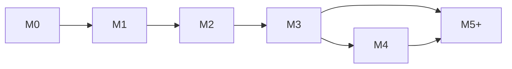

# 里程碑路线图

> 完整定义 Nora 从工程基础到生产可用的里程碑规划。每个里程碑包含交付组件、验收条件和范围边界。
>
> 真源：`docs/ARCHITECTURE.md` §20、`docs/M0_PLAN.md`

---

## M0：工程基础与 CI 门禁

**目标**：完成 Python 工程骨架、基础基础设施和 CI 门禁，为 M1 首个业务切片做好准备。

**截止**：2026-07-27（5 天）

### 交付组件

| 组件 | 说明 |
|------|------|
| Python 包结构 | `src/nora/` + `apps/` + `tests/` 目录骨架，`pyproject.toml`，`uv.lock` |
| 配置加载 | Pydantic Settings，支持 env/`.env` 文件，环境覆盖 |
| 异常体系 | `NoraError` 基类，`DomainError`/`ApplicationError`/`InfrastructureError` 分支，稳定 `error_code` |
| 结构化日志 | JSON 格式，`request_id`/`trace_id` 上下文注入，敏感字段脱敏预留 |
| FastAPI 工厂 | `create_app()` 工厂模式，`/health`、`/ready`、全局异常处理器、CORS、lifespan |
| PostgreSQL 基线 | 异步 SQLAlchemy 引擎、连接池、Alembic 迁移、`Repository[T]` 抽象基类与通用实现 |
| Docker Compose | API + PostgreSQL + Redis（骨架）+ MinIO（骨架）编排，`Dockerfile.api`，`docker-compose.override.yml` 开发覆写 |
| CI 扩展 | ruff（lint + format）、mypy（type check）、pytest（含架构测试），PostgreSQL service container |

### 范围边界

- 不实现任何业务功能（无领域模型、无业务路由）
- 不引入 Redis/Celery 作为运行时依赖（docker-compose 中预留骨架即可）
- 不引入 LLM/Agent/RAG 相关依赖
- 不引入 Gradio 客户端
- 不设置覆盖率门禁（仅执行和报告）

### 验收条件

- [ ] `docker compose up` 后 API 在 `localhost:8000` 可访问
- [ ] `curl localhost:8000/health` 返回 `{"status": "healthy"}`
- [ ] CI 中 ruff、mypy、pytest 全部通过
- [ ] 架构测试验证 domain 层不导入 FastAPI/SQLAlchemy
- [ ] Alembic 空迁移可正常执行和回滚

### 前置依赖

无。M0 是起点。

### Issue 拆分

详见 `docs/M0_PLAN.md`，拆为 7 个 Implementation Issue。

---

## M1：Identity 与岗位快照纵向切片

**目标**：交付第一个可运行的业务切片 — 用户认证 + 手工导入不可变岗位快照。验证整个依赖方向（API → Use Case → Domain → Repository → DB）正确可用。

**截止**：2026-08-01（5 天）

### 交付组件

| 组件 | 上下文 | 说明 |
|------|--------|------|
| 认证主体 | Identity & Preferences | 用户注册/登录、Token 颁发与验证、密码哈希 |
| 用户范围隔离 | Identity & Preferences | 所有 Repository 查询自动注入用户归属，跨用户数据不可见 |
| JobPosting 领域模型 | Opportunity Intelligence | `JobPosting` 聚合，含 JD 正文、来源元数据、内容摘要、状态 |
| 岗位创建 API | Opportunity Intelligence | `POST /job-postings` — 提交 JD 文本 + 可选来源，返回稳定 ID，支持幂等 |
| 岗位读取 API | Opportunity Intelligence | `GET /job-postings/{id}` — 返回用户范围内的岗位快照 |
| 审计记录 | Automation & Governance | `AuditEvent` 记录创建操作：操作者、动作、目标、版本、时间 |
| 测试覆盖 | — | 单元测试（领域规则）、契约测试（Repository）、集成测试（API + DB） |

### 范围边界

- 不实现岗位评分、公司背调、简历匹配
- 不实现 Agent、报告生成、浏览器采集或自动投递
- 不依赖 LLM、RAG、Redis、Celery、Milvus 或外部 API
- 不实现 Gradio 客户端（M3 做）
- 不实现简历管理（M2 做）
- 不实现更新/删除岗位（只创建和读取）

### 验收条件

- [ ] API 认证通过后可创建和读取岗位快照
- [ ] 相同幂等键重复提交返回首次结果（HTTP 200，而非 409）
- [ ] 用户 A 无法查看用户 B 的岗位
- [ ] 审计记录包含操作者、动作、目标 ID 和时间
- [ ] 单元/契约/集成测试全部通过

### 前置依赖

- M0 全部合并

### 风险与假设

- 身份 Provider 选择（自建 JWT / OAuth 集成）需在 M1 Architecture Issue 中固化
- 假设 M0 的 PostgreSQL Repository 基类已可用

---

## M2：简历管理与 RAG 基础

**目标**：建立简历事实管理和 RAG 检索管道，使系统具备"存储可信简历 → 向量化 → 混合检索 → Evidence Pack"的完整能力。

**截止**：2026-08-07（6 天）

### 交付组件

| 组件 | 上下文 | 说明 |
|------|--------|------|
| ResumeVersion 模型 | Career Profile | 简历版本管理，已确认经历和技能 |
| CapabilityEvidence | Career Profile | 技能/经历的来源定位与可信级别 |
| SourceDocument 模型 | Knowledge & Evidence | 来源文档快照，含对象存储引用 |
| Chunk 模型 | Knowledge & Evidence | 版本化文档切片，引用 Source 版本 |
| BGE-M3 Embedding | Knowledge & Evidence | 将 Chunk 向量化，写入 pgvector |
| Hybrid Retrieve | Knowledge & Evidence | 向量相似度 + 关键词混合检索 |
| Reranker | Knowledge & Evidence | 对检索候选进行精排 |
| Evidence Pack | Knowledge & Evidence | 组装检索结果为不可变证据包，包含来源版本和生成器版本 |
| Model Gateway | 跨上下文 | Provider-neutral 网关，管理 Prompt 版本和模型调用 |

### 范围边界

- 不实现 Agent Runtime（M5+）
- 不实现决策报告（M3 做）
- 不实现浏览器采集（延后）
- 不实现 Milvus（保持 pgvector）
- 不涉及自动简历解析（用户手工确认经历）

### 验收条件

- [ ] 用户可创建和管理简历版本
- [ ] Source Document → Chunk → Embedding 管道可执行
- [ ] 混合检索返回带相关性分数的结果
- [ ] Reranker 可提升顶部结果的准确性
- [ ] Evidence Pack 包含完整的来源追踪信息
- [ ] Model Gateway 可调用至少一个 Provider 并返回结构化响应

### 前置依赖

- M1 全部合并
- Model Provider 配置（DeepSeek 或其他）需在 M2 Architecture Issue 中决定

### 决策待办（需独立 Architecture Issue）

- BGE-M3 部署方式（本地模型 / API 调用）
- Reranker 选型与部署
- Model Gateway Provider 选择、Prompt 版本管理策略
- 向量索引参数（距离算法、索引类型）

---

## M3：最小化 Demo

**目标**：整合 M0-M2 已有能力，交付一个可运行的求职决策 Demo。用户可上传岗位和简历，系统生成附带 Evidence 引用的基础决策分析。**这是第一个可向用户演示的版本。**

**截止**：2026-08-15（8 天）

### 交付组件

| 组件 | 上下文 | 说明 |
|------|--------|------|
| DecisionCase 模型 | Decision & Reporting | 组合用户画像与岗位快照的分析案例 |
| 确定性规则引擎 | Decision & Reporting | 基于岗位/简历字段的匹配规则（无需 LLM 的部分） |
| Decision Report | Decision & Reporting | 版本化决策报告，含 Evidence 引用链 |
| Gradio Demo 客户端 | Apps/Demo | 简单的 Web 界面：登录 → 输入岗位 → 导入简历 → 查看分析 |
| LLM 增强分析 | 跨上下文 | 基于 Evidence Pack 的 LLM 生成分析（经 Schema 校验） |
| M0-M2 集成测试 | — | 跨越所有 Context 的 E2E 测试 |

### 范围边界

- 不依赖 Redis/Celery（M4 引入）
- 不包含 Agent 编排（M5+）
- 不包含浏览器采集或自动投递
- 不包含审批流程（M5+）
- 不包含生产级部署配置（M4 做）

### 验收条件

- [ ] 用户通过 Gradio 界面完成完整流程：注册 → 录入岗位 → 导入简历 → 查看分析报告
- [ ] 报告明确区分"事实"、"推断"和"建议"
- [ ] 报告中的每个结论可追溯到 Evidence
- [ ] 无模型输出时（Model Gateway 不可用），确定性规则仍可生成基础分析
- [ ] Demo 可在本地 `docker compose up` 后直接使用

### 前置依赖

- M2 全部合并
- M0 Docker Compose 编排已包含演示入口

### 风险与假设

- Gradio 客户端的引入方式需 Architecture Issue 确认（独立进程 vs 嵌入 API）
- Demo 的"分析"质量取决于 M2 的 RAG 管道质量

---

## M4：可选中间件与生产准备

**目标**：引入 Redis/Celery 等可选中间件优化异步处理能力，补充生产级非功能需求。**不改变 M3 Demo 已验证的领域边界。**

**截止**：2026-08-23（8 天）

### 交付组件

| 组件 | 说明 |
|------|------|
| Redis 缓存 | 热点数据缓存、Session 存储、API 限流 |
| Celery 任务队列 | 异步任务编排：Embedding 批量处理、报告生成、定时任务 |
| Worker Process | Celery Worker 容器、任务定义、重试策略 |
| 幂等任务执行 | 任务级幂等键，防止重复执行 |
| 性能基准测试 | 接口延迟、吞吐量、检索延迟 Benchmark |
| 安全扫描 | SBOM 生成、依赖审查（`uv audit`）、secret scan |
| 日志聚合 | 结构化日志输出到 stdout（对接 Docker 日志驱动） |
| 部署文档 | 生产部署指南、环境变量清单、架构图 |

### 范围边界

- 不修改 M0-M3 已交付的领域模型和 API 契约
- 不引入 Milvus（延后评估）
- 不引入 Kubernetes（延后）
- 不实现服务拆分
- 不实现浏览器或飞书集成

### 验收条件

- [ ] Celery Worker 可消费 Embedding 任务并写回 pgvector
- [ ] 相同幂等任务重放不产生重复数据
- [ ] 缓存命中时 API 响应时间降低 ≥50%（相对未缓存）
- [ ] SBOM 可生成，依赖审查无高危漏洞
- [ ] 部署文档可指导新环境搭建

### 前置依赖

- M3 全部合并

### 决策待办（需独立 Architecture Issue）

- Celery Broker、重试、取消和可靠事件发布策略
- 缓存失效策略与 TTL 规则
- 对象存储生产配置（MinIO → S3 兼容服务）

---

## M5+：专项 Agent 与服务拆分评估

**目标**：引入 LangGraph Agent Runtime，逐个交付求职决策各环节的专项 Agent。在生产负载达到触发条件时评估服务拆分和 Milvus 迁移。

**截止**：待定（按需启动）

### 交付组件

| 组件 | 说明 |
|------|------|
| Agent Runtime | LangGraph Adapter：运行图、状态管理、暂停/恢复、Checkpoint |
| Tool Registry | 受控 Tool 注册表，READ/COMPUTE/WRITE 分类，Pydantic Schema 校验 |
| Approval 流程 | ProposedAction → Approved/Rejected → Executed 状态机，幂等执行 |
| 投递决策 Agent | 分析岗位匹配度，给出投递建议 |
| 面试准备 Agent | 基于 JD 和简历生成面试题目和准备材料 |
| 出行规划 Agent | 根据面试时间和地点规划出行方案 |
| 复盘 Agent | 面试后自动生成复盘报告 |
| 报告汇总 Agent | 合并多个决策报告为综合看板 |
| Milvus 评估 | 达到触发条件后 Benchmark 驱动迁移决策 |
| 服务拆分评估 | 达到触发条件后评估 API/Worker/Agent 拆分 |

### 范围边界

- 不实现自动投递、自动发送招聘消息或无人值守浏览器写操作
- 不保存模型私有 chain-of-thought
- 不引入多租户、计费或生产级高可用（除非有独立 Architecture Issue）
- 不将飞书 Base、向量数据库或 Agent State 作为业务事实源

### 验收条件

- [ ] Agent Runtime 可加载运行图、暂停、恢复
- [ ] Tool 调用经过 Schema 校验和 Approval 审批
- [ ] 每个 Agent 可通过独立 Demo 验证其输出
- [ ] Agent 输出明确区分"模型推断"和"规则结果"
- [ ] 外部写操作完整记录审计日志

### 前置依赖

- M4 全部合并
- Model Gateway 已稳定运行

### 决策待办（需独立 Architecture Issue）

- LangGraph Checkpoint 持久化策略
- Agent 间通信和数据共享边界
- Browser/Connector Runtime 安全模型
- Milvus 引入阈值与迁移方案
- 服务拆分触发条件的具体指标

---

## 汇总

### 依赖关系



### 时间线

```text
2026-07-23                             2026-08-23
├──────┬──────┬──────┬──────┬──────┬─────┤
│  M0  │  M1  │  M2  │  M3  │  M4  │缓冲 │
│ 5 天 │ 5 天 │ 6 天 │ 8 天 │ 8 天 │ 2天 │
│工程   │岗位   │RAG   │Demo  │中间件 │     │
│基础   │切片   │简历   │展示   │生产   │     │
└──────┴──────┴──────┴──────┴──────┴─────┘
```

### 不变原则（贯穿所有里程碑）

1. **一 Issue、一分支、一 PR、一验收**
2. **人工验收门禁**：推送前必须用户授权
3. **Docker 优先开发**：无宿主机环境依赖
4. **依赖方向**：Domain → Application → Adapters
5. **模型输出不可信**：必须经过校验
6. **外部写默认关闭**：需审批
