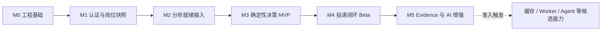

# 里程碑路线图

> 本文定义 Nora 的里程碑结果、范围和退出边界。原子交付顺序见
> [`MILESTONE_PLAN.md`](MILESTONE_PLAN.md)，实际执行状态以 GitHub Milestone 与 Issue 为准。
>
> 已交付能力及证据只维护在 [`current-capabilities.toml`](current-capabilities.toml)，本文不建立并行的
> Current 台账。

## 总体方向

Nora 的主动路线图最多到 M5，并按用户结果而不是技术组件划分：

| 里程碑 | 用户结果 | 当前状态 |
| :--- | :--- | :--- |
| M0 | 工程、数据库、容器和质量门禁可运行 | 已关闭 |
| M1 | 用户可认证并保存隔离、不可变的岗位快照 | 已关闭 |
| M2 | 用户可建立版本化、可确认、足以分析的岗位/主档/简历输入 | 已关闭 |
| M3 | 用户可获得确定性报告并记录投或不投 | 已关闭 |
| M4 | 用户可生成投递材料、手工记录投递和面试通知，并部署单用户 Beta | 规划中 |
| M5 | 报告可使用 Evidence、检索和可选模型增强，规模化组件按指标引入 | 规划中 |

M6+ 不再作为主动 Milestone。外部平台写入、深度面试复盘、实时出行、长期记忆和 Agent Runtime
进入触发式候选池；满足真实业务、数据、许可和架构准入条件后再重新立项。


```mermaid
flowchart LR
    M0["M0 工程基础"] --> M1["M1 认证与岗位快照"]
    M1 --> M2["M2 分析就绪输入"]
    M2 --> M3["M3 确定性决策 MVP"]
    M3 --> M4["M4 投递闭环 Beta"]
    M4 --> M5["M5 Evidence 与 AI 增强"]
    M5 -.准入触发.-> E["缓存 / Worker / Agent 等候选能力"]
```

## M0：工程基础与 CI 门禁

### 结果

建立模块化单体工程、FastAPI 应用、PostgreSQL/Alembic、Docker Compose、配置、日志和质量门禁，为业务切片提供可重复运行基础。

### 边界

- 不实现业务功能；
- MinIO 只作为 Artifact 字节存储进入 Compose；Redis 未达 M5 指标前不引入运行时；
- 不引入 LLM、RAG、Agent 或 Web 客户端。

### 状态

M0 已关闭。当前能力和合并证据见 [`current-capabilities.toml`](current-capabilities.toml)。

## M1：Identity 与岗位快照纵向切片

### 结果

用户可以注册、登录，并通过公开 API 创建和读取自己范围内的不可变岗位快照；创建行为具备幂等、审计和事务一致性。

### 边界

- 不做岗位分析、公司情报、简历、报告或投递；
- 不依赖 LLM、RAG、Redis 或 Worker；
- 不实现自动抓取或外部写。

### 状态

M1 已关闭。当前能力和合并证据见 [`current-capabilities.toml`](current-capabilities.toml)。

## M2：分析就绪的输入基线

### 目标

用户可以通过浏览器建立足以直接执行确定性分析的版本化输入：

- 原始 `JobPosting`；
- 用户确认的结构化 `JobRequirementSnapshot`；
- `CandidateProfile`；
- `ResumeVersion`。

M2 在既有岗位、主档、简历、Vue 工作台和 JD 输入契约上完成了分析就绪基线扩展；当前能力与合并证据只在 [`current-capabilities.toml`](current-capabilities.toml) 维护。

### 交付组件

| 组件 | 说明 |
| :--- | :--- |
| JobRequirementSnapshot 决策 | 独立于 JobPosting 原文，定义所有权、版本、来源定位和确认状态 |
| 结构化岗位要求 | 技能、最低经验、学历、地点和工作方式；缺失保持 unknown |
| 岗位要求确认 UI | 用户可以人工补充、修正和确认候选字段 |
| 截图 OCR 输入 | 上传、资源限制、OCR、预览修正、确认后保存 |
| 链接受控抓取 | SSRF 防护、正文预览、确认后保存 |
| 分析就绪状态 | 页面明确岗位、主档和简历是否具备可分析输入 |
| 浏览器 E2E | 覆盖结构化确认、截图/链接预览和用户隔离 |

### 数据边界

- `JobPosting` 保存用户实际看到的原文和基本来源元数据；
- `JobRequirementSnapshot` 保存用户确认的结构化解释；
- 修改岗位要求必须创建新版本，不覆盖历史；
- OCR、规则或模型抽取只能产生候选，未经确认不得成为确定性规则事实；
- `DecisionCase` 必须引用具体岗位要求版本；
- Embedding、缓存和临时解析结果不是业务事实源。

### 安全边界

- OCR 前限制字节数、格式、像素和解码资源；传入内容复制为不可变字节；
- URL 必须验证协议、主机、IDNA、DNS/IP、重定向、组播、大小、类型和超时；
- 每次重定向重新验证目标，连接目标与已验证解析结果保持一致或重新校验；
- 不执行网页脚本，不携带浏览器 Cookie，不登录招聘平台；
- OCR 和网页正文均视为不可信输入；
- 失败返回稳定错误码，不猜测内容。

### 非目标

- 不创建 DecisionCase；
- 不执行匹配规则或生成报告；
- 不调用 LLM，不启用 pgvector；
- 不生成 ResumeVariant、PDF 或 MessageDraft；
- 不执行外部投递。

### 退出条件

- [x] JobRequirementSnapshot 所有权和版本边界完成 Architecture Review；
- [x] 用户能通过真实 API 和 Web 创建、读取并确认结构化岗位要求；
- [x] 修改确认结果产生新版本，历史输入不被覆盖；
- [x] 截图和链接 API 只返回预览，不直接保存岗位事实；
- [x] SSRF、DNS Rebinding、重定向、组播、大小、超时和图片资源限制测试通过；
- [x] 分析就绪输入具有真实浏览器 E2E；
- [x] 无模型密钥时全部 M2 流程可运行；
- [x] 当前能力台账仍只记录已经合并的能力。

### 关闭记录

M2 已于 2026-08-10 完成退出核验并关闭。具体实现代码路径和 PR 证据不在路线图重复维护，以 [`current-capabilities.toml`](current-capabilities.toml) 为唯一台账。

## M3：确定性求职决策 MVP

### 目标

用户选择分析就绪的岗位、主档和简历后，系统创建不可变 DecisionCase，执行确定性规则，生成版本化 Decision Report，并记录 apply 或 skip。

M3 必须在无 LLM、无 Embedding、无 pgvector、无 Redis、无 Worker 和无 Agent Runtime 的环境中完整运行。

### 核心流程

```text
JobPosting + JobRequirementSnapshot
  + CandidateProfile + ResumeVersion
  -> DecisionCase
  -> deterministic rules
  -> DecisionReport
  -> ApplicationDecision(apply | skip)
```

### 交付组件

| 组件 | Issue | 说明 |
| :--- | :--- | :--- |
| DecisionCase 契约 | #24 | 固定输入引用、版本、归属和幂等，不拥有公开路由 |
| 确定性规则 | #73 | 技能、经验、地点/工作方式、学历 |
| 版本化基础报告 | #74 | Fact、Rule Result、Unknown、Recommendation、Citation |
| 分析与报告 API | #75 | 唯一拥有公开 HTTP 契约和错误映射 |
| 分析与报告页面 | #76 | 创建、加载、失败、报告历史和刷新恢复 |
| 真实 Compose E2E | #77 | 主流程、刷新恢复和双用户隔离 |
| 最小投不投决定 | #80 | analyzed -> apply/skip，引用报告版本 |

### 执行边界

- 默认同步执行确定性规则，不伪造队列、进度百分比或 Worker 状态；
- 规则是纯逻辑，不执行网络调用、模型调用或数据库写入；
- 缺失输入返回 unknown，不返回 500，不从自由文本猜测；
- 报告生成按 DecisionCase、规则集和生成器版本幂等；
- apply 只记录意图，不生成材料或执行外部写。

### 非目标

- 不实现 RAG、LLM、pgvector 或 Reranker；
- 不生成定制简历、PDF 或消息草稿；
- 不实现公司全网采集；
- 不引入 Redis、任务队列或 Agent Runtime；
- 不自动投递或发送消息。

### 退出条件

- [x] DecisionCase 固定引用全部输入版本且验证同一用户；
- [x] 四类规则覆盖正常、边界和 unknown；
- [x] 每条规则可定位输入字段和版本；
- [x] 报告结构、版本和幂等行为通过验证；
- [x] 用户可记录 apply 或 skip；
- [x] 页面刷新和重新登录后可恢复案例、报告和决定；
- [x] API 覆盖 401、404、409、422 和 503；
- [x] 浏览器 E2E 覆盖主流程和双用户隔离；
- [x] 无模型、无向量扩展的 Compose 新环境可以直接验收。

### 关闭记录

M3 已于 2026-08-12 完成退出核验并关闭。具体实现代码路径和 PR 证据不在路线图重复维护，以
[`current-capabilities.toml`](current-capabilities.toml) 为唯一台账。

## M4：可部署的投递闭环 Beta

### 目标

把“决定要投”扩展为可用的个人求职流程：生成岗位定制简历、PDF 和消息草稿，由用户手工投递并记录结果和最小面试通知，同时达到单用户 Beta 的部署、安全、备份和可观测基线。

### 核心流程

```text
DecisionReport
  -> ApplicationDecision(apply)
  -> ResumeVariant + TemplateDefinition
  -> PDF Artifact + MessageDraft
  -> 用户手工投递
  -> ApplicationRecord
  -> InterviewCase
```

### 交付组件

| 组件 | Issue | 说明 |
| :--- | :--- | :--- |
| Artifact/Source 生命周期决策 | M4.1 #163 | 所有权、跨存储一致性、访问、删除、恢复与 M5 继承；已完成 |
| M3 封版与规划映射 | M4.2 #167 | 同步 Current/Planned 状态和 M4/M5 原子顺序 |
| Artifact 与 Source 基础 | M4.3 #21 | 元数据入 PostgreSQL，二进制入对象存储 |
| 公司情报版本边界决策 | M4.4 #164 | D-014：独立 CompanySnapshot/CompanyAssessment 版本；保持 M3 DecisionCase/DecisionReport 身份兼容 |
| ResumeVariant 与模板 | M4.5 #91 | 声明式、不可变、不执行任意模板代码 |
| 可观测性指标增强 | M4.6 #87 | 在既有日志和追踪上增加指标，不重复实现 |
| Beta 部署架构 | M4.7 #171 | 固定目标环境、网络、TLS、Secret 和发布边界 |
| 公司情报最小化 | M4.8 #79 | 规模、行业、来源、摘要和时效；缺失 unknown |
| 公司情报页面 | M4.9 #169 | 录入、版本、来源、时效和报告展示 |
| 确定性 PDF | M4.10 #92 | 固定渲染环境、版本和哈希，写入 Artifact Storage |
| 确定性 MessageDraft | M4.11 #93 | 可编辑纯文本，不依赖 LLM，不自动发送 |
| ApplicationRecord | M4.12 #94 | 用户确认的手工投递状态、幂等和审计 |
| 最小 InterviewCase | M4.13 #140 | 时间、地点、轮次、备注和用户隔离 |
| Beta 认证安全决策 | M4.14 #174 | 注册、会话、CORS、滥用防护和密钥轮换边界 |
| 公网认证加固 | M4.15 #175 | 落地受控开户、限流、CORS 和会话安全契约 |
| Beta 运行基线 | M4.16 #138 | 部署、供应链、秘密扫描、SBOM、备份恢复 |
| Jenkins CD | M4.17 #153 | 从固定版本自动部署、冒烟并安全停止或回滚 |
| Beta 浏览器 E2E | M4.18 #165 | apply 到手工投递记录、认证、恢复、隔离与外部写关闭 |

### 边界

- 模板不得执行任意 Python、JavaScript、Jinja 或用户提供的活动 HTML；
- PDF 的字节级确定性只在锁定字体、渲染器、元数据和运行环境内承诺；
- MessageDraft 基础版本不依赖公司 Evidence Pack 或 LLM；
- ApplicationRecord 记录用户确认事实，不代表 Nora 自动完成外部操作；
- 外部写保持关闭；
- 不实现深度面试准备、复盘、实时出行或长期记忆。

### 退出条件

- [ ] M4.1、M4.4、M4.7 和 M4.14 Architecture 门禁完成；
- [ ] M4.3-M4.18 的强制实现、运行、文档和 E2E 项全部交付；
- [ ] apply 可以生成可编辑 ResumeVariant；
- [ ] 模板不可变且不能执行任意代码；
- [ ] PDF 在锁定环境中可重复生成并保存哈希；
- [ ] MessageDraft 无模型时可生成和编辑；
- [ ] 用户可手工记录投递状态和最小面试通知；
- [ ] 公司情报缺失、冲突或过期时明确标记；
- [ ] 所有新增对象和 Artifact 按用户隔离；
- [ ] 部署、安全扫描、备份恢复和可观测门禁通过；
- [ ] 浏览器 E2E 覆盖 apply 到投递记录；
- [ ] 外部写保持关闭。

## M5：Evidence、AI 与规模化增强

### 目标

在 M3/M4 可独立运行的基础上增加 Source、Chunk、Embedding、混合检索、Evidence Pack 和可选模型增强，并根据真实指标决定是否引入 Reranker、Redis 或 Worker。

### 推荐顺序

1. M5.1 #166 审查 Provider、凭据、许可、数据和成本边界；
2. M5.2 #172 冻结检索评测集与质量门槛；
3. M5.3 #141 确认 Embedding 契约、模型、版本、维度和归一化；
4. M5.4 #168 确定 pgvector Schema、距离和索引策略；
5. M5.5 #81 实现确定性 Chunk，M5.6 #85 实现 Model Gateway；
6. M5.7 #22 启用 pgvector Schema 与索引，M5.8 #82 实现 Embedding Adapter；
7. M5.9 #83 实现关键词/向量混合检索；
8. M5.10 #23 生成不可变 Evidence Pack，M5.11 #25 生成独立 LLM 增强版本；
9. M5.12 #84 基于冻结评测决定是否引入 Reranker；
10. M5.13 #139 建立性能和容量基线；
11. M5.14 #27、M5.15 #28 根据基准决定 Redis 或 Worker 是否立项；
12. M5.16 #170 汇总真实 Evidence 与增强报告浏览器 E2E 退出证据。

### 关键约束

- Embedding 模型、版本和维度决策先于 pgvector 列和索引设计；
- Source、Chunk、Embedding 和索引均版本化，向量可重建；
- 检索先定义评测集和指标，不以“Provider 已接通”作为完成；
- Evidence Pack 在无 Reranker、无 LLM 时仍成立；
- LLM 只读取版本化事实、规则结果和 Evidence Pack；
- 模型输出经过 Schema 校验并区分 fact、rule、llm_inferred、suggestion、unknown 和 citation；
- Provider 不可用或 Schema 无效时返回确定性报告；
- 增强版本不覆盖历史确定性报告；
- Redis、Worker 和 Reranker 的结论允许为不引入。

### 非目标

- 不自动更新 CandidateProfile；
- 不执行外部投递或消息发送；
- 不把向量、缓存或 Agent State 作为事实源；
- 不并行维护 pgvector 与 Milvus；
- 不因未来可能需要而拆微服务或引入 Kubernetes；
- 不为了产品叙事强行引入 LangGraph。

### 退出条件

- [ ] Source -> Chunk -> Embed -> Retrieve -> Evidence Pack 可执行；
- [ ] 检索有固定评测集、质量基线、延迟和成本记录；
- [ ] 每个增强结论具有稳定引用；
- [ ] Provider 不可用时 M3/M4 仍可完整运行；
- [ ] 用户、来源和版本过滤通过安全测试；
- [ ] Embedding 和索引可重建；
- [ ] Reranker 若引入，具有量化收益；
- [ ] Redis/Worker 若引入，具有触发证据、幂等和故障降级；
- [ ] 未引入的条件能力具有正式结论；
- [ ] 部署、备份、安全和数据保留门禁继续通过。

## 触发式候选池

以下能力不是 M2-M5 的默认退出条件：

| 能力 | 重新立项的最低条件 |
| :--- | :--- |
| 外部平台写入 | 明确具体平台和动作、许可、账号安全、Approval、幂等、审计和人工接管 |
| 深度面试准备/复盘 | 已有 InterviewCase 与真实用户数据，候选内容必须经用户确认 |
| 实时出行 | 地图/天气 Provider、许可、时效、成本和失败降级已审查 |
| MemoryCandidate | 已有足够 outcome 数据，确认、拒绝、删除和过期规则明确 |
| Agent Runtime | 稳定 Application Use Case、多个真实 Tool、分支/暂停/恢复需求和量化收益 |
| Milvus/服务拆分/Kubernetes | pgvector 或模块化单体存在可复验容量与隔离瓶颈 |

外部写始终遵循 ProposedAction -> Approval -> Execution，并具备幂等、审计和不确定结果人工处理。

## 不变原则

1. 一个分支、一个 PR；Issue 可选，关联时一个 PR 最多关闭一个 Issue；
2. 依赖方向保持 Apps/Adapters -> Application -> Domain；
3. 当前能力与证据只维护在 `current-capabilities.toml`；
4. 模型输出不是事实，外部内容视为不可信；
5. 外部写默认关闭；
6. 可选能力不能成为较早里程碑的硬依赖；
7. Milestone 关闭前必须完成真实调用路径和新环境动态验收；
8. 路线图内容不能替代代码、测试、PR、审核和合并证据。
