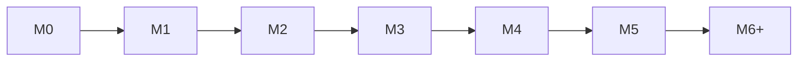

# 里程碑路线图

> 完整定义 Nora 从工程基础到生产可用的里程碑规划。每个里程碑包含交付组件、验收条件和范围边界。
>
> 产品愿景：[`PRODUCT_VISION.md`](PRODUCT_VISION.md)。架构边界：[`ARCHITECTURE.md`](ARCHITECTURE.md)。
> 目标用户：软件工程专业应届生（以校招为主），产品范围与能力重心以 [`PRODUCT_VISION.md`](PRODUCT_VISION.md) 为准。
> 本文定义里程碑范围；实际执行状态以 GitHub Milestone 与 Issue 为准。
>
> M2 及之后的范围已按 [`MILESTONE_PLAN_DRAFT.md`](MILESTONE_PLAN_DRAFT.md) 重排：**确定性 Demo 先于 AI 增强**，
> RAG/LLM 移至 M4，中间件移至 M5。原子交付细节以该执行计划为准，本文只保留里程碑范围与验收。

---

## M0：工程基础与 CI 门禁

**目标**：完成 Python 工程骨架、基础基础设施和 CI 门禁，为 M1 首个业务切片做好准备。

**截止**：2026-07-27（5 天）

### 交付组件

| 组件 | 说明 |
|------|------|
| Python 包结构 | `backend/app/`（含 `backend/app/apps/`）+ `backend/tests/`，`backend/pyproject.toml`，`backend/uv.lock` |
| 配置加载 | Pydantic Settings，支持 env/`.env` 文件，环境覆盖 |
| 异常体系 | `NoraError` 基类，`DomainError`/`ApplicationError`/`InfrastructureError` 分支，稳定 `error_code` |
| 结构化日志 | JSON 格式，`request_id`/`trace_id` 上下文注入，敏感字段脱敏预留 |
| FastAPI 工厂 | `create_app()` 工厂模式，`/health`、`/ready`、全局异常处理器、CORS、lifespan |
| PostgreSQL 基线 | 异步 SQLAlchemy 引擎、连接池、Alembic 迁移、`Repository[T]` 抽象基类与通用实现 |
| Docker Compose | API + PostgreSQL + Redis（骨架）+ MinIO（骨架）编排，`Dockerfile.api`，`docker-compose.override.yml` 开发覆写 |
| CI 扩展 | ruff（lint + format）、mypy（type check）、pytest（含架构测试），PostgreSQL service container |

### 范围边界

- 不实现任何业务功能（无领域模型、无业务路由）
- 不引入 Redis/Celery 作为运行时依赖（docker-compose 中预留骨架即可）
- 不引入 LLM/Agent/RAG 相关依赖
- 不引入 Web 客户端
- 不设置覆盖率门禁（仅执行和报告）

### 验收条件

- [x] `docker compose up` 后 API 在 `localhost:8000` 可访问
- [x] `curl localhost:8000/health` 返回 `{"status": "healthy"}`
- [x] CI 中 ruff、mypy、pytest 全部通过
- [x] 架构测试验证 domain 层不导入 FastAPI/SQLAlchemy
- [x] Alembic 空迁移可正常执行和回滚

完成证据：M0 [Milestone](https://github.com/dev-cai/Nora/milestone/1) 已关闭；容器与健康检查见
[#14](https://github.com/dev-cai/Nora/issues/14)，CI 与架构门禁见 [#15](https://github.com/dev-cai/Nora/issues/15) 和
[#65](https://github.com/dev-cai/Nora/issues/65)，迁移与 Repository 基线见 [#13](https://github.com/dev-cai/Nora/issues/13)。

### 前置依赖

无。M0 是起点。

### Issue 拆分

历史 M0 交付路径以 GitHub Issue #9–#15 与 M0 [Milestone](https://github.com/dev-cai/Nora/milestone/1) 为准。

---

## M1：Identity 与岗位快照纵向切片

**目标**：交付第一个可运行的业务切片 — 用户认证 + 手工导入不可变岗位快照。验证整个依赖方向（API → Use Case → Domain → Repository → DB）正确可用。

**截止**：2026-08-01（5 天）

### 交付组件

| 组件 | 上下文 | 说明 |
|------|--------|------|
| 认证主体 | Identity & Preferences | 用户注册/登录、Token 颁发与验证、密码哈希 |
| 用户范围隔离 | Identity & Preferences | 所有 Repository 查询自动注入用户归属，跨用户数据不可见 |
| JobPosting 领域模型 | Opportunity Intelligence | `JobPosting` 聚合，含 JD 正文、来源元数据、内容摘要、状态 |
| 岗位创建 API | Opportunity Intelligence | `POST /job-postings` — 提交 JD 文本 + 可选来源，返回稳定 ID，支持幂等 |
| 岗位读取 API | Opportunity Intelligence | `GET /job-postings/{id}` — 返回用户范围内的岗位快照 |
| 审计记录 | Automation & Governance | `AuditEvent` 记录创建操作：操作者、动作、目标、版本、时间 |
| 测试覆盖 | — | 单元测试（领域规则）、契约测试（Repository）、集成测试（API + DB） |

### 范围边界

- 不实现岗位评分、公司背调、简历匹配
- 不实现 Agent、报告生成、浏览器采集或自动投递
- 不依赖 LLM、RAG、Redis、Celery、Milvus 或外部 API
- 不实现 Web 客户端（M2 做）
- 不实现简历管理（M2 做）
- 不实现更新/删除岗位（只创建和读取）

### 验收条件

- [x] API 认证通过后可创建和读取岗位快照
- [x] 相同幂等键重复提交返回首次结果（HTTP 200，而非 409）
- [x] 用户 A 无法查看用户 B 的岗位
- [x] 审计记录包含操作者、动作、目标 ID 和时间
- [x] 单元/契约/集成测试全部通过

完成证据：M1 [Milestone](https://github.com/dev-cai/Nora/milestone/3) 已关闭；认证与隔离见
[#16](https://github.com/dev-cai/Nora/issues/16)，岗位快照与幂等见 [#17](https://github.com/dev-cai/Nora/issues/17) 和
[#18](https://github.com/dev-cai/Nora/issues/18)，审计与事务一致性见 [#19](https://github.com/dev-cai/Nora/issues/19)，
最终回归门禁见 [#65](https://github.com/dev-cai/Nora/issues/65)。

### 前置依赖

- M0 全部合并

### 风险与假设

- Identity Task #16 使用自建短时效 JWT；改为 Session、OAuth 或第三方身份 Provider 前需独立 Architecture Issue
- 假设 M0 的 PostgreSQL Repository 基类已可用

---

## M2：Demo-ready 数据与前端基础

**目标**：建立 M3 所需的真实输入契约与可运行 Web 基础。用户可在浏览器完成注册、登录、岗位录入（文本/截图/链接契约）、岗位列表与详情、主档（CandidateProfile）与简历版本（ResumeVersion）录入读取。

**截止**：2026-08-22（按详细计划 §20 估算）

### 交付组件

| 组件 | 上下文 | 说明 |
|------|--------|------|
| 岗位公开契约补齐 | Opportunity Intelligence | 创建请求支持标题/公司/地点，响应返回完整 JD、来源、状态与版本；用户范围分页列表 |
| CandidateProfile | Career Profile | 用户确认事实主档：基本信息、教育、经历、技能、偏好与字段级确认状态 |
| ResumeVersion | Career Profile | 从已确认主档发布的不可变简历事实版本 |
| Vue 3 + Vite 工程 | Frontend | 路由/布局/错误边界、API client、注册登录与岗位页面 |
| 前端 CI | Frontend | lint / type / test / build 门禁 |
| 画像与简历页面 | Frontend | 主档表单、简历发布与列表 |
| JD 输入 Port | Opportunity Intelligence | 文本 / 截图（OCR）/ 链接（受控抓取）契约与安全边界（仅定义，实现放 M3） |

### 范围边界

- 不实现 RAG、Embedding、Reranker、Model Gateway 或 LLM（移至 M4）
- 不实现 DecisionCase 与决策报告（M3 做）
- 不实现 JD 截图 OCR 或链接抓取执行（M2 仅定义 Port 与契约）
- 不引入 pgvector
- 不实现自动投递

### 验收条件

- [x] Web 可注册、登录并读取当前用户
- [x] Web 可创建、列表和读取用户自己的岗位
- [x] Web 可维护 CandidateProfile 并发布 ResumeVersion
- [x] 用户 A 无法访问用户 B 的岗位、画像和简历
- [x] `docker compose up --build` 可访问 Web 与 API
- [x] M2 主流程包含 `node scripts/web-api-smoke.mjs` 前后端集成冒烟
- [x] JD 输入 Port（文本/截图/链接）契约已定义并通过契约测试
- [x] 未引入 RAG、模型或外部 Provider 硬依赖

### 完成证据

M2 交付清单与前端收尾见 Issue [#107](https://github.com/dev-cai/Nora/issues/107)；岗位公开契约、主档与简历版本见
PR [#100](https://github.com/dev-cai/Nora/pull/100)–[#102](https://github.com/dev-cai/Nora/pull/102)；Vue 工程、
前端 CI 与画像/简历页面见 [#103](https://github.com/dev-cai/Nora/pull/103)–[#105](https://github.com/dev-cai/Nora/pull/105)；
JD 输入契约见 [#106](https://github.com/dev-cai/Nora/pull/106)；前端收尾与集成冒烟见
[#108](https://github.com/dev-cai/Nora/pull/108)。浏览器级基础 E2E 由 Issue
[#112](https://github.com/dev-cai/Nora/issues/112) 补齐。

### 前置依赖

- M1 全部合并
- Vue 3 + Vite 架构决策已合并（Issue #49 边界）

### 原子交付

原子交付顺序与验收以 [`MILESTONE_PLAN_DRAFT.md`](MILESTONE_PLAN_DRAFT.md) §10（M2.1–M2.8）为准。

---

## M3：最小确定性决策 Demo

**目标**：交付第一个由用户从浏览器完整操作的确定性决策 Demo，**无外部模型密钥也能完整运行**。报告以确定性规则为核心，RAG、LLM、Agent 均不属于本里程碑。

**截止**：2026-09-12（按详细计划 §20 估算）

### 交付组件

| 组件 | 上下文 | 说明 |
|------|--------|------|
| DecisionCase 输入契约 | Decision & Reporting | 不可变分析输入快照（岗位/主档/简历版本 + 规则集版本） |
| 确定性规则引擎 | Decision & Reporting | 技能/技术栈、经验年限、地点、学历四类规则 + 公司情报 |
| 版本化基础报告 | Decision & Reporting | 不依赖 LLM 的 DecisionReport，含事实/规则/未知/建议分区 |
| JD 截图 OCR 与链接抓取 | Opportunity Intelligence | 真实 JD 输入获取，带来源定位与失败降级 |
| 公司情报最小化 | Opportunity Intelligence | 网评/规模/来源 + 时效标签，不做聚合分数 |
| 最小投不投决定 | Application & Follow-up | `analyzed → skip/apply` 最小状态机，skip 沉淀历史相似记录 |
| 分析与报告 API/页面 | Backend + Frontend | `POST /decisions`、`GET /reports/{id}`、报告页 + DecisionBar |
| Compose E2E | — | 真实 Web → API → PostgreSQL 主流程验证 |

### 范围边界

- 不调用 LLM，不要求 Provider API Key
- 不实现 RAG / pgvector（M4）
- 不生成定制简历、PDF 或消息草稿（M6+）
- 不引入 Redis/Celery（M5）
- 不实现 Agent Runtime（M6+）
- JD 截图 OCR 与链接抓取属于输入获取，不属于 JD 自动抽取

### 验收条件

- [ ] 用户通过 Vue Web 完成完整主流程：录入 → 分析 → 查看报告 → 投/不投
- [ ] 报告完全由真实 API 和 PostgreSQL 数据生成，无模型可运行
- [ ] 每条规则可追溯到输入字段；缺输入返回 unknown
- [ ] 支持 JD 文本 / 截图 / 链接三种输入方式
- [ ] 报告包含公司情报摘要或明确 unknown
- [ ] 跨用户访问被阻止；相同输入重试不产生重复报告
- [ ] `docker compose up --build` 后新环境可直接验收

### 前置依赖

- M2 全部合并
- 规则输入 Schema 通过独立 Issue 确认

### 原子交付

原子交付顺序与验收以 [`MILESTONE_PLAN_DRAFT.md`](MILESTONE_PLAN_DRAFT.md) §11（M3.1–M3.9）为准。

---

## M4：Evidence、RAG 与 AI 增强

**目标**：在 M3 确定性闭环之上增加可定位来源、检索与可选模型增强。不改变 M3 的核心事实、规则与报告可用性。

**截止**：2026-10-24（按详细计划 §20 估算）

### 交付组件

| 组件 | 上下文 | 说明 |
|------|--------|------|
| SourceDocument / Artifact | Knowledge & Evidence | 来源元数据存 PostgreSQL，原始内容存对象存储 |
| Chunk | Knowledge & Evidence | 版本化分片，引用 Source 版本，稳定 locator |
| pgvector | Knowledge & Evidence | 启用扩展、向量维度与索引策略（独立 Architecture Issue） |
| Embedding 适配器 | Knowledge & Evidence | Provider-neutral Port，BGE-M3 候选，批量/重试/版本 |
| 混合检索 | Knowledge & Evidence | 关键词 + 向量相似度，用户与版本过滤 |
| Evidence Pack | Knowledge & Evidence | 不可变检索结果包，供报告引用 |
| Reranker（条件交付） | Knowledge & Evidence | 仅当基准证明收益时引入 |
| Model Gateway | 跨上下文 | Provider-neutral Chat/Completion Port，Schema 校验，Prompt 版本 |
| LLM 报告增强 | Decision & Reporting | 基于报告事实 + Evidence Pack，输出分 fact/rule/inferred/suggestion |
| JobPlatform Port 预留 | Automation & Governance | 批量导入/投递/打招呼三类 Port，半自动 Disabled/Manual |

### 范围边界

- 不引入 Agent Runtime（M6+）
- 不实现平台登录与自动投递（仅定义 Port）
- 不让模型直接更新 CandidateProfile
- 不将向量库作为业务事实源
- 不要求 Reranker 成为固定组件

### 验收条件

- [ ] Source → Chunk → Embedding → Retrieve → Evidence Pack 可执行
- [ ] 每条增强结论引用稳定 Evidence locator
- [ ] Provider 不可用时确定性报告保持可用
- [ ] 模型输出经过 Schema 校验
- [ ] 数据与向量均按用户隔离；Embedding 和索引可重建

### 前置依赖

- M3 全部合并
- pgvector、Source/Artifact 数据所有权、Provider 策略通过独立 Architecture Issue

### 原子交付

原子交付顺序与验收以 [`MILESTONE_PLAN_DRAFT.md`](MILESTONE_PLAN_DRAFT.md) §12（M4.1–M4.10）为准。

---

## M5：生产准备与异步能力

**目标**：把已验证的 Demo 与 AI 增强提升到可部署、可观察、可恢复的水平。中间件由指标触发，不预先成为架构事实。

**截止**：2026-11-20（按详细计划 §20 估算）

### 交付组件

| 组件 | 说明 |
|------|------|
| 性能基准与容量目标 | 延迟、吞吐、检索延迟、任务耗时与失败率基线 |
| 安全供应链 | SBOM、依赖审查（`uv audit`）、secret scan |
| 部署配置 | 生产部署指南、环境变量清单、备份恢复演练 |
| 可观测性 | 日志、指标、追踪 |
| Redis（条件引入） | 仅当热点缓存/限流证据成立时 |
| Celery/Worker（条件引入） | 仅当长任务、重试与并发需求成立时；任务幂等、取消、重试和死信策略 |

### 范围边界

- 不因"将来可能需要"引入 Kubernetes
- 不立即拆微服务
- 不修改既有领域事实所有权
- 不以缓存命中率替代用户体验指标

### 验收条件

- [ ] 性能和容量目标有可复验基准
- [ ] 无高危未处置依赖漏洞
- [ ] 备份恢复演练成功
- [ ] 部署文档可由新环境执行
- [ ] Redis/Celery 未达触发条件时可明确不引入并关闭评估

### 前置依赖

- M3 已关闭（含 AI 能力则 M4 已稳定）
- 已采集性能与可靠性基线
- Redis/Celery 引入条件通过 Architecture Issue

### 原子交付

原子交付顺序与验收以 [`MILESTONE_PLAN_DRAFT.md`](MILESTONE_PLAN_DRAFT.md) §13 为准。

---

## M6+：投递闭环与专项 Agent

**目标**：在稳定事实、报告与 Evidence 之上构建投递决定、简历变体、消息草稿、投递记录、面试与出行推荐，以及受控 Agent 工作流。外部写默认关闭。

**截止**：待定（按业务切片启动）

### 推荐业务顺序

0. JobPlatform Port 预留与 Approval 接线（半自动，接 M4.10）；
1. `ApplicationDecision`：`analyzed → skip|apply` 状态机，skip 沉淀历史相似记录；
2. `CompanySnapshot` 与受控 JD 输入增强：受控 URL 抓取、截图/OCR、来源许可与时效标签；
3. `ResumeVariant` 与声明式模板：`CandidateProfile → ResumeVersion → ResumeVariant`，模板不可变版本，不执行任意模板代码；
4. 确定性 PDF：WeasyPrint 渲染，对象存储 + SHA-256 + 版本元数据；
5. `MessageDraft`：可编辑纯文本，不自动发送；
6. `ApplicationRecord` 与面试：`message_drafted → applied → interviewing → offer_received/rejected/withdrawn`；
7. `InterviewCase`、`InterviewReview` 与出行推荐（`TravelPlan`）；
8. 结果学习：待确认 `MemoryCandidate`，确认后才影响主档；
9. 在稳定业务 API 之上评估 Agent Runtime。

### Agent 边界

- Agent 只编排 Application 层用例，不直接访问 ORM、数据库或秘密（权威定义见 [`ARCHITECTURE.md`](ARCHITECTURE.md) §11/§12）；
- 外部写默认关闭；ProposedAction 必须经用户批准；执行具有幂等键和审计事件；
- 不保存模型私有思维链；Agent 失败不破坏已有业务事实；
- 半自动投递：系统生成打招呼语与定制简历，用户在确认后手动或经 Approval 执行，不自动登录平台；
- 投递决策 / 技术面试准备 / 出行规划 / 复盘 / 报告汇总五类 Agent 是产品能力角色，定义见 [`PRODUCT_VISION.md`](PRODUCT_VISION.md) §4。

### 前置依赖

- M4 全部合并（Evidence 与 Model Gateway 稳定）
- JobPlatform Port 安全边界通过独立 Architecture Issue

### 原子交付

原子交付顺序与验收以 [`MILESTONE_PLAN_DRAFT.md`](MILESTONE_PLAN_DRAFT.md) §14 为准。

---

## 汇总

### 依赖关系


```mermaid
flowchart LR
    M0 --> M1
    M1 --> M2
    M2 --> M3
    M3 --> M4
    M4 --> M5
    M5 --> M6["M6+"]
```

### 时间线（估算，以 GitHub Milestone 为准）

```text
M2 Demo-ready 数据与前端基础   2026-08-22
M3 最小确定性决策 Demo         2026-09-12
M4 Evidence、RAG 与 AI 增强    2026-10-24
M5 生产准备与异步能力           2026-11-20
M6+ 投递闭环与专项 Agent        待定（按业务切片）
```

### 不变原则（贯穿所有里程碑）

1. **一 Issue、一分支、一 PR、一自动审核**
2. **自动审核门禁**：PR 合并前必须通过 Codex 自动审核（通过 = APPROVE；不通过 = REQUEST_CHANGES + 建议）
3. **Docker 优先开发**：无宿主机环境依赖
4. **依赖方向**：Apps/Adapters → Application → Domain
5. **模型输出不可信**：必须经过校验
6. **外部写默认关闭**：需审批
