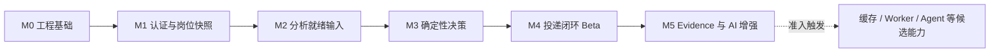

# 里程碑路线图

> 本文只定义 Nora 的里程碑结果、边界和退出目标，不记录实施状态、原子任务、依赖或执行顺序。
> 当前已交付能力及证据只见 [`current-capabilities.toml`](current-capabilities.toml)；进行中工作、依赖和顺序只见
> [GitHub Milestones](https://github.com/dev-cai/Nora/milestones) 与 [GitHub Issues](https://github.com/dev-cai/Nora/issues)。

## 规划真源边界

| 信息 | 唯一真源 |
| :--- | :--- |
| 产品目标、用户旅程和能力词汇 | [`PRODUCT_VISION.md`](PRODUCT_VISION.md) |
| 已确认业务流程与产品决策基线 | [`BUSINESS_FLOW.md`](BUSINESS_FLOW.md) |
| 里程碑结果、边界和退出目标 | 本文 |
| 进行中工作、Issue 状态、依赖和执行顺序 | [GitHub Milestones](https://github.com/dev-cai/Nora/milestones) 与 [GitHub Issues](https://github.com/dev-cai/Nora/issues) |
| 当前已交付能力、代码路径与 PR 证据 | [`current-capabilities.toml`](current-capabilities.toml) |
| 架构决策、模块边界和数据所有权 | [`ARCHITECTURE.md`](ARCHITECTURE.md) |
| 前端结构、路由和 HTTP 集成契约 | [`FRONTEND.md`](FRONTEND.md) |
| 本地环境、配置、迁移和测试命令 | [`DEVELOPMENT.md`](DEVELOPMENT.md) |

Roadmap 中的目标不证明能力已经交付。Milestone 关闭与 Issue 生命周期以 GitHub 数据为准，长期文档不复制其状态。

## 总体方向

Nora 的编号路线图止于 M5，并按用户结果而不是技术组件划分：

| 里程碑 | 用户结果 |
| :--- | :--- |
| M0 | 工程、数据库、容器和质量门禁可运行 |
| M1 | 用户可认证并保存隔离、不可变的岗位快照 |
| M2 | 用户可建立版本化、可确认、足以分析的岗位、主档和简历输入 |
| M3 | 用户可获得确定性报告并记录投或不投 |
| M4 | 用户可生成投递材料、手工记录投递和面试通知，并部署单用户 Beta |
| M5 | 报告可使用 Evidence、检索和可选模型增强，规模化组件按指标引入 |

```mermaid
flowchart LR
    M0["M0 工程基础"] --> M1["M1 认证与岗位快照"]
    M1 --> M2["M2 分析就绪输入"]
    M2 --> M3["M3 确定性决策"]
    M3 --> M4["M4 投递闭环 Beta"]
    M4 --> M5["M5 Evidence 与 AI 增强"]
    M5 -.准入触发.-> E["缓存 / Worker / Agent 等候选能力"]
```

M5 之后的能力进入触发式候选池；只有满足真实业务、数据、许可和架构准入条件后才独立立项，不预排新的编号阶段。

## M0：工程基础与 CI 门禁

### 结果

建立模块化单体工程、FastAPI 应用、PostgreSQL/Alembic、Docker Compose、配置、日志和质量门禁，为业务切片提供可重复运行基础。

### 边界

- 不实现业务功能；
- Artifact 字节存储只建立基础运行条件，缓存和队列不预先进入业务路径；
- 不引入 LLM、RAG、Agent 或 Web 客户端。

### 退出目标

- 新环境可以启动数据库和 API，并执行迁移；
- 静态、类型、单元、迁移和容器门禁可重复运行；
- 配置、日志和依赖方向具有明确基线。

## M1：Identity 与岗位快照纵向切片

### 结果

用户可以注册、登录，并通过公开 API 创建和读取自己范围内的不可变岗位快照；创建行为具备幂等、审计和事务一致性。

### 边界

- 不做岗位分析、公司情报、简历、报告或投递；
- 不依赖 LLM、RAG、缓存或 Worker；
- 不实现自动抓取或外部写。

### 退出目标

- 认证、用户隔离和岗位快照主路径可从公开 API 验证；
- 重复创建、跨用户读取和失败回滚行为明确；
- 新增切片遵循 Application、Port、Domain 和 Adapter 边界。

## M2：分析就绪的输入基线

### 结果

用户可以通过浏览器建立足以直接执行确定性分析的版本化输入，包括岗位原文、用户确认的结构化岗位要求、个人主档和不可变简历版本。

### 边界

- 岗位原文与用户确认的结构化解释分离，修改解释必须追加版本；
- OCR、规则或模型抽取只能产生候选，未经确认不得成为确定性规则事实；
- 上传和链接输入受资源限制、SSRF 防护和人工确认约束；
- 不创建决策案例、运行匹配规则、生成报告或执行外部投递；
- 不要求模型、向量扩展、缓存或 Worker。

### 退出目标

- 用户能通过真实 API 和 Web 创建、读取并确认全部分析输入；
- 修改确认结果不会覆盖历史版本；
- 截图和链接流程只在用户确认后保存岗位事实；
- 输入就绪状态、用户隔离和关键安全边界具有浏览器与后端验证；
- 无模型密钥的环境可完成全部输入流程。

## M3：确定性求职决策 MVP

### 结果

用户选择分析就绪的岗位、主档和简历后，系统固定输入版本、执行确定性规则、生成版本化决策报告，并记录投或不投。

### 边界

- 默认同步执行纯规则，不伪造队列、进度或 Worker 状态；
- 缺失输入保持 unknown，不从自由文本猜测；
- 报告按固定输入、规则集和生成器版本保持幂等与可追溯；
- 投递决定只记录意图，不生成材料或执行外部写；
- 不引入 RAG、LLM、向量扩展、缓存、任务队列或 Agent Runtime。

### 退出目标

- 决策案例固定全部输入版本并验证同一用户；
- 规则覆盖正常、边界和 unknown，结果可定位输入字段与版本；
- 报告、投递决定、刷新恢复和双用户隔离可从真实调用路径验证；
- 无模型和无向量扩展的新环境可以完成整个决策流程。

## M4：可部署的投递闭环 Beta

### 结果

把“决定要投”扩展为个人投递闭环：生成岗位定制简历、PDF 和消息草稿，由用户手工投递并记录结果和最小面试通知，同时达到单用户 Beta 的部署、安全、备份和可观测基线。

### 边界

- 模板是声明式不可变数据，不执行任意代码或活动 HTML；
- PDF 确定性只在锁定字体、渲染器、元数据和运行环境内承诺；
- 消息草稿无模型也可生成和编辑，不自动发送；
- 投递与面试记录只保存用户确认事实，不推断外部操作成功；
- 公司情报保留来源、版本、时效与 unknown，不做全网自动采集或聚合风险分数；
- 外部写保持关闭，不包含深度面试复盘、实时出行或长期记忆。

### 退出目标

- 用户可以从投递决定生成可编辑简历变体、确定性 PDF 和消息草稿；
- 用户可以手工记录投递状态与最小面试通知；
- Artifact、模板、公司信息和业务记录保持版本化、用户隔离与可恢复；
- 部署、认证、安全扫描、备份恢复、可观测和持续交付门禁可验证；
- 浏览器流程覆盖材料生成、手工投递记录、恢复与隔离，且外部写保持关闭。

## M5：Evidence、AI 与规模化增强

### 结果

在确定性决策和投递闭环可独立运行的基础上，增加版本化来源、检索、Evidence Pack、可选模型增强和可确认的 AI 文档导入，
使用户可从 PDF/DOCX 简历或文本/截图/受控链接 JD 获得可编辑结构化草稿，并根据真实指标决定是否引入 Reranker、缓存或 Worker。

### 边界

- Embedding 身份、模型、版本和维度先于向量 Schema 与索引设计；
- Source、Chunk、Embedding 和索引均可版本化、可重建；
- 检索先定义固定评测集和指标，不以 Provider 接通作为完成；
- Evidence Pack 在无 Reranker、无 LLM 时仍成立；
- 模型只读取版本化事实、规则结果和 Evidence，输出经 Schema 校验且不升级为用户事实；
- 导入模型输出只形成 owner 隔离、版本化的 ImportDraft；用户整体确认前不写 CandidateProfile、JobPosting 或
  JobRequirementSnapshot 事实；
- Provider 不可用时返回确定性结果，增强版本不覆盖历史；
- 不自动更新主档、执行外部写、并行维护多个向量数据库或强行为叙事引入 Agent Runtime。

### 退出目标

- Source 到 Evidence Pack 的检索链路可执行且引用稳定；
- 检索具有固定评测集、质量基线、延迟和成本记录；
- 模型增强具备版本隔离、失败降级和用户/来源过滤；
- PDF/DOCX 简历和文本/截图/受控链接 JD 可以生成可编辑草稿，用户以最新版本与内容指纹一次整体确认；
- 并发编辑产生明确冲突，确认写入具备幂等与原子性证据，解析/OCR/模型失败不会产生部分主档或岗位事实；
- Embedding 与索引可以重建，部署、备份、安全和数据保留门禁继续成立；
- Reranker、缓存和 Worker 具有量化引入证据，或形成可审查的不引入结论。

## 触发式候选池

以下能力不属于既有里程碑的默认退出目标：

| 能力 | 重新立项的最低条件 |
| :--- | :--- |
| 外部平台写入 | 明确具体平台和动作、许可、账号安全、Approval、幂等、审计和人工接管 |
| 深度面试准备与复盘 | 已有面试记录和真实用户数据，候选内容必须经用户确认 |
| 实时出行 | 地图或天气 Provider、许可、时效、成本和失败降级已审查 |
| 长期记忆 | 已有足够 outcome 数据，确认、拒绝、删除和过期规则明确 |
| Agent Runtime | 稳定 Application Use Case、多个真实 Tool、暂停恢复需求和量化收益 |
| 服务拆分或编排平台 | 模块化单体存在可复验容量、部署或隔离瓶颈 |

外部写始终遵循 ProposedAction -> Approval -> Execution，并具备幂等、审计和不确定结果人工处理。

## 不变原则

1. 依赖方向保持 Apps/Adapters -> Application/Ports -> Domain；
2. 当前能力与证据只维护在 `current-capabilities.toml`；
3. 任务状态、依赖与顺序只维护在 GitHub Milestones/Issues；
4. 模型输出不是事实，外部内容视为不可信；
5. 外部写默认关闭；
6. 可选能力不能成为较早里程碑的硬依赖；
7. Milestone 退出必须经过真实调用路径和新环境动态验收；
8. 路线图不能替代代码、测试、PR、审核和合并证据。
